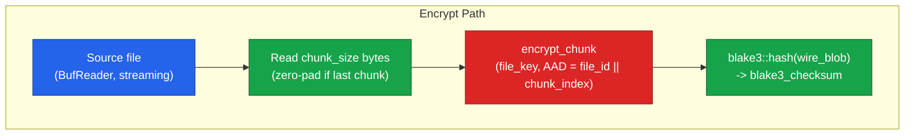
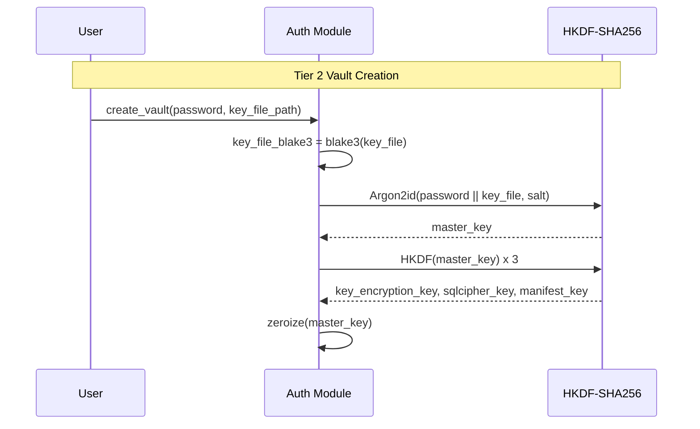
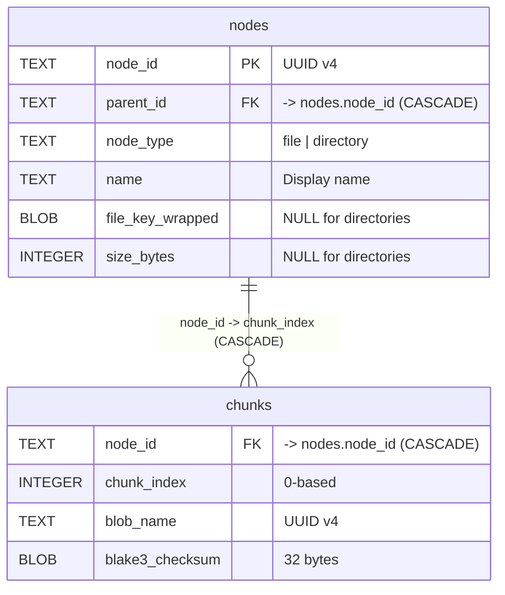
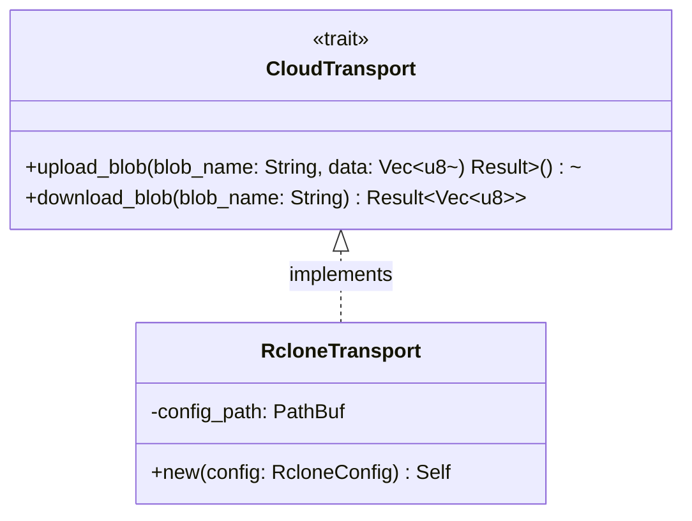
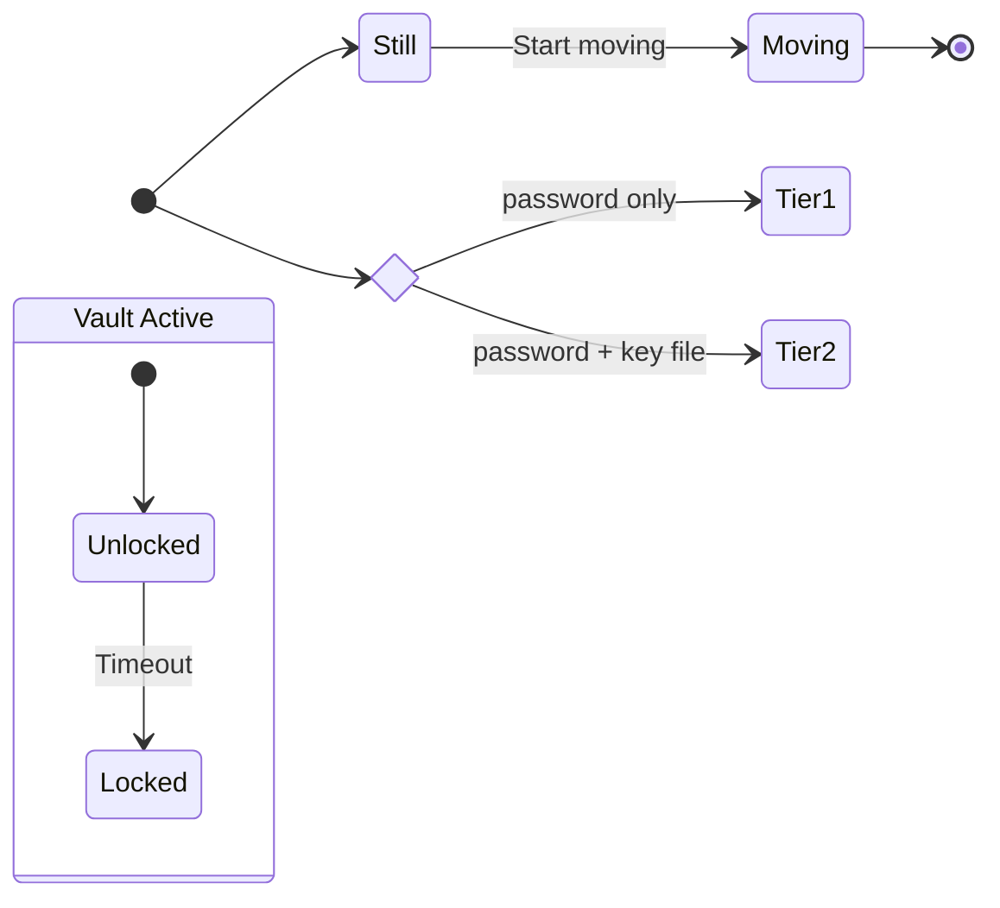
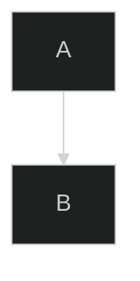
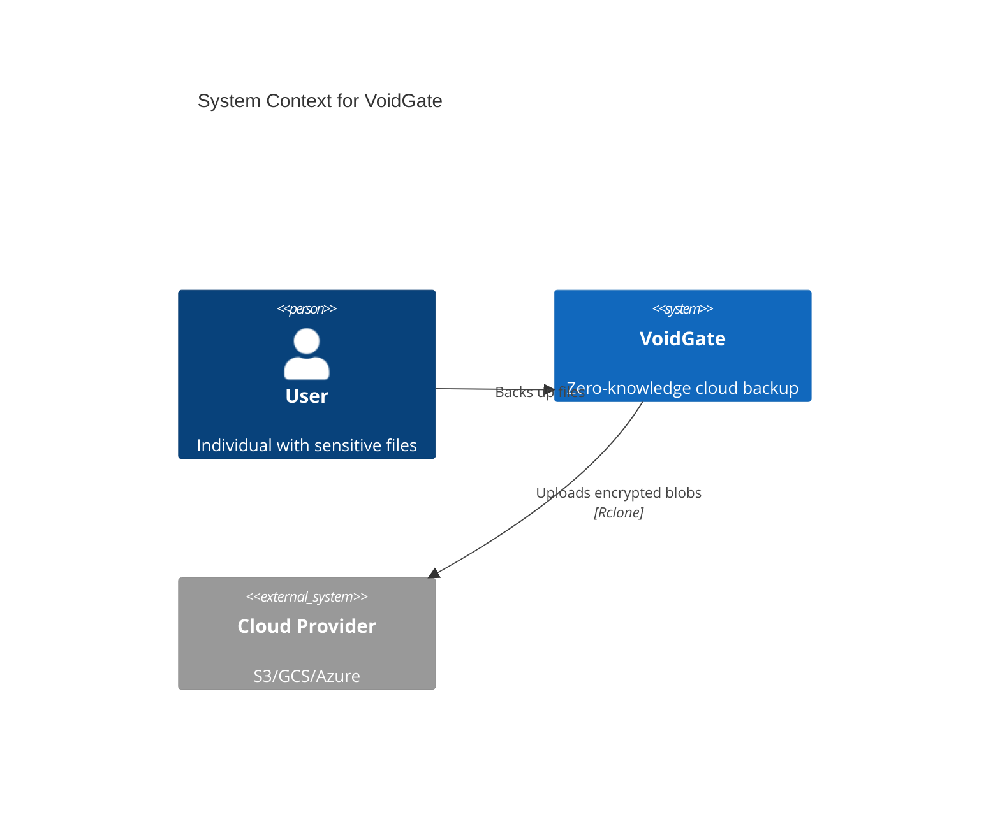

# Mermaid Syntax Reference — VoidGate

Full syntax guide for Mermaid diagrams used in VoidGate documentation.

---

## Diagram Type Selection

| Diagram Type | Best For | VoidGate Examples | Status |
|-------------|----------|-------------------|--------|
| **Flowchart** | Process flows, algorithms | Chunk pipeline, key derivation | Stable |
| **Sequence** | Temporal interactions | Auth flow, sync sequence, IPC | Stable |
| **ER Diagram** | Data models | Manifest schema, DB structure | Stable |
| **Class** | Type hierarchies | Trait implementations, modules | Stable |
| **State** | State machines | Session lifecycle, vault states | Stable |
| **Graph** | Information flows | SSOT, dependency graphs | Stable |
| **Architecture** | Service topology | Cloud deployment, infrastructure | Experimental |
| **C4** | Software architecture | System context, containers | Experimental |
| **Timeline** | Chronology | Roadmap phases, releases | Experimental |

Stick to stable types for core documentation. Experimental types have syntax that may change.

---

## Flowchart (`flowchart TD`)

**Use for**: Process flows, pipelines, decision trees, module dependencies

### Critical Rules

1. **Line breaks**: Use `<br/>` NOT `\n` or `#br;`
2. **Arrows in nodes**: Use plain `->` NOT `-&gt;` or HTML entities
3. **Special chars**: Use double quotes `["text"]` for any special characters
4. **Reserved words**: Avoid `end` as node ID — capitalize: `END` or quote: `["end"]`
5. **Node ID prefixes**: Don't start IDs with `o` or `x` followed by `-` (creates special edges)
6. **Subgraphs**: Use for logical grouping (e.g., BACKEND, FRONTEND, EXTERNAL)

### Node Shapes

- `["text"]` — Rectangle (processes)
- `("text")` — Rounded rectangle (events)
- `{"text"}` — Diamond (decisions)
- `[("text")]` — Cylinder (databases)
- `(("text"))` — Circle (start/stop)

Extended shapes (v11.3.0+):
- `A@{ shape: hex }` — Hexagon
- `A@{ shape: cyl }` — Cylinder
- `A@{ shape: stadium }` — Stadium (terminal)
- `A@{ shape: lean-r }` — Lean right (input/output)

### Arrows & Links

- `-->` — Standard arrow
- `-.->` — Dotted arrow
- `==>` — Thick arrow
- `--text-->` — Arrow with label
- `<-->` — Bidirectional arrow
- `~~~` — Invisible link (positioning only)

### VoidGate Node Conventions

- **Module nodes**: `MODULE["module/<br/>Brief description<br/>Key components"]:::style`
- **Process nodes**: `E1["Step description<br/>(context or details)"]:::proc`
- **Data nodes**: `D1["Data artifact<br/>format or type"]:::data`
- **Crypto nodes**: `C1["Crypto operation<br/>algorithm or key"]:::crypto`

### Example



---

## Sequence Diagram (`sequenceDiagram`)

**Use for**: IPC flows, authentication flows, sync sequences, API interactions

### Critical Rules

1. **Line breaks**: Use `\n` NOT `<br/>`
2. **Arrows in messages**: Use `#45;#62;` NOT `->` or `-&gt;`
3. **Greater-than**: Use `#62;` NOT `&gt;` or `>`
4. **Participants**: Declare explicitly at top if order matters
5. **Semicolons in text**: Use `#59;` (semicolons can end statements)

### Arrow Types

- `->>` — Solid line with arrowhead (calls)
- `-->>` — Dotted line with arrowhead (responses)
- `-x` — Solid line with cross (error/failure)
- `-)` — Solid line with open arrow (async)
- `<<->>` — Bidirectional solid (v11.0.0+)

### Activations

- `activate A` / `deactivate A` — Explicit activation
- `A->>+B: message` — Activate B on send
- `B-->>-A: reply` — Deactivate B on reply

### Control Structures

- `loop [text]` ... `end`
- `alt [condition]` ... `else` ... `end`
- `opt [condition]` ... `end`
- `par [action 1]` ... `and [action 2]` ... `end`
- `break [condition]` ... `end`

### VoidGate Conventions

- **Participant names**: Short, capitalized (`User`, `Auth`, `Sync`, `Meta`)
- **Full names**: `Meta as MetadataStore (SQLCipher)`
- **Phases**: `note over A,B: Phase 1 — Description`
- **Self-calls**: `A->>A: operation #45;#62; result`

### Example



---

## Entity Relationship Diagram (`erDiagram`)

**Use for**: Database schemas, manifest structure, table relationships

### Critical Rules

1. **Arrows in attributes**: Use `#45;#62;` NOT `->` or `-&gt;`
2. **FK references**: Use `FK "#45;#62; table.column"` format
3. **Attribute keys**: `PK`, `FK`, `UK` (comma-separated for multiple: `PK, FK`)
4. **Cardinality**: `||` (exactly one), `|o` (zero or one), `|{` (one or more), `o{` (zero or more)
5. **Relationship line**: `--` (identifying/solid), `..` (non-identifying/dashed)

### VoidGate Conventions

- **Table names**: lowercase (matching SQLite convention)
- **Column types**: TEXT, INTEGER, BLOB (SQLite types)
- **FK format**: `TEXT node_id FK "#45;#62; nodes.node_id (CASCADE)"`
- **UUID columns**: `TEXT <name> PK "UUID v4"`

### Example



---

## Class Diagram (`classDiagram`)

**Use for**: Rust module structure, trait hierarchies, type relationships

### Visibility Modifiers

- `+` — Public
- `-` — Private
- `#` — Protected
- `~` — Package/Internal

### Method Modifiers

- `*` — Abstract (after method: `method()*`)
- `$` — Static (after method: `method()$`)

### Relationships

- `<|--` — Inheritance
- `*--` — Composition
- `o--` — Aggregation
- `-->` — Association
- `..|>` — Realization (interface implementation)
- `..>` — Dependency

### Generics

Use `~` (tilde): `List~T~`, `Result~Vec~u8~~`

### Example



---

## State Diagram (`stateDiagram-v2`)

**Use for**: Session lifecycle, vault state machine, authentication states

### Key Constructs



---

## Graph (`graph TD`)

**Use for**: Information flows, high-level architecture, SSOT diagrams

Nearly identical to `flowchart TD` but more permissive with special characters and supports full HTML in node labels (`<br/>`, `<strong>`, etc.). Prefer `flowchart` for new diagrams; use `graph` when you need HTML richness.

---

## Styling

### VoidGate Color Palette

```mermaid
classDef secret   fill:#dc2626,stroke:#991b1b,color:#fff
classDef crypto   fill:#2563eb,stroke:#1e40af,color:#fff
classDef storage  fill:#16a34a,stroke:#166534,color:#fff
classDef user     fill:#9333ea,stroke:#6b21a8,color:#fff
classDef boundary fill:#f59e0b,stroke:#d97706,color:#000
classDef infra    fill:#6b7280,stroke:#374151,color:#fff
```

Semantic use:
- `secret` (red) — key material, passwords, plaintext data
- `crypto` (blue) — encryption/decryption operations, KDF, HKDF
- `storage` (green) — SQLCipher, blob storage, rclone
- `user` (purple) — user-facing: UI, IPC commands, inputs
- `boundary` (amber) — trust boundaries, security perimeters
- `infra` (grey) — infrastructure, external systems

Apply with `:::secret` after a node definition.

### Theming



Available themes: `default`, `dark`, `neutral`, `forest`, `base`

---

## Common Issues & Fixes

| Symptom | Cause | Fix |
|---------|-------|-----|
| Empty squares / missing text | `\|` or `\|\|` in flowchart node label | Use `#124;` (pipe entity) in node text |
| Empty squares / missing text | `->` in flowchart node label | Use `#45;#62;` (not plain `->`) |
| Empty squares / missing text | `\n` in flowchart node label | Use `<br/>` in flowcharts |
| Empty squares / missing text | Unicode chars (e.g. `≥`, `🔥`) in flowchart label | Use ASCII equivalents (`>=`) or plain text |
| Syntax error on build | `end` used as node ID | Use `END` or `["end"]` |
| Syntax error on build | Nested `alt`/`end` inside `par`/`and`/`end` block | Flatten structure; inline the condition in the message text |
| Edge labels rendered with literal quotes | Quoted text inside pipes: `\|"text"\|` | Remove inner quotes: `\|text\|` |
| Special edge rendered unexpectedly | Node ID starts with `o-` or `x-` | Add space or capitalize |
| Arrows not rendering in sequence | Named HTML entity like `-&gt;` | Use `#45;#62;` |
| Sequence diagram breaks at semicolon | `;` in message text | Use `#59;` |

---

## mdBook Integration

### File Structure

- **Location**: `docs/architecture/diagrams/` (cross-cutting) or `docs/architecture/designs/<name>/diagrams/` (design-specific)
- **Format**: Markdown file with single Mermaid code block
- **Header**: Title (h1), auto-generation note, last updated date
- **Footer**: Description section, related links

### Build Configuration

- **mdBook preprocessor**: `mdbook-mermaid` required
- **JS files**: `mermaid.min.js` and `mermaid-init.js` in `docs/`
- **Zoom**: Custom pan/zoom controls via `mermaid-init.js`

### Local Testing

```bash
cd docs
mdbook build
mdbook serve --open
```

### Validation Checklist

- [ ] `mdbook build` passes with no errors
- [ ] All node labels visible (no empty squares)
- [ ] Arrows render correctly
- [ ] Line breaks display as intended
- [ ] Zoom controls work
- [ ] Dark/light theme switching works

---

## Exporting for the Report

```bash
# Install once
npm install -g @mermaid-js/mermaid-cli

# Export (extract mermaid block from .md file first)
mmdc -i diagram.mmd -o diagram.svg -t neutral -b transparent
# -w 1200 -s 2 for high-res PNG
```

Use `neutral` theme for print. Export SVG when possible — scales without pixelation.

---

## Experimental Diagram Types

### Architecture Diagram (`architecture-beta`, v11.1.0+)

```mermaid
architecture-beta
    group client(disk)[VoidGate Client]
    service app(server)[Tauri App] in client
    service rclone(server)[Rclone] in client

    group cloud(cloud)[Cloud Provider]
    service storage(database)[Object Storage] in cloud

    app{group}:R --> L:rclone{group}
    rclone:R --> L:storage{group}
```

### C4 Context Diagram (Experimental)


