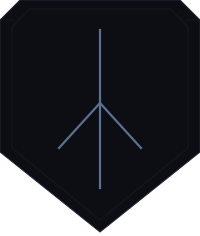

# Arx Runa

<h3>Encrypted here · Stored anywhere</h3>

**Zero-knowledge cloud storage** — files are encrypted on your device before upload. The cloud receives only opaque ciphertext. Keys never leave your machine.

---

**📖 [Read the full documentation](https://chorizzio.github.io/arx-runa/)** — architecture, design decisions, threat model, and development guides.

## Core Pillars

- **Client-side encryption** — XChaCha20-Poly1305 (AEAD), never plaintext
  in the cloud
- **Hardware MFA** — USB key file as a mandatory cryptographic factor;
  password alone cannot compromise data
- **Zero-Trace** — sensitive data zeroed from RAM immediately after use;
  no temp files, no plaintext on disk
- **Fixed-size padded chunks** — cloud provider cannot infer file sizes,
  structure, or metadata
- **Bring Your Own Cloud** — encrypted blobs via Rclone; no provider lock-in

## Technology Stack

| Component | Technology |
|---|---|
| Language | Rust (edition 2024) |
| Framework | Tauri (web frontend + Rust backend) |
| Encryption | XChaCha20-Poly1305 via `chacha20poly1305` crate |
| KDF | Argon2id → HKDF-SHA256 key separation |
| MFA | USB key file (32 bytes random entropy) |
| Local DB | SQLite + SQLCipher |
| Cloud transport | Rclone |
| Memory safety | `zeroize`, `secrecy`, `mlock`/`VirtualLock` |

## Documentation

**📖 [Full Documentation on GitHub Pages](https://chorizzio.github.io/arx-runa/)**

Quick links:
- [Use Cases](https://chorizzio.github.io/arx-runa/use-cases/index.html) — Real-world scenarios Arx Runa is designed for
- [Roadmap](https://chorizzio.github.io/arx-runa/roadmap.html) — Implementation roadmap
- [Architecture](https://chorizzio.github.io/arx-runa/architecture/index.html) — Detailed technical designs for each part of the system
- [Glossary](https://chorizzio.github.io/arx-runa/guides/glossary.html) — Terms used consistently across Arx Runa
- [Research](https://chorizzio.github.io/arx-runa/research/index.html) — Research to critique and explore ideas and options