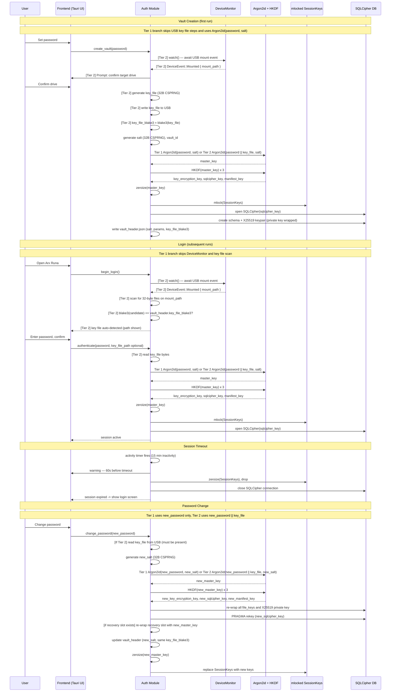

# Authentication Flow

> Auto-generated by `/diagram`. Regenerate with `/diagram update authentication-flow.md`.
> Last updated: 2026-04-10

## Description

The authentication flow covers four scenarios:

1. **Vault creation**: Tier 1 derives from password only (`key_file_blake3 = null`), while Tier 2 also generates and stores a USB key file; both tiers run Argon2id + HKDF, initialise SQLCipher and X25519 identity keys, then write the vault header.

2. **Login**: Tier 1 authenticates with password only. Tier 2 detects USB insertion via `DeviceMonitor`, scans 32-byte files against `key_file_blake3`, then runs Argon2id + HKDF. Both tiers mlock `SessionKeys` and open SQLCipher.

3. **Session timeout**: activity-based timer, 60-second warning, all keys zeroed via `ZeroizeOnDrop`, SQLCipher closed, frontend returns to login screen.

4. **Password change**: Tier 1 re-derives with `new_password + new_salt`; Tier 2 uses `new_password + key_file + new_salt`. Then re-wrap per-file keys and X25519 private key, optionally re-wrap recovery slot data, re-key SQLCipher, and update the vault header. No cloud blob re-encryption required.

## Key security invariants

- `master_key`/`new_master_key` remain ceremony-local and are zeroized immediately after all dependent operations complete (HKDF and optional recovery-slot re-wrap)
- `SessionKeys` are mlock'd; hard failure if mlock is unavailable
- Authentication errors do not reveal which factor was wrong
- New salt is always generated when password changes

## Related

- Design document: [../design.md](../design.md)
- Report log: [../../../../report-log/2026-03-29-204153-authentication-session-design.md](../../../../report-log/2026-03-29-204153-authentication-session-design.md)
