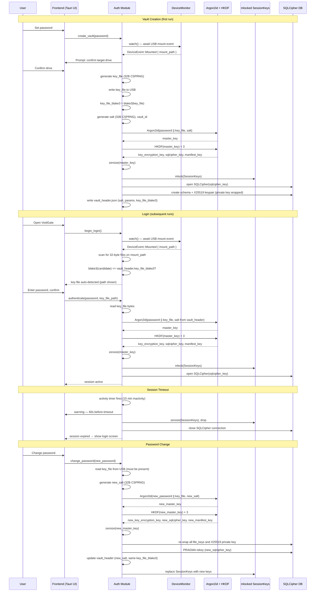

# Authentication Flow

> Auto-generated by `/diagram`. Regenerate with `/diagram update authentication-flow.md`.
> Last updated: 2026-03-29

## Description

The authentication flow covers four scenarios:

1. **Vault creation**: password set, key file generated and written to USB, Argon2id + HKDF derive session keys, SQLCipher DB and X25519 identity keypair initialised, vault header written to cloud.

2. **Login**: USB insertion detected by `DeviceMonitor`, 32-byte files scanned and matched against `key_file_blake3` from vault header, password entered, Argon2id + HKDF run, `SessionKeys` mlock'd, SQLCipher opened.

3. **Session timeout**: activity-based timer, 60-second warning, all keys zeroed via `ZeroizeOnDrop`, SQLCipher closed, frontend returns to login screen.

4. **Password change**: re-derive with new password + same key file + new salt, re-wrap all per-file keys and X25519 private key, re-key SQLCipher, update vault header. No cloud blob re-encryption required.

## Key security invariants

- `master_key` exists only between Argon2id output and HKDF completion — zeroed immediately after
- `SessionKeys` are mlock'd; hard failure if mlock is unavailable
- Authentication errors do not reveal which factor was wrong
- New salt is always generated when password changes

## Related

- Design document: [../../architecture/designs/authentication-and-session-management.md](../../architecture/designs/authentication-and-session-management.md)
- Report log: [../../report-log/2026-03-29-204153-authentication-session-design.md](../../report-log/2026-03-29-204153-authentication-session-design.md)
