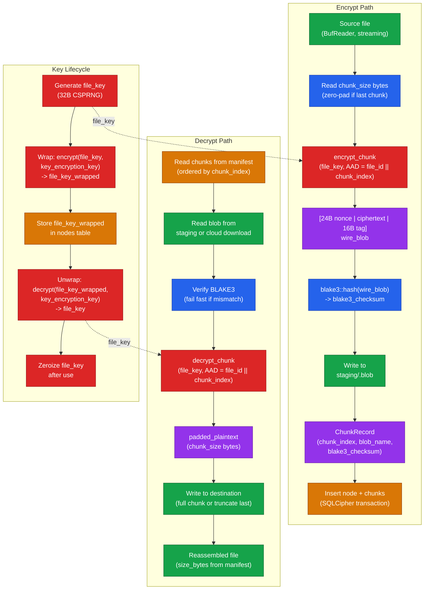

# Chunk Pipeline

> Auto-generated by `/diagram`. Regenerate with `/diagram update chunk-pipeline.md`.
> Last updated: 2026-03-29

## Description

### Encrypt path

1. Source file is read in `chunk_size` (4 MiB) increments via `BufReader`
2. Each chunk is zero-padded to exactly `chunk_size` if the last segment is shorter
3. `encrypt_chunk` applies XChaCha20-Poly1305 with AAD = `file_id || chunk_index`
4. BLAKE3 is computed over the full encrypted blob (`nonce || ciphertext || tag`)
5. The blob is written to the staging directory with a random UUID v4 filename
6. A `ChunkRecord` is returned for each chunk
7. All `ChunkRecord`s are committed to SQLCipher in a single transaction alongside the node row

### Decrypt path

1. Chunk rows are read from SQLCipher, ordered by `chunk_index`
2. Each blob is read from staging or a downloaded cloud copy
3. BLAKE3 is recomputed and compared — if mismatch, return `ChecksumMismatch` without touching the ciphertext
4. `decrypt_chunk` verifies the AEAD tag and decrypts
5. All chunks except the last are written in full (`chunk_size` bytes)
6. The last chunk is truncated to `file_size mod chunk_size` bytes, using `size_bytes` from the `nodes` row

### Key lifecycle

A `file_key` is generated per file at creation. It is immediately wrapped with `key_encryption_key` and stored in the `nodes` table. In memory, `file_key` exists only during encrypt and decrypt operations and is zeroized immediately after use.

## Related

- Design document: [../design.md](../design.md)
- Crypto primitives: [../../cryptographic-primitives/design.md](../../cryptographic-primitives/design.md)
- Source: `src-tauri/src/storage/`
