# Manifest Database Schema

> Auto-generated by `/diagram`. Regenerate with `/diagram update manifest-schema.md`.
> Last updated: 2026-04-18

```mermaid
erDiagram
    nodes {
        TEXT node_id PK "UUID v4"
        TEXT parent_id FK "#45;#62; nodes.node_id (CASCADE)"
        TEXT node_type "file | directory"
        TEXT name "plaintext (SQLCipher encrypted)"
        INTEGER created_at "Unix timestamp"
        INTEGER modified_at "Unix timestamp"
        INTEGER size_bytes "0 for directories"
        BLOB file_key_wrapped "NULL for directories"
    }

    chunks {
        TEXT chunk_id PK "UUID v4"
        TEXT node_id FK "#45;#62; nodes.node_id (CASCADE)"
        INTEGER chunk_index "0-based"
        TEXT blob_name "NULL for epoch chunks"
        INTEGER size_padded "chunk_size_bytes or epoch blob size"
        BLOB blake3_checksum "32 bytes over encrypted blob"
        TEXT epoch_blob_id FK "NULL for standalone chunks"
        INTEGER byte_offset "NULL for standalone chunks"
        INTEGER byte_length "NULL for standalone chunks"
    }

    epoch_blobs {
        TEXT epoch_blob_id PK "UUID v4"
        TEXT blob_name "UUID v4 staged file name"
        BLOB file_key_wrapped "epoch blob file_key wrapped with KEK"
        INTEGER size_padded "total padded blob size"
        BLOB blake3_checksum "32 bytes over encrypted epoch blob"
    }

    epoch_buffer {
        TEXT entry_id PK "UUID v4"
        TEXT node_id FK "#45;#62; nodes.node_id (CASCADE)"
        BLOB plaintext "in-RAM only; never written to disk unencrypted"
        INTEGER size_bytes
        INTEGER queued_at "Unix timestamp"
    }

    manifest_meta {
        TEXT key PK "schema_version, vault_id, snapshot_counter, etc."
        TEXT value "configuration values"
    }

    pending_deletions {
        TEXT blob_name PK
        INTEGER queued_at "Unix timestamp"
    }

    vault_identity {
        INTEGER id PK "always 1 (singleton)"
        BLOB public_key "X25519 public key"
        BLOB wrapped_private_key "private key KEK-wrapped"
    }

    destination_sessions {
        TEXT destination_id PK
        TEXT label
        TEXT destination_type "cloud | external_drive | local_path"
        TEXT rclone_remote_name
        TEXT rclone_config_blob "encrypted config blob"
        TEXT bucket
        TEXT path_prefix
        INTEGER is_primary "0 | 1"
        TEXT backup_mode "mirror | accumulating | NULL"
        INTEGER created_at
        TEXT device_id "device identifier for this destination"
    }

    contacts {
        TEXT contact_id PK
        TEXT display_name
        TEXT email
        BLOB public_key
        INTEGER created_at
    }

    shares {
        TEXT share_id PK
        TEXT file_id FK "#45;#62; nodes.node_id (CASCADE)"
        TEXT contact_id FK "#45;#62; contacts.contact_id"
        TEXT file_share_id
        TEXT cloud_path
        INTEGER created_at
        INTEGER expires_at "NULL if no expiration"
        INTEGER revoked_at "NULL if active"
        TEXT download_key_id
        INTEGER receipt_requested "0 | 1"
        INTEGER receipt_received_at
        INTEGER import_receipt_received_at
        TEXT download_folder_id "GDrive folder ID for revocation"
    }

    received_shares {
        TEXT share_id PK
        TEXT sender_contact_id FK "#45;#62; contacts.contact_id (nullable)"
        BLOB sender_public_key "X25519 public key, 32 bytes"
        TEXT file_id "file node identifier (UUID v4)"
        TEXT file_name
        BLOB file_key_wrapped
        INTEGER chunk_count
        INTEGER chunk_size
        TEXT chunk_uuids "JSON array"
        TEXT cloud_endpoint "JSON object"
        INTEGER expires_at
        INTEGER imported_at
    }

    backup_upload_failures {
        TEXT blob_name PK
        TEXT destination_id PK
        INTEGER failed_at "Unix timestamp"
        INTEGER retry_count
    }

    pending_backup {
        TEXT blob_name PK
        TEXT destination_id PK
    }

    sharing_config {
        TEXT config_id PK
        TEXT destination_id
        TEXT provider "gdrive"
        TEXT config_json "JSON config"
        INTEGER created_at
        INTEGER updated_at
    }

    nodes ||--o{ nodes : "parent_id (self-referencing tree)"
    nodes ||--o{ chunks : "node_id #45;#62; chunk_index (CASCADE)"
    nodes ||--o{ epoch_buffer : "node_id (CASCADE)"
    nodes ||--o{ shares : "node_id #45;#62; file_id (CASCADE)"
    epoch_blobs ||--o{ chunks : "epoch_blob_id"
    contacts ||--o{ shares : "contact_id"
    contacts ||--o{ received_shares : "sender_contact_id"
    destination_sessions ||--o{ backup_upload_failures : "destination_id"
    destination_sessions ||--o{ pending_backup : "destination_id"
```

## Description

Entity-relationship diagram for the SQLCipher manifest database. The entire database is encrypted with `sqlcipher_key` (derived from `master_key` via HKDF-SHA256 during authentication).

### Core tables (Phase 3)

- **nodes**: Virtual filesystem tree. Files have `file_key_wrapped`; directories have `NULL`. Self-referencing via `parent_id` for the directory hierarchy.
- **chunks**: One row per encrypted blob. Either standalone (`blob_name` set) or epoch-buffered (`epoch_blob_id` set). `UNIQUE(node_id, chunk_index)` prevents duplicates.
- **manifest_meta**: Key-value store for vault metadata (`schema_version`, `vault_id`, `snapshot_counter`, `chunk_size_bytes`, `epoch_buffer_enabled`).
- **pending_deletions**: Durable queue of blob identifiers awaiting cloud/local deletion confirmation after manifest commits.

### Epoch buffering tables (Phase 3, v2)

- **epoch_blobs**: One row per epoch blob. Holds the blob's own `file_key_wrapped` and BLAKE3 checksum.
- **epoch_buffer**: In-RAM plaintext queue; plaintext column is never written to disk unencrypted.

### Identity table (Phase 2.4/5)

- **vault_identity**: Singleton row (`id = 1`) holding the vault's X25519 keypair. Private key is KEK-wrapped.

### Cloud sync tables (Phase 4)

- **destination_sessions**: Vault-scoped destination metadata and encrypted Rclone config blobs. Includes `device_id` for device-scoped destinations (v7).
- **backup_upload_failures**: Durable retry queue for failed backup uploads (Phase 7).
- **pending_backup**: Blobs awaiting backup upload (Phase 7).
- **sharing_config**: GDrive sharing configuration per destination (v8).

### Sharing tables (Phase 5)

- **contacts**: Known recipients with X25519 public keys.
- **shares**: Outbound file shares linking a file to a contact. Includes download receipt tracking and GDrive folder ID.
- **received_shares**: Inbound shares. Stores `sender_public_key`, `file_id`, and `expires_at` alongside decryption metadata.

## Related

- Design document: [../design.md](../design.md)
- Chunk Pipeline: [chunk-pipeline.md](chunk-pipeline.md)
- File Sharing design: [../../file-sharing/design.md](../../file-sharing/design.md)
- Source: `src-tauri/src/storage/`
