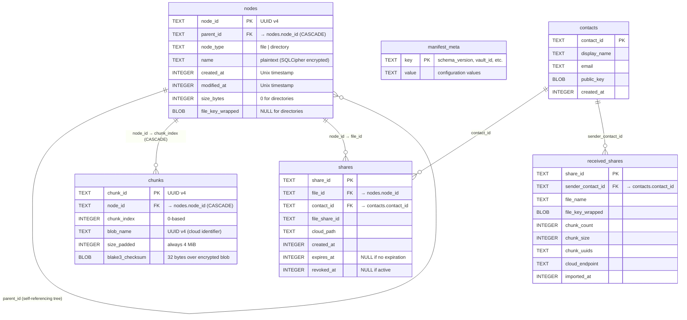

# Manifest Database Schema

> Auto-generated by `/diagram`. Regenerate with `/diagram update manifest-schema.md`.
> Last updated: 2026-04-04

## Description

Entity-relationship diagram for the SQLCipher manifest database. The entire database is encrypted with `sqlcipher_key` (derived from `master_key` via HKDF-SHA256 during authentication).

### Core tables (Phase 3)

- **nodes**: Virtual filesystem tree. Files have `file_key_wrapped`; directories have `NULL`. Self-referencing via `parent_id` for the directory hierarchy.
- **chunks**: One row per encrypted blob. Linked to nodes via `node_id` with CASCADE delete. `UNIQUE(node_id, chunk_index)` prevents duplicates.
- **manifest_meta**: Key-value store for vault metadata (`schema_version`, `vault_id`, `snapshot_counter`, `last_synced_at`).

### Sharing tables (Phase 5)

- **contacts**: Known recipients with X25519 public keys.
- **shares**: Outbound file shares linking a file to a contact.
- **received_shares**: Inbound shares from other vaults.

## Related

- Design document: [../design.md](../design.md)
- Chunk Pipeline: [chunk-pipeline.md](chunk-pipeline.md)
- File Sharing design: [../../file-sharing/design.md](../../file-sharing/design.md)
- Source: `src-tauri/src/storage/`
