# Cloud Synchronisation Sequence

> Auto-generated by `/diagram`. Regenerate with `/diagram update cloud-sync-sequence.md`.
> Last updated: 2026-04-05

```mermaid
sequenceDiagram
    participant User
    participant Sync as Sync Module
    participant Meta as MetadataStore (SQLCipher)
    participant Stage as Staging Directory
    participant RT as RcloneTransport (sidecar)
    participant Cloud as Cloud Remote

    note over User,Cloud: Push Flow (upload local changes)
    User->>Sync: push()
    Sync->>Meta: get_meta("snapshot_counter") #45;#62; local_counter
    Sync->>RT: download_blob("manifest/manifest-backup.blob", temp)
    RT->>Cloud: rclone copyto manifest/manifest-backup.blob
    Cloud-->>RT: manifest-backup.blob
    RT-->>Sync: temp file
    Sync->>Sync: decrypt manifest backup #45;#62; cloud_counter
    break cloud_counter #62; local_counter
        Sync-->>User: CONFLICT — pull first
    end
    break cloud_counter #60; local_counter
        Sync-->>User: CONFLICT — cloud manifest older than local
    end

    Sync->>Meta: get all staged blob_names
    Sync->>Sync: Fisher-Yates shuffle(blob_list)
    
    note over Sync,Cloud: Concurrent upload (4 Rclone processes via JoinSet)
    
    par Upload blob 1
        Sync->>RT: upload_blob(staging/uuid1.blob)
        RT->>Cloud: rclone copyto vault/uuid1.blob
        Cloud-->>RT: ok
        RT-->>Sync: ok
        Sync->>Stage: delete staging/uuid1.blob
    and Upload blob 2
        Sync->>RT: upload_blob(staging/uuid2.blob)
        RT->>Cloud: rclone copyto vault/uuid2.blob
        Cloud-->>RT: ok
        RT-->>Sync: ok
        Sync->>Stage: delete staging/uuid2.blob
    and Upload blob 3
        Sync->>RT: upload_blob(staging/uuid3.blob)
        RT->>Cloud: rclone copyto vault/uuid3.blob
        Cloud-->>RT: ok
        RT-->>Sync: ok
        Sync->>Stage: delete staging/uuid3.blob
    and Upload blob 4
        Sync->>RT: upload_blob(staging/uuid4.blob)
        RT->>Cloud: rclone copyto vault/uuid4.blob
        Cloud-->>RT: ok
        RT-->>Sync: ok
        Sync->>Stage: delete staging/uuid4.blob
    end
    
    note over Sync: Repeat for next batch until all blobs uploaded
    Sync->>Meta: increment_snapshot_counter() #45;#62; new_counter
    Sync->>Meta: set_meta("last_synced_at", now)
    Sync->>Sync: VACUUM INTO temp#59; encrypt with manifest_key
    Sync->>RT: upload_blob(temp, manifest/manifest-backup.blob)
    RT->>Cloud: rclone copyto
    Cloud-->>RT: ok
    Sync->>RT: upload_blob(vault-header.json, vault-header.json)
    RT->>Cloud: rclone copyto
    Cloud-->>RT: ok
    Sync-->>User: push complete (new_counter blobs synced)

    note over User,Cloud: Pull Flow (new-device recovery)
    User->>Sync: pull()
    Sync->>RT: download_blob("vault-header.json", temp)
    RT->>Cloud: rclone copyto vault-header.json
    Cloud-->>RT: vault-header.json
    RT-->>Sync: temp file
    Sync->>Sync: parse VaultHeader #45;#62; salt, params, key_file_blake3
    Sync-->>User: prompt: password + USB key file
    User->>Sync: password + key_file_path
    Sync->>Sync: Argon2id(password || key_file, salt) #45;#62; master_key
    Sync->>Sync: HKDF #45;#62; key_encryption_key, sqlcipher_key, manifest_key
    Sync->>Sync: zeroize(master_key)
    Sync->>RT: download_blob("manifest/manifest-backup.blob", temp)
    RT->>Cloud: rclone copyto manifest/manifest-backup.blob
    Cloud-->>RT: manifest-backup.blob
    RT-->>Sync: temp file
    Sync->>Sync: decrypt manifest backup with manifest_key
    Sync->>Meta: import SQLCipher DB (keyed with sqlcipher_key)
    Sync->>Meta: get all chunk rows #45;#62; (blob_name, blake3_checksum)
    
    note over Sync,Cloud: Concurrent download (4 Rclone processes via JoinSet)
    
    par Download blob 1
        Sync->>RT: download_blob(vault/uuid1.blob)
        RT->>Cloud: rclone copyto vault/uuid1.blob
        Cloud-->>RT: uuid1.blob
        RT-->>Sync: staging/uuid1.blob
        Sync->>Sync: Verify BLAKE3 (delete + record failure on mismatch)
    and Download blob 2
        Sync->>RT: download_blob(vault/uuid2.blob)
        RT->>Cloud: rclone copyto vault/uuid2.blob
        Cloud-->>RT: uuid2.blob
        RT-->>Sync: staging/uuid2.blob
        Sync->>Sync: Verify BLAKE3
    and Download blob 3
        Sync->>RT: download_blob(vault/uuid3.blob)
        RT->>Cloud: rclone copyto vault/uuid3.blob
        Cloud-->>RT: uuid3.blob
        RT-->>Sync: staging/uuid3.blob
        Sync->>Sync: Verify BLAKE3
    and Download blob 4
        Sync->>RT: download_blob(vault/uuid4.blob)
        RT->>Cloud: rclone copyto vault/uuid4.blob
        Cloud-->>RT: uuid4.blob
        RT-->>Sync: staging/uuid4.blob
        Sync->>Sync: Verify BLAKE3
    end
    
    note over Sync: Repeat for next batch until all blobs downloaded
    Sync-->>User: pull complete (any failures reported)

    note over User,Cloud: Conflict Detection Detail
    Sync->>Meta: get_meta("snapshot_counter") #45;#62; local=5
    Sync->>Cloud: download manifest #45;#62; decrypt #45;#62; cloud_counter=7
    note right of Sync: cloud #62; local #45;#62; another device pushed
    Sync-->>User: CONFLICT: pull first (local=5, cloud=7)
    Sync->>Cloud: download manifest #45;#62; decrypt #45;#62; cloud_counter=3
    note right of Sync: cloud #60; local #45;#62; stale cloud state
    Sync-->>User: CONFLICT: cloud older than local (local=5, cloud=3)
```

## Description

The cloud synchronisation flow covers three scenarios:

1. **Push**: reads the cloud manifest backup to check `snapshot_counter` for conflicts, shuffles staged blobs for upload order randomisation, uploads all pending blobs concurrently (4 Rclone sidecar processes), then updates the manifest backup and vault header.

2. **Pull (new-device recovery)**: downloads the vault header to obtain Argon2id parameters, authenticates the user, decrypts and imports the manifest backup, then downloads all blobs with BLAKE3 verification.

3. **Conflict detection**: `snapshot_counter` comparison before every push; if cloud and local counters differ (`cloud > local` or `cloud < local`), the push is aborted and the user must resolve divergence before retrying.

## Key invariants

- Blob upload order is randomised to prevent temporal correlation attacks
- `snapshot_counter` is incremented only after all blobs are successfully uploaded
- BLAKE3 verification is mandatory before any downloaded blob is accepted
- Vault header is uploaded unconditionally on every push (idempotent; keeps cloud header current after password or key rotation)
- RcloneTransport never receives plaintext data — only staging blobs (AEAD ciphertext) and the vault header (public parameters)

## Related

- Design document: [../design.md](../design.md)
- Authentication flow: [../../authentication-and-session-management/diagrams/authentication-flow.md](../../authentication-and-session-management/diagrams/authentication-flow.md)
- Chunk pipeline: [../../chunking-and-manifest/diagrams/chunk-pipeline.md](../../chunking-and-manifest/diagrams/chunk-pipeline.md)
