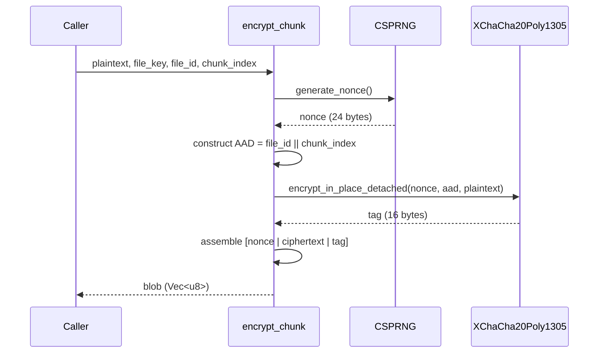

# Chunk Encryption Flow

> Auto-generated by `/diagram`. Regenerate with `/diagram update chunk-encryption-flow.md`.
> Last updated: 2026-04-04

## Description

Shows the internal flow of `encrypt_chunk`: the caller provides plaintext with cryptographic context (file_key, file_id, chunk_index), a fresh 24-byte nonce is generated via CSPRNG, AAD is constructed from the file identity and chunk position, and XChaCha20-Poly1305 produces the authenticated ciphertext. The final wire blob is assembled as `[nonce | ciphertext | tag]`.

## Related

- Design document: [../design.md](../design.md)
- Key Derivation Tree: [key-derivation-tree.md](key-derivation-tree.md)
- Key Derivation Flow: [key-derivation-flow.md](key-derivation-flow.md)
- Source: `src-tauri/src/crypto/`
