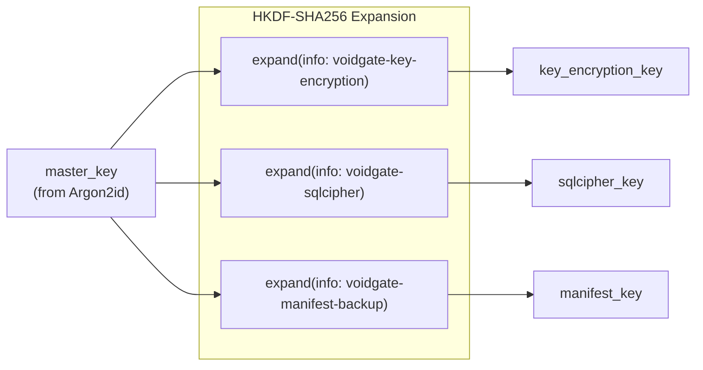

# Key Derivation Flow

> Auto-generated by `/diagram`. Regenerate with `/diagram update key-derivation-flow.md`.
> Last updated: 2026-04-04

## Description

Shows the HKDF-SHA256 key derivation tree from `master_key` to the three vault-level keys. Each key is derived with a distinct info string to ensure cryptographic separation. The `master_key` is produced by Argon2id (Phase 2) and consumed here as input material.

## Related

- Design document: [../design.md](../design.md)
- Key Derivation Tree (full): [key-derivation-tree.md](key-derivation-tree.md)
- Chunk Encryption Flow: [chunk-encryption-flow.md](chunk-encryption-flow.md)
- Source: `src-tauri/src/crypto/hkdf.rs`
