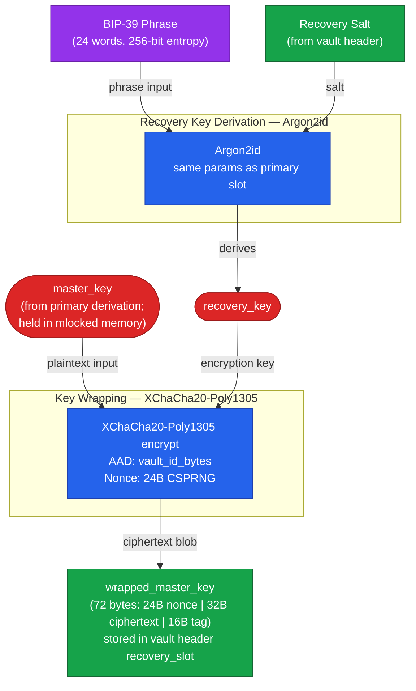

# Key Derivation — Recovery Slot

> Auto-generated by `/diagram`. Regenerate with `/diagram update key-derivation-recovery-slot.md`.
> Last updated: 2026-04-10

## Description

The recovery slot provides an independent path to `master_key` via a user-held BIP-39
recovery phrase, without compromising the primary authentication ceremony. Recovery setup
is a separate post-creation ceremony (via Security settings), not part of vault creation.

The `master_key` is **never stored in plaintext**. The wrap operation produces an
authenticated ciphertext blob; the plaintext `master_key` is only a transient input to the
XChaCha20-Poly1305 AEAD operation, which is held in mlocked memory and zeroized by
`ZeroizeOnDrop` after the wrap returns.

**Legend:**
- `BIP-39 Phrase` — 24-word mnemonic; 256-bit entropy; user-held; never stored by Arx Runa
- `Recovery Salt` — random salt stored in vault header recovery slot; distinct from primary Argon2 salt
- `recovery_key` — 32-byte key derived from BIP-39 phrase via Argon2id; used solely to wrap/unwrap `master_key`
- `master_key` — supplied from primary derivation (see [key-derivation-tree.md](key-derivation-tree.md)); never stored
- `wrapped_master_key` — authenticated ciphertext blob (not plaintext); stored in `vault_header.recovery_slots[].wrapped_master_key`
- `AAD: vault_id_bytes` — 16-byte raw UUID bytes bound into AEAD tag to prevent cross-vault attacks

**Security properties:**
- Compromising the recovery phrase is equivalent to compromising the password — it unwraps `master_key` directly
- The `wrapped_master_key` blob is ciphertext; without the recovery phrase, it is opaque
- Cross-vault reuse of a `wrapped_master_key` blob is prevented by the vault-scoped AAD

## Related

- Primary key derivation: [key-derivation-tree.md](key-derivation-tree.md)
- Design document: [../design.md](../design.md)
- Research: [../../../../research/password-and-key-recovery.md](../../../../research/password-and-key-recovery.md)
