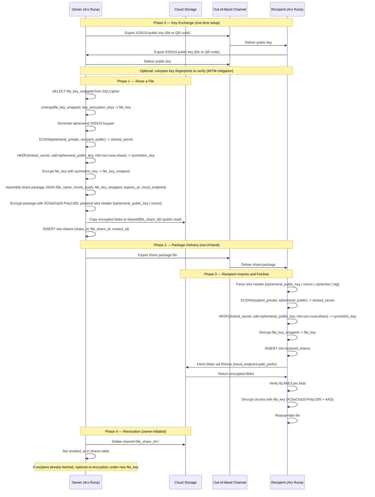

# File Sharing Flow

> Auto-generated by `/diagram`. Regenerate with `/diagram update file-sharing-flow.md`.
> Last updated: 2026-03-29

## Description

The file sharing flow has four phases:

1. **Key exchange** (one-time): both parties export their X25519 public keys via any out-of-band channel (email, messaging app, USB). No Arx Runa server involvement. Optional fingerprint verification mitigates MITM attacks on the key exchange channel.

2. **Share creation**: the owner retrieves the `file_key` for the target file, constructs an ECIES-encrypted share package JSON (including optional expiration), emits wire bytes with an `ephemeral_public_key` + nonce header, copies blobs to a public-read shared folder, and records the share in SQLCipher.

3. **Recipient import and fetch**: the recipient decrypts the share package using their X25519 private key, obtains the `file_key`, fetches blobs from the cloud via Rclone using the `cloud_endpoint` descriptor, and decrypts the file locally.

4. **Revocation**: the owner deletes the shared blob folder. If the recipient has already fetched and decrypted, re-encryption under a new `file_key` is the only way to prevent access to the updated file.

## Related

- Design document: [../design.md](../design.md)
- Key derivation: [../../cryptographic-primitives/diagrams/key-derivation-tree.md](../../cryptographic-primitives/diagrams/key-derivation-tree.md)
- Report log: [../../../../report-log/2026-03-29-194331-file-sharing-architecture-design.md](../../../../report-log/2026-03-29-194331-file-sharing-architecture-design.md)
