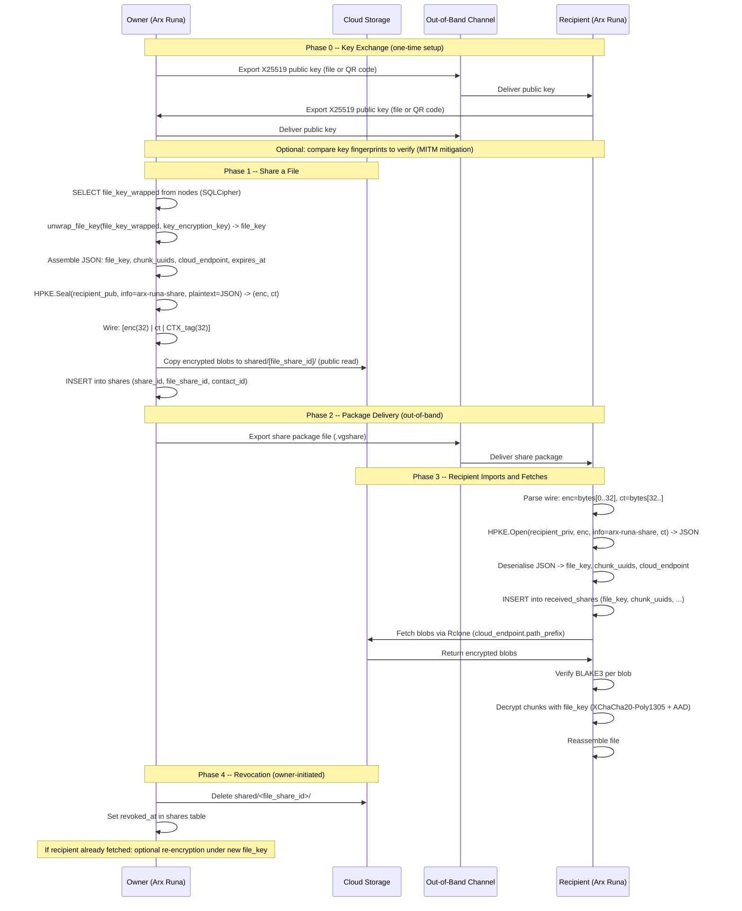

# File Sharing Flow

> Auto-generated by `/diagram`. Regenerate with `/diagram update file-sharing-flow.md`.
> Last updated: 2026-04-12

## Description

The file sharing flow has four phases:

1. **Key exchange** (one-time): both parties export their X25519 public keys via any out-of-band channel (email, messaging app, USB). No Arx Runa server involvement. Optional fingerprint verification mitigates MITM attacks on the key exchange channel.

2. **Share creation**: the owner retrieves and unwraps the `file_key` for the target file, assembles the share package JSON (including `file_key`, `chunk_uuids`, `cloud_endpoint`, and optional `expires_at`), seals the JSON with HPKE (`DHKEM(X25519, HKDF-SHA256) + HKDF-SHA256 + CTX-ChaCha20-Poly1305`), copies blobs to a public-read shared folder, and records the share in SQLCipher. Wire format: `[enc(32) | ciphertext | CTX_tag(32)]`.

3. **Recipient import and fetch**: the recipient opens the HPKE envelope using their X25519 private key, deserialises the JSON to obtain `file_key` and `chunk_uuids`, stores the result in `received_shares`, fetches blobs from the cloud via Rclone, and decrypts the file locally.

4. **Revocation**: the owner deletes the shared blob folder. If the recipient has already fetched and decrypted, re-encryption under a new `file_key` is the only way to prevent access to the updated file.

## Related

- Design document: [../design.md](../design.md)
- Cryptographic construction: [../../../../research/file-sharing-cryptography.md](../../../../research/file-sharing-cryptography.md)
- Key derivation: [../../cryptographic-primitives/diagrams/key-derivation-tree.md](../../cryptographic-primitives/diagrams/key-derivation-tree.md)
