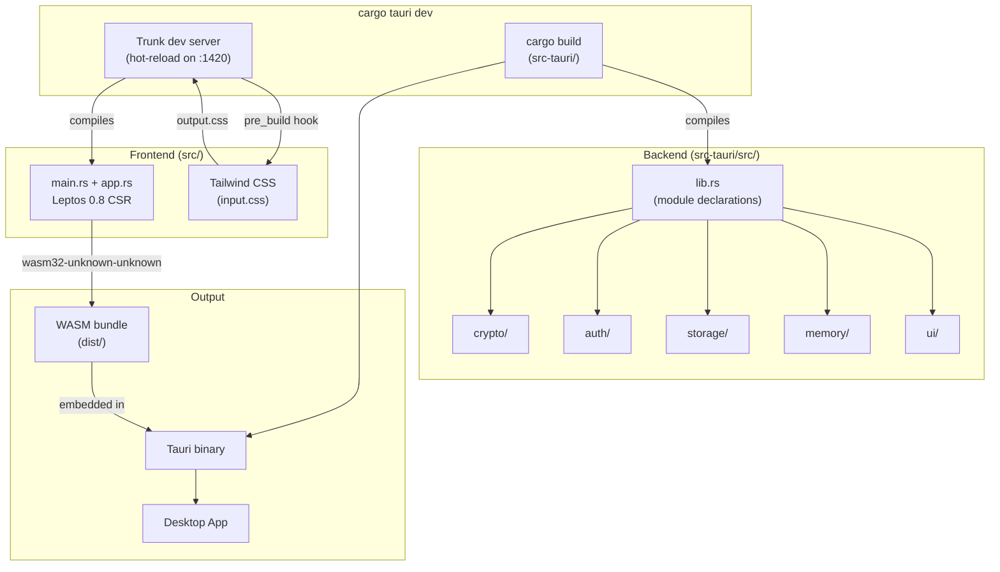
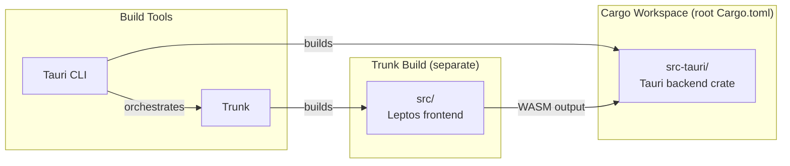
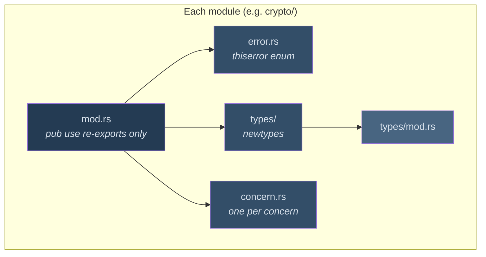

# Build Pipeline and Project Structure

## Build Pipeline

```mermaid
flowchart TB
    subgraph dev["cargo tauri dev"]
        direction TB
        trunk["Trunk dev server<br/>(hot-reload on :1420)"]
        cargo["cargo build<br/>(src-tauri/)"]
    end

    subgraph frontend["Frontend (src/)"]
        leptos["main.rs + app.rs<br/>Leptos 0.8 CSR"]
        tailwind["Tailwind CSS<br/>(input.css)"]
    end

    subgraph backend["Backend (src-tauri/src/)"]
        lib["lib.rs<br/>(module declarations)"]
        crypto["crypto/"]
        auth["auth/"]
        storage["storage/"]
        memory["memory/"]
        ui["ui/"]
    end

    subgraph output["Output"]
        wasm["WASM bundle<br/>(dist/)"]
        bin["Tauri binary"]
        app["Desktop App"]
    end

    trunk -->|"pre_build hook"| tailwind
    tailwind -->|"output.css"| trunk
    trunk -->|"compiles"| leptos
    leptos -->|"wasm32-unknown-unknown"| wasm

    cargo -->|"compiles"| lib
    lib --> crypto & auth & storage & memory & ui
    cargo --> bin

    wasm -->|"embedded in"| bin
    bin --> app
```

## Workspace Structure

```mermaid
graph LR
    subgraph workspace["Cargo Workspace (root Cargo.toml)"]
        tauri_crate["src-tauri/<br/>Tauri backend crate"]
    end

    subgraph trunk_build["Trunk Build (separate)"]
        frontend_crate["src/<br/>Leptos frontend"]
    end

    subgraph tools["Build Tools"]
        trunk_tool["Trunk"]
        tauri_cli["Tauri CLI"]
    end

    tauri_cli -->|"orchestrates"| trunk_tool
    tauri_cli -->|"builds"| tauri_crate
    trunk_tool -->|"builds"| frontend_crate
    frontend_crate -->|"WASM output"| tauri_crate
```

## Module Structure (per ADR-001)

```mermaid
graph TD
    subgraph module["Each module (e.g. crypto/)"]
        mod["mod.rs<br/><i>pub use re-exports only</i>"]
        error["error.rs<br/><i>thiserror enum</i>"]
        types["types/<br/><i>newtypes</i>"]
        types_mod["types/mod.rs"]
        concerns["concern.rs<br/><i>one per concern</i>"]
    end

    mod --> error
    mod --> types
    mod --> concerns
    types --> types_mod

    style mod fill:#243b53,color:#d9e2ec
    style error fill:#334e68,color:#d9e2ec
    style types fill:#334e68,color:#d9e2ec
    style types_mod fill:#486581,color:#d9e2ec
    style concerns fill:#334e68,color:#d9e2ec
```
