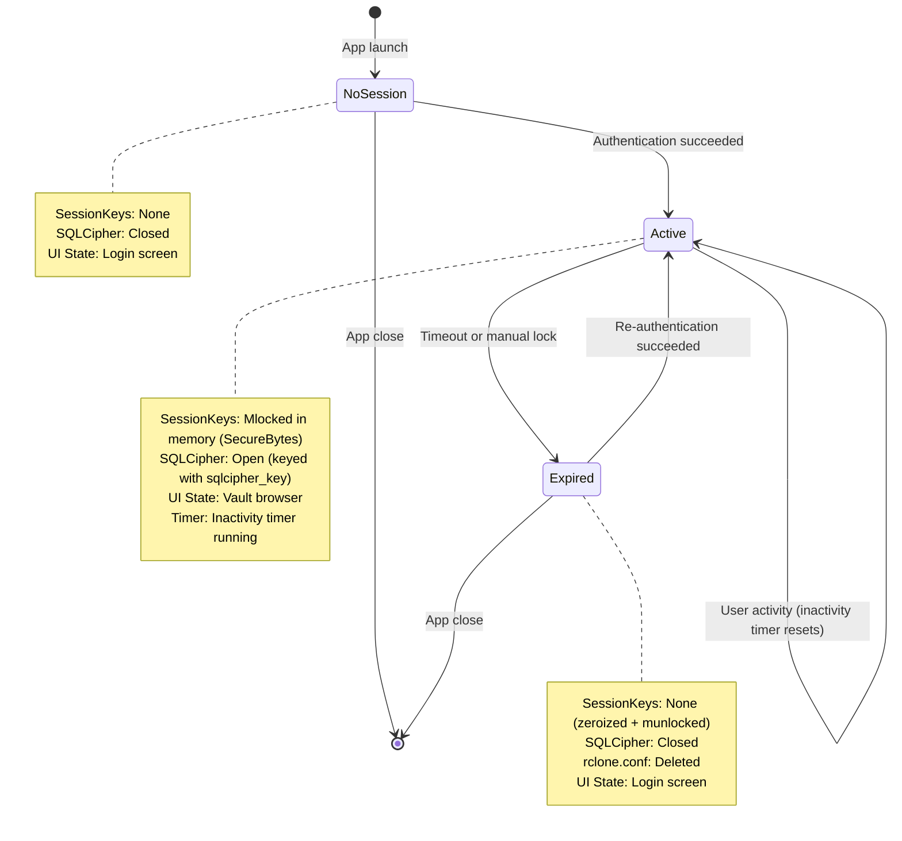

# Session State Machine

> Last updated: 2026-06-05 — reflects implemented `LifecycleState` enum in `src-tauri/src/auth/session/manager.rs`.

## Description

State machine for the Arx Runa session lifecycle as implemented in `SessionManager`.

### States

- **NoSession**: Initial state on app launch. No session has ever been established in this process. User must authenticate.
- **Active**: Session keys are resident in mlocked memory. SQLCipher is open. Inactivity timer runs; resets on every `reset_timer()` call (wired to IPC command dispatch).
- **Expired**: A prior session was locked. Keys are zeroized and munlocked. SQLCipher is closed. `rclone.conf` has been overwritten and deleted. Re-authentication required.

### Events (not states)

The backend emits `SessionEvent` via an internal `broadcast::Sender` — these are runtime signals, not lifecycle states:

| Event | When |
|-------|------|
| `TimeoutWarning { seconds_remaining }` | Shortly before automatic lock (configurable pre-warning window) |
| `Locked` | After lock completes (both manual and timeout) |

### Lock sequence (`lock()`)

1. Close operation gate (`fetch_or(GATE_CLOSED_FLAG)`) — no new IPC operations admitted
2. Cancel inactivity timer
3. Wait for in-flight operations (`wait_for(|count| *count == 0)`)
4. Drop SQLCipher connection (`keys.metadata_store = None`)
5. Overwrite and delete `rclone.conf` (`destroy_rclone_conf()`)
6. Drop `SessionKeys` — `SecureBytes` fields zeroize then munlock
7. Transition lifecycle to `Expired`
8. Emit `SessionEvent::Locked`

### Security invariants

- **SessionKeys lifecycle**: Only present in mlocked memory during `Active`. Zeroized and munlocked on transition to `Expired` via `SecureBytes::drop`.
- **SQLCipher connection**: Closed before `SessionKeys` are dropped (ordered teardown prevents use-after-free).
- **rclone.conf**: Overwritten with random data before deletion; failure is logged but non-fatal (session closes regardless).
- **No key persistence**: `SessionKeys` never written to disk, swap, or log files.
- **Operation gate**: Atomic `u32` combining `GATE_CLOSED_FLAG` (bit 31) and operation counter (bits 0–30). CAS double-check prevents races between `begin_operation()` and `lock()`.

### Timer configuration

Configured via `SessionConfig` (`dirs::config_dir()/arx-runa/config.json`):

- `session_timeout_secs`: inactivity duration before lock (default 900 s, clamped to [60, 86400])
- Pre-warning window: `PRE_WARNING_SECONDS` before lock — emits `TimeoutWarning`

## Related

- Design document: [../design.md](../design.md)
- Sub-phase: [../../authentication-and-session-management/sub-phases/2.3-session-lifecycle-and-timeout.md](../../authentication-and-session-management/sub-phases/2.3-session-lifecycle-and-timeout.md)
- Source: `src-tauri/src/auth/session/manager.rs`
