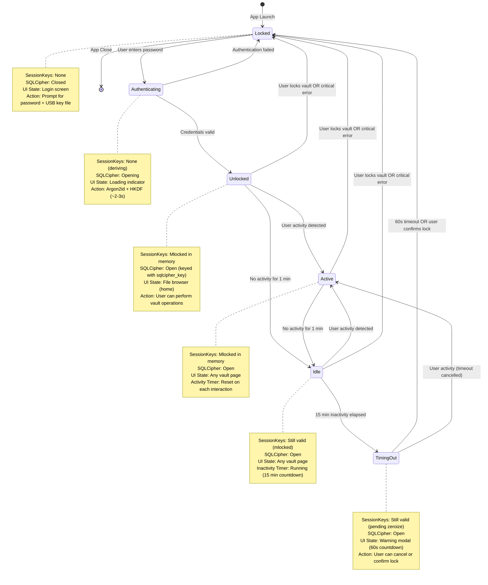

# Session State Machine

> Auto-generated by `/diagram`. Regenerate with `/diagram update session-state-machine.md`.
> Last updated: 2026-04-05

## Description

State machine for VoidGate session lifecycle. States represent the authentication and activity status of the vault session. All session keys are held in mlocked memory during Unlocked/Active/Idle/TimingOut states and immediately zeroized on transition to Locked.

### States

- **Locked**: No active session. SQLCipher closed, no keys in memory. User must authenticate to unlock.
- **Authenticating**: Password + USB key file submitted. Argon2id key derivation in progress (~2-3 seconds). Transition to Unlocked on success, Locked on failure.
- **Unlocked**: Session active but no specific activity state tracked yet. Immediately transitions to Active or Idle based on user interaction.
- **Active**: User is actively interacting with the vault. Activity timer resets on each interaction (mouse move, keystroke, file operation).
- **Idle**: No user activity for 1+ minutes. Inactivity timer starts counting toward 15-minute threshold.
- **TimingOut**: 15 minutes of inactivity elapsed. UI shows warning modal with 60-second countdown. User can cancel (return to Active) or confirm lock (transition to Locked).

### Transitions

| From | To | Trigger | Action |
|------|----|---------| -------|
| Locked | Authenticating | User enters password + key file detected | Start Argon2id + HKDF |
| Authenticating | Unlocked | Credentials valid | Open SQLCipher, mlock SessionKeys |
| Authenticating | Locked | Authentication failed | Zeroize intermediate state, show error |
| Unlocked | Active | User activity detected | Start activity timer |
| Unlocked | Idle | No activity for 1 min | Start inactivity timer (15 min threshold) |
| Active | Idle | No activity for 1 min | Continue inactivity timer |
| Idle | Active | User activity detected | Reset inactivity timer |
| Idle | TimingOut | 15 min inactivity elapsed | Show warning modal (60s countdown) |
| TimingOut | Active | User activity or cancels timeout | Reset all timers |
| TimingOut | Locked | 60s expires OR user confirms lock | Zeroize SessionKeys, close SQLCipher |
| Any unlocked | Locked | User locks vault OR critical error | Immediate zeroize + close |

### Security invariants

- **SessionKeys lifecycle**: Only exist in mlocked memory during Unlocked/Active/Idle/TimingOut. Zeroized on transition to Locked (via `ZeroizeOnDrop`).
- **SQLCipher connection**: Opened only after successful authentication. Closed before SessionKeys are zeroized (to avoid use-after-free).
- **No key persistence**: SessionKeys never written to disk, swap, or log files.
- **Fail-secure**: Critical errors (mlock failure, SQLCipher corruption) immediately transition to Locked state with zeroization.

### Timer configuration

- **Activity timeout**: 1 minute of no interaction → Idle
- **Inactivity timeout**: 15 minutes in Idle → TimingOut
- **Warning duration**: 60 seconds in TimingOut → Locked (if no activity)

All timers configurable via `SessionConfig` (Phase 2.3 implementation).

## Related

- Design document: [../design.md](../design.md)
- Authentication flow: [../../authentication-and-session-management/diagrams/authentication-flow.md](../../authentication-and-session-management/diagrams/authentication-flow.md)
- Sub-phase: [../../authentication-and-session-management/sub-phases/2.3-session-lifecycle-and-timeout.md](../../authentication-and-session-management/sub-phases/2.3-session-lifecycle-and-timeout.md)
- Source: `src-tauri/src/auth/session.rs`
