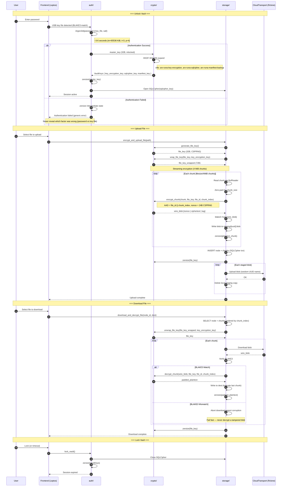

# End-to-End Encryption Flow

> Auto-generated by `/diagram`. Regenerate with `/diagram update end-to-end-encryption-flow.md`.
> Last updated: 2026-04-12



## Description

This diagram shows the complete encryption data flow across Arx Runa's modules, from user authentication through file upload/download to vault locking.

### Key security invariants illustrated

1. **master_key** exists only during HKDF expansion, then is immediately zeroized
2. **file_key** is generated per file, wrapped before storage, and zeroized after each operation
3. **Plaintext buffers** are zeroized immediately after encryption/decryption
4. **AAD binding** includes both `file_id` and `chunk_index` to prevent swap attacks
5. **BLAKE3 verification** occurs before decryption attempt (fail-fast)
6. **All keys** are held in mlocked memory during the session

### Module boundaries

| Module | Responsibility |
|--------|----------------|
| `auth/` | Password + key file → Argon2id → master_key → HKDF; session lifecycle |
| `crypto/` | HKDF expansion, chunk encrypt/decrypt, file key wrap/unwrap, nonce generation |
| `storage/` | Chunking, manifest (SQLCipher), staging, orchestrates encrypt/decrypt pipeline |
| `CloudTransport` | Rclone abstraction for blob upload/download |

### Wire format

Each encrypted chunk blob:
```
[24-byte nonce | ciphertext (padded to 4 MiB) | 16-byte Poly1305 tag]
```

Total overhead: 40 bytes per chunk (0.001% of 4 MiB).

## Related

- Design: [Cryptographic Primitives](../designs/cryptographic-primitives/design.md)
- Design: [Authentication & Session Management](../designs/authentication-and-session-management/design.md)
- Design: [Chunking & Manifest](../designs/chunking-and-manifest/design.md)
