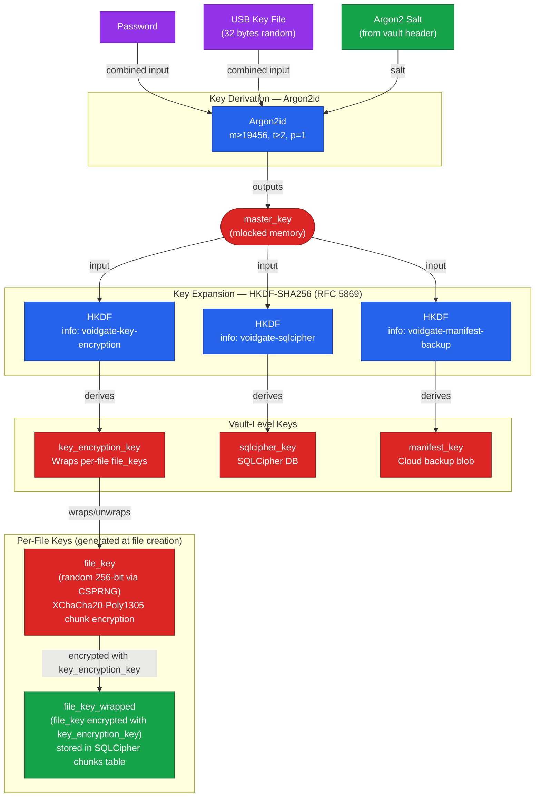

# Key Derivation Tree

> Auto-generated by `/diagram`. Regenerate with `/diagram update key-derivation-tree.md`.
> Last updated: 2026-03-29 (sharing design integration)

## Description

The key derivation tree shows how a single master key is derived from user credentials
(password + USB key file + Argon2 salt) via Argon2id, then expanded into three
vault-level purpose-specific keys via HKDF-SHA256. A fourth level of per-file keys
provides file-granularity access control.

**Legend:**
- `master_key` — output of Argon2id; never stored, held in mlocked memory only
- `key_encryption_key` — wraps and unwraps per-file `file_key` values; never used directly for chunk encryption
- `sqlcipher_key` — used to key the local SQLCipher manifest database
- `manifest_key` — used to encrypt the manifest backup blob uploaded to cloud storage
- `file_key` — random 256-bit key generated per file at creation time; used for XChaCha20-Poly1305 chunk encryption; stored wrapped (encrypted) in SQLCipher
- `Argon2 Salt` — stored in plaintext in the vault header (public by design, needed before key derivation)

**Key separation properties:**
- Compromising `key_encryption_key` exposes wrapped file keys in SQLCipher, but not `sqlcipher_key` or `manifest_key`
- Compromising a `file_key` exposes only that file's chunks — not other files
- Compromising `sqlcipher_key` exposes the manifest (file metadata, blob names) but not chunk plaintext
- `master_key` is never stored; an attacker without the password + USB key file cannot derive any vault-level key

## Related

- Report log: [2026-03-28-225617-problem-formulation.md](../../report-log/2026-03-28-225617-problem-formulation.md)
- Source files: `src-tauri/src/auth/` (Argon2id + session keys), `src-tauri/src/crypto/` (HKDF derivation)
- Design document: [../../architecture/designs/file-sharing.md](../../architecture/designs/file-sharing.md)
