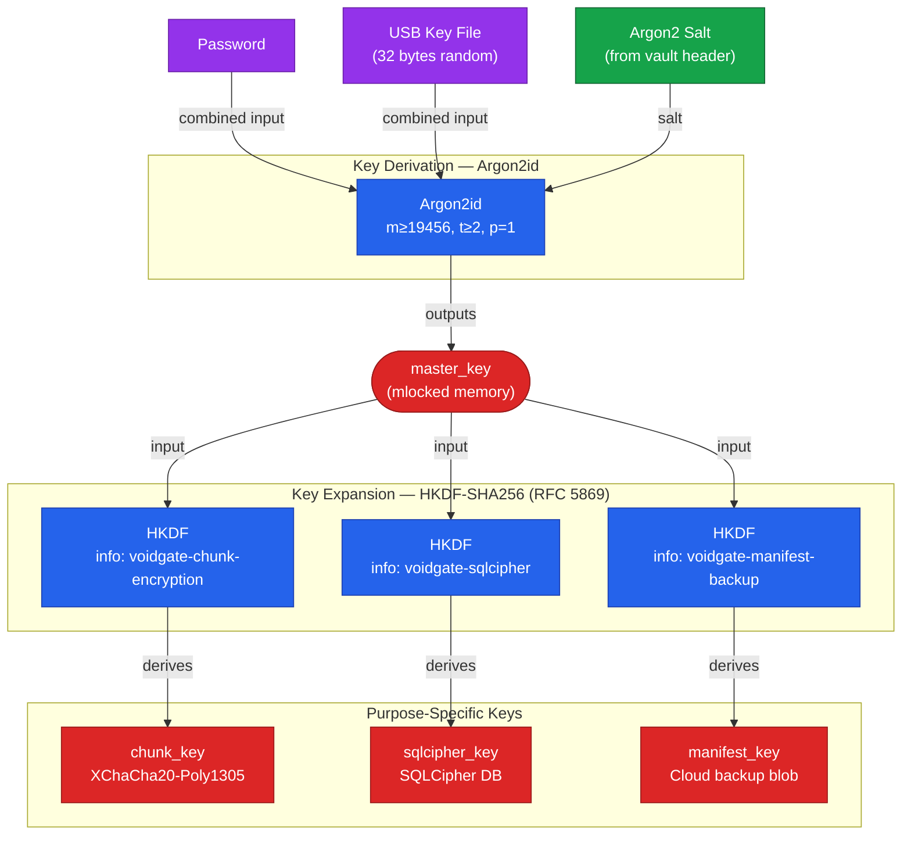

# Key Derivation Tree

> Auto-generated by `/diagram`. Regenerate with `/diagram update key-derivation-tree.md`.
> Last updated: 2026-03-28T23:45:24+0100 (commit: 703df41)

## Description

The key derivation tree shows how a single master key is derived from user credentials (password + USB key file + Argon2 salt) via Argon2id, then expanded into three purpose-specific keys via HKDF-SHA256. Key separation ensures that a compromise of one derived key (e.g. `chunk_key`) does not expose the others (`sqlcipher_key`, `manifest_key`).

**Legend:**
- `master_key` — output of Argon2id; never stored, held in mlocked memory only
- `chunk_key` — used for XChaCha20-Poly1305 AEAD encryption of file chunks
- `sqlcipher_key` — used to key the local SQLCipher manifest database
- `manifest_key` — used to encrypt the manifest backup blob uploaded to cloud storage
- `Argon2 Salt` — stored in plaintext in the vault header (public by design, needed before key derivation)

## Related

- Report log: [2026-03-28-225617-problem-formulation.md](../../report-log/2026-03-28-225617-problem-formulation.md)
- Source files: `src-tauri/src/auth/` (Argon2id + session keys), `src-tauri/src/crypto/` (HKDF derivation)
