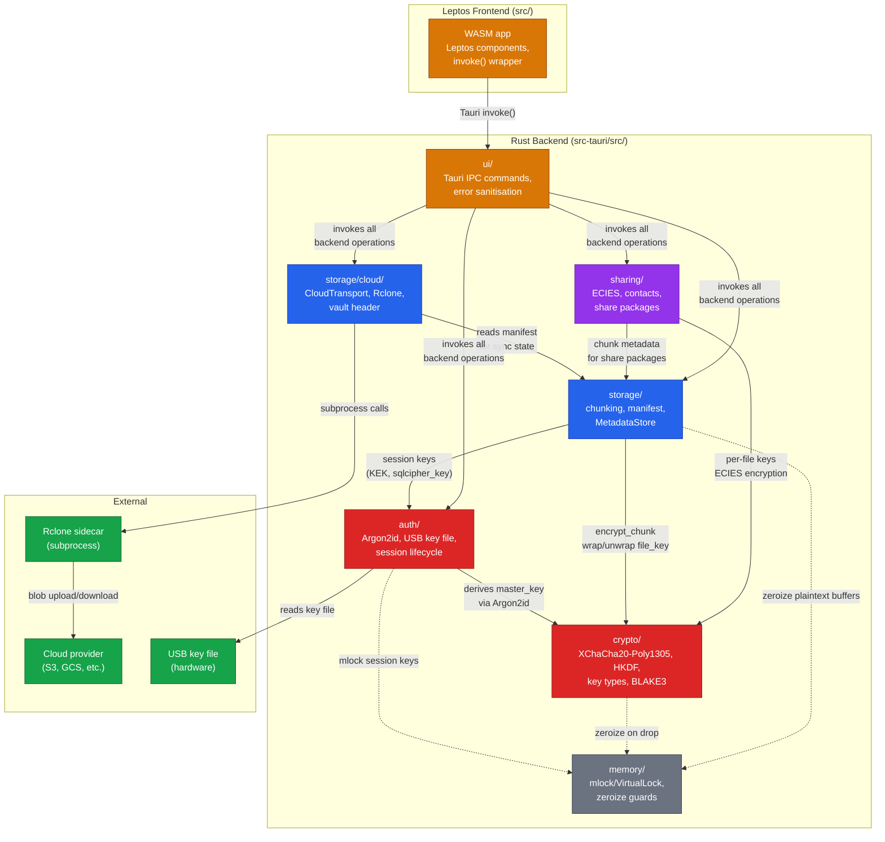

# Module Dependency Graph

> Auto-generated by `/diagram`. Regenerate with `/diagram update module-dependency-graph.md`.
> Last updated: 2026-04-04

## Description

Shows the dependency relationships between Arx Runa's Rust modules, the Leptos frontend, and external systems.

### Dependency layers

1. **Core** (red): `crypto/` and `auth/` — foundational cryptographic and authentication primitives. `auth` depends on `crypto` for key derivation.
2. **Data** (blue): `storage/` and `storage/cloud/` — chunking, manifest management, and cloud synchronisation. Depends on both core modules.
3. **Feature** (purple): `sharing/` — file sharing via ECIES. Depends on crypto and storage. Cloud access goes through storage abstraction.
4. **Infrastructure** (grey): `memory/` — memory protection (`mlock`, `zeroize`). Used by core and data modules via dotted lines (cross-cutting concern).
5. **Boundary** (amber): `ui/` and WASM frontend — Tauri IPC layer that sanitises errors and exposes backend operations to the frontend.
6. **External** (green): Rclone sidecar, cloud provider, USB key file.

### Key invariant

The dependency graph is acyclic. Lower layers never import from higher layers. The IPC boundary (`ui/`) is the only module that touches all backend modules.

## Related

- Roadmap: [../../roadmap.md](../../roadmap.md)
- SSOT Information Flow: [ssot-information-flow.md](ssot-information-flow.md)
- End-to-End Encryption Flow: [end-to-end-encryption-flow.md](end-to-end-encryption-flow.md)
