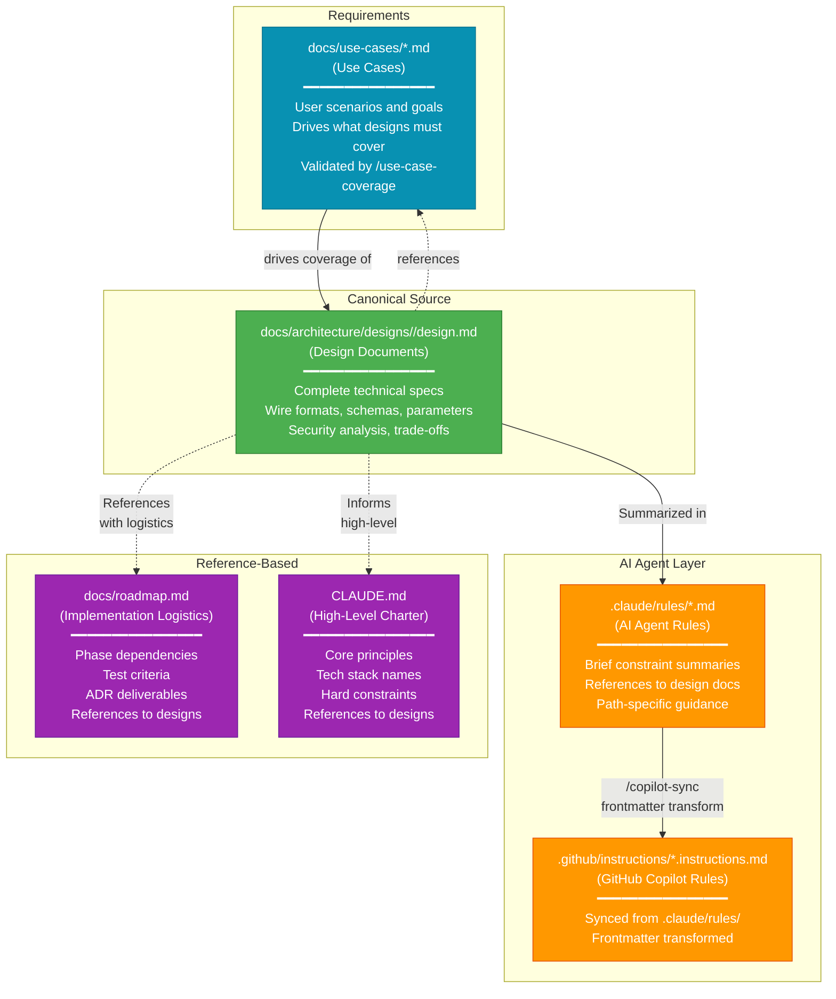

# SSOT Architecture Information Flow

## Legend

- **Requirements** (Teal): User scenarios that drive what the system must cover. Validated against design docs via `/use-case-coverage`.
- **Canonical Source** (Green): Authoritative technical specifications. Edit here first.
- **AI Agent Layer** (Orange): Brief summaries that reference canonical sources.
- **Reference-Based** (Purple): High-level documents that reference designs, not duplicate them.

## Information Flow

1. **Use Cases → Design**: Use cases define what scenarios designs must address; `/use-case-coverage` validates coverage
2. **Design → Use Cases**: Design docs reference the use cases they implement (traceability)
3. **Design → Rules**: Rule files summarize constraints and reference design docs for details
4. **Rules → Sync**: Rules synced to GitHub Copilot via `/copilot-sync`
5. **Design → Reference**: Roadmap and CLAUDE.md reference designs for details

## Key Principle

**Design documents are the single source of truth**. Use cases define *what* must be covered; design docs define *how*. AI agents read rule summaries for quick context, then consult design docs for authoritative details. When parameters change:

1. Update the design document
2. Update rule summary if needed
3. Run `/copilot-sync`
