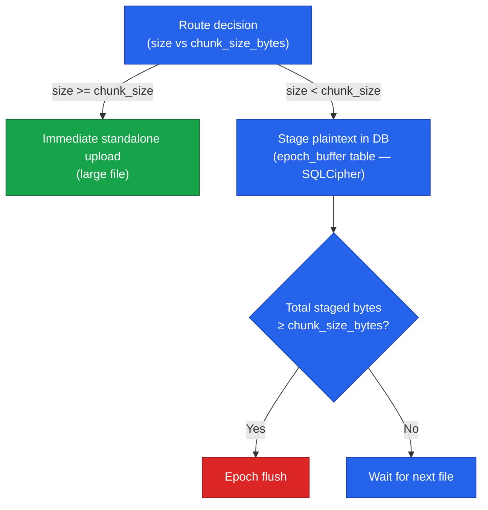

# Chunking Strategy and Epoch Buffering

When a file is added to Arx Runa it is split into uniform chunks before encryption. This page explains why fixed-size chunks are used, what the trade-offs are, and how the optional epoch buffer reduces storage overhead for vaults with many small files.

---

## Why fixed-size chunks?

Three chunking strategies are common in backup and cloud-storage systems:

| Strategy | How it works | Why Arx Runa rejects it |
|---|---|---|
| **Variable-size** | Chunk boundaries adapt to natural file-segment boundaries | Variation in chunk sizes leaks content patterns to an observer who can compare uploads over time |
| **Content-defined (CDC)** | A rolling hash over the data determines where chunks end — ideal for deduplication | The hash is computed over plaintext, creating a structural fingerprint of the file. An adversary with access to historical upload patterns can correlate fingerprints across uploads even without the encryption key |
| **Fixed-size** | Every chunk is exactly `chunk_size_bytes` — the last chunk is zero-padded to the same size | — |

Arx Runa uses fixed-size chunks (default 4 MiB, configurable at vault creation from 128 KiB to 64 MiB, immutable thereafter). Every blob the cloud receives is identically sized. An observer can count the number of blobs and infer a size *interval*, but not the exact file size, and learns nothing about file content structure.

The chunk size is stored in `manifest_meta.chunk_size_bytes` and validated on every vault open. Changing it after vault creation would require downloading, re-encrypting, and re-uploading every blob — equivalent to recreating the vault.

---

## The padding trade-off

Zero-padding is straightforward for large files: a 30 MiB file becomes eight 4 MiB blobs with modest waste on the last chunk. For very small files the ratio is reversed. A 10 KiB note padded to 4 MiB is a 400:1 overhead. The true file size is stored inside the encrypted manifest and the cloud never learns it, but the storage cost is real.

For most use cases — photos, documents, backups — this overhead is negligible. For vaults storing hundreds of small files (notes, configuration files, source code snippets) the cumulative waste matters.

---

## Epoch buffering: packing small files together

Epoch buffering is an opt-in vault setting (`epoch_buffer_enabled`, default off) that addresses the small-file overhead problem by packing multiple small files into a single encrypted blob before uploading.

### Routing

When epoch buffering is enabled, every file upload goes through a routing decision in `storage::vault_ops::routing::decide`:

- **Files smaller than `chunk_size_bytes`** → epoch buffer path
- **Files `chunk_size_bytes` or larger** → immediate standalone upload (same as when epoch buffering is off)

The trailing partial chunk of a large file is not deferred to the epoch buffer — it follows the immediate path and is padded to `chunk_size_bytes` as normal.

### How the epoch buffer path works

1. **Stage**: The file is loaded into memory (it is small by definition — less than `chunk_size_bytes`). The plaintext is written to the `epoch_buffer` table inside the SQLCipher database — never as a standalone plaintext file on disk. SQLCipher encrypts the entire database, so the plaintext is at rest only in encrypted form.

2. **Check flush trigger**: After staging, Arx Runa checks whether the total bytes in `epoch_buffer` have reached `chunk_size_bytes`.

3. **Flush**: When the threshold is reached, all staged plaintexts are concatenated into a single buffer, zero-padded to exactly `chunk_size_bytes`, and encrypted as one blob using `encrypt_chunk`. A BLAKE3 checksum is computed over the encrypted epoch blob and stored alongside it.

4. **Commit**: `commit_epoch_flush` runs as a single atomic transaction: it inserts the `epoch_blobs` row, creates chunk rows for each file with `byte_offset` and `byte_length` that record where that file's data sits within the epoch blob, and clears the `epoch_buffer` table.

5. **Upload**: The epoch blob is uploaded as a single cloud object — one API call regardless of how many files it contains.

### Decrypting a file stored in an epoch blob

When you download a file that was stored in an epoch blob, Arx Runa:

1. Looks up the file's chunk record in the manifest — it has `epoch_blob_id` set instead of `blob_name`
2. Fetches the `EpochBlobRecord` and unwraps the epoch file key
3. Verifies the BLAKE3 checksum of the epoch blob, then decrypts it
4. Slices out bytes `byte_offset` through `byte_offset + byte_length` from the decrypted buffer
5. Writes only that slice to the destination and zeroizes the buffer

The exported file is byte-for-byte identical to the original regardless of how many other files share the same epoch blob.

### Security properties

Epoch buffering does not weaken the zero-knowledge guarantee:

- Plaintext staged in the `epoch_buffer` table is encrypted by SQLCipher — it never exists as an unencrypted file on disk
- The epoch blob uploaded to the cloud is a standard encrypted blob, indistinguishable from a standalone chunk blob
- The cloud learns that one blob was uploaded; it cannot determine how many files it contains or what they are
- Each file's key is still generated and stored independently; the epoch file key wraps the concatenated buffer and is separate from individual file keys

### Comparing the two paths

| | Standalone path | Epoch buffer path |
|---|---|---|
| Files per blob | 1 | Many (up to flush threshold) |
| Padding overhead | Full `chunk_size_bytes` per file | Shared across files in one epoch |
| Cloud API calls | 1 per chunk | 1 per epoch blob |
| Plaintext on disk | Never | Never (staged in SQLCipher) |
| Enabled | Always | Opt-in at vault creation |

---

## Choosing at vault creation

The `epoch_buffer_enabled` setting is chosen once at vault creation and is immutable thereafter, just like `chunk_size_bytes`. Both are part of the vault's identity: changing either would require re-encrypting every blob.

If your vault is primarily large files (photos, videos, archives), the default — epoch buffering off — is the right choice. If your vault stores many small files, enabling epoch buffering at creation time will significantly reduce both cloud storage usage and the number of API calls per sync.

---

## Related

- [How Files Are Encrypted and Decrypted](file-encryption.md) — the full encryption and decryption pipeline
- [What the Cloud Sees](cloud-sync.md) — blob layout, UUID naming, and what the cloud provider can observe
