# What the Cloud Sees

The cloud is the most obvious place to ask: *what if someone gets in?* A compromised S3 bucket, a subpoena to your provider, a rogue employee with storage access — any of these might give an attacker read access to everything you've uploaded. This page explains what they would find.

## What is actually stored in the cloud

Your cloud storage holds a flat directory of encrypted blobs, a vault header file, and an encrypted manifest backup. Nothing else.

```
<remote>:<cloud_root>/
  vault-header.json               -- public parameters only, no key material
  manifest/
    manifest-backup.blob          -- encrypted SQLCipher export
  vault/
    <uuid>.blob                   -- your encrypted file chunks
```

Every encrypted chunk is named with a random UUID — 128 bits with no relation to the file it came from, the chunk's position in that file, or any other identifying information. There is no folder structure. There are no file names. There are no timestamps that reveal when a file was last modified. From the outside, the vault directory is an undifferentiated pile of identically sized blobs.

## What the cloud provider can observe

An observer with full read access to your cloud storage can see:

| What they see | What it reveals |
|---|---|
| Number of blobs in `vault/` | Approximate vault size in 4 MiB increments — not file count or individual file sizes |
| Each blob's size | Nothing — all blobs are padded to exactly the same size before encryption |
| Blob names | Nothing — each is a random UUID with no connection to file identity |
| Upload and download timing | When you are active; upload order is randomised, so which blobs belong to the same file cannot be inferred from timing alone |
| `vault-header.json` contents | Only public parameters needed to re-derive keys: the Argon2id salt, memory settings, and a BLAKE3 fingerprint of your USB key file — no key material, no decryptable content |
| `manifest/manifest-backup.blob` | That a manifest backup exists; the content is AEAD-encrypted and unreadable without your master key |
| File names, folder structure, file content | Nothing — all of this lives inside encrypted ciphertext |

The one thing the cloud does learn is a lower bound on how much data you have — blob count multiplied by 4 MiB. This is inherent to any cloud backup system and cannot be hidden without far more complex techniques.

## Staging is local and temporary

Before any chunk reaches the cloud, it passes through a local staging directory on your device. Chunks are encrypted and written to staging first, then uploaded by the sync layer, then deleted from staging once the upload is confirmed. The staging directory is never exposed to the cloud and is cleared of orphaned blobs on startup. The cloud receives only finished, encrypted blobs.

## Rclone as the transport layer

Arx Runa does not implement its own cloud protocol. Instead it uses [rclone](https://rclone.org) — a mature, open-source tool that speaks to over 70 storage backends — as a sidecar process that handles the actual bytes-over-the-wire work. Arx Runa manages what gets uploaded and in what order; rclone handles authentication and transfer.

Out of the box, the setup wizard covers the most common providers: AWS S3, Backblaze B2, Wasabi, Cloudflare R2, Google Drive, OneDrive, and local or external drives. If your provider isn't on that list, you can supply a raw rclone configuration directly, which gives access to all backends rclone supports.

Cloud credentials are never written to disk in plaintext. They are stored as encrypted rows inside your vault's SQLCipher database — the same Argon2id-hardened key chain that protects everything else — and are passed to rclone via a temporary file when a session opens. That file is overwritten and deleted when the session closes.

## Multiple destinations

You can configure one primary destination and any number of backup destinations. Every push goes to the primary; backups are mirrored from the primary on demand or on schedule using `rclone sync`. Because the blobs are already encrypted before they leave your device, copying them to a second cloud provider requires no re-encryption — the same XChaCha20-Poly1305 ciphertext lands verbatim on the backup. Losing your primary provider does not mean losing your data.

## The vault header in the cloud

One file in the cloud is intentionally readable before you authenticate: `vault-header.json`. It contains the Argon2id salt and parameters your device needs to re-derive your keys on a new machine, and the BLAKE3 fingerprint that identifies your USB key file. It contains no key material and no decryptable content. Anyone who downloads it learns only that Arx Runa is being used and which Argon2id parameters were chosen — the same information that would be visible on the login screen of any app.

Storing the header in the cloud is what makes new-device recovery possible without any server on Arx Runa's side. See [Recovery: If You Lose Your Key](recovery.md) for the full flow.

## Sync sequence

The diagram below shows a complete push and pull cycle, including conflict detection. All blob uploads are randomised in order and parallelised; the manifest backup is uploaded last, after all chunks are confirmed.

```mermaid
sequenceDiagram
    participant User
    participant Sync as Sync Module
    participant Meta as MetadataStore (SQLCipher)
    participant Stage as Staging Directory
    participant RT as RcloneTransport (sidecar)
    participant Cloud as Cloud Remote

    note over User,Cloud: Push Flow (upload local changes)
    User->>Sync: push()
    Sync->>Meta: get_meta("snapshot_counter") #45;#62; local_counter
    Sync->>RT: download_blob("manifest/manifest-backup.blob", temp)
    RT->>Cloud: rclone copyto manifest/manifest-backup.blob
    Cloud-->>RT: manifest-backup.blob
    RT-->>Sync: temp file
    Sync->>Sync: decrypt manifest backup #45;#62; cloud_counter
    break cloud_counter #62; local_counter
        Sync-->>User: CONFLICT — pull first
    end
    break cloud_counter #60; local_counter
        Sync-->>User: CONFLICT — cloud manifest older than local
    end

    Sync->>Meta: get all staged blob_names
    Sync->>Sync: Fisher-Yates shuffle(blob_list)
    
    note over Sync,Cloud: Concurrent upload (4 Rclone processes via JoinSet)
    
    par Upload blob 1
        Sync->>RT: upload_blob(staging/uuid1.blob)
        RT->>Cloud: rclone copyto vault/uuid1.blob
        Cloud-->>RT: ok
        RT-->>Sync: ok
        Sync->>Stage: delete staging/uuid1.blob
    and Upload blob 2
        Sync->>RT: upload_blob(staging/uuid2.blob)
        RT->>Cloud: rclone copyto vault/uuid2.blob
        Cloud-->>RT: ok
        RT-->>Sync: ok
        Sync->>Stage: delete staging/uuid2.blob
    and Upload blob 3
        Sync->>RT: upload_blob(staging/uuid3.blob)
        RT->>Cloud: rclone copyto vault/uuid3.blob
        Cloud-->>RT: ok
        RT-->>Sync: ok
        Sync->>Stage: delete staging/uuid3.blob
    and Upload blob 4
        Sync->>RT: upload_blob(staging/uuid4.blob)
        RT->>Cloud: rclone copyto vault/uuid4.blob
        Cloud-->>RT: ok
        RT-->>Sync: ok
        Sync->>Stage: delete staging/uuid4.blob
    end
    
    note over Sync: Repeat for next batch until all blobs uploaded
    Sync->>Meta: increment_snapshot_counter() #45;#62; new_counter
    Sync->>Meta: set_meta("last_synced_at", now)
    Sync->>Sync: VACUUM INTO temp#59; encrypt with manifest_key
    Sync->>RT: upload_blob(temp, manifest/manifest-backup.blob)
    RT->>Cloud: rclone copyto
    Cloud-->>RT: ok
    Sync->>RT: upload_blob(vault-header.json, vault-header.json)
    RT->>Cloud: rclone copyto
    Cloud-->>RT: ok
    Sync-->>User: push complete (new_counter blobs synced)

    note over User,Cloud: Pull Flow (new-device recovery)
    User->>Sync: pull()
    Sync->>RT: download_blob("vault-header.json", temp)
    RT->>Cloud: rclone copyto vault-header.json
    Cloud-->>RT: vault-header.json
    RT-->>Sync: temp file
    Sync->>Sync: parse VaultHeader #45;#62; salt, params, key_file_blake3
    Sync-->>User: prompt: password + USB key file
    User->>Sync: password + key_file_path
    Sync->>Sync: Argon2id(password || key_file, salt) #45;#62; master_key
    Sync->>Sync: HKDF #45;#62; key_encryption_key, sqlcipher_key, manifest_key
    Sync->>Sync: zeroize(master_key)
    Sync->>RT: download_blob("manifest/manifest-backup.blob", temp)
    RT->>Cloud: rclone copyto manifest/manifest-backup.blob
    Cloud-->>RT: manifest-backup.blob
    RT-->>Sync: temp file
    Sync->>Sync: decrypt manifest backup with manifest_key
    Sync->>Meta: import SQLCipher DB (keyed with sqlcipher_key)
    Sync->>Meta: get all chunk rows #45;#62; (blob_name, blake3_checksum)
    
    note over Sync,Cloud: Concurrent download (4 Rclone processes via JoinSet)
    
    par Download blob 1
        Sync->>RT: download_blob(vault/uuid1.blob)
        RT->>Cloud: rclone copyto vault/uuid1.blob
        Cloud-->>RT: uuid1.blob
        RT-->>Sync: staging/uuid1.blob
        Sync->>Sync: Verify BLAKE3 (delete + record failure on mismatch)
    and Download blob 2
        Sync->>RT: download_blob(vault/uuid2.blob)
        RT->>Cloud: rclone copyto vault/uuid2.blob
        Cloud-->>RT: uuid2.blob
        RT-->>Sync: staging/uuid2.blob
        Sync->>Sync: Verify BLAKE3
    and Download blob 3
        Sync->>RT: download_blob(vault/uuid3.blob)
        RT->>Cloud: rclone copyto vault/uuid3.blob
        Cloud-->>RT: uuid3.blob
        RT-->>Sync: staging/uuid3.blob
        Sync->>Sync: Verify BLAKE3
    and Download blob 4
        Sync->>RT: download_blob(vault/uuid4.blob)
        RT->>Cloud: rclone copyto vault/uuid4.blob
        Cloud-->>RT: uuid4.blob
        RT-->>Sync: staging/uuid4.blob
        Sync->>Sync: Verify BLAKE3
    end
    
    note over Sync: Repeat for next batch until all blobs downloaded
    Sync-->>User: pull complete (any failures reported)
```


