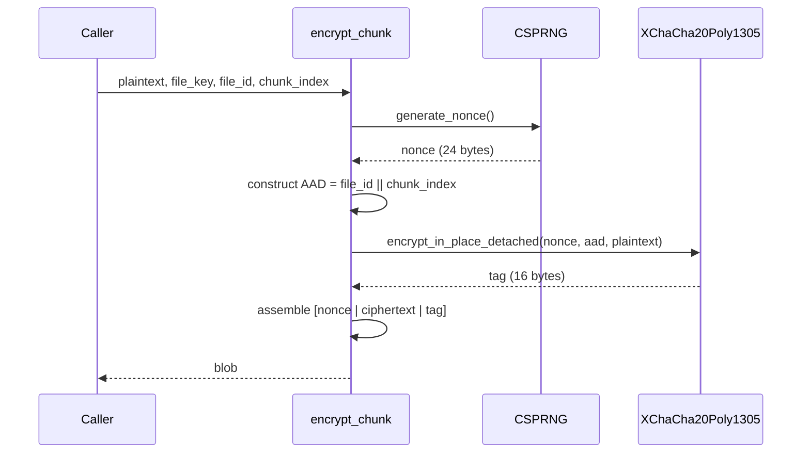
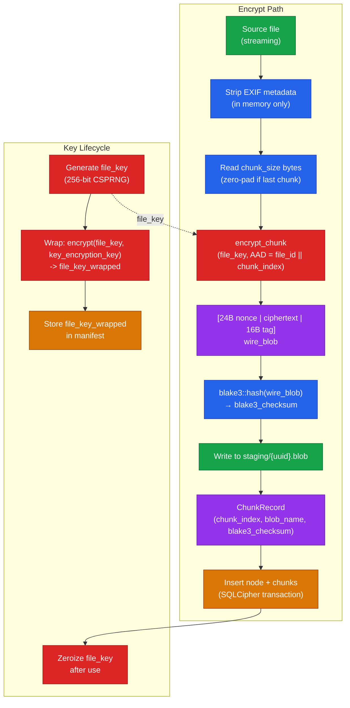
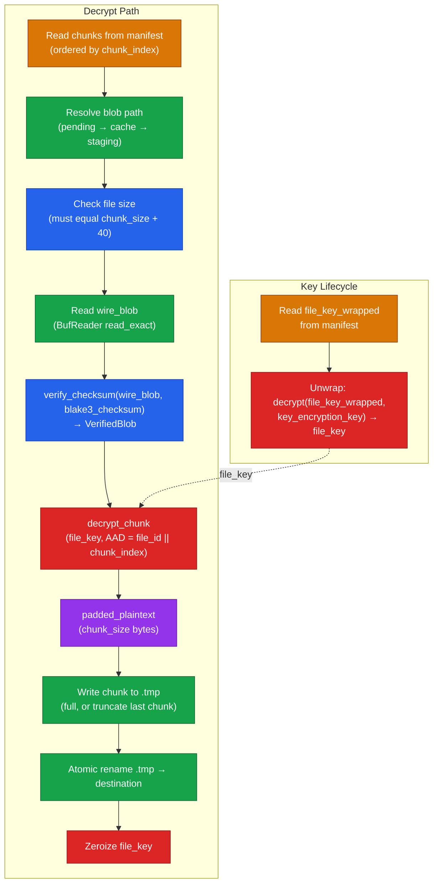

# How Files Are Encrypted and Decrypted

When you add a file to Arx Runa, it never reaches the cloud in recognisable form. By the time the first byte leaves your device, the file has been stripped of hidden metadata, split into uniform chunks, padded to an identical size, and encrypted under a key that exists nowhere outside your vault. Here is what happens at each step — and why.

## Stripping hidden metadata

Before encryption begins, Arx Runa strips [EXIF](../guides/glossary.md#exif), XMP, and IPTC metadata from media files. A photo from your phone carries GPS coordinates, camera model, lens settings, and timestamps alongside the image itself — information you may not intend to archive. Arx Runa removes all of it in memory before any further processing. Your original file on disk is never modified; the stripped copy is what enters the encryption pipeline. When you later export a file, the exported copy will also be free of that embedded metadata.

## Splitting into chunks

The clean file is split into fixed-size chunks — 4 MiB by default, though you choose the size once at vault creation and it applies to every file thereafter. Chunking serves three purposes: it enables streaming so Arx Runa never holds an entire file in memory, it allows partial download when you only need part of a large file, and it keeps memory use bounded regardless of how big the file is.

## Padding every chunk to the same size

The final chunk of most files is shorter than the full chunk size. Rather than uploading a shorter blob — which would let an observer infer the file's true size — Arx Runa zero-pads the last chunk to the full chunk size before encryption. Every blob the cloud receives is identically sized, whether it contains 1 byte of real data or 4 MiB. The actual file size is stored inside your encrypted manifest database; the cloud learns only how many blobs exist, nothing more.

## A unique key for every file

When you add a file, Arx Runa generates a fresh random 256-bit key just for that file. This key is immediately *wrapped* — encrypted using the `key_encryption_key` derived from your master key — and stored in the manifest. The raw file key never touches disk and is zeroed from memory as soon as encryption is complete.

Because each file has its own independent key, the exposure or rotation of one file's key has no effect on any other file. Rekeying is surgical, not vault-wide.

## Encrypting each chunk

Each chunk is encrypted with [XChaCha20-Poly1305](../guides/glossary.md#xchacha20-poly1305), an authenticated encryption scheme. The cipher generates a fresh 192-bit random nonce for every single chunk — with a nonce space this large, the probability of two chunks ever sharing a nonce is negligible across any realistic number of files.

Alongside the nonce, each encryption operation takes in *associated authenticated data* (AAD) that binds the ciphertext to both the file's unique identity and the chunk's position in the sequence. This means a chunk cannot be silently reordered or transplanted from another file — if the file or position doesn't match, the authentication tag will fail and decryption is rejected before any data is returned.

The wire format stored for each chunk is:

```
[ 24-byte nonce | ciphertext | 16-byte Poly1305 tag ]
```

The 16-byte tag is what makes tampering detectable. Flip a single bit in transit or storage and decryption fails cleanly.



## Integrity check on the encrypted blob

After encryption, Arx Runa computes a [BLAKE3](../guides/glossary.md#blake3) checksum over the encrypted blob. This checksum is recorded in the manifest alongside the chunk record. When a chunk is downloaded, the checksum is verified *before* decryption begins — so bit rot or storage corruption is caught immediately, without any decryption key being exercised against corrupt data.

## The manifest

The manifest is a [SQLCipher](../guides/glossary.md#sqlcipher) database encrypted with its own key derived independently from the master key. It holds the mapping from your file paths and directory structure to chunk records — including chunk positions, blob identifiers, BLAKE3 checksums, and the wrapped file keys. Without the manifest, the cloud blobs are an anonymous, unordered collection of identically sized ciphertext. The manifest is also backed up to the cloud in encrypted form so you can restore it on a new device.

## The full pipeline



---

# How Files Are Decrypted

Decryption is the exact inverse of encryption. Every guarantee made on the way in — authentication, ordering, padding removal — is enforced again on the way out, before a single byte of plaintext is written.

## Unwrapping the file key

The manifest stores the file key in wrapped form. To begin decryption, Arx Runa unwraps it using the `key_encryption_key` derived from the master key. The raw file key exists in memory only for the duration of the operation and is zeroed immediately after.

## Pre-flight validation

Before touching any blobs, Arx Runa validates the chunk list from the manifest: the number of chunks must match what is expected for the file size, and chunk indices must be contiguous starting at zero with no gaps or duplicates. Any anomaly here is a hard stop — it means the manifest is inconsistent and the file cannot be safely reconstructed.

## Locating each blob

Chunks may live in different locations depending on sync state. For each blob, Arx Runa checks in order: the pending upload directory, the local cache, and the staging directory. Whichever location holds the file wins. If none do, the blob must be downloaded from the cloud before decryption can proceed.

## Verifying integrity before decryption

The BLAKE3 checksum stored in the manifest is verified against the blob **before** the file key is used. This is enforced at the type level — the `VerifiedBlob` type that `decrypt_chunk` accepts can only be constructed by `verify_checksum`, so it is impossible to decrypt a blob without first checking it. A mismatch means the blob was corrupted in storage or transit; the error is reported and decryption stops immediately.

Arx Runa also checks the blob's file size against the expected wire format size (`chunk_size + 40 bytes` for the 24-byte nonce and 16-byte tag) before reading it. A size mismatch fails without reading the blob content.

## Decrypting each chunk

`decrypt_chunk` takes the verified blob, the file key, and the same AAD used during encryption (`file_id || chunk_index`). XChaCha20-Poly1305 authenticates the ciphertext and tag together: if either has been tampered with, or if the wrong file identity or chunk position is supplied, the authentication tag fails and no plaintext is returned. There is no partial output on failure.

The result is a buffer of exactly `chunk_size` bytes — the padded plaintext.

## Stripping padding from the last chunk

Every chunk except the last is written in full. For the last chunk, Arx Runa reads the true file size from the manifest and writes only the bytes that belong to the file:

```
bytes_to_write = file_size − (chunk_index × chunk_size)
```

The zero-padding added at encryption time is silently discarded. The output file will be byte-for-byte identical to the original, minus any EXIF metadata that was stripped on the way in.

## Atomic output

Arx Runa writes each chunk to a temporary file named `<destination>.arx-runa-decrypt-<uuid>.tmp`. Only after all chunks have been written and verified does it atomically rename the temporary file to the final destination. A crash at any point before the rename leaves no partial output at the destination path — the next attempt starts from the beginning.

## The full pipeline


