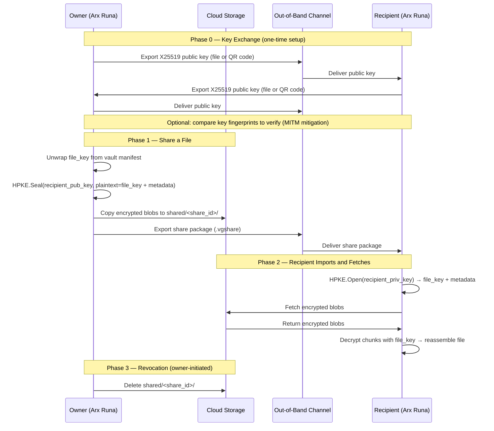

# Sharing Files Privately

Most file sharing works by trusting something: a shared password, a server that brokers access, or a platform that holds the keys on both ends. Arx Runa takes a different approach — it lets you share a file with someone so that only they can read it, and the cloud hosting the file cannot.

## Your identity: a key pair, not an account

When you first run Arx Runa, it generates an X25519 key pair. This is your sharing identity. The private key lives in your encrypted vault, protected by the same password and USB key that guards everything else. Your public key is something you can hand to anyone — it contains no secret information.

There is no central server that stores or verifies identities. Arx Runa doesn't have accounts. Email addresses appear in the contacts list as human-readable labels, not as delivery addresses — Arx Runa never touches email infrastructure.

## Exchanging public keys out-of-band

Before you can share a file with someone, you each need the other's public key. Arx Runa exports your public key as a small file or QR code. You send it to your contact via whatever channel you already trust — a message, an email, a USB stick. They import it, and do the same in reverse. This is a one-time setup per contact pair.

The security of this step depends on the channel you use. If an attacker controls that channel, they could substitute their own public key and intercept the share. To guard against this, Arx Runa displays a short fingerprint alongside each contact — the first 16 hex characters of the SHA-256 hash of their public key. A quick phone call to compare fingerprints is enough to confirm you have the real key.

## How the share package works

Every file in Arx Runa has its own random 256-bit encryption key — the `file_key`. This key is what encrypts the file's chunks in the cloud. It is wrapped with your vault's `key_encryption_key` and stored in the encrypted manifest, so normally only you can use it.

When you share a file, Arx Runa does something precise: it takes that file's `file_key` and encrypts it *for the recipient's public key* using [HPKE](../guides/glossary.md#hpke) (RFC 9180). The ciphersuite is `DHKEM(X25519, HKDF-SHA256) + HKDF-SHA256 + ChaCha20-Poly1305`. Only the recipient's private key can open this envelope. Not the cloud. Not Arx Runa's servers. Not you, once it's sent.

The result is a **share package** — a small file (`.vgshare`) that contains:

- The HPKE-encrypted envelope (which holds the `file_key`, the file name, chunk identifiers, and the cloud location)
- Nothing else — no unencrypted key material, no file content

You deliver the share package the same way you exchanged public keys: out-of-band, through a channel of your choosing.

## What the cloud hosts

To let the recipient download the file, Arx Runa copies the encrypted blobs into a separate folder in your cloud storage, under `shared/<share_id>/`. The cloud can see those blobs — the same opaque, fixed-size encrypted chunks that make up your normal vault. It cannot read the share package, which you deliver separately and out-of-band. It cannot read the `file_key` inside the package, because that is sealed to the recipient's public key.

The cloud sees ciphertext. The share package is the only thing that unlocks it, and the share package is only readable by the recipient.

## Snapshot semantics

A share is a point-in-time snapshot. When you share a file, the share package contains the chunk identifiers for the file *as it exists at that moment*. If you edit the file later, the recipient's share still points to the original version. To give them the updated file, you create a new share.

This is a deliberate choice. A "live" share — where the recipient always sees your latest version — would require a different, more complex model. The snapshot approach keeps the cryptography simple and the boundaries clear.

## Revocation and expiration

If the recipient has not yet fetched the blobs, you can revoke the share by deleting the `shared/<share_id>/` folder from the cloud. The share package they hold becomes a pointer to nothing — access is cut without any re-encryption.

If they have already downloaded and decrypted the blobs, the data is on their machine. Cryptographic revocation of content that has left your control is not possible — this is honest, not a flaw, and it is the same limitation that applies to any file you share by any method. For a stronger guarantee after-the-fact, Arx Runa supports re-encrypting the file under a new key, which invalidates any future fetches from the old blobs.

Shares can also have an expiry date. When a share expires, Arx Runa automatically deletes the blobs from cloud on its next sync — no manual action required.
