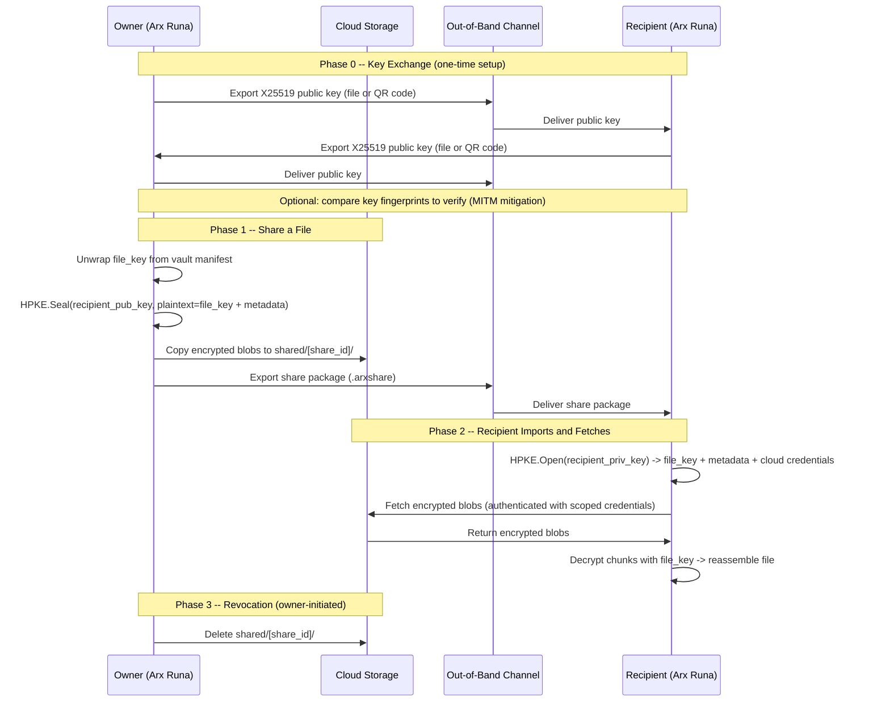
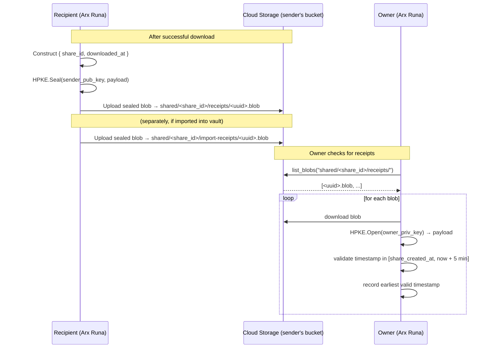

# Sharing Files Privately

Most file sharing works by trusting something: a shared password, a server that brokers access, or a platform that holds the keys on both ends. Arx Runa takes a different approach — it lets you share a file with someone so that only they can read it, and the cloud hosting the file cannot.

## Your identity: a key pair, not an account

When you first run Arx Runa, it generates an X25519 key pair. This is your sharing identity. The private key lives in your encrypted vault, protected by the same password and USB key that guards everything else. Your public key is something you can hand to anyone — it contains no secret information.

There is no central server that stores or verifies identities. Arx Runa doesn't have accounts. Email addresses appear in the contacts list as human-readable labels, not as delivery addresses — Arx Runa never touches email infrastructure.

## Exchanging public keys out-of-band

Before you can share a file with someone, you each need the other's public key. Arx Runa exports your public key as a small file or QR code. You send it to your contact via whatever channel you already trust — a message, an email, a USB stick. They import it, and do the same in reverse. This is a one-time setup per contact pair.

The security of this step depends on the channel you use. If an attacker controls that channel, they could substitute their own public key and intercept the share. To guard against this, Arx Runa displays a short fingerprint alongside each contact — the first 16 hex characters of the SHA-256 hash of their public key. A quick phone call to compare fingerprints is enough to confirm you have the real key.

## How the share package works

Every file in Arx Runa has its own random 256-bit encryption key — the `file_key`. This key is what encrypts the file's chunks in the cloud. It is wrapped with your vault's `key_encryption_key` and stored in the encrypted manifest, so normally only you can use it.

When you share a file, Arx Runa does something precise: it takes that file's `file_key` and encrypts it *for the recipient's public key* using [HPKE](../guides/glossary.md#hpke) (RFC 9180). The ciphersuite is `DHKEM(X25519, HKDF-SHA256) + HKDF-SHA256 + ChaCha20-Poly1305`. Only the recipient's private key can open this envelope. Not the cloud. Not Arx Runa's servers. Not you, once it's sent.

The result is a **share package** — a small file (`.arxshare`) that contains:

- The HPKE-encrypted envelope (which holds the `file_key`, the file name, chunk identifiers, the cloud location, and scoped cloud credentials for the recipient to download the blobs)
- Nothing else — no unencrypted key material, no file content

You deliver the share package the same way you exchanged public keys: out-of-band, through a channel of your choosing.



## What the cloud hosts

To let the recipient download the file, Arx Runa copies the encrypted blobs into a separate folder in your cloud storage, under `shared/<share_id>/`. The share package embeds scoped cloud credentials (inside the HPKE envelope) that allow the recipient to download from that folder — without accessing your main cloud account or vault. For B2 this is a scoped application key restricted to that prefix (read + write, so the recipient can also upload the receipt blob); for Google Drive it is a Service Account JSON with read permission on the shared folder.

The cloud sees ciphertext. The share package is the only thing that unlocks it, and the share package is only readable by the recipient.

## Snapshot semantics

A share is a point-in-time snapshot. When you share a file, the share package contains the chunk identifiers for the file *as it exists at that moment*. If you edit the file later, the recipient's share still points to the original version. To give them the updated file, you create a new share.

This is a deliberate choice. A "live" share — where the recipient always sees your latest version — would require a different, more complex model. The snapshot approach keeps the cryptography simple and the boundaries clear.

## Revocation and expiration

If the recipient has not yet fetched the blobs, you can revoke the share by deleting the `shared/<share_id>/` folder from the cloud. The share package they hold becomes a pointer to nothing — access is cut without any re-encryption.

If they have already downloaded and decrypted the blobs, the data is on their machine. Cryptographic revocation of content that has left your control is not possible — this is honest, not a flaw, and it is the same limitation that applies to any file you share by any method.

Shares can also have an expiry date (default: 30 days). When a share expires, Arx Runa automatically deletes the blobs from cloud on its next sync — no manual action required.

## Download receipts

When you share a file, the recipient's app is asked to send a delivery receipt. The recipient's app writes a small encrypted blob to your cloud storage after they successfully download the file. You can check for receipts at any time.

### What the receipt contains

The receipt is a JSON object sealed with [HPKE](../guides/glossary.md#hpke) to *your* public key — the same key that anchors your sharing identity:

```json
{ "share_id": "...", "downloaded_at": <unix timestamp> }
```

Only you can open it. The cloud sees an opaque blob uploaded to a `receipts/` prefix inside the share folder. It cannot read the timestamp or link it to a specific recipient.

### How receipts are written

After the recipient's app successfully downloads the shared blobs, it:

1. Constructs the receipt payload with the `share_id` and current timestamp.
2. HPKE-seals the payload to your public key — retrieved from the share package you sent.
3. Uploads the sealed blob to `shared/<share_id>/receipts/<uuid>.blob` in your cloud storage.

A second receipt is written to `import-receipts/<uuid>.blob` if the recipient imports the file into their own Arx Runa vault rather than saving it to disk directly. You can therefore distinguish "file reached their device" from "file entered their vault".

Receipt upload is best-effort and non-fatal: if it fails, the download still completes successfully and the recipient receives no error. The failure is logged internally and the receipt will simply be absent.

### How you check for receipts

Arx Runa polls `shared/<share_id>/receipts/` using your own cloud credentials. For each blob it finds, it downloads and attempts `HPKE.Open` with your private key. Any blob it cannot open — because it is malformed or was not sealed to your key — is silently skipped.

A valid receipt's timestamp is range-checked: it must fall between when you created the share and five minutes into the future (to tolerate clock skew). The earliest valid timestamp across all receipt blobs is recorded as the delivery time in your manifest.



### Privacy properties

- The receipt tells you the share was fetched; it does not contain the recipient's identity beyond the fact that whoever held the share package downloaded it.
- The cloud cannot read the receipt — it is sealed to your public key.
- Receipts are always requested. No receipt blob is ever written if the recipient's app fails to upload one (best-effort, non-fatal).
