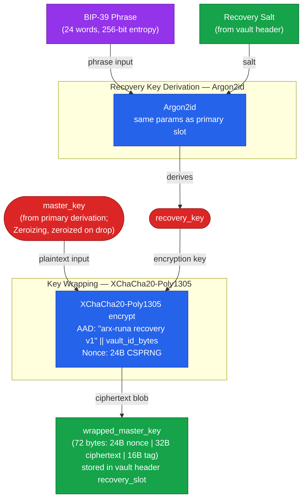

# Recovery: If You Lose Your Key

Every security system has to answer the same uncomfortable question: what happens when something goes wrong? Arx Runa has thought carefully about failure modes, and this page walks through your options for each one. Knowing the recovery paths — and their limits — is part of evaluating whether the system deserves your trust.

## The Recovery Phrase

When you create a vault, Arx Runa can generate a **recovery slot**: an independent second way to open your vault. Setup is opt-in and works like this. Arx Runa generates 256 bits of cryptographically random entropy and encodes it as a 24-word phrase in the [BIP-39](../guides/glossary.md) wordlist format — the same format used by hardware cryptocurrency wallets. You see this phrase exactly once. Write it down and store it somewhere safe, separate from your devices.

Internally, your phrase becomes a key through the same [Argon2id](../guides/glossary.md) derivation used for your password. That key then wraps an encrypted copy of your master key and stores it in the vault header in the cloud. The phrase itself is never stored anywhere — Arx Runa holds only the encrypted copy.

## Using the Phrase to Recover

If you forget your password or lose your USB key file, you enter the recovery phrase instead. Arx Runa runs Argon2id over the phrase, derives the recovery key, and uses it to unwrap your master key from the cloud vault header. From that point on, the session proceeds exactly as a normal unlock.

Recovery is a single atomic ceremony: you supply the phrase and your new credentials in one step. Arx Runa re-wraps everything under the new credentials and uploads an updated vault header. Afterwards your vault is fully operational under a new password (and optionally a new USB key), and your recovery phrase continues to work against the updated vault — you do not need to generate a new one.

The BIP-39 checksum embedded in the final word of the phrase catches transcription errors before Argon2id even runs, giving you immediate feedback on a mistyped word.

## New Device

Moving to a new machine requires no special ceremony if you still know your credentials. Configure your cloud backend, and Arx Runa fetches the vault header — which contains everything needed to re-derive your keys. Enter your password (and insert your USB key file if your vault uses one), and Arx Runa downloads the encrypted manifest backup from the cloud, decrypts it, and bootstraps a fully operational local vault. Nothing was stored locally on the old machine that needs to be transferred.

If the old machine is gone and you have also forgotten your password, this is where the recovery phrase is essential: fetch the vault header, enter the phrase, set new credentials, and you are back.

## Replacing a Lost USB Key

If you use USB two-factor authentication and lose the drive — but still remember your password — you can rotate the key file without the recovery phrase. The rotation ceremony requires the old key file to be present, so you need to act before losing access to it entirely. Arx Runa generates a new key file on a replacement drive, re-derives the master key under the new combination, and re-wraps everything. Your sharing relationships survive: the underlying identity keypair does not change during rotation, only the wrapping around it.

## The Hard Limit

If you did not configure a recovery slot, or if you lose both your password and your recovery phrase, your vault cannot be opened — not by you, not by Arx Runa. The same encryption that makes your files safe from an attacker makes them equally inaccessible without the keys. This is deliberate, not a gap: it means no support process, no account recovery form, and no legal demand can produce your data.

If that prospect concerns you, the answer is to configure a recovery slot now and store the phrase somewhere physically safe.
