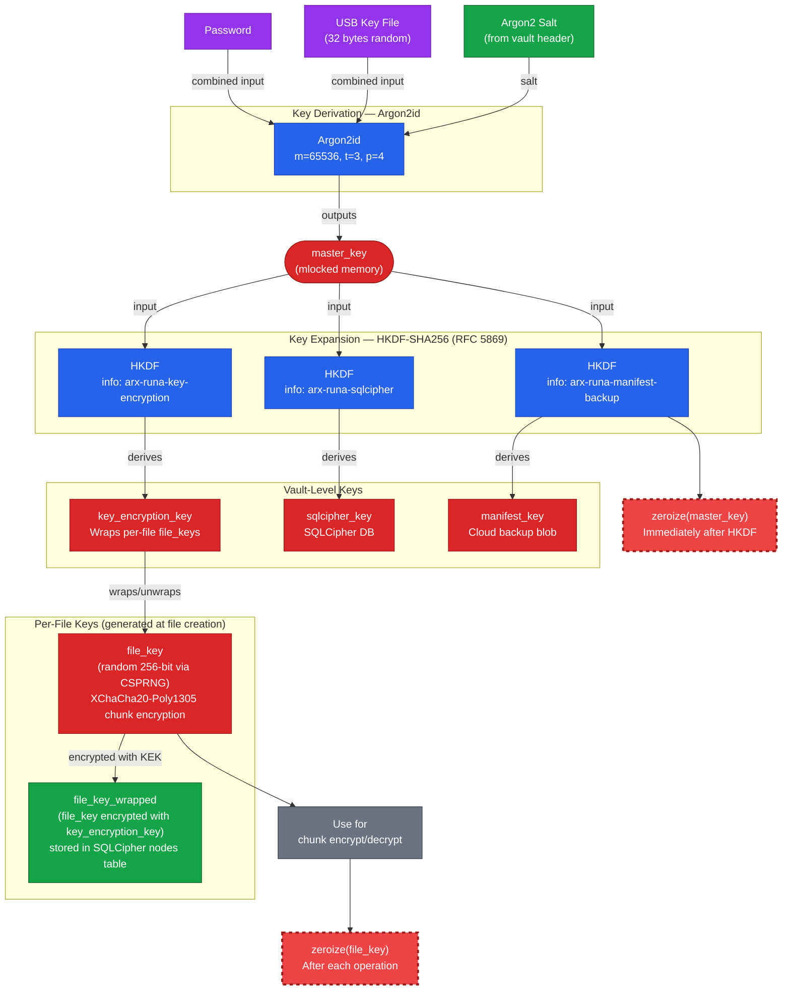

# The Vault

Everything in Arx Runa starts with the vault. Think of it as a strongbox that spans two places at once: a local encrypted database on your device, and a collection of encrypted blobs in your cloud storage. Neither half is useful without the key — and the key only ever lives in your head.

## What a vault contains

On your device, the vault is a [SQLCipher](../guides/glossary.md) database — an encrypted SQLite file — that tracks every file you've added: its name, directory structure, where its encrypted chunks live in the cloud, and the keys needed to decrypt them. This database is your manifest. Without it, the cloud blobs are unreadable ciphertext with no index.

In the cloud, the vault is a flat directory of opaque, fixed-size blobs plus a vault header file and an encrypted manifest backup. The blobs are your encrypted file data. The header holds the parameters needed to re-derive your keys on any device. The manifest backup means that even if you lose your local device entirely, the full index of your files can be restored — encrypted, so the cloud provider sees only ciphertext.

## The master key

When you create a vault, Arx Runa runs your password through [Argon2id](../guides/glossary.md) — a deliberately slow, memory-hard function designed to make brute-force attacks expensive. The output is your master key: a 256-bit value that exists only in locked memory during your session. It is never written to disk, never logged, and zeroed the moment it has served its purpose.

If you've enabled the USB key option, the key file on your drive is combined with your password before Argon2id runs. Losing either input means the master key can't be reconstructed without both.

## The key tree

The master key doesn't directly encrypt your files. Instead, Arx Runa uses [HKDF](../guides/glossary.md) (RFC 5869) to expand it into three purpose-specific keys, each derived with a distinct label so they are cryptographically independent:

- **key_encryption_key** — wraps the individual encryption key for each of your files
- **sqlcipher_key** — encrypts the manifest database itself
- **manifest_key** — encrypts the manifest backup stored in the cloud

Knowing one of these keys reveals nothing about the others. As soon as all three are derived, the master key is zeroed — it never persists beyond that instant.

## Per-file keys

Every file you add gets its own unique random key, generated fresh at the time of encryption. That key encrypts the file's data chunks, then is immediately wrapped — encrypted — with your key_encryption_key and stored in the manifest. When you open a file, the wrapped key is unwrapped in memory, used for decryption, and zeroed again.

This means each file's security is independent. Re-encrypting or rekeying one file has no effect on any other, and there is no single "file encryption key" whose exposure would compromise your entire vault.

## The vault header

The vault header is a small file stored in your cloud alongside your encrypted blobs. It holds your Argon2id parameters and the random salt used during key derivation — the inputs needed to repeat the derivation on a new device. If you've set up a recovery phrase, the header also contains an encrypted copy of the master key wrapped under the recovery key.

None of this is useful without your password or recovery phrase to drive the derivation. The header is what lets you unlock your vault on a new device without separately transferring the manifest database.
