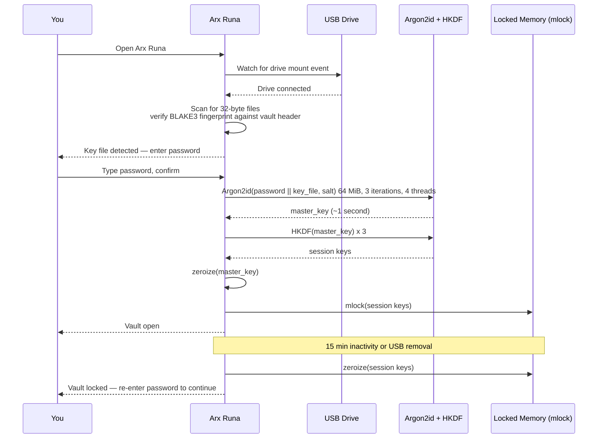

# Unlocking: Password and USB Key

Unlocking a vault looks simple from the outside — type your password, press enter, done. Under the hood, the process is deliberately expensive. This page explains what happens step by step, and why each piece matters.

## Two factors, one combined secret

Arx Runa supports two security tiers. In the basic configuration you unlock with your password alone. With USB MFA enabled, you also need a key file: a small file of exactly 32 bytes of random data that lives on a removable drive. No special hardware is required — any USB stick will do. The key file is pure entropy; it has no internal structure, no device identifier, no serial number. It is raw randomness written to a file you can name and place wherever you like on the drive.

The two factors are not stacked — they are combined into a single input before any cryptography runs. Arx Runa appends the raw key file bytes to your password bytes and feeds the combined value into the key derivation function. An attacker with only your password cannot unlock the vault, because the derivation produces a different master key without the key file. An attacker with only your drive cannot unlock it either. Each factor is useless without the other.

## Finding your key file automatically

You never need to navigate to the key file or remember where you put it. When you plug in your USB drive, Arx Runa detects the mount event and scans the drive for any file that is exactly 32 bytes. For each candidate, it computes a [BLAKE3](../guides/glossary.md) hash and compares it against a fingerprint stored in your vault header. When the fingerprints match, the key file field in the login screen fills automatically. You only need to enter your password and confirm.

The fingerprint in the vault header is public information — it is a verifier, not a secret. Knowing the hash does not help an attacker reconstruct the 32-byte file it was derived from. The file content is what matters; the fingerprint only identifies which file to use.

## Argon2id: the slow step

Once the input is assembled — password alone, or password combined with key file — it goes into [Argon2id](../guides/glossary.md). Argon2id is a memory-hard key derivation function: it consumes 64 MiB of RAM across multiple passes so that each guess an attacker makes costs significant time and memory. Where conventional hash functions can be parallelised onto thousands of GPU cores for fast brute-force, Argon2id's memory requirement caps how many guesses can run in parallel. The cost per guess stays high regardless of the attacker's hardware.

This is why unlocking takes a moment — typically about a second. That pause is the security working. The Argon2id parameters (memory, iterations, parallelism) are stored in your vault header so they can be updated in future versions without invalidating existing vaults.

## The session

After Argon2id finishes, [HKDF](../guides/glossary.md) expands the output into your session keys (as described in [The Vault](the-vault.md)). Those keys are immediately locked into physical RAM — the operating system is instructed not to page them to disk under any circumstances. If memory locking fails for any reason, Arx Runa refuses to open the session rather than silently operating with weaker protection.

Your session stays open while you're active. After 15 minutes of inactivity, Arx Runa zeroes every session key and closes your vault. You can also lock manually at any time. For Tier 2 vaults, removing the USB drive triggers an immediate lock — the physical key must be present to keep the vault open.

## What an attacker faces offline

If someone extracts your vault's storage — the encrypted blobs and vault header — they can try to brute-force your password. What they find is that each guess requires a full Argon2id computation: 64 MiB of RAM, three passes, with no shortcut available regardless of their hardware. For a Tier 2 vault, they also need your USB drive in hand. The combination makes offline attacks impractical against any reasonable password.
