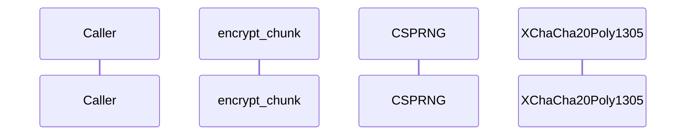
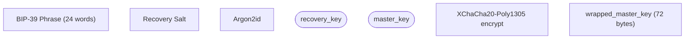
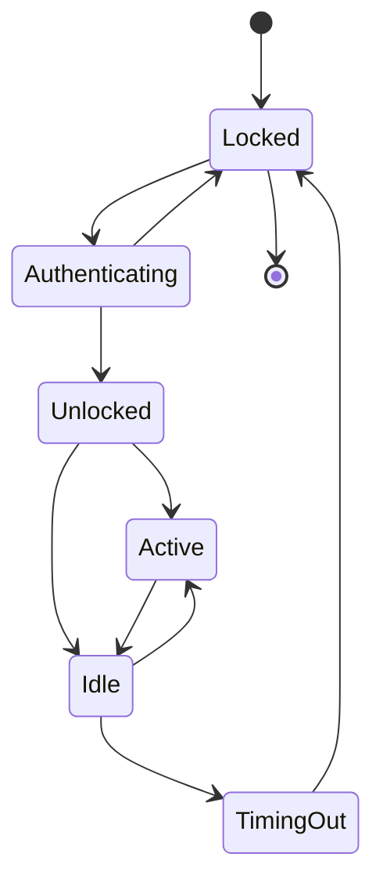

# Rapport-forklaringer: alle komplekse designs, kodeblokke og diagrammer

Dette dokument er en læseguide til `docs/report/arx-runa-bachelorrapport.md`. Hver kompleks del af rapporten er gennemgået med:

- **Hvad** designet gør (i kort form)
- **Hvorfor** det er sådan (rationale)
- **Linje-for-linje-forklaring** af alle kodeblokke (Rust-syntax + krypto-logik)
- **Node-for-node-forklaring** af alle Mermaid-diagrammer

Strukturen følger rapportens kapitelnumre, så du kan læse parallelt.

---

## Indhold

- [Baggrundsbegreber du skal kende først](#baggrundsbegreber)
- [Kapitel 5: Kryptering og nøgleafledning](#kapitel-5)
- [Kapitel 6: Hardware-faktor og recovery](#kapitel-6)
- [Kapitel 7: Chunking og synkronisering](#kapitel-7)
- [Kapitel 8: Zero-Trace og hukommelseslås](#kapitel-8)
- [Kapitel 9: Fildeling med HPKE](#kapitel-9)

---

<a id="baggrundsbegreber"></a>
## Baggrundsbegreber du skal kende først

Disse termer går igen i hele rapporten. Forstå dem nu, så slipper du for at slå op senere.

### Krypto-primitiver

| Term | Forklaring |
|------|-----------|
| **AEAD** | Authenticated Encryption with Associated Data. Krypterer *og* signerer i ét. Output: ciphertext + tag. Hvis nogen ændrer ciphertext (også bare 1 bit), fejler dekryptering. |
| **AAD** | Associated Data. Klartekst-data der ikke krypteres, men *bindes* til tagget. Ændres AAD, fejler dekryptering. Bruges til at binde en chunk til sin position (`file_id || chunk_index`). |
| **Nonce** | "Number used once". Tilfældigt tal der gør hver kryptering unik, selvom samme nøgle bruges. Nonce-genbrug = totalt sikkerhedsbrud. |
| **KDF** | Key Derivation Function. Forvandler et password til en nøgle. Skal være langsom, så brute-force er dyrt. |
| **HKDF** | HMAC-based KDF. Tager én nøgle og afleder flere "domæne-separerede" nøgler ud fra den. Hurtig — designet til at *udvide*, ikke at *strække*. |
| **Argon2id** | Memory-hard password KDF. Bruger 64 MiB RAM pr. gæt → ASIC/GPU-resistent. |
| **CSPRNG** | Cryptographically Secure Pseudo-Random Number Generator. Tilfældighed du tør bruge til nøgler. |
| **KEK / DEK** | Key Encryption Key / Data Encryption Key. Hierarki: KEK krypterer DEK'er; DEK'er krypterer data. Kompromittering af én DEK rammer kun den ene fil. |
| **HPKE** | Hybrid Public Key Encryption (RFC 9180). Kombinerer asymmetrisk + symmetrisk kryptering, så man kan kryptere til en modtagers public key uden delt hemmelighed. |
| **X25519** | Asymmetrisk nøglepar baseret på Curve25519. Bruges til Diffie-Hellman key exchange. |
| **BLAKE3** | Hash-funktion. Hurtig, parallelliserbar, tree-baseret. Bruges som integritetstjek og fingeraftryk. |
| **mlock / VirtualLock** | OS-syscalls der låser en RAM-region, så OS ikke pager den til disk-swap. |
| **zeroize** | Aktiv overskrivning af RAM med nuller, så compiler ikke optimerer det væk. |

### Rust-mønstre du møder igen og igen

| Mønster | Forklaring |
|---------|-----------|
| `Result<T, E>` | Funktion kan returnere succes (`Ok(T)`) eller fejl (`Err(E)`). Tvinger fejlhåndtering. |
| `?`-operator | "Hvis Err, returnér med det samme." Kort for `match { Ok(x) => x, Err(e) => return Err(e) }`. |
| `Zeroizing<T>` | Wrapper-type fra `zeroize`-crate. Når den droppes, overskrives indholdet med nul. |
| `SecretBox<T>` | Wrapper fra `secrecy`-crate. Skjuler indhold i `Debug`-output (printes som `[REDACTED]`). |
| `#[derive(ZeroizeOnDrop)]` | Automatisk zeroize ved drop. |
| `Box<[u8; N]>` | Heap-allokeret array på præcis N bytes. Vi vil have den på heap (ikke stack) for at kunne `mlock`'e den. |
| `unsafe { ... }` | Rust-blok hvor du tager ansvar for invarianter compileren ikke kan tjekke (fx raw pointers, FFI). Skal ledsages af `// SAFETY:`-kommentar. |
| `async fn` / `.await` | Asynkrone funktioner. Returnerer en future der køres af tokio runtime. |
| `pub(crate)` | "Synlig i hele crate'n, men ikke uden for". Bruges til intern API. |
| `&[u8]` vs `&[u8; N]` | Slice (dynamisk længde) vs reference til array med fast længde N. Compile-time-tjek. |

Nu er du klar.

---

<a id="kapitel-5"></a>
## Kapitel 5: Kryptering og nøgleafledning

### Det store billede

Et password er ikke en nøgle — det er for kort og har for lidt entropi. Vi har brug for:

1. **Strække passwordet** til en stærk masternøgle (Argon2id, langsomt).
2. **Afledte flere nøgler** fra den ene masternøgle, så samme nøgle ikke bruges to forskellige steder (HKDF, hurtigt).
3. **Pakke per-fil-nøgler ind** i en af de afledte nøgler (KEK/DEK-hierarki).

Resultatet er et nøgletræ: ét password → én master_key → tre vault-nøgler → mange file_keys → en per-chunk-kryptering.

### Diagram 5.1: Nøgleafledningstræet (flowchart)

```mermaid
flowchart TD
    PW["Password"]
    KF["USB Key File (32 bytes)"]
    SALT["Argon2 Salt"]
    ARGON["Argon2id"]
    MK_NODE(["master_key (Zeroizing, zeroized on drop)"])
    HKDF1["HKDF info: key-encryption"]
    HKDF2["HKDF info: sqlcipher"]
    HKDF3["HKDF info: manifest-backup"]
    KEK["key_encryption_key"]
    SK["sqlcipher_key"]
    MK["manifest_key"]
    FK["file_key (random CSPRNG)"]
```



**Sådan læses det:**

1. **Tre input-noder (lilla/grøn):**
   - `Password` — det brugeren skriver. Variabel længde.
   - `USB Key File` — 32 bytes ren CSPRNG-entropi fra USB-pinden (kun ved Tier 2).
   - `Argon2 Salt` — 32 random bytes lagret i klartext i vault-headeren. Salten gør at to vaults med samme password får forskellig master_key.

2. **Argon2id-blokken (blå):**
   - Parametrene `m=65536, t=3, p=4` betyder: 64 MiB RAM, 3 iterationer, 4 parallelle tråde. RFC 9106's anbefalede minimum.
   - Input til Argon2id er: `password_bytes || key_file_bytes` (konkateneret) + salt.
   - Output: 32 bytes — `master_key`.

3. **master_key (rød ellipse, "secret"):**
   - Holdes i mlocked memory så OS ikke pager den til disk.
   - Bruges KUN som input til HKDF, derefter zeroizes den straks.

4. **Tre HKDF-blokke (blå):**
   - Samme `master_key` ekspanderes tre gange med tre forskellige `info`-strenge.
   - Info-strengen er domæneadskillelse: `"arx-runa-key-encryption"` vs `"arx-runa-sqlcipher"` vs `"arx-runa-manifest-backup"`.
   - HKDF garanterer at de tre outputs er kryptografisk uafhængige — kompromittering af én lækker ikke de andre.

5. **Tre vault-nøgler (røde):**
   - `key_encryption_key` (KEK): wrapper alle file_keys.
   - `sqlcipher_key`: krypterer hele SQLCipher-databasen lokalt.
   - `manifest_key`: krypterer manifest-backup-blob i cloud.

6. **Per-fil-laget (rødt + grønt):**
   - `file_key` — 32 random bytes pr. fil, friskt fra CSPRNG.
   - `file_key_wrapped` — file_key krypteret med KEK og gemt i SQLCipher.

7. **Zeroize-noderne (rødt med stiplet kant):**
   - `zeroize(master_key)` sker umiddelbart efter HKDF har leveret de tre nøgler. master_key skal ikke blive liggende i RAM.
   - `zeroize(file_key)` sker efter chunk-kryptering er færdig.

**Den centrale idé:** Hver nøgle har præcis ét formål. Hvis én lækker, isoleres skaden.

### Listing 5.1: `derive_vault_keys()` linje for linje

```rust
const HKDF_SALT: &[u8]                 = b"arx-runa-v1";
```

- `const` — compile-time-konstant, lagres i program-binary.
- `&[u8]` — slice af bytes (reference med længde).
- `b"..."` — byte-string-literal. `b"arx-runa-v1"` = `[97, 114, 120, ...]`.
- Salten er global og ikke-hemmelig. HKDF kræver formelt en salt, men sikkerheden afhænger ikke af at den er hemmelig — kun at den er forskellig pr. anvendelse.

```rust
const HKDF_INFO_KEY_ENCRYPTION: &[u8]  = b"arx-runa-key-encryption";
const HKDF_INFO_SQLCIPHER: &[u8]       = b"arx-runa-sqlcipher";
const HKDF_INFO_MANIFEST_BACKUP: &[u8] = b"arx-runa-manifest-backup";
```

- Tre forskellige `info`-strenge. HKDF blander dem ind i output, så samme master_key + samme salt + forskellig info → forskellig nøgle.
- Domæneadskillelse: hvis vi en dag genbruger HKDF til et fjerde formål, vælger vi en ny info-streng.

```rust
pub fn derive_vault_keys(master_key_bytes: &[u8; 32]) -> Result<VaultKeys, CryptoError> {
```

- `pub` — funktionen er offentlig.
- `master_key_bytes: &[u8; 32]` — reference til præcis 32 bytes. Compile-time-tjek: hvis kalderen sender 31 bytes, fejler kompilering.
- Returnerer `Result<VaultKeys, CryptoError>` — enten succes med tre nøgler, eller fejl.

```rust
    Ok(VaultKeys {
        key_encryption_key: KeyEncryptionKey::from_secret_box(expand_into_secret_box(
            master_key_bytes, HKDF_INFO_KEY_ENCRYPTION,
        )?),
```

- `Ok(...)` — wrap resultatet i succes-varianten af Result.
- `VaultKeys { ... }` — struct-konstruktion.
- `expand_into_secret_box(master_key_bytes, HKDF_INFO_KEY_ENCRYPTION)` — kalder en intern hjælpefunktion der laver HKDF-expand og returnerer en `SecretBox<[u8; 32]>`.
- `?` — hvis HKDF-expand fejler, returnér fejlen straks.
- `KeyEncryptionKey::from_secret_box(...)` — wrap SecretBox i den typede newtype `KeyEncryptionKey`.

De to næste blokke gør præcis det samme for `sqlcipher_key` og `manifest_key` med deres egne info-strenge.

**Pointen med koden:** Hver nøgle har sin egen Rust-type (`KeyEncryptionKey`, `SqlcipherKey`, `ManifestKey`). Det forhindrer at man ved et uheld bruger sqlcipher_key som file_key — compileren vil afvise det.

### Listing 5.2: `encrypt_chunk()` linje for linje

```rust
pub fn encrypt_chunk(
    mut plaintext: Zeroizing<Vec<u8>>,
    file_key: &FileKey,
    file_id: &FileId,
    chunk_index: ChunkIndex,
) -> Result<Vec<u8>, CryptoError> {
```

- `mut plaintext: Zeroizing<Vec<u8>>` — vi tager *ownership* af plaintext (ikke reference). Når funktionen slutter, droppes Zeroizing, som overskriver bufferen med nul. `mut` fordi vi krypterer in-place.
- `file_key: &FileKey` — reference til nøglen (vi tager ikke ejerskab af den).
- `file_id`, `chunk_index` — newtypes der vrapper en UUID og en u32. Stærke typer forhindrer at man bytter dem om.

```rust
    let nonce_bytes = generate_nonce();
```

- Tilfældige 24 bytes (192 bits, fordi det er XChaCha20). Ny pr. chunk.

```rust
    let aad = build_chunk_aad(file_id, chunk_index);
```

- AAD = `file_id_bytes || chunk_index_u32_big_endian`.
- Hvorfor? Hvis en angriber bytter blob-1 og blob-2 om i skyen, vil dekryptering fejle, fordi AAD'en ikke matcher chunk_index'et.
- AAD krypteres ikke — den hashes ind i tagget. Den er offentlig logisk men kryptografisk bundet til ciphertext.

```rust
    let cipher = XChaCha20Poly1305::new(GenericArray::from_slice(file_key.expose()));
    let nonce = GenericArray::from_slice(&nonce_bytes);
```

- Instantierer cipher-objektet med file_key.
- `file_key.expose()` returnerer `&[u8; 32]` — den eneste måde at få fat i bytes ud af SecretBox.
- `GenericArray::from_slice` er en biblioteks-specifik wrapper RustCrypto-bibliotekerne kræver.

```rust
    let tag = match cipher.encrypt_in_place_detached(nonce, &aad, plaintext.as_mut_slice()) {
        Ok(value) => value,
        Err(_) => return Err(CryptoError::EncryptionFailed),
    };
```

- `encrypt_in_place_detached` — krypterer plaintext-bufferen *in-place* (overskriver med ciphertext) og returnerer tagget separat.
- "Detached" betyder tagget er ikke appended til ciphertext; vi får det selv at samle bagefter.
- `match` — pattern-matcher på Ok/Err. Ved fejl mappes biblioteksfejlen til vores egen `CryptoError`.

```rust
    let mut blob = Vec::with_capacity(24 + plaintext.len() + 16);
    blob.extend_from_slice(&nonce_bytes);
    blob.extend_from_slice(&plaintext);
    blob.extend_from_slice(tag.as_slice());
    Ok(blob)
}
```

- Wire-format: `[24B nonce | ciphertext | 16B Poly1305-tag]`.
- `with_capacity` præ-allokerer den rigtige størrelse — undgår reallokering.
- Den returnerede `Vec<u8>` skrives så til et staging-blob på disk.

**Hvad sker der med plaintext-bufferen?** Den indeholder nu ciphertext (in-place-skrevet), men `Zeroizing<Vec<u8>>` overskriver alligevel når funktionen returnerer. Den udgående `blob` er ren ciphertext, så det er fint at den ikke er Zeroizing.

### Listing 5.3: Nøgletyper

```rust
#[derive(ZeroizeOnDrop)]
pub struct FileKey(SecretBox<[u8; 32]>);

#[derive(ZeroizeOnDrop)]
pub struct KeyEncryptionKey(SecretBox<[u8; 32]>);
```

- **Newtype-mønster:** En struct med ét felt. `FileKey(SecretBox<...>)` — tuple-struct uden navngivne felter.
- **Hvorfor newtype?** Compile-time-typesikkerhed. `fn encrypt(k: &FileKey)` accepterer ikke en `&KeyEncryptionKey`, selvom begge er 32 bytes internt.
- **`#[derive(ZeroizeOnDrop)]`** — proc-macro der genererer en `Drop`-impl der zeroize'r feltet.
- **`SecretBox<[u8; 32]>`** — gemmer 32 bytes og redacter dem fra `Debug` (så `println!("{:?}", file_key)` viser `FileKey([REDACTED])`, ikke selve bytes).

### Diagram 5.2: Krypteringsflow for ét chunk (sequenceDiagram)



**Linje-for-linje:**

1. `Caller->>encrypt_chunk: plaintext, file_key, file_id, chunk_index` — kalderen sender 4 input.
2. `encrypt_chunk->>CSPRNG: generate_nonce()` — beder OS om 24 random bytes.
3. `CSPRNG-->>encrypt_chunk: nonce (24 bytes)` — får dem tilbage.
4. `encrypt_chunk->>encrypt_chunk: construct AAD = file_id || chunk_index` — bygger AAD ved at sammenkæde file_id (16 bytes) og chunk_index (4 bytes big-endian).
5. `encrypt_chunk->>XChaCha20Poly1305: encrypt_in_place_detached(...)` — selve AEAD-operationen.
6. `XChaCha20Poly1305-->>encrypt_chunk: tag (16 bytes)` — Poly1305-tagget.
7. `encrypt_chunk->>encrypt_chunk: assemble [nonce | ciphertext | tag]` — samler wire-format.
8. `encrypt_chunk-->>Caller: Result<Vec<u8>, CryptoError>` — returnerer blob.

Bemærk pilene: `->>` = synkront kald, `-->>` = retur.

---

<a id="kapitel-6"></a>
## Kapitel 6: Hardware-faktor og recovery

### Det store billede

Tier 1 = kun password. Tier 2 = password + USB-nøglefil. Den centrale idé er at de to faktorer **ikke** valideres separat — de **konkateneres** ind i samme Argon2id-kald. Det betyder:

- En forkert password gør master_key forkert → dekryptering af alt fejler.
- En forkert key_file gør master_key forkert → samme.
- Der er ikke en "tjek faktor 1, så tjek faktor 2"-checkpoint, en angriber kan omgå.

### Listing 6.1: USB-nøglefilgenerering

```rust
let mut buffer: Zeroizing<[u8; 32]> = Zeroizing::new([0u8; 32]);
```

- `[u8; 32]` — fast-størrelse-array (stack-allokeret hvis det ikke vrappes).
- `Zeroizing::new([0u8; 32])` — initialiserer med 32 nuller og wrapper i Zeroizing.
- `mut` — vi skal kunne skrive til den.

```rust
rand::rng().fill_bytes(buffer.as_mut_slice());
```

- `rand::rng()` — får OS's CSPRNG (på Windows: BCryptGenRandom; på Linux: getrandom).
- `fill_bytes(...)` — fylder bufferen med tilfældige bytes.
- `as_mut_slice()` — konverterer `&mut [u8; 32]` til `&mut [u8]`.

```rust
staging::write_owner_only_new(&key_file_path, buffer.as_slice()).await?;
```

- Skriver bytes til disk med owner-only ACL (kun denne bruger kan læse). På Windows sætter den DACL; på Unix sætter den mode 0600.
- `.await` — funktionen er async (filsystem-I/O).
- `?` — propagér fejl.

```rust
let digest = blake3::hash(buffer.as_slice());
key_file_blake3_hex = Some(hex::encode(digest.as_bytes()));
```

- BLAKE3-hash af nøglefilens 32 bytes.
- Hash-en er 32 bytes; vi hex-encoder den til 64 ASCII-tegn og gemmer i vault-headeren.
- **Hvorfor:** ved næste login skal vi kunne genkende den rigtige nøglefil blandt mange 32-byte-filer på USB-drevet. Vi hasher hver fundne 32-byte-fil og sammenligner mod det gemte hash.

```rust
key_file_bytes = Some(buffer);
```

- Gem bufferen til senere — den skal bruges som input til Argon2id i samme ceremony.

### Listing 6.2: Autodetect-scanning

```rust
if metadata.len() != KEY_FILE_SIZE {
    continue;
}
```

- Performance-filter: hvis filen ikke er præcis 32 bytes, skip den. Hash-beregning er forholdsvis dyr; size-tjek er gratis.

```rust
let hash = blake3::hash(buffer.as_ref());
if hash.as_bytes().ct_eq(&reference_hash.0).into() {
    return Ok(Some(entry.into_path()));
}
```

- Hash filens indhold.
- **`ct_eq`** = constant-time equals. Vigtigt mod timing-angreb: en naiv `==`-sammenligning afslutter ved første forskelle og lækker information om hvor mange bytes der matchede.
- `ct_eq` returnerer en `Choice`-type fra `subtle`-crate'en der konverteres til bool med `.into()`.

### Listing 6.3: BIP-39 mnemonic + recovery slot

```rust
let mut entropy: Zeroizing<[u8; 32]> = Zeroizing::new([0u8; 32]);
rand::rng().fill_bytes(entropy.as_mut_slice());
```

- 256 bits frisk entropi til BIP-39.

```rust
let mnemonic = Mnemonic::from_entropy_in(Language::English, entropy.as_slice())
    .map_err(|_| AuthenticationError::VaultHeaderInvalid)?;
```

- BIP-39-biblioteket konverterer 32 bytes til 24 ord. Algoritmen: append en 8-bit SHA-256-checksum, split 264 bits i 24 chunks á 11 bits, slå hvert 11-bit-tal op i en wordlist på 2048 ord.
- `.map_err(|_| ...)` — mapper bibliotekets fejltype til vores. Lambda `|_|` ignorerer detaljen (vi vil ikke lække den).

```rust
let phrase_string = canonicalize_phrase(&mnemonic);
drop(entropy);
```

- `canonicalize` lower-caser og normaliserer whitespace.
- `drop(entropy)` — eksplicit drop tvinger Zeroizing til at overskrive bufferen NU, ikke ved scope-end. Den 32-byte raw entropy lever ikke længere end nødvendigt; kun phrase-strengen.

```rust
let mut recovery_salt: Zeroizing<[u8; 32]> = Zeroizing::new([0u8; 32]);
rand::rng().fill_bytes(recovery_salt.as_mut_slice());
```

- Frisk salt til recovery-slottet. Adskilt fra primary-saltet.

```rust
derive_recovery_key_into(
    phrase_string.as_bytes(),
    &recovery_salt,
    &current_params,
    &mut recovery_key_bytes,
)?;
```

- Kører Argon2id med phrase som "password" og recovery_salt. Skriver output direkte ind i `recovery_key_bytes`-bufferen (in-place — ingen allokering, intet ekstra kopi).

```rust
let recovery_key = recovery_key_from_array(&recovery_key_bytes);
let wrapped = wrap_master_key_for_recovery(&master_key_typed, &recovery_key, vault_id)?;
```

- Krypterer master_key med recovery_key som AEAD-nøgle. Wire-format: `[24B nonce | 32B ciphertext | 16B tag]` = 72 bytes.
- AAD = `"arx-runa recovery v1" || vault_id`. Binder slottet til præcis denne vault.

### Diagram 6.2: Recovery slot-konstruktion (flowchart)



**Hvad gør den:**

1. Bruger har 24 ord (256 bits entropi efter checksum-fjernelse).
2. Phrasen + recovery_salt → Argon2id → 32-byte recovery_key.
3. master_key (den eksisterende, fra primary unlock) krypteres med recovery_key.
4. Resultatet (72 bytes) gemmes i vault-headeren under recovery_slots.

**Hvorfor virker det?** Senere, hvis password+USB er tabt:

1. Bruger indtaster phrasen.
2. Vi kører Argon2id med samme salt → samme recovery_key.
3. recovery_key dekrypterer wrapped_master_key → master_key.
4. Vi har vault-adgang uden serverkald.

### Listing 6.4: Slot-iteration ved recovery

```rust
for slot in header.recovery_slots.iter() {
    if slot.method != "bip39" { continue; }
```

- Vault-headeren kan i princippet have flere recovery-slots med forskellige metoder. Vi tager kun BIP-39-slots. (Andre metoder ikke implementeret i øjeblikket.)

```rust
    derive_recovery_key_into(
        canonical.as_bytes(),
        &slot_salt,
        &slot_params,
        &mut recovery_key_bytes,
    )?;
```

- Kør Argon2id med slottets gemte salt og parametre. (Hvert slot kan have sine egne — fremtidssikring.)

```rust
    let recovery_key = recovery_key_from_array(&recovery_key_bytes);
    match unwrap_master_key_from_recovery(&wrapped, &recovery_key, &vault_id) {
        Ok(master_key_typed) => {
            recovered_master_key = Some(bytes);
            break;
        }
        Err(_) => { drop(recovery_key); }
    }
}
```

- Forsøg at unwrap. Hvis succes → vi har master_key, exit loop.
- Hvis fejl → `drop(recovery_key)` (zeroize'r umiddelbart) og fortsæt med næste slot.
- **Non-orakulær fejl:** vi siger ikke til brugeren "salt-1 fejlede, salt-2 fejlede". Bare "ugyldig phrase". En angriber lærer intet om hvor mange slots der findes, eller hvilket der er det rigtige.

### Listing 6.5: Tier-afhængig KDF-input

```rust
pub(crate) fn derive_master_key_into(
    password_utf8_bytes: &[u8],
    key_file_bytes: Option<&[u8; KEY_FILE_LENGTH_BYTES]>,
    salt: &[u8; 32],
    parameters: &Argon2Params,
    output: &mut [u8; MASTER_KEY_LENGTH_BYTES],
) -> Result<(), AuthenticationError> {
```

- `Option<&[u8; 32]>` — `Some(bytes)` for Tier 2, `None` for Tier 1.
- `output: &mut [u8; 32]` — kalderen leverer destinations-buffer; vi skriver direkte ind i den (in-place, ingen allokering).
- Returnerer `Result<(), E>` — succes uden værdi (`()`), eller fejl.

```rust
    let combined_input_length =
        password_utf8_bytes.len() + key_file_bytes.map_or(0, |_| KEY_FILE_LENGTH_BYTES);
```

- `map_or(default, f)` på Option: hvis None → default (0); hvis Some → kald f.
- Resultatet: total længde af det vi vil hash'e.

```rust
    let mut combined_input: Zeroizing<Vec<u8>> =
        Zeroizing::new(Vec::with_capacity(combined_input_length));
    combined_input.extend_from_slice(password_utf8_bytes);
    if let Some(bytes) = key_file_bytes {
        combined_input.extend_from_slice(bytes);
    }
```

- Allokér én buffer med korrekt størrelse.
- Append password bytes.
- Hvis Tier 2: append key_file bytes.
- Resultatet: `password_bytes || key_file_bytes` eller bare `password_bytes`.

```rust
    let argon2_params = Params::new(
        parameters.memory_cost_kib,
        parameters.time_cost,
        parameters.parallelism,
        Some(MASTER_KEY_LENGTH_BYTES),
    )
    .map_err(|_| AuthenticationError::InvalidCredentials)?;
```

- Konstruerer Argon2-parametre. `Some(32)` = "vi vil have 32 bytes output".

```rust
    let argon2 = Argon2::new(Algorithm::Argon2id, Version::V0x13, argon2_params);
    argon2
        .hash_password_into(&combined_input, salt, output)
        .map_err(|_| AuthenticationError::InvalidCredentials)?;
    Ok(())
}
```

- Vælger Argon2id-varianten (ikke Argon2i eller Argon2d) og version 0x13 (RFC 9106).
- `hash_password_into` skriver de 32 output-bytes direkte ind i den buffer kalderen leverede.

### Listing 6.6: DeviceMonitor-trait

```rust
pub trait DeviceMonitor: Send + Sync {
    fn watch(&self) -> Pin<Box<dyn Stream<Item = DeviceEvent> + Send>>;
}
```

- `trait` = interface. Tre platformsimplementeringer (Windows/Linux/macOS) + mock til tests.
- `Send + Sync` — trait-bounds: implementeringer skal være sikre at sende/dele mellem threads.
- `watch()` returnerer en async Stream af DeviceEvents.
- `Pin<Box<dyn Stream<...>>>` — boxed trait-objekt der er pinnet (kan ikke flyttes). Standard mønster for async streams.

```rust
pub enum DeviceEvent {
    Mounted   { mount_path: PathBuf },
    Unmounted { mount_path: PathBuf },
}
```

- To events: en USB blev sat i (Mounted), eller den blev fjernet (Unmounted).
- Struct-varianter med navngivne felter (`{ mount_path: ... }`).
- Hver implementering lytter på OS-events (WMI på Windows, udev på Linux, IOKit på macOS) og oversætter til disse to events.

### Diagram 6.1: Tier 2 unlock-flow (sequenceDiagram)

Ni participants i flowet: bruger, app, USB, KDF, mlocked memory. Sekvensen:

1. **Du åbner appen.** Den starter en `DeviceMonitor::watch()` stream.
2. **USB sættes i.** OS fyrer mount-event.
3. **App scanner drevet.** Filtrerer 32-byte-filer, BLAKE3-hasher hver, sammenligner mod headeren.
4. **Match fundet.** App promptes dig for password.
5. **Du skriver password.** Bytes sendes via Tauri IPC (Zeroizing).
6. **Argon2id kører.** ~61 ms. Output: master_key.
7. **HKDF kører tre gange.** Output: KEK, sqlcipher_key, manifest_key.
8. **zeroize(master_key).** master_key skal ikke længere ligge i RAM.
9. **mlock(session keys).** Vault er åben.
10. **15 min inaktivitet eller USB-fjern.** Alle keys zeroizes; vault låses.

Bemærk: nøglerne forlader aldrig backend-processen. Frontend ser kun "session unlocked"-events.

---

<a id="kapitel-7"></a>
## Kapitel 7: Chunking og synkronisering

### Det store billede

Cloud-udbyderen ser hver blob du uploader. Selv hvis indholdet er krypteret, kan udbyderen observere:

- **Blob-navne** → hvis vi brugte filnavne, lækkede vi metadata.
- **Antal blobs pr. fil** → hvis chunks varierer i størrelse, lækker vi indhold (CDC-rolling-hash-angrebene fra 2025).
- **Adgangsmønstre** → hvilke blobs vi læser sammen.
- **Upload-rækkefølge** → hvilke ændringer der hænger sammen.

Modforanstaltningerne:

1. **UUID-blobnavne** → ingen filnavn-information.
2. **Fast chunk-størrelse** + zero-padding → kun grov filstørrelses-information lækkes.
3. **Fisher-Yates-shuffle af upload-rækkefølge** → randomiserer mønsteret.
4. **Manifest krypteret** → struktur skjules.

### Diagram 7.1: Chunk-pipeline (flowchart)

Diagrammet har tre subgraphs:

**Encrypt Path:**
- `E0`: Route decision — er epoch_buffer slået til? Er filen lille?
- `E0B`: Hvis epoch_buffer + lille fil → stage plaintext i SQLCipher-tabel (`epoch_buffer`). Klartekst når aldrig disk.
- `EXIF`: Hvis filen er et billede (magic bytes JPEG/PNG/...) → strip EXIF-metadata.
- `E1–E2`: Stream-read en chunk_size-portion. Zero-pad sidste chunk.
- `E3`: Kald `encrypt_chunk(plaintext, file_key, AAD=file_id||chunk_index)`.
- `E4`: Wire-blob = `[nonce | ciphertext | tag]`.
- `E5`: BLAKE3-hash af wire-blob → checksum til integritetstjek ved download.
- `E6`: Skriv til `staging/{uuid}.blob`.
- `E7`: Lav `ChunkRecord` (chunk_index, blob_name, checksum).
- `E8`: Insert i SQLCipher manifest.

**Decrypt Path:**
- `D1`: Læs chunk-records fra manifest, ordered by chunk_index.
- `D2`: Læs blob fra staging eller download fra cloud.
- `D3`: Verificér BLAKE3 → fail fast hvis korrupt. Hvorfor før dekryptering? Hurtigere fejldetektering og giver et lag *uden* nøgleadgang.
- `D4`: `decrypt_chunk(blob, file_key, AAD)`. Dekryptering fejler også hvis AAD er forkert (= forkert chunk_index → omplacering opdaget).
- `D5–D6`: Skriv chunk-data til destinationsfilen. Sidste chunk truncates til den lagrede `size_bytes`.

**Key Lifecycle:**
- `K1`: Generér file_key (32B CSPRNG).
- `K2`: Wrap med KEK → file_key_wrapped.
- `K3`: Gem i nodes-tabellen.
- `K4`: Unwrap just-in-time når der skal krypteres/dekrypteres.
- `K5`: Zeroize file_key efter brug.

**Det vigtige:** Hver chunk er en uafhængig AEAD-operation med sin egen nonce. Korruption af én chunk ødelægger ikke de andre.

### Listing 7.1: CloudTransport-trait

```rust
#[async_trait]
pub trait CloudTransport: Send + Sync {
    async fn upload_blob(&self, local_path: &Path, remote_path: &str)
        -> Result<(), CloudTransportError>;
    async fn download_blob(&self, remote_path: &str, local_path: &Path)
        -> Result<(), CloudTransportError>;
    async fn delete_blob(&self, remote_path: &str)
        -> Result<(), CloudTransportError>;
    async fn list_blobs(&self, remote_prefix: &str)
        -> Result<Vec<String>, CloudTransportError>;
}
```

- `#[async_trait]` — Rust har ikke native async trait-metoder endnu (bemærk: er ved at blive standard, men crate'n bruges her). Macroen omskriver `async fn` i trait til `fn -> Pin<Box<dyn Future>>`.
- Fire metoder: upload, download, delete, list. CRUD-mønstret for blob-storage.
- Returnerer `Result<..., CloudTransportError>` — fejlhåndtering pr. operation.
- **Hvorfor en trait?** Produktion = `RcloneTransport` (kalder rclone-subprocess). Tests = `MockCloudTransport` (in-memory HashMap). Samme interface → samme test-coverage som produktion.

**RcloneTransport-detaljer (fra realiseringsafsnittet):**
- Alle argumenter sendes som `Vec<OsString>` til `tokio::process::Command`.
- Aldrig `sh -c` eller `cmd /c` → ingen shell-injection.
- stderr sanitiseres før logging (kan indeholde credentials).

### Diagram 7.2: Push/pull-flow (sequenceDiagram)

**Push-fasen (upload):**

1. `User->>Sync: push()` — bruger trykker upload.
2. `Sync->>Meta: get_meta("snapshot_counter") -> local_counter` — hent lokal tæller.
3. `Sync->>RT: download_blob("manifest/manifest-backup.blob", temp)` — hent cloud-manifestet (vi vil sammenligne).
4. `Sync->>Sync: decrypt manifest -> cloud_counter` — dekryptér og læs tælleren.
5. **Konflikttjek (`break`-blokke):**
   - Hvis `cloud_counter > local_counter` → en anden enhed har skubbet siden vi pullede. Abort, kræv pull først.
   - Hvis `cloud_counter < local_counter` → cloud er ældre end vi forventer. Abort (rollback-detektion).
6. `Sync->>Sync: Fisher-Yates shuffle(blob_list)` — randomisér upload-rækkefølge. Cloud-udbyderen kan ikke aflæse "hvilke filer hænger sammen" fra blob-rækkefølgen.
7. **`par`-blok (parallel upload):** Op til 4 blobs sendes samtidigt via tokio JoinSet. Hver blob slettes fra staging efter succesfuld upload.
8. `Sync->>Meta: increment_snapshot_counter()` — bump local_counter.
9. `Sync->>RT: upload_blob(manifest)` — manifest uploades **sidst**. Hvorfor? Hvis vi crasher midt i blob-upload, ses cloud stadig som "ingen ændring" indtil manifestet er der. Atomicitet.
10. `Sync->>RT: upload_blob(vault-header.json)` — header opdateres til sidst.

**Pull-fasen (ny enhed):**

1. `User->>Sync: pull()`.
2. `Sync->>RT: download_blob("vault-header.json", temp)` — hent header (klartext, indeholder salt+algoritmer).
3. `Sync-->>User: prompt: password + USB key file`.
4. `Sync->>Sync: Argon2id(...) -> master_key`.
5. `Sync->>Sync: HKDF -> 3 keys; zeroize(master_key)`.
6. `Sync->>RT: download_blob("manifest/manifest-backup.blob")` og dekryptér.
7. `Sync->>Meta: import SQLCipher DB`.
8. **`par`-blok (parallel download):** Hent alle data-blobs. Verificér BLAKE3 pr. blob. Mismatch → slet og record failure (cloud-udbyderen kunne have manipuleret).

**Hvorfor monoton snapshot-tæller frem for vector clocks?** Med én primær enhed er der kun én "writer" ad gangen. Vi treats det som single-writer multiple-reader. Det er Tabel 7.5's pointe — CRDT/OT kræver semantisk merge på *klartext*, hvilket er umuligt på krypteret data.

---

<a id="kapitel-8"></a>
## Kapitel 8: Zero-Trace og hukommelseslås

### Det store billede

Zero-Trace betyder: når vault er låst, må en angriber med fuld disk-adgang ikke kunne finde nogen meningsfulde rester.

Tre persistens-trusler:
1. **OS-swap** — heap-allokerede nøgler kan ende i pagefile.sys/swap.
2. **Temp-filer** — naive fil-viewere skriver dekrypteret indhold til /tmp.
3. **Browser-storage** — Tauri's WebView kan gemme i localStorage/IndexedDB.

Modforanstaltninger:
1. `mlock`/`VirtualLock` — låser RAM-sider mod paging.
2. RAM-only filvisning via `blob:` URL og HTTP range requests.
3. CSP `default-src 'self'`; ingen brug af localStorage/IndexedDB i frontend.

### Listing: `SecureBytes<N>::new()`

```rust
pub(crate) fn new() -> Result<Self, MemoryLockError> {
    let mut buffer: Box<[u8; N]> = Box::new([0u8; N]);
```

- `Box<[u8; N]>` — heap-allokeret array. Vi skal have det på heap, fordi mlock kræver en stabil virtuel adresse. Stack-allokeringer kan flytte rundt.
- `Box::new([0u8; N])` — allokér N nuller på heap.
- `N` er en const generic — størrelse fastsat på compile-time.

```rust
    unsafe { platform::lock_memory(buffer.as_mut_ptr(), N) }?;
```

- `unsafe` — vi kalder FFI-syscall (`mlock` på Unix, `VirtualLock` på Windows). Rust kan ikke verificere syscall-invarianter.
- `as_mut_ptr()` returnerer `*mut u8` — raw pointer.
- `// SAFETY:`-kommentaren (ikke vist her) skal forklare hvorfor det er sikkert: bufferen lever lige nu, har præcis N bytes, og vi unlocker med samme parametre i Drop.
- `?` — hvis lock fejler (typisk ulimit), returnér MemoryLockError. **Hard error** — vi degraderer ikke til "unlock men uden mlock".

```rust
    Ok(Self { buffer })
}
```

### Listing: `Drop`-impl

```rust
impl<const N: usize> Drop for SecureBytes<N> {
    fn drop(&mut self) {
        self.buffer.as_mut().zeroize();
        unsafe { platform::unlock_memory(self.buffer.as_mut_ptr(), N); }
    }
}
```

- `impl Drop` — kald automatisk ved scope-end eller eksplicit `drop(...)`.
- `zeroize()` — overskriver alle N bytes med 0. Compileren har ikke lov at optimere det væk (zeroize-crate'n bruger volatile writes + memory fences).
- Derefter unlock'er vi hukommelses-sidet. **Rækkefølge:** zeroize FØR unlock. Hvis vi unlock'ede først kunne side få paged inden vi når at zeroize.
- Drop er RAII (Resource Acquisition Is Initialization): lifetime'n af lock + zeroize kobles til lifetime'n af strukturen.

### Listing: Newtype-wrappers med ZeroizeOnDrop

```rust
#[derive(ZeroizeOnDrop)]
pub struct KeyEncryptionKey(SecretBox<[u8; 32]>);

#[derive(ZeroizeOnDrop)]
pub struct FileKey(SecretBox<[u8; 32]>);
```

(Allerede gennemgået i kapitel 5; gentages her for kontekst.)

### Diagram 8.1: Session-livscyklus (stateDiagram)



**Tilstande:**

- **`[*]`** = start/slut (særlig stateDiagram-syntaks).
- **Locked** — initialtilstand. Ingen nøgler i RAM.
- **Authenticating** — Argon2id kører. Password+key_file ligger i Zeroizing-buffere.
- **Unlocked** — session keys er i mlocked RAM, men ingen brugeraktivitet.
- **Active** — bruger interagerer (klikker, læser filer).
- **Idle** — 1 min uden aktivitet. Stadig unlocked.
- **TimingOut** — 15 min total inaktivitet. App viser warning; bruger har 60s til at reagere.
- **Locked** (igen) — keys zeroized.

**Overgange:**

- `Active → Idle` ved aktivitets-stop.
- `Idle → TimingOut` ved 15 min.
- `TimingOut → Locked` ved 60s = total 16 min idle.
- Manuel lås kan trigge fra Unlocked/Active/Idle.

### Listing: Gate-flag

```rust
const GATE_CLOSED_FLAG: u32 = 0x8000_0000;
const COUNTER_MASK: u32 = 0x7FFF_FFFF;
```

- En enkelt `AtomicU32` kombinerer to ting i ét felt:
  - **Bit 31** (`0x8000_0000`): gate closed/open.
  - **Bit 0–30** (`0x7FFF_FFFF`): operations-tæller.
- Hvorfor i ét atomic? Vi kan opdatere begge i én atomic CAS-operation. Hvis vi havde to separate atomics, ville der være race conditions.

**Sådan virker det i praksis:**

- `begin_operation()` — atomic compare-and-swap: hvis gate bit er 0, increment counter.
- `end_operation()` — decrement counter.
- `lock()` — `fetch_or(GATE_CLOSED_FLAG)` sætter bit 31. Nye `begin_operation()`-kald fejler nu. Derefter venter vi til counter er 0 (alle igangværende operationer afsluttet). Så zeroize.

**Race-scenariet det løser:** En IPC-tråd er midt i `begin_operation` (CAS lykkedes), holder en reference til nøglen, og vi starter zeroize på samme tid. Uden gaten kunne vi nul-stille bytes mens tråden læser dem. Med gaten venter vi til counter==0, så alle nøgle-referencer er releasede.

### Listing: `VaultActions::clear()`

```rust
pub fn clear(&self) {
    self.set_state.update(|s| {
        s.files.clear();
        s.current_path = String::new();
        s.selected.clear();
    });
}
```

- Leptos signal-baseret state. `set_state.update(|s| ...)` tager en closure der muterer state.
- `s.files.clear()` — tøm fil-listen.
- `s.current_path = String::new()` — reset path.
- `s.selected.clear()` — tøm selection.

Hvorfor vigtigt? Når vault låses, må Leptos-frontenden ikke beholde fil-metadata i RAM. Selv om det er RAM (ikke disk), er det data fra den krypterede vault og skal ryddes ved lås.

### Subtile detaljer

**`get_file_content` (sti A, ≤ 50 MiB):**
- Backend dekrypterer til `Zeroizing<Vec<u8>>` i RAM.
- Base64-encoder og returnerer via IPC.
- Frontend laver `blob:`-URL via `URL.createObjectURL(blob)`. Browseren beholder bytes i WebView-RAM.
- Ved luk: `URL.revokeObjectURL(...)` frigør referencen.
- Backend zeroize'r Zeroizing-bufferen.

**`arxvault://`-handler (sti B, video):**
- WebView-anmodning kommer ind med `Range: bytes=N-M`.
- Handler bestemmer hvilke chunks der overlapper.
- Dekrypterer kun de chunks; sender bytes som HTTP response.
- Max 8 MiB ad gangen → kun ét chunks plaintext i RAM samtidigt.
- **Undtagelse (invariant 7):** dekrypterede bytes kopieres til `Vec<u8>` (ikke Zeroizing) før de gives til Tauri's `ResponseBuilder::body()`. Tauri owner bytes derfra og frigør dem normalt. Det er en dokumenteret begrænsning.

---

<a id="kapitel-9"></a>
## Kapitel 9: Fildeling med HPKE

### Det store billede

Fildeling kræver: alice kan kryptere `file_key` (32 bytes) sådan at kun bob's private key kan dekryptere. Uden delt hemmelighed, uden server, uden PKI.

Løsningen: HPKE (RFC 9180). HPKE kombinerer:
- **KEM** (Key Encapsulation Mechanism): DH med en *efemer* nøgle → genererer en delt hemmelighed.
- **AEAD**: krypterer beskeden med den delte hemmelighed.

Plus en custom AEAD-variant (CTX-ChaCha20-Poly1305) for key-commitment.

### HPKE seal: sådan virker det matematisk

Sender (Alice):

1. Generer efemert X25519-nøglepar (`eph_sk`, `eph_pk`).
2. Diffie-Hellman: `shared = eph_sk * recipient_pk`. (Bob kan beregne samme `shared = recipient_sk * eph_pk` fordi DH er kommutativt.)
3. HKDF: `key, base_nonce = HKDF(shared, info)`.
4. AEAD-encrypt plaintext med key og base_nonce.
5. Wire = `enc || ciphertext`, hvor `enc = eph_pk` (Alice's efemere public key).
6. **Kassér `eph_sk`** — så hverken Alice eller en angriber kan genskabe shared senere.

Modtager (Bob):

1. Læs `enc` fra wire.
2. DH: `shared = recipient_sk * enc`.
3. HKDF samme key + nonce.
4. AEAD-decrypt.

**Forward secrecy:** fordi eph_sk er smidt væk, kan en fremtidig kompromittering af Alice's nøgler ikke dekryptere gamle share-pakker.

### Listing 9.x: HPKE-kald i pseudo-Rust

```
(enc, ct) = HPKE.Seal(
    recipient_public_key,
    info = b"arx-runa-share",
    plaintext = share_package_json
)
wire = [enc (32 B) | ciphertext | CTX_tag (32 B)]
```

- `info = b"arx-runa-share"` — domæneadskillelse. Hvis vi en dag bruger HPKE til andet (fx kvitteringer), vælger vi en anden info-streng, så pakkerne ikke kan forveksles.
- `plaintext = share_package_json` — hele payloaden er JSON: `{share_id, file_key, chunk_uuids, cloud_endpoint, expires_at, sender_public_key, ...}`.
- Output: `enc` (32B efemer pk) + `ciphertext` (varierende længde) + `tag` (her: 32B BLAKE3 commitment, ikke 16B Poly1305).

### CTX-ChaCha20-Poly1305 og key-commitment

**Problemet med standard AEAD:**
- Poly1305-tag er 16 bytes, beregnet som en lineær funktion af key+ciphertext.
- En angriber kan konstruere `(key1, msg1)` og `(key2, msg2)` så de producerer **samme ciphertext + samme tag**.
- I HPKE-context: en angriber kunne lave en share-pakke der dekrypterer til *forskellige* file_keys afhængig af hvem der åbner den.
- Det åbner for **partition oracle**-angreb: angriber lærer noget om nøglen ved at observere om dekryption lykkes.

**Løsningen — CTX-tag:**

```
CTX_TAG = BLAKE3("arx-runa-ctx-v1" || key || nonce || ciphertext)
```

- Tagget er en kollisionsresistent hash over **både nøglen og ciphertext**.
- Hvis to forskellige nøgler kunne åbne samme ciphertext, ville hashen være forskellig under hver nøgle → tag-verifikation fejler under mindst én.
- **CMT-4-sikkerhed** (det stærkeste niveau af committing AEAD).
- 32 bytes (BLAKE3 hash) i stedet for 16 bytes (Poly1305). Lille overhead værd at betale i en delings-kontekst.

**Implementeringsdetaljer:**
- Constant-time sammenligning af tagget (mod timing-angreb).
- AAD er tom (`&[]`) — ikke nødvendig her, fordi nøgle+nonce+ciphertext allerede er bundet via hashen.

### Diagram 9.1: Delingsflow (sequenceDiagram)

Tre faser:

**Fase 0 — Nøgleudveksling (engangs):**
- Begge brugere eksporterer deres X25519 public key som fil eller QR.
- Udvekslet via valgfri kanal (email, SMS, in person, signal).
- Valgfri: sammenlign 16-hex-cifret fingeraftryk over telefon (`first 8 bytes of SHA-256(public_key)`).

**Fase 1 — Del en fil:**
1. Owner: `SELECT file_key_wrapped FROM nodes WHERE file_id = ?`.
2. Owner: unwrap file_key med KEK → file_key i mlocked RAM.
3. Owner: assemblér JSON payload.
4. Owner: `HPKE.Seal(recipient_pub, info, JSON)` → `(enc, ct)`.
5. Owner: kopiér krypterede blobs til `shared/<file_share_id>/` på cloud (samme krypterede blobs, samme keys, blot på en ny path som modtageren kan tilgå).
6. Owner: eksportér `.arxshare`-fil (HPKE-envelopen).

**Fase 2 — Import:**
1. Recipient: `HPKE.Open(recipient_priv, enc, ct)` → JSON.
2. Recipient: wrap file_key med deres egen KEK (så den lever i recipientens vault).
3. Recipient: hent blobs fra cloud via Rclone.
4. Recipient: verificér BLAKE3 pr. blob, dekryptér med file_key.

**Fase 3 — Revokering:**
1. Owner: slet `shared/<file_share_id>/` fra cloud.
2. Owner: set `revoked_at` i shares-tabellen.
3. **Begrænsning:** modtageren kan have hentet/kopieret blobs lokalt før revokeringen. Kryptografisk uigenkaldelig.

### Listing 9.x: `SharePackagePayload` med custom Drop

```rust
pub(crate) struct SharePackagePayload {
    pub share_id: String,
    pub file_key: String,
    pub sender_public_key: String,
    pub chunk_uuids: Vec<String>,
    pub cloud_endpoint: serde_json::Value,
}

impl Drop for SharePackagePayload {
    fn drop(&mut self) {
        self.file_key.zeroize();
    }
}
```

- Payloaden er JSON-serialisérbar (`String`-felter, `Vec`, `serde_json::Value`).
- **Problemet:** vi kan ikke bruge `Zeroizing<String>` direkte i en serde-struct uden custom serde-impl.
- **Løsningen:** manuel `Drop`-impl der zeroize'r kun det sensitive felt (`file_key`).
- `String` har en intern `Vec<u8>`, så `zeroize()` overskriver heap-bufferen.
- De andre felter (share_id, chunk_uuids) er ikke sensitive — de afslører ikke filindhold.

### Hvorfor manual HPKE-implementering?

Rapporten nævner at det publicerede `hpke`-crate er fravalgt:

1. **Sealed `Aead`-trait:** crate'n eksponerer ikke en måde at implementere et custom AEAD som CTX-ChaCha20-Poly1305 (32B tag, BLAKE3 commitment). Trait'en er `sealed` (kun crate-interne types implementerer den).
2. **rand_core-version-konflikt:** `hpke`-crate'n bruger `rand_core 0.9`; projektet bruger `rand 0.10` → `rand_core 0.10`. Inkompatible.

Så HPKE Base-mode er implementeret manuelt ovenpå:
- `x25519-dalek` (DH-operationen).
- `hkdf` + `sha2` (HKDF-Extract og HKDF-Expand per RFC 9180 §4).
- `sharing/ctx_aead.rs` (CTX-konstruktionen).

---

## Tværgående mønstre du har set nu

Hvis du forstår disse mønstre, har du forstået kernen i kodebasen:

### 1. Newtype + ZeroizeOnDrop
`FileKey(SecretBox<[u8; 32]>)` med `#[derive(ZeroizeOnDrop)]`. Forhindrer at en bytes-buffer bliver til "bare bytes" — den har en type, den redacter Debug, og den zeroize'r ved drop.

### 2. mlocked SecureBytes
`Box<[u8; N]>` + mlock + zeroize via RAII. En enkelt struktur ejer hele livscyklussen.

### 3. KEK/DEK-hierarki
Ét sted at autentificere (master_key). Mange data-nøgler (file_keys). Wrapping kobler dem sammen uden at lække vertikalt.

### 4. AEAD med AAD til position-binding
`AAD = file_id || chunk_index`. Forhindrer rekord-omplacering, fordi tag-verifikation fejler hvis AAD ikke matcher.

### 5. Trait + impl for testbarhed
`CloudTransport`-trait, `DeviceMonitor`-trait. Mock-implementeringer giver fuld test-coverage uden ekstern infrastruktur.

### 6. Atomic gate + counter i én u32
Bit 31 = gate, bit 0–30 = counter. Tillader atomic lukning + drainings-check uden race conditions.

### 7. Konkateneret KDF-input (ikke stacked validation)
`Argon2id(password || key_file, salt)` — ikke "validate password, then validate key_file". Hvis begge ikke er korrekte, er output meningsløst.

### 8. info-strenge som domæneadskillelse
HKDF info, HPKE info, CTX tag prefix. Hver gang vi bruger samme primitive til et nyt formål, ny string. Forhindrer cross-protocol-angreb.

---

## Kort glossar over de forkortelser der er nemme at glemme

| Forkortelse | Hvad det er i Arx Runa |
|-------------|------------------------|
| `KEK` | key_encryption_key — wrapper file_keys |
| `DEK` | file_key — krypterer faktiske chunks |
| `AAD` | `file_id \|\| chunk_index` ved chunks; `vault_id` ved recovery-wrap |
| `MK` | master_key — kun midlertidig, zeroizes efter HKDF |
| `MFA` | password + USB nøglefil (Tier 2) |
| `AAL2` | NIST 800-63B's level 2: to faktorer fra forskellige kategorier |
| `CSPRNG` | OS-leveret crypto random (BCryptGenRandom/getrandom) |
| `RAII` | Resource Acquisition Is Initialization — Rust's drop-mønster |
| `BIP-39` | Bitcoin Improvement Proposal 39 — 24-ords mnemonic |
| `CTX` | Vores custom committing-tag konstruktion |
| `HPKE` | Hybrid Public Key Encryption (RFC 9180) |
| `DHKEM` | Diffie-Hellman Key Encapsulation Mechanism |

---

## Hvis du skal forklare det mundtligt

Tre højde-tre stykker du altid kan falde tilbage på:

**1. Hvorfor zero-knowledge?**
Cloud-udbyderen ser kun krypterede bytes med UUID-navne. Selv hvis CLOUD Act tvinger Microsoft til at udlevere data, er der intet meningsfuldt at udlevere — nøglerne forlader aldrig din maskine.

**2. Hvorfor to faktorer kombineret, ikke stacked?**
Hvis vi validerede password og key_file separat, kunne en angriber omgå tjeklet. Ved at sende `password || key_file` ind i samme Argon2id-kald er hver enkelt faktor matematisk nødvendig — uden begge er output bare en anden 32-byte streng.

**3. Hvorfor HPKE og ikke "krypter file_key med modtagerens public key direkte"?**
Ren X25519 + AEAD ville være forward-secret hvis vi gjorde det rigtigt, men der er nemt at gøre forkert. HPKE er en standardiseret konstruktion fra IETF med peer-review. CTX-tagget tilføjer key-commitment, som er ekstra vigtig når plaintext er en kryptografisk nøgle.

---

*Forfatter-note: Når du læser kode i `src-tauri/`, så start fra `auth/ceremonies/unlock.rs` — det er det centrale flow der binder alle modulerne sammen.*
