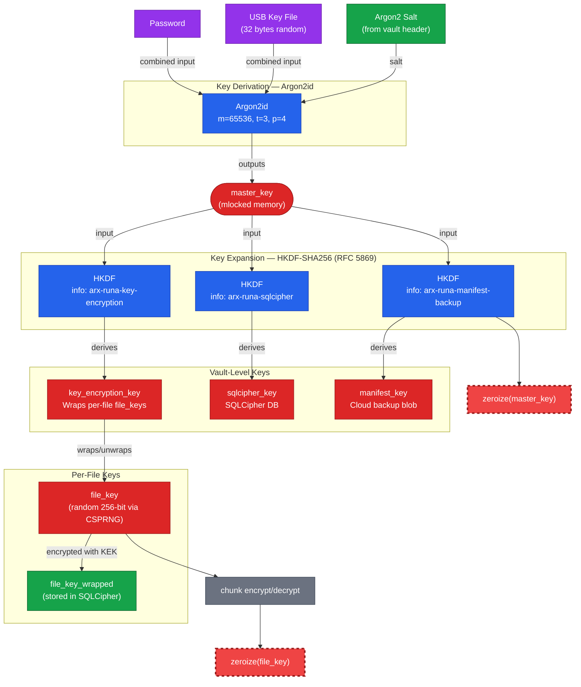
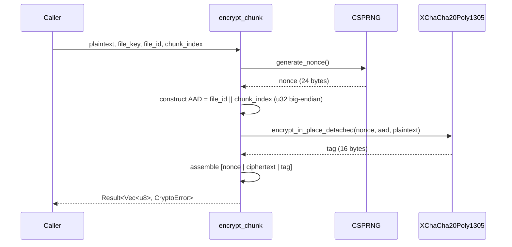
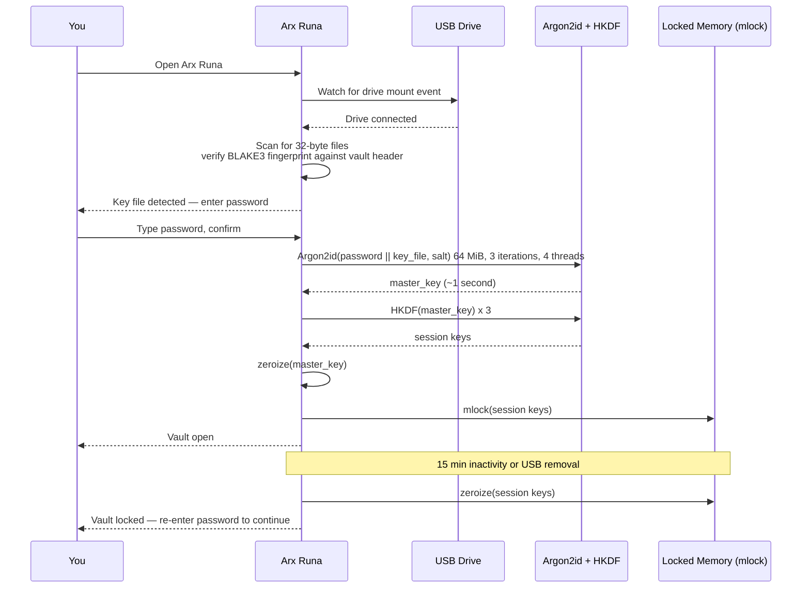
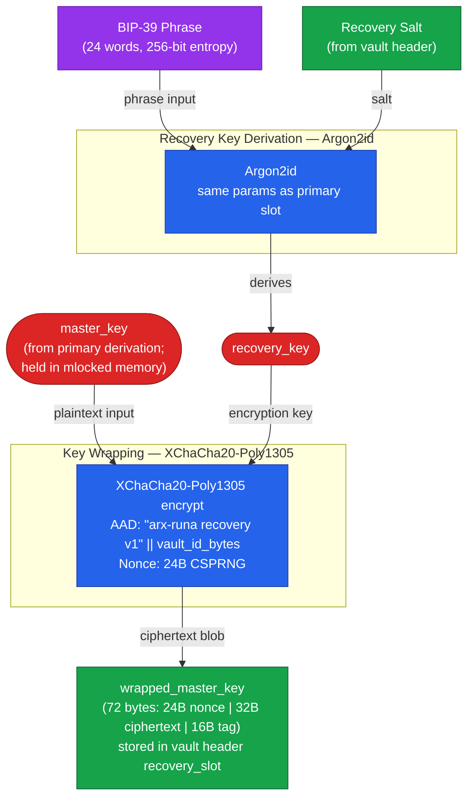
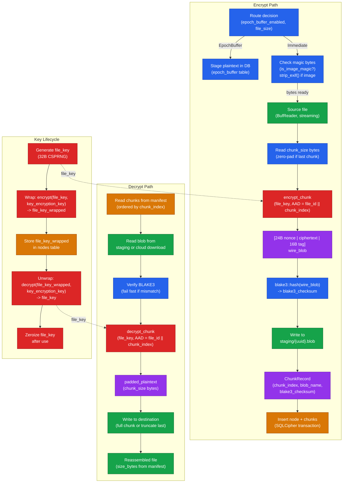
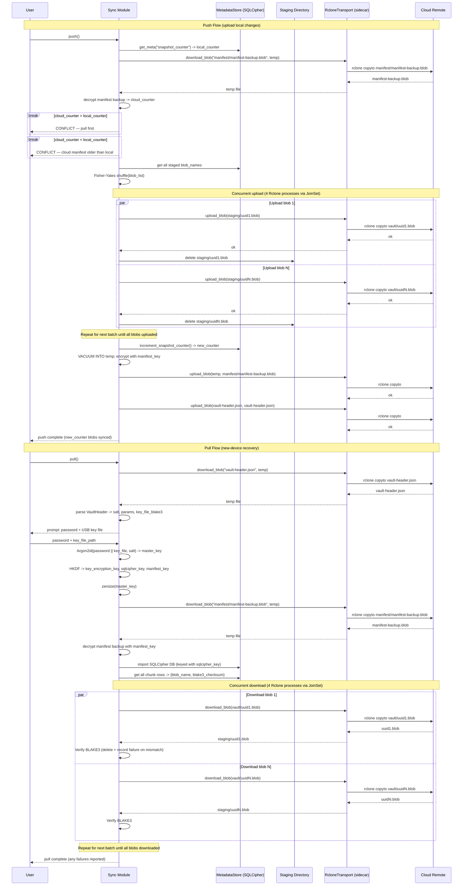
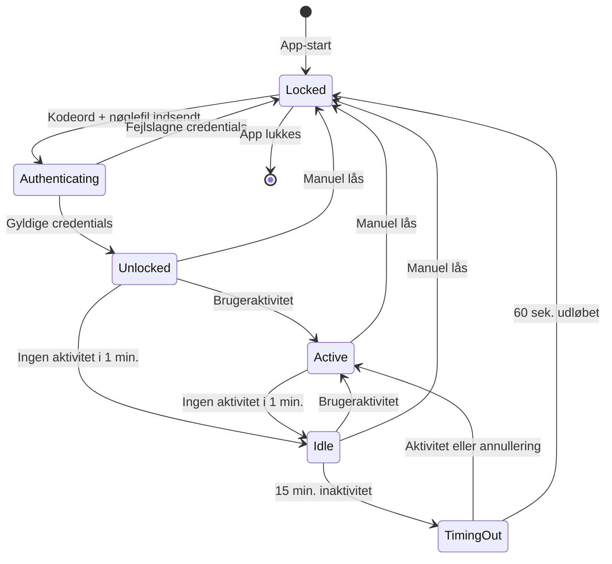
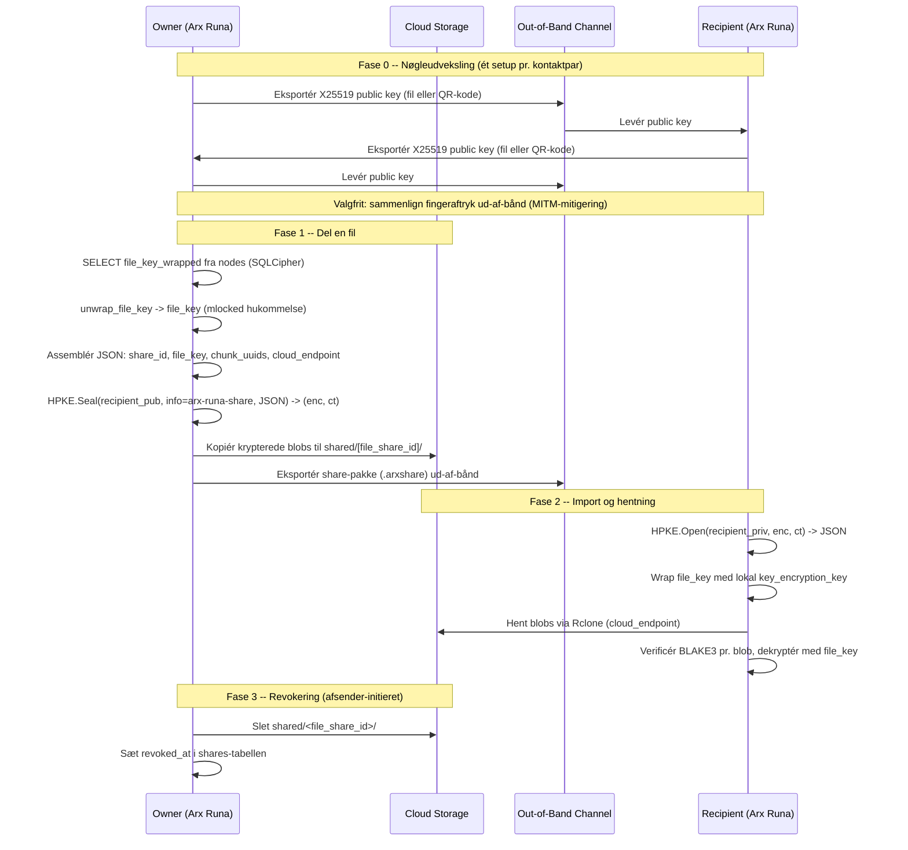

# Arx Runa — Bachelorrapport

*Encrypted here · Stored anywhere*
*Bachelorprojekt — PBA Softwareudvikling*

---

**Projektnavn:** Arx Runa — Zero-Knowledge Client Encryption
**Antal tegn:** [indsæt ved aflevering]
**Gruppemedlemmer:** Christian Salgård Svinding
**Produktside:** https://salgaard.github.io/arx-runa/
**GitHub:** https://github.com/salgaard/arx-runa
**Download:** https://salgaard.github.io/arx-runa/download.html

> **AI-deklarering (UCL §8.5):** Claude (Anthropic) er anvendt som skrivepartner og kodenavigator i forbindelse med projektet. Konkret er AI-assistance benyttet til: sparring om arkitekturbeslutninger og kryptografiske valg i designfasen; generering af sektionsudkast til rapporten, herunder §1 Indledning samt løbende udkast til øvrige afsnit, der efterfølgende er gennemlæst, redigeret og godkendt af forfatteren; korrekturlæsning og stilredigering af dansk prosa; navigation og søgning i kodebase og designdokumenter. Al kode i projektet er skrevet af forfatteren uden AI-kodegenerering. Al rapporttekst er gennemlæst, tilrettet og godkendt af forfatteren, der er eneste ansvarlige for rapportens faglige indhold og konklusioner. Brug er sket i overensstemmelse med UCL's retningslinjer på mitucl.dk.

---

## Indholdsfortegnelse

1. [Indledning](#1-indledning)
2. [Problemformulering](#2-problemformulering)
3. [Metode og videnskabsteoretisk grundlag](#3-metode-og-videnskabsteoretisk-grundlag)
   - 3.1 Udviklingsmetodik
   - 3.2 Komparativ analyse som teknisk evalueringsredskab
   - 3.3 Dataindsamling og validering
4. [Teknologisk kontekst og relaterede systemer](#4-teknologisk-kontekst-og-relaterede-systemer)
   - 4.1 Mainstream cloud storage — trust-modellen
   - 4.2 Eksisterende privacy-orienterede løsninger
   - 4.3 Use Cases — brugscenarier der driver kravene
   - 4.4 Systemkrav
   - 4.5 Positionering af Arx Runa
   - 4.6 Systemarkitektur — overordnet design
   - 4.7 Trusselsmodel og angrebsoverflade
5. [Analyse og Realisering: Krypteringsstandarder og nøglehåndtering](#5-analyse-og-realisering-krypteringsstandarder-og-nøglehåndtering)
6. [Analyse og Realisering: Hardware-faktor og offline recovery](#6-analyse-og-realisering-hardware-faktor-og-offline-recovery)
7. [Analyse og Realisering: Chunking, synkronisering og provider-agnostisk storage](#7-analyse-og-realisering-chunking-synkronisering-og-provider-agnostisk-storage)
8. [Analyse og Realisering: Zero-Trace operation og RAM-baseret UI](#8-analyse-og-realisering-zero-trace-operation-og-ram-baseret-ui)
9. [Analyse og Realisering: Fildeling i et zero-trust system](#9-analyse-og-realisering-fildeling-i-et-zero-trust-system)
10. [Test og evaluering](#10-test-og-evaluering)
    - 10.1 Testlag og ansvarsfordeling
    - 10.2 Scenarietest som use case-traceabilitet
    - 10.3 CI-pipeline og platformsdækning
    - 10.4 Teststrategi-refleksion — Agile Testing Quadrants
11. [Diskussion og anbefalinger](#11-diskussion-og-anbefalinger)
12. [Konklusion](#12-konklusion)
    - 12.1 Svar på den overordnede problemformulering
    - 12.2 Begrænsninger og åbne spørgsmål
13. [Litteraturliste og bilag](#13-litteraturliste-og-bilag)
    - Bilag A: Trusselsmodel (fuld STRIDE-matrix)
    - Bilag B: Forensisk verifikation
    - Bilag C: Performance-benchmarks
    - Bilag E: Ordliste
    - Bilag F: Fuldt kravkatalog

---

## 1. Indledning

Når en fil uploades til Google Drive, OneDrive eller Dropbox, krypteres forbindelsen. Transport Layer Security sikrer at data ikke kan aflæses undervejs. Men krypteringen stopper ved serveren. Cloud-udbyderen modtager klarteksten, lagrer den og besidder selv de nøgler der beskytter den. Brugerens privatlivs-garanti er dermed ikke kryptografisk, men kontraktlig: man stoler på at udbyderen ikke misbruger adgangen.

Denne tillidsmodel er sårbar af to grunde. For det første kan juridisk tvang overskride kontrakten. CLOUD Act (Clarifying Lawful Overseas Use of Data Act) forpligter amerikanske cloudvirksomheder til at udlevere data lagret hvor som helst i verden, når en amerikansk domstol udsteder kendelse (U.S. Congress, 2018). Europæiske jurisdiktioner har tilsvarende mekanismer. Brugerens data er dermed tilgængeligt for en bred kreds af statslige aktører uden brugerens viden eller samtykke. For det andet er koncentrationen af data hos en enkelt udbyder et attraktivt mål for angribere. Et kompromitteret cloud-system eksponerer ikke blot ét offers filer, men potentielt millioner.

Kryptografisk zero-knowledge storage løser begge problemer ved at flytte krypteringskontrol til klienten: data krypteres på brugerens enhed, og cloud-udbyderen modtager udelukkende krypterede blobs uden adgang til de nøgler der ville kunne afkode dem. Udbyderen kan dermed hverken opfylde en retskendelse om dataindhold eller lækkes til at eksponere klartekst.

Eksisterende løsninger med klient-side kryptering adresserer dele af dette problem, men hver med afgrænsede begrænsninger. Cryptomator krypterer lokalt inden synkronisering, men er konstrueret som et virtuelt drev der kan skrive dekrypterede filer til disk. Tresorit tilbyder stærk end-to-end kryptering, men er en managed tjeneste, hvor brugeren er bundet til Tresorts infrastruktur. Proton Drive markedsføres som zero-knowledge, men understøtter heller ikke en brugerkontrolleret storage-backend. Ingen af dem kombinerer hardware-baseret multifaktorautentifikation, offline recovery uden tredjepart og provider-agnostisk transport i ét system (jf. Tabel 4.2 for en detaljeret sammenligning).

Dette bachelorprojekt realiserer Arx Runa, et desktop-kryptosystem der bygger på zero-knowledge-princippet som arkitektonisk fundament. Systemet krypterer hvert fil-chunk med XChaCha20-Poly1305 og HKDF-afledte per-fil-nøgler, inden data overføres til en brugerdefineret cloud-backend via Rclone. Cloud-udbyderen modtager under ingen omstændigheder klartekst, filnavne eller metadata. Autentificeringen kræver to faktorer: adgangskode og en fysisk USB-nøglefil, der konkateneres direkte i nøgleafledningsfunktionen Argon2id. En offline recovery-mekanisme baseret på BIP-39 muliggør credential-gendannelse uden delegation til tredjeparter. Dekrypteret filindhold eksisterer udelukkende i `mlock`-beskyttet RAM under en aktiv session og slettes automatisk ved vault-lås.

Rapporten er struktureret som følger. §2 opstiller problemformuleringen og fem underspørgsmål. §3 beskriver den metodiske tilgang (Design Science Research og komparativ analyse). §4 etablerer den teknologiske kontekst, use cases, systemkrav og trusselsmodel. §5–9 analyserer og realiserer systemets fem kernefunktioner, ét kapitel pr. underspørgsmål, med delkonklusioner der direkte besvarer hvert underspørgsmål. §10 evaluerer teststrategien. §11 diskuterer de centrale design-afvejninger og begrænsninger. §12 konkluderer mod problemformuleringen.

---

## 2. Problemformulering

### Overordnet problemformulering

Hvordan kan en softwareløsning til sikker cloud-storage designes og implementeres, således at klient-side kryptering eliminerer behovet for tillid til tredjeparts-udbydere, og hvordan kan brugen af fysiske hardware-faktorer (MFA) og "Zero-Trace"-principper minimere den lokale angrebsflade på brugerens maskine?

### Underspørgsmål

**Underspørgsmål 1 — Krypteringsstandarder og nøglehåndtering:**
Hvilke moderne krypteringsstandarder og nøglehåndteringsprincipper er bedst egnede til at sikre datakonfidentialitet og -integritet, når data skal opbevares i et miljø uden for brugerens kontrol?

**Underspørgsmål 2 — USB-nøglefil og offline recovery:**
Hvordan kan en fysisk USB-nøglefil integreres i autentificeringsflowet som obligatorisk anden faktor (således at kendskab til adgangskode alene er utilstrækkeligt), og hvordan kan en offline BIP-39-gendannelsesmekanisme muliggøre brugerstyret credential-recovery uden at delegere tillid til tredjepart?

**Underspørgsmål 3 — Chunking, synkronisering og provider-agnostisk storage:**
Hvordan kan effektiv chunking og synkroniseringslogik implementeres til at uploade ændringer til cloud uden at afsløre filnavne, mappestrukturer eller metadata til cloud-udbyderen, og hvordan kan synkroniseringsprotokollen opretholde konsistens på tværs af enheder, mens den forbliver provider-agnostisk?

**Underspørgsmål 4 — Zero-Trace operation via RAM-baseret UI:**
Hvordan kan et RAM-baseret in-application UI opnå Zero-Trace-drift, sikrende at dekrypteret filindhold aldrig skrives til disk under en session, og hvilke forensiske spor efterlades eventuelt på værtsmaskinen efter vault-lås?

**Underspørgsmål 5 — Fildeling i et zero-trust system:**
Hvilke kryptografiske og protokolniveau-udfordringer opstår ved aktivering af fildeling med filgranularitet mellem uafhængige brugere i et zero-trust klient-side krypteret system, og hvordan sammenligner den foreslåede delingsarkitektur med eksisterende tilgange som OneDrive-delingslinks og Cryptomator shared vaults?

---

## 3. Metode og videnskabsteoretisk grundlag

Kapitlet begrunder de metodiske valg der ligger til grund for rapporten: udviklingstilgang, evalueringsmetode og datagrundlag.

### 3.1 Udviklingsmetodik — konstruktiv tilgang

Det videnskabsteoretiske fundament er en konstruktiv, artefaktorienteret tilgang. I denne tilgang frembringes viden ved at designe, bygge og evaluere et fungerende system: artefaktet er selve svaret på problemformuleringen. Tilgangen er pragmatisk epistemologisk: viden valideres ved at demonstrere at artefaktet løser det identificerede problem, ikke ved at falsificere en hypotese. Den overordnede problemformulering stiller præcis et designspørgsmål: *hvordan kan en løsning designes og implementeres?* Denne forskningstilgang betegnes i IS-forskning *Design Science Research* (DSR) og er veldokumenteret som metode til systemer der besvarer designspørgsmål frem for forklarende spørgsmål (Hevner et al., 2004).

Udviklingsprocessen fulgte en hybrid model med to overordnede faser.

Den første fase var upfront systemdesign: research, problemformulering og design af hele systemet (Phase 0–6) inden implementering begyndte. Denne fase sikrede at de kryptografiske invarianter (de kontraktmæssige grænseflader der binder faserne sammen) var gennemtænkt som et samlet hele. Et fejlbehæftet nøglehierarki i Phase 1 propagerer som strukturel konsekvens til autentificering (Phase 2), chunking (Phase 3) og fildeling (Phase 5). Upfront design reducerer denne risiko.

Den anden fase var parallel implementering på tværs af alle syv faser. Design-dokumenterne fungerede som levende arbejdsdokumenter der blev opdateret løbende efterhånden som implementeringen afslørede nye indsigter. Unit tests verificerede enkeltmoduler løbende. Efter UI-færdiggørelse i Phase 6 gennemførtes manuel systemtest, der afslørede fejl på tværs af lag. Fejlrettelserne krævede iterationer i både kode og design inden systemet nåede en stabil tilstand.

Tilgangen er en bevidst hybrid mellem to etablerede procesmodeller. Den indledende systemdesign-fase følger den prædiktive models princip om at al design og alle krav skal afklares inden implementering begynder, det Stephens betegner *Big Design Up Front* (BDUF): faserne gennemføres sekventielt og fuldstændigt, og implementering starter ikke før design er låst (Stephens, 2022, s. 432). Den parallelle implementering og den afsluttende valideringscyklus er omvendt inspireret af agile principper: iterativ tilpasning, kontinuerlig feedback og accept af ændringer undervejs (Stephens, 2022, s. 472). Hybridformen er valgt fordi sikkerhedskritisk software stiller modstridende krav: kryptografiske invarianter skal designes samlet og forstås på tværs af faser, mens implementeringens kompleksitet ikke lader sig forudsige fuldt ud i designfasen.

Arx Runa er struktureret i syv domæneafgrænsede faser (Phase 0–6):

| Fase | Domæne |
|------|--------|
| Phase 0 | Projektskeleton og infrastruktur |
| Phase 1 | Kryptografiske primitiver |
| Phase 2 | Autentificering og sessionsstyring |
| Phase 3 | Chunking og manifest |
| Phase 4 | Cloud-synkronisering |
| Phase 5 | Fildeling |
| Phase 6 | Tauri IPC og frontend |

Fasernes design-dokumenter er bevaret i `docs/architecture/designs/` og udgør et centralt referencegrundlag i denne rapport. De tværgående invarianter (kontrakter der gælder på tværs af alle faser) er samlet i `docs/architecture/design-invariants.md`.

### 3.2 Komparativ analyse som teknisk evalueringsredskab

Analysekapitlerne (§5–9) anvender komparativ analyse som teknisk evalueringsredskab. For hvert underspørgsmål identificeres relevante designalternativer, og de vurderes mod definerede evalueringsparametre. Metoden giver et fagligt belæg for de trufne valg frem for blot at beskrive hvad der blev implementeret.

Analysen er struktureret i tre niveauer med fuld traceabilitet. *Use cases* (UC-1–5) afgrænser scope: de definerer præcis hvilken funktionalitet der undersøges og hvilke brugerkrav der er relevante. UC-3 definerer eksempelvis scopet for §6 som en bruger med USB-nøglefil og BIP-39-gendannelse. *Kravdomæner* (REQ-AUTH, REQ-CRYPTO, REQ-VAULT, REQ-SYNC, REQ-SHARE, REQ-UI) operationaliserer use casene til konkrete krav med fuld UC-til-krav-traceabilitet. I analysekapitlerne fungerer disse krav som evalueringskriterier: et designvalg begrundes ved at demonstrere at det opfylder de relevante krav. *Evalueringsparametrene* er de tekniske dimensioner der er afledt af kravene og anvendes til direkte sammenligning af alternativer. I §5 sammenlignes AES-256-GCM, ChaCha20-Poly1305 og XChaCha20-Poly1305 mod parametrene nonce-sikkerhed, timing-robusthed og platformsydelse. I §6 sammenlignes TOTP, FIDO2/WebAuthn og USB-nøglefil mod sikkerhedsniveau, offline-kapabilitet og implementeringskompleksitet.

Kravdomænerne er ikke en forudlavet kravspecifikation der styrede implementeringen kronologisk. De er den analytiske linse rapporten anvender til at evaluere om designbeslutningerne samlet set opfylder de identificerede brugerbehov. Den komparative analyses validitet afhænger af at evalueringsparametrene dækker de reelle krav; denne risiko reduceres ved at parametrene er udledt direkte af kravdomænerne, som igen er funderet i use casene.

### 3.3 Dataindsamling og validering

Det empiriske grundlag for primitive-valg og protokoldesign er et systematisk litteraturstudie: RFC'er, NIST-standarder og kryptografiske papers udgør de primære kilder. Denne kildeprioritet er bevidst. RFC'er og NIST-dokumenter er peer-reviewed, vedligeholdte og udgør branchens normative referencer for kryptografisk praksis. Konkurrenters sikkerhedsarkitektur (Cryptomator, Tresorit, Proton Drive) analyseres udelukkende via officielle whitepapers og tilgængelige security audits, ikke via white-box analyse af kildekode.

Designbeslutningernes korrekthed verificeres gennem fire testlag med adskilte ansvarsområder: unit-tests (enkelt funktion i isolation), scenariotests (tværgående flows med reel kryptografi og reel SQLCipher), integrationstests (fuld encrypt-upload-download-decrypt round-trip) og E2E-tests (brugergrænseflade og browser-storage-oprydning). Testlagene beskrives i detalje i §10.

Zero-Trace-egenskaben verificeres manuelt: efter vault-lås inspiceres browser-storage (localStorage, sessionStorage, IndexedDB), IPC-responses for nøglemateriale og filsystemet for klartekstfragmenter i midlertidige mapper. Fremgangsmåden er dokumenteret i `docs/notes/zero-trace-manual-verification.md`. En dybere forensisk analyse med specialiserede værktøjer udgør en mulig fremtidig udvidelse og er beskrevet i `docs/notes/zero-trace-forensic-tools.md`; fraværet af denne analyse er en metodisk begrænsning for de fremsatte konklusioner om Zero-Trace-egenskaben.

Kildekritik er relevant på to områder. For det første kan kryptografiske standarder forældes; valget af aktive og ikke-reviderede standarder (RFC 8439, RFC 9106, NIST SP 800-131A) frem for nyere, endnu ikke bredt adopterede forslag reducerer denne risiko. For det andet er konkurrenters sikkerhedspåstande baseret på selvoffentliggjort materiale. Cryptomators arkitektur er dog open source og eksternt auditeret af uafhængige sikkerhedsforskere (McLean, 2016; Cure53, 2017), hvilket øger kildens troværdighed sammenlignet med Tresorit og Proton Drive.

---

## 4. Teknologisk kontekst og relaterede systemer

Dette kapitel etablerer det problemrum Arx Runa opererer i. Analysen følger kæden: den dominerende tillidsmodel i eksisterende cloud-løsninger afslører et designgab, eksisterende privacy-orienterede alternativer dækker delvist dette gab men med konkrete mangler, use cases præciserer hvad brugerne konkret behøver, systemkrav operationaliserer disse behov, og positioneringen viser hvad Arx Runa bidrager med.

### 4.1 Mainstream cloud storage — trust-modellen

Den dominerende model for cloud storage bygger på server-side kryptering med provider-kontrollerede nøgler. OneDrive, Google Drive og Dropbox krypterer data i hvile, men nøglerne administreres af udbyderen (Microsoft, u.å.; Google, u.å.; Dropbox, u.å.). Det betyder i praksis at udbyderen til enhver tid kan dekryptere og tilgå filindhold, filnavne, mappestrukturer og adgangsmønstre.

Denne tillidsmodel indebærer tre kategorier af eksponering. For det første er data tilgængeligt for udbyderens egne systemer og medarbejdere, hvilket skaber en insider-trussel uanset hensigt. For det andet gør den juridiske tillid til udbyderen brugeren sårbar over for statslig indgreb: Clarifying Lawful Overseas Use of Data Act (CLOUD Act, Pub. L. 115-141, 2018) forpligter amerikanske cloud-udbydere til at udlevere data til føderale myndigheder uanset dataenes fysiske placering, uden at brugeren nødvendigvis underrettes (U.S. Congress, 2018). For det tredje kan datalæk hos udbyderen eksponere indhold direkte, da ingen kryptografisk barriere beskytter brugerens data mod en kompromitteret server.

Fælles for disse eksponeringer er at de ikke kan mitigeres af brugeren inden for den eksisterende model. Løsningen kræver at krypteringen flyttes fra udbyderen til klienten, og at udbyderen aldrig modtager nøglematerialet.

### 4.2 Eksisterende privacy-orienterede løsninger

Reaktionen på denne tillidsmodel har skabt et marked for klient-side krypterede løsninger. Tre repræsentanter er særlig relevante som sammenligningsgrundlag.

**Cryptomator** er open source og implementerer klient-side kryptering oven på eksisterende cloud-backends (Google Drive, OneDrive, Dropbox m.fl.). Filindhold og filnavne krypteres lokalt inden synkronisering via et virtuelt drev, og udbyderen modtager udelukkende krypteret data. Den mangler imidlertid to egenskaber som er centrale for de use cases der motiverer Arx Runa: hardware-faktor i autentificeringen er ikke dokumenteret i arkitekturen, og det virtuelle drev medfører at dekrypterede filer kan skrives til disk uden aktiv nøgle-zeroization (Cryptomator, u.å., afsnittet "Virtual Filesystem").

**Tresorit** er end-to-end krypteret og tilbyder Swiss jurisdiction som juridisk garanti (Tresorit, u.å., afsnittet "Privacy"). Adgangskoden forlader aldrig enheden, nøglerne kontrolleres af brugeren, og nøgledeling sker via RSA-4096 med OAEP (Tresorit, u.å., afsnittet "Encryption"). Tresorit opfylder ISO 27001:2022 og indgår HIPAA Business Associate Agreements (Tresorit, u.å., afsnittet "Compliance"). Den afgørende begrænsning er produktmodellen: Tresorit tilbydes udelukkende som en managed cloud-tjeneste, og mulighed for at anvende en selvvalgt storage-backend er ikke dokumenteret i sikkerhedsarkitekturen (Tresorit, u.å., afsnittet "Encryption").

**Proton Drive** markedsføres som zero-knowledge cloud storage og er del af Proton-økosystemet. Kryptering sker klient-side, og Proton hævder selv at ingen (heller ikke Proton) kan tilgå filer eller filnavne uden brugerens nøgle (Proton AG, u.å., afsnittet "End-to-end encryption for all your files"). Som Tresorit er Proton Drive en managed cloud-tjeneste: data lagres hos Proton, og brugeren kan ikke anvende en alternativ backend. Hardware-faktor og BIP-39-baseret offline recovery uden tredjepart er ikke dokumenteret.

Fælles for alle tre løsninger er at de adresserer cloud-udbyderens tillidsmodel men introducerer en ny: tilliden til den pågældende SaaS-leverandør (Tresorit, Proton) eller til at brugerens eneste faktor (adgangskoden) er tilstrækkelig. Ingen af løsningerne kombinerer klient-side kryptering, hardware MFA, offline recovery uden tredjepart, provider-agnostisk lagring og zero-trace operation i ét system.

### 4.3 Use Cases — brugscenarier der driver kravene

> *Kilde: `docs/use-cases/` — UC-1 til UC-5*

Analysen af eksisterende løsningers mangler omsættes til fem konkrete brugscenarier. Scenarierne fungerer som scope-afgrænsning: de definerer præcis hvilken adfærd systemet skal understøtte og danner grundlag for kravdomænerne i §4.4. Fem primære brugscenarier er identificeret ud fra problemformuleringen:

| UC | Scenarie | Primær sikkerhedsegenskab |
|----|----------|--------------------------|
| UC-1 | Personlig zero-knowledge backup | Opaque blobs, EXIF-stripping, in-memory visning |
| UC-2 | Adgang på tværs af enheder | Konfliktresolution, stale manifest-detektion |
| UC-3 | Hardware MFA og nøgletab | Tier 2-auth, BIP-39 recovery, credential-rotation |
| UC-4 | Personlig fildeling | HPKE-kryptering, udløb, revocation |
| UC-5 | Multi-destination backup | Mirror/accumulating-tilstande, per-destination fejlhåndtering |

UC-1 og UC-4 illustrerer det grundlæggende problem: en bruger der ønsker at lagre og dele filer uden at cloud-udbyderen kan læse dem. UC-3 tilføjer den anden dimension: hvad sker der når adgangskoden kompromitteres eller hardware-faktoren mistes?

### 4.4 Systemkrav

> *Kilde: `docs/architecture/requirements.md` — 106 krav fordelt på 6 domæner*

Use casene omsættes til 106 konkrete systemkrav med fuld traceabilitet (UC → krav → design). Kravene er grupperet i seks domæner der afspejler systemets arkitektoniske lag:

| Domæne | Antal krav | Primære use cases |
|--------|-----------|------------------|
| REQ-AUTH | 23 | UC-1, UC-3 |
| REQ-CRYPTO | 16 | UC-1, UC-4 |
| REQ-VAULT | 15 | UC-1, UC-2, UC-4, UC-5 |
| REQ-SYNC | 15 | UC-1, UC-2, UC-5 |
| REQ-SHARE | 14 | UC-4 |
| REQ-UI | 17 | UC-1, UC-2, UC-3, UC-4 |

De konkrete krav anvendes som belæg i analysekapitlerne (§5–9), fx REQ-CRYPTO-001 som begrundelse for XChaCha20-valget i §5.

### 4.5 Positionering af Arx Runa

Tabel 4.2 sammenstiller de fem egenskaber der er centrale for de identificerede use cases på tværs af de analyserede løsninger.

| Egenskab | Use case | Cryptomator | Tresorit | Proton Drive | Arx Runa |
|----------|----------|:-----------:|:--------:|:------------:|:--------:|
| Hardware MFA | UC-3 | ✗ | ✗ | ✗ | ✓ |
| BIP-39 offline recovery uden tredjepart | UC-3 | ✗ | ✗ | ✗ | ✓ |
| Zero-trace (ingen klartekst på disk) | UC-1 | ✗ | ✗ | ✗ | ✓ |
| Provider-agnostisk lagring (BYOC) | UC-5 | ✓* | ✗ | ✗ | ✓ |
| Filgranulær kryptografisk deling (E2E) | UC-4 | ✗ | ～ | ～ | ✓ |

*Cryptomator understøtter multiple backends via virtuel drev-integration, men uden multi-destination og rclone-abstraktion. ～ angiver server-medieret deling uden klient-side HPKE.

*Tabel 4.2: Sammenligning af sikkerhedsegenskaber på tværs af løsninger. Kildegrundlag: Cryptomator (u.å.); Tresorit (u.å.); Proton AG (u.å.). ✗ angiver at egenskaben ikke er dokumenteret i den pågældende løsnings sikkerhedsarkitektur. ～ angiver server-medieret implementation uden klient-side HPKE.*

Tabellen viser at de eksisterende løsninger isoleret set løser enkeltproblemer. Cryptomator er stærk på provider-agnostisk lagring men mangler autentificeringsdybde. Tresorit og Proton Drive er stærke på klartekst-isolation mod cloud-udbyderen men låser brugeren til egne servere og mangler recovery uden tredjepart. Ingen af dem tilbyder hardware-faktor kombineret med offline recovery, og ingen garanterer zero-trace på klientmaskinen.

Arx Runa adskiller sig ikke ved at opfinde nye kryptografiske primitiver, men ved at integrere disse egenskaber i en sammenhængende arkitektur. Kombinationen er det nye: vault-nøglen afledes af to uafhængige faktorer (Tier 2, UC-3), BIP-39-recovery eliminerer tredjepartsafhængighed ved nøgletab, zero-trace sikrer ingen spor på disk efter vault-lås, rclone-integrationen giver fuld backend-frihed (Rclone, u.å.), og HPKE med X25519-identiteter muliggør filgranulær deling uden at eksponere vault'ens øvrige indhold (Barnes et al., 2022). Analysekapitlerne (§5-9) undersøger hvert designvalg og de afvejninger det medfører.

### 4.6 Systemarkitektur — overordnet design

Arx Runa er implementeret som en Tauri-applikation med en Rust-backend og en Leptos/WASM-frontend. Følgende tabel giver et overblik over kernekomponenterne, der introduceres her og refereres direkte i analysekapitlerne.

**Kernekomponenter og ansvar:**

| Komponent | Placering | Ansvar |
|-----------|-----------|--------|
| `crypto/` | `src-tauri/src/crypto/` | AEAD-kryptering, nøgleafledning (Argon2id → HKDF), nøgle-wrapping |
| `auth/` | `src-tauri/src/auth/` | Vault-oprettelse, oplåsning, recovery ceremonies (Tier 1/2) |
| `vault/` | `src-tauri/src/vault/` | Chunk-pipeline, SQLCipher-manifest, filnøgle-håndtering |
| `sync/` | `src-tauri/src/sync/` | Rclone-integration, multi-destination, konflikthåndtering |
| `sharing/` | `src-tauri/src/sharing/` | HPKE share-pakker, X25519-identiteter, kontakthåndtering |
| Frontend | Leptos/WASM i Tauri-shell | RAM-baseret UI — dekrypteret indhold forlader aldrig WASM-hukommelsesrum |

Det centrale arkitektoniske princip er at krypteringen udelukkende sker på klienten. Ingen komponent sender ukrypteret data til cloud-laget, og frontend-laget håndterer aldrig rå nøgler. Cloud-udbyderen modtager kun opaque ciphertext-blobs; SQLCipher-manifestet, der indeholder filnavne, chunk-referencer og indpakkede filnøgler, forbliver lokalt og krypteret. Hvordan dette realiseres i krypterings- og chunking-pipeline, analyseres i §5 og §7.

---

### 4.7 Trusselsmodel og angrebsoverflade

> *Kilde: `docs/how-it-works/security-model.md` og `docs/guides/security-model.md`*

Designbeslutningerne i §5–9 er forankret i en konkret adversary-model med tre primære trusselskategorier:

| Adversary | Kapabilitet | Hvad Arx Runa forsvarer mod |
|-----------|-------------|------------------------------|
| Cloud-udbyder | Fuld adgang til lagrede data | Krypterede blobs — ingen klartekst, filnavne eller metadata |
| Juridisk tvang (CLOUD Act m.fl.) | Kan pålægge udbyder at udlevere data | Samme som ovenfor — udbyder har intet meningsfuldt at udlevere |
| Fysisk angriber (ulåst maskine) | Adgang til filsystem og RAM under session | Zero-Trace: nøgler zeroizes ved vault-lås; intet dekrypteret indhold på disk |

Trust boundaries er defineret som følger: klienten (brugerens maskine og Arx Runa-processen) er trusted, cloud-udbyderen er fuldt untrusted og behandles som aktiv adversary, og netværkslaget er untrusted men out of scope da TLS håndteres af rclone og cloud-SDK'erne.

Tre angrebsscenarier er eksplicit out of scope: OS-kompromittering (rootkit eller keylogger på klientmaskinen), bruger der aktivt saboterer sin egen vault, og side-channel-angreb på kryptografiske primitiver. Afgrænsningen er ikke vilkårlig: OS-kompromittering er et forudsætningsbrud der kræver klientbeskyttelse uden for systemets rækkevidde, og side-channel-mitigering kræver hardware- eller mikrokode-garantier der ikke kan realiseres i applikationslaget alene.

Trusselsmodellen er det analytiske fundament de efterfølgende kapitler refererer til. Når §5 begrunder XChaCha20-valget og §6 analyserer tier-modellen, er det i forhold til de adversary-kategorier der er defineret her. En fuld STRIDE-kategoriseret threat matrix er i Bilag A.

---

## 5. Analyse og Realisering: Krypteringsstandarder og nøglehåndtering

Dette kapitel besvarer underspørgsmål 1: hvilke kryptografiske standarder og nøglehåndteringsmekanismer danner grundlaget for Arx Runas zero-knowledge-garanti, og hvad begrunder valget? Trusselsmodellen (§4.7) placerer cloud-udbyderen som fuldt untrusted adversary med adgang til alle lagrede data. Krypteringslaget skal opfylde ét præcist krav. Ingen del af en brugers data eller nøgler må fremstå meningsfulde for udbyderen. Analysen gennemgår de primære designvalg i rækkefølge: AEAD-primitiv, nøgleafledningspipeline, nøglehierarki og Rust-realiseringen.

### 5.1 Valg af AEAD-primitiv: XChaCha20-Poly1305

XChaCha20-Poly1305 (Arciszewski, 2020) blev valgt som AEAD-primitiv (Authenticated Encryption with Associated Data) for alle chunk-krypteringsoperationer. Valget er resultatet af en komparativ analyse af fire kandidater.

AES-256-GCM er NIST-standardiseret og udbredt i produktionssystemer (NIST, 2007). To egenskaber gør det uegnet her. Sikkerheden er betinget af AES-NI-hardwareinstruktioner for at undgå timing-angrebsrisici på systemer uden disse. Konsekvenserne af nonce-genbrug er katastrofale. To krypteringer med samme nonce og nøgle afslører autentificeringsnøglen og korrumperer fortroligheden, demonstreret mod reale TLS-implementeringer af Böck m.fl. (2016). AES-256-GCM-SIV (RFC 8452) afbøder nonce-genbrugsproblemet, men en 4 GiB-begrænsning pr. besked og komplikationer i multi-key-scenarier gør konstruktionen unødigt kompleks (McLean, 2016).

ChaCha20-Poly1305 (RFC 8439) er hardware-uafhængig og veletableret, men 96-bit nonce-størrelsen er for kort til tilfældig generering. Ifølge birthday bound er kollisionssandsynligheden ikke-negligibel allerede ved ca. 2³² krypteringer med tilfældig nonce-generering (Arciszewski, 2020).

XChaCha20-Poly1305 udvider nonce-størrelsen til 192 bit via HChaCha20-underfunktionen. Ifølge draft-irtf-cfrg-xchacha-03, §3.1, er kollisionssandsynligheden ca. 2⁻³³ efter 2⁸⁰ krypteringer, effektivt ubegrænset i enhver praktisk vault. Bernstein (2011) fastlægger sikkerhedsbeviset for den udvidede nonce under de samme antagelser som basiscifreret.

| Alternativ | Afvisningsbegrundelse |
|---|---|
| AES-256-GCM | Nonce-genbrug katastrofalt; timing-angrebsrisiko uden AES-NI (Böck m.fl., 2016; NIST, 2007) |
| ChaCha20-Poly1305 | 96-bit nonce utilstrækkelig; birthday bound ved ca. 2³² (Arciszewski, 2020) |
| AES-256-GCM-SIV | 4 GiB-begrænsning pr. besked; multi-key-komplikationer; begrænset Rust-biblioteksunderstøttelse (McLean, 2016) |
| AEGIS-256 | Stadig i IETF CFRG-udkaststadie; ingen afsluttet RFC; ingen uafhængigt revideret Rust-crate (IETF, u.å.) |

*Tabel 5.1: AEAD-kandidater og begrundelse for afvisning. Kildegrundlag: Arciszewski (2020); Böck m.fl. (2016); McLean (2016); IETF (u.å.).*

Key non-commitment er en kendt egenskab ved Poly1305-baserede konstruktioner. En forfalskningsangriber kan i princippet konstruere et ciphertext der verificerer mod to forskellige nøgler (Chan & Rogaway, 2022). I Arx Runas enkelt-vault-model er konsekvenserne begrænsede, men egenskaben er noteret som en åben overvejelse ved fremtidig multi-vault-understøttelse.

### 5.2 Nøgleafledning: Argon2id og HKDF-SHA256

Nøgleafledningspipelinen er to-trins. Adgangskoden (kombineret med den optionelle USB-nøglefil ved Tier-2-autentificering) behandles af Argon2id for at producere en 32-byte master_key. Derefter ekspanderes master_key af HKDF-SHA256 til tre funktionsseparerede vault-nøgler.

**Argon2id (RFC 9106)**

Argon2id vandt Password Hashing Competition (PHC) i 2015 og er den aktuelle anbefaling fra OWASP, NIST SP 800-63B og RFC 9106 til adgangskodebaseret nøgleafledning (Biryukov m.fl., 2021; OWASP, 2024; NIST, 2017). "id"-varianten er sammensat af to supplerende modstandsegenskaber. Data-independent hukommelsesadgang i første gennemgang beskytter mod side-channel-angreb fra co-lokaliserede processer. Data-dependent adgang i efterfølgende gennemgange modvirker GPU/ASIC-optimering (Biryukov m.fl., 2021).

Arx Runa anvender den anden anbefaling fra RFC 9106, §4 (high-security, non-interactive), med parametrene m=65.536 (64 MiB), t=3, p=4 (Biryukov m.fl., 2021). OWASP bekræfter disse parametre som den øverste tier for interaktive desktopapplikationer (OWASP, 2024). Målt med Criterion under produktionsparametre på Windows 11 tager en vault-oplåsning 61,0 ms (95 % CI: 60,1–62,0 ms); den meningsfulde sikkerhedsparameter er ikke latensen, men angrebsomkostningen pr. gæt: en angriber betaler den samme hukommelses- og tidsomkostning pr. forsøg (jf. Bilag C).

| Alternativ | Afvisningsbegrundelse |
|---|---|
| bcrypt | Maks. 72-byte adgangskodegrænse; ingen memory-hardness; egnet til autentificering, ikke nøgleafledning |
| scrypt (RFC 7914) | Forgænger for Argon2id; ringere time-memory-afvejning; ikke anbefalet af OWASP til nye designs |
| PBKDF2-SHA256 | Ingen memory-hardness; GPU-parallelliserbar; NIST anbefaler det i FIPS-kontekster, men Argon2id er overlegent til nøgleafledning (NIST, 2017) |

*Tabel 5.2: KDF-kandidater og begrundelse for afvisning. Kildegrundlag: Biryukov m.fl. (2021); OWASP (2024); NIST (2017).*

**HKDF-SHA256 (RFC 5869)**

Argon2id producerer en 32-byte master_key med fuld entropi. HKDF-SHA256 (Krawczyk & Eronen, 2010) bruges herefter i expand-only-tilstand til at afkøre tre domæneseparerede nøgler. Via info-strengen `arx-runa-key-encryption` afkøres key_encryption_key, `arx-runa-sqlcipher` afkører sqlcipher_key og `arx-runa-manifest-backup` afkører manifest_key. Info-strengene sikrer kryptografisk domæneseparation, så ingen afledt nøgle kan bruges som erstatning for en anden, og kompromittering af én eksponerer ikke de øvrige. SHA-256 er valgt frem for SHA-3 og BLAKE2 på grund af NIST SP 800-56C Rev 2-godkendelse og udbredt understøttelse i Rust-miljøet (NIST, 2020a). TLS 1.3 (RFC 8446) anvender HKDF-SHA256 som produktionspræcedens (Rescorla, 2018).



*Figur 5.1: Nøgleafledningstre for Arx Runa. Adgangskode og USB-nøglefil kombineres som input til Argon2id (m=65.536, t=3, p=4), der producerer master_key. HKDF-SHA256 ekspanderer master_key til tre vault-nøgler via domæneseparerede info-strenge. master_key zeroises umiddelbart efter HKDF-ekspansionen.*

### 5.3 Nøglehåndtering og vault-arkitektur

Vault-arkitekturen implementerer et KEK/DEK-hierarki (Key Encryption Key / Data Encryption Key) i overensstemmelse med NIST SP 800-57, §6.2 (NIST, 2020b). Princippet om begrænset eksponering betyder at kompromittering af én DEK kun berører den pågældende fils data og ikke propagerer til resten af vault'en.

**Per-fil tilfældig nøgle**

Hver fil tildeles en unik file_key genereret af en kryptografisk stærk tilfældighedsgenerator (CSPRNG). file_key bruges til XChaCha20-Poly1305-kryptering af filens chunks og lagres aldrig i klartekst. Den er krypteret (wrapped) med key_encryption_key og gemmes i SQLCipher-manifestet. Adgang til en fil kræver at vault'en er oplåst, og file_key er unwrapped just-in-time for kryptering eller dekryptering.

Per-fil-nøglearkitekturen har tre konsekvenser. Eksponeringsradius er begrænset, fordi kompromittering af én file_key kun berører den pågældende fils chunks (NIST, 2020b). Nøglerotation pr. fil er mulig uden at røre andre filer eller vault-nøglen. Fildeling (kapitel 9) understøttes ved at inkludere en enkelt file_key i en HPKE-pakke, uden at vault'ens key_encryption_key forlader enheden.

LUKS2 og Linux fscrypt anvender samme mønster som produktionspræcedenser. Begge systemer krypterer volume- eller filnøgler med adgangskodeafledte nøgler, så kompromittering af adgangskoden ikke automatisk kompromitterer datanøglerne (Fruhwirth m.fl., u.å.; kernel.org, u.å.).

**Krypteret manifest**

sqlcipher_key krypterer hele SQLCipher-manifestet, som indeholder filnavne, chunk-referencer, metadata og wrapped file_keys. Ingen meningsfulde data lagres ukrypteret lokalt, og cloud-udbyderen modtager aldrig en kopi af sqlcipher_key. Manifestet er det lokale sandhedspunkt for vault'ens tilstand.

Nøgler der aldrig forlader enheden: master_key, key_encryption_key, sqlcipher_key, manifest_key og uindpakkede file_keys eksisterer udelukkende i RAM under en aktiv session og zeroises ved vault-lås.

### 5.4 Realisering i Arx Runa

Designvalgene realiseres i modulhierarkiet `src-tauri/src/crypto/`, struktureret med én fil pr. primitiv.

`hkdf.rs` eksponerer `derive_vault_keys(master_key_bytes: &[u8; 32]) -> Result<VaultKeys, CryptoError>`, der udfører HKDF-SHA256-ekspansionen og returnerer alle tre vault-nøgler. `VaultKeys` er en newtype-struktur der holder `key_encryption_key`, `sqlcipher_key` og `manifest_key` som separate, stærkt typede felter. Domæneseparationen implementeres via dedikerede info-strenge, som vist i Listing 5.1; ingen nøgle kan forveksles med en anden i Rusts typesystem.

```rust
// src-tauri/src/crypto/hkdf.rs
const HKDF_SALT: &[u8]                 = b"arx-runa-v1";
const HKDF_INFO_KEY_ENCRYPTION: &[u8]  = b"arx-runa-key-encryption";
const HKDF_INFO_SQLCIPHER: &[u8]       = b"arx-runa-sqlcipher";
const HKDF_INFO_MANIFEST_BACKUP: &[u8] = b"arx-runa-manifest-backup";

pub fn derive_vault_keys(master_key_bytes: &[u8; 32]) -> Result<VaultKeys, CryptoError> {
    Ok(VaultKeys {
        key_encryption_key: KeyEncryptionKey::from_secret_box(expand_into_secret_box(
            master_key_bytes, HKDF_INFO_KEY_ENCRYPTION,
        )?),
        sqlcipher_key: SqlcipherKey::from_secret_box(expand_into_secret_box(
            master_key_bytes, HKDF_INFO_SQLCIPHER,
        )?),
        manifest_key: ManifestKey::from_secret_box(expand_into_secret_box(
            master_key_bytes, HKDF_INFO_MANIFEST_BACKUP,
        )?),
    })
}
```

*Listing 5.1: `derive_vault_keys()` i `hkdf.rs`. Én HKDF-expand-kald pr. nøgle med unik info-streng sikrer kryptografisk domæneseparation. Alle tre nøgler returneres indpakket i `SecretBox<[u8; 32]>` via `expand_into_secret_box`.*

`encrypt_chunk.rs` og `decrypt_chunk.rs` realiserer XChaCha20-Poly1305-krypteringen af individuelle chunks. AAD (Additional Authenticated Data) konstrueres fra file_id og chunk_index (big-endian u32). Bindingen sikrer at et chunk ikke kan flyttes til en anden fil eller position uden at autentificeringen fejler. Wire-formatet er `[nonce (24 bytes) | ciphertext | tag (16 bytes)]`. Listing 5.2 viser den komplette `encrypt_chunk()`-funktion.

```rust
// src-tauri/src/crypto/encrypt_chunk.rs
pub fn encrypt_chunk(
    mut plaintext: Zeroizing<Vec<u8>>,
    file_key: &FileKey,
    file_id: &FileId,
    chunk_index: ChunkIndex,
) -> Result<Vec<u8>, CryptoError> {
    let nonce_bytes = generate_nonce();
    let aad = build_chunk_aad(file_id, chunk_index);

    let cipher = XChaCha20Poly1305::new(GenericArray::from_slice(file_key.expose()));
    let nonce = GenericArray::from_slice(&nonce_bytes);

    let tag = match cipher.encrypt_in_place_detached(nonce, &aad, plaintext.as_mut_slice()) {
        Ok(value) => value,
        Err(_) => return Err(CryptoError::EncryptionFailed),
    };

    let mut blob = Vec::with_capacity(24 + plaintext.len() + 16);
    blob.extend_from_slice(&nonce_bytes);
    blob.extend_from_slice(&plaintext);
    blob.extend_from_slice(tag.as_slice());
    Ok(blob)
}
```

*Listing 5.2: `encrypt_chunk()` i `encrypt_chunk.rs`. Nonce genereres af CSPRNG ved hvert kald; AAD binder chunk-identiteten til autentificeringstaggget; wire-blob assembleres som `[nonce | ciphertext | tag]`.*

`wrap_key.rs` eksponerer `wrap_file_key()` og `unwrap_file_key()`, der anvender key_encryption_key til at kryptere og dekryptere file_keys med XChaCha20-Poly1305 og file_id som AAD. Mønsteret er identisk med Listing 5.2, men med key_encryption_key som krypteringsnøgle og en 72-byte wire-blob (nonce + 32-byte nøgle + tag). `nonce.rs` leverer `generate_nonce()`, der genererer en frisk 24-byte nonce fra CSPRNG ved hvert kald.

`types/mod.rs` definerer alle nøgletyper. Listing 5.3 viser strukturerne for `FileKey` og `KeyEncryptionKey`; de øvrige nøgletyper følger samme mønster. `zeroize`-craten sikrer volatile-skriv ved drop, og `SecretBox<T>` forhindrer utilsigtet logning via Debug-redaction (Celi, u.å.; Grigorik, u.å.).

```rust
// src-tauri/src/crypto/types/mod.rs
#[derive(ZeroizeOnDrop)]
pub struct FileKey(SecretBox<[u8; 32]>);

#[derive(ZeroizeOnDrop)]
pub struct KeyEncryptionKey(SecretBox<[u8; 32]>);
```

*Listing 5.3: Nøgletypedefinitioner i `types/mod.rs`. `ZeroizeOnDrop` sikrer volatile-skriv af nøglebytes ved drop; `SecretBox<T>` allokerer nøglen på heap med redacted Debug-impl så bytes aldrig fremgår af logs eller fejlbeskeder.*



*Figur 5.2: Intern flow for `encrypt_chunk`. Hvert kald genererer en ny 24-byte nonce fra CSPRNG, konstruerer AAD fra filidentitet og chunkposition, og producerer et `[nonce | ciphertext | tag]`-blob via XChaCha20-Poly1305.*

Testdækning for modulet omfatter unit-tests (AEAD round-trip, nonce-uniqueness, forkert-nøgle-fejl) og property-based tests via `proptest`. Integrationstests i `tests/scenarios_auth.rs` dækker en krypteret round-trip over real SQLCipher.

> **Delkonklusion — Underspørgsmål 1:** XChaCha20-Poly1305 eliminerer nonce-kollisionsrisikoen ved enhver praktisk vault-størrelse og er hardware-uafhængig. Argon2id med RFC 9106-parametrene gør brute-force hukommelsesintensivt og GPU-resistent. HKDF-SHA256 separerer vault-nøglerne kryptografisk, så kompromittering af én nøgle ikke propagerer til de øvrige. Per-fil tilfældig nøgle med KEK/DEK-hierarki begrænser eksponeringsradius til den individuelle fil. Samlet modsvarer arkitekturen trusselsmodellens krav (§4.7): cloud-udbyderen modtager udelukkende opaque ciphertext-blobs, og ingen del af nøglehierarkiet forlader klientens RAM under en aktiv session.

---

## 6. Analyse og Realisering: Hardware-faktor og offline recovery

Dette kapitel undersøger Underspørgsmål 2: Hvordan kan en fysisk USB-nøglefil integreres som obligatorisk anden faktor, og hvordan kan offline BIP-39 recovery muliggøre brugerstyret gendannelse af credentials uden at delegere tillid?

### 6.1 Tier-model for autentificering

Adgangskodebaseret autentificering har en fundamental svaghed: én faktor er ét angrebspunkt. Et kompromitteret password giver fuld adgang, og angriberen behøver ikke bryde krypteringen direkte. NIST SP 800-63B definerer tre Authenticator Assurance Levels (AAL1–AAL3), der graduerer kravet til autentificering efter risikoprofil (NIST, 2017). AAL1 tillader enkeltfaktor, mens AAL2 kræver to uafhængige faktorer fra forskellige kategorier, typisk en vidensbaseret (password) og en besiddelsesbaseret (hardware token).

Arx Runa implementerer to autentificeringsniveauer svarende til disse trin. Tier 1 anvender kun adgangskode (AAL1). Tier 2 kræver adgangskode kombineret med en USB-nøglefil (AAL2, REQ-AUTH-001). Den afgørende designbeslutning er, at de to faktorer ikke er stacked som separate valideringstrin, men kombineres til ét samlet KDF-input. Tier 1-afledningen er:

`master_key = Argon2id(password_bytes, salt)`

Tier 2-afledningen er:

`master_key = Argon2id(password_bytes || key_file_bytes, salt)`

Konkatenering er entydigt fordi key_file_bytes altid er præcis 32 bytes (REQ-AUTH-008). Et forkert password producerer en anden master_key. Et forkert key_file producerer ligeledes en anden master_key. Ingen faktor er tilstrækkelig alene (REQ-AUTH-003, REQ-AUTH-004, REQ-AUTH-005).

To alternativer til USB-nøglefilen var kandidater i designanalysen. FIDO2/WebAuthn er en moderne standard for hardwarebundet autentificering med public-key kryptografi og challenge-response (FIDO Alliance, 2019). Protokollens non-deterministiske natur er en fordel mod replay-angreb, men en ulempe her: Argon2id kræver et reproducerbart input for at producere den samme master_key på tværs af sessioner og enheder, og FIDO2's challenge-respons-output opfylder ikke det krav. TOTP (Time-based One-Time Passwords) er forkastet af samme grund (IETF, 2011). En TOTP-kode er tidafhængig, og kombinationen `password || TOTP` er forskellig for hvert 30-sekundervindue. Determinisme er ikke valgfrit i dette design: KDF-output er nøglen, og nøglen skal kunne reproduceres præcist.

### 6.2 USB-nøglefil: design og angrebsovervejelser

En USB-nøglefil er 32 bytes genereret af CSPRNG (`rand::rng().fill_bytes()`) ved vault-oprettelse (REQ-AUTH-008). Filen har ingen intern struktur, ingen versionsbyte og intet enheds-id, den er ren tilfældig entropi svarende til 256 bits og samme størrelse som en X25519 privat nøgle. Brugeren kan navngive filen og placere den frit på drevet. Listing 6.1 viser genereringen i `auth/ceremonies/create.rs`:

```rust
// src-tauri/src/auth/ceremonies/create.rs
let mut buffer: Zeroizing<[u8; 32]> = Zeroizing::new([0u8; 32]);
rand::rng().fill_bytes(buffer.as_mut_slice());
staging::write_owner_only_new(&key_file_path, buffer.as_slice()).await?;
let digest = blake3::hash(buffer.as_slice());
key_file_blake3_hex = Some(hex::encode(digest.as_bytes()));
key_file_bytes = Some(buffer);
```

*Listing 6.1: Generering af USB-nøglefil i `create.rs`. 32 bytes CSPRNG-entropi skrives til drevet med owner-only rettigheder. En BLAKE3-hash gemmes i vault-headeren som fingeraftryk til auto-detektion.*

BLAKE3-hashen er et offentligt verificeringstegn (O'Connor et al., 2019). Den er preimage-resistent: kendskab til hashen giver ingen information om de 32 bytes, der producerede den. Hashen lagres i klartext i vault-headeren fordi bootstrapping af autentificering kræver den, og den afslører intet om nøglefilens indhold.

Brugeren behøver ikke navigere manuelt til nøglefilen. Arx Runa overvåger OS-native mount-events og scanner det tilsluttede drev automatisk ved indsætning (REQ-AUTH-010, REQ-AUTH-012). Figur 6.1 illustrerer forløbet fra USB-tilslutning til åben session.



*Figur 6.1: Unlock-flow for Tier 2-vault. USB-tilslutning udløser BLAKE3-scanning; match udfylder nøglefil-feltet i UI. Brugeren bekræfter aktivt, Argon2id deriverer master_key, og sessionnøgler låses i mlocked hukommelse. Ved timeout eller fjernelse af USB zeroizes alle nøgler. (Kilde: `docs/how-it-works/unlocking.md`.)*

Scanningsalgoritmen filtrerer på præcis 32 bytes filstørrelse. Næsten ingen legitime filer er 32 bytes, så kandidatmængden er minimal. For hvert hit beregnes `blake3::hash(content)` og sammenlignes med fingeraftrykket via konstant-tids sammenligning, som vist i Listing 6.2.

```rust
// src-tauri/src/auth/autodetect.rs
if metadata.len() != KEY_FILE_SIZE {
    continue;   // filtrerer alle filer der ikke er præcis 32 bytes
}
// ...
let hash = blake3::hash(buffer.as_ref());
if hash.as_bytes().ct_eq(&reference_hash.0).into() {
    return Ok(Some(entry.into_path()));
}
```

*Listing 6.2: Scanningslogik i `autodetect.rs`. Størrelsesfilter minimerer kandidatmængden. `ct_eq` (konstant-tids sammenligning) forhindrer timing-sidekanalangreb mod BLAKE3-verifikationen.*

Tabel 6.1 opsummerer de primære angrebsscenarier mod hardware-faktoren.

| Scenario | Trussel | Modforanstaltning |
|----------|---------|-------------------|
| USB stjålet | Angriber besidder key_file, intet password | Argon2id kræver begge faktorer; password alene er utilstrækkeligt |
| USB mistet permanent | Bruger mister hardware-faktor | BIP-39 recovery-slot muliggør re-keying uden USB og password |
| USB kopieret digitalt | Angriber har key_file-bytes | Samme risiko som stjålet USB; kræver stadig password |
| Key file roteret | Ny nøglefil genereres; gammel kasseres | Rotationsceremoni kræver gammel USB til at afvikle eksisterende filnøgleindpakninger |

*Tabel 6.1: Angrebsscenarier for USB-nøglefil og tilhørende modforanstaltninger. Fysisk besiddelse er en sikkerhedspræmis: systemet kræver to separate kompromiser for at en angriber får adgang.*

Sikkerhedsargumentet hviler på, at de to faktorer er uafhængige. En angriber skal kompromittere adgangskoden og besidde den fysiske USB-nøglefil. Kopiering af key_file-bytes svarer til USB-tyveri og er kun meningsfuldt kombineret med password-kompromittering.

### 6.3 BIP-39 offline recovery

Tier 2-vaulte introducerer et utilgængeligheds-scenarie: mistes USB-drevet permanent og adgangskoden glemmes, er vaultens data varigt utilgængeligt. En recovery-mekanisme er nødvendig, men den må ikke delegere tillid til en tredjepart, fordi det ville undergrave det zero-trust-princip der begrunder systemets eksistens.

Tabel 6.2 sammenligner de tre primære recovery-alternativer.

| Alternativ | Tillidsproblem |
|------------|----------------|
| Server-side key escrow | Kræver tillid til server: kompromittering, legal seizure (CLOUD Act) eller driftsnedlukning eksponerer master_key |
| Social recovery via Shamir's Secret Sharing | Kræver tillid til N kontakter: social engineering-angrebsflade; ét share-sæt er tilstrækkeligt til kompromittering |
| Email-baseret reset | Kræver tillid til email-udbyder og identity provider; begge tredjeparter er CLOUD Act-eksponerede |

*Tabel 6.2: Recovery-alternativer med tilhørende tillidsproblemer. Kildegrundlag: U.S. Congress (2018) for CLOUD Act; Shamir (1979) for secret sharing. Alle tre alternativer kræver delegation af tillid til en tredjepart.*

BIP-39 (Palatinus et al., 2013) koder entropi som en ordsekvens med integreret checksum. Standarden er udviklet til hardware cryptocurrency-wallets og er implementeret i velauditerede crates. 24 ord svarer til 256 bits entropi med 8-bit checksum. Checksummens funktion er fejldetektering: en forkert transskriberet phrase fejler checksum-validering øjeblikkeligt, inden Argon2id køres. Ordliste-enkodning er mere fejltolerant end hexadecimale strenge ved manuel afskrivning, fordi en fejlstavet ord er nemmere at identificere end én forkert hexadecimal karakter.

Recovery-slottet er en kryptografisk indpakket kopi af master_key lagret i vault-headeren i skyen. Figur 6.2 illustrerer konstruktionen.



*Figur 6.2: Recovery slot-konstruktion. BIP-39-phrasen afledes til recovery_key via Argon2id med samme parametre som primær-slot. Master_key indpakkes i XChaCha20-Poly1305 med vault_id som AAD og lagres i vault-headeren. (Kilde: `docs/how-it-works/recovery.md`.)*

Slot-konstruktionen følger fire trin. Arx Runa genererer 256 bits CSPRNG-entropi og koder den som en 24-ords BIP-39-phrase. Phrasen vises én gang i UI og gemmes aldrig af systemet. En ny salt genereres via CSPRNG, og recovery_key afledes via Argon2id med de samme parametre som det primære password-slot. Master_key indpakkes med XChaCha20-Poly1305 med vault_id som AAD, og det resulterende 72-byte blob (24-byte nonce, 32-byte ciphertext, 16-byte tag) lagres i vault-headerens `recovery_slots`-array. Listing 6.3 viser genereringen i `auth/ceremonies/setup_recovery.rs`:

```rust
// src-tauri/src/auth/ceremonies/setup_recovery.rs
let mut entropy: Zeroizing<[u8; 32]> = Zeroizing::new([0u8; 32]);
rand::rng().fill_bytes(entropy.as_mut_slice());
let mnemonic = Mnemonic::from_entropy_in(Language::English, entropy.as_slice())
    .map_err(|_| AuthenticationError::VaultHeaderInvalid)?;
let phrase_string = canonicalize_phrase(&mnemonic);
drop(entropy);                      // entropi zeroizes umiddelbart efter mnemonic-generering

let mut recovery_salt: Zeroizing<[u8; 32]> = Zeroizing::new([0u8; 32]);
rand::rng().fill_bytes(recovery_salt.as_mut_slice());
derive_recovery_key_into(
    phrase_string.as_bytes(),
    &recovery_salt,
    &current_params,
    &mut recovery_key_bytes,
)?;
let recovery_key = recovery_key_from_array(&recovery_key_bytes);

let wrapped = wrap_master_key_for_recovery(&master_key_typed, &recovery_key, vault_id)?;
```

*Listing 6.3: BIP-39 mnemonic-generering og slot-wrap i `setup_recovery.rs`. Entropien zeroizes umiddelbart efter mnemonic-generering. Recovery_key afledes via Argon2id med samme parametre som primær-slot. Master_key indpakkes i XChaCha20-Poly1305 med vault_id som AAD.*

Ved recovery itererer systemet over slots og forsøger AEAD-dekryptering for hvert. Listing 6.4 viser iterationen i `recover_with_phrase.rs`:

```rust
// src-tauri/src/auth/ceremonies/recover_with_phrase.rs
for slot in header.recovery_slots.iter() {
    if slot.method != "bip39" { continue; }
    derive_recovery_key_into(
        canonical.as_bytes(),
        &slot_salt,
        &slot_params,
        &mut recovery_key_bytes,
    )?;
    let recovery_key = recovery_key_from_array(&recovery_key_bytes);
    match unwrap_master_key_from_recovery(&wrapped, &recovery_key, &vault_id) {
        Ok(master_key_typed) => {
            recovered_master_key = Some(bytes);
            break;
        }
        Err(_) => { drop(recovery_key); }   // næste slot; ingen oracle-information
    }
}
```

*Listing 6.4: Slot-iteration og AEAD-dekryptering i `recover_with_phrase.rs`. Forkert phrase resulterer i `Err(_)` fra AEAD-dekryptering. Fejlsemantikken er non-orakulær: angriberen kan ikke skelne forkert phrase fra forkert password.*

Recovery-slot bruger identiske Argon2id-parametre som primær-slot (m=65536 KiB, t=3, p=4, RFC 9106, 2021). Det er en bevidst beslutning: en angriber, der inspicerer vault-headeren i klartext, kan ikke skelne recovery-slot-salt fra primær-slot-salt. Selvom 256-bit entropi teknisk gør Argon2id-cost redundant for brute-force (søgerummet er 2²⁵⁶), bevares cost-ækvivalensen for slot-indistinguishability. Phrasen forbliver gyldig på tværs af password-rotationer og key file-rotationer. Ved en rotation re-wrappes master_key under en ny recovery_key, men phrasen ændres ikke.

### 6.4 Realisering i Arx Runa

Tier-modellen, USB-nøglefilen og BIP-39-recovery er realiseret på tværs af auth-modulet i `src-tauri/src/auth/`. Tabel 6.3 angiver de primære filer og deres ansvar.

| Modul | Ansvar |
|-------|--------|
| `auth/ceremonies/create.rs` | Vault-oprettelse for begge tiers; key_file-generering og BLAKE3-hash |
| `auth/ceremonies/unlock.rs` | Login-flow; tier-afhængig KDF-input-konstruktion |
| `auth/ceremonies/setup_recovery.rs` | BIP-39 mnemonic-generering; indpakking af master_key i recovery-slot |
| `auth/ceremonies/recover_with_phrase.rs` | Recovery-autentificering; slot-iteration; re-wrapping af alle filnøgler |
| `auth/ceremonies/rotate_key_file.rs` | Key file-rotation; kræver begge faktorer og ny USB |
| `auth/kdf.rs` | `derive_master_key_into()`: tier-afhængig Argon2id og HKDF-pipeline |
| `auth/autodetect.rs` | USB-scanning: 32-byte filter og BLAKE3-verifikation |
| `auth/device_monitor/` | OS-native events: `WindowsDeviceMonitor`, `LinuxDeviceMonitor`, `MacOsDeviceMonitor` |
| `auth/session/keys.rs` | `SessionKeys`: mlocked/VirtualLock-beskyttet hukommelse, zeroization ved drop |
| `crypto/recovery_wrap.rs` | `wrap_master_key_for_recovery()` og `unwrap_master_key_from_recovery()` |

*Tabel 6.3: Nøglemoduler der realiserer autentificering og recovery i `src-tauri/src/auth/`.*

Listing 6.5 viser KDF-input-konstruktionen i `auth/kdf.rs`. Tier-skelnet er udtrykt direkte i Rusts typesystem via `Option<&[u8; 32]>`:

```rust
// src-tauri/src/auth/kdf.rs
pub(crate) fn derive_master_key_into(
    password_utf8_bytes: &[u8],
    key_file_bytes: Option<&[u8; KEY_FILE_LENGTH_BYTES]>,
    salt: &[u8; 32],
    parameters: &Argon2Params,
    output: &mut [u8; MASTER_KEY_LENGTH_BYTES],
) -> Result<(), AuthenticationError> {
    let mut combined_input: Zeroizing<Vec<u8>> =
        Zeroizing::new(Vec::with_capacity(
            password_utf8_bytes.len()
                + key_file_bytes.map_or(0, |_| KEY_FILE_LENGTH_BYTES),
        ));
    combined_input.extend_from_slice(password_utf8_bytes);
    if let Some(bytes) = key_file_bytes {
        combined_input.extend_from_slice(bytes);   // Tier 2: password || key_file
    }
    // Argon2id hash af combined_input med salt...
}
```

*Listing 6.5: Tier-afhængig KDF-input i `kdf.rs`. `None` = Tier 1 (password alene); `Some(bytes)` = Tier 2 (password konkateneret med key_file). Split er entydigt fordi KEY_FILE_LENGTH_BYTES altid er 32.*

`DeviceMonitor`-trait-mønsteret muliggør testbarhed uden fysisk hardware. Tre platformsimplementeringer og én mock-implementation deler den samme trait-grænse (Listing 6.6):

```rust
// src-tauri/src/auth/device_monitor/mod.rs
pub trait DeviceMonitor: Send + Sync {
    fn watch(&self) -> Pin<Box<dyn Stream<Item = DeviceEvent> + Send>>;
}
pub enum DeviceEvent {
    Mounted   { mount_path: PathBuf },
    Unmounted { mount_path: PathBuf },
}
```

*Listing 6.6: `DeviceMonitor`-trait i `device_monitor/mod.rs`. Trait-grænsen deles af `WindowsDeviceMonitor`, `LinuxDeviceMonitor`, `MacOsDeviceMonitor` og `MockDeviceMonitor`, der muliggør testning af hele auto-detektion-flowet uden fysisk USB-hardware.*

Tre kritiske invarianter gennemføres konsekvent på tværs af alle ceremonier. Fejlsemantikken er non-orakulær (REQ-AUTH-006): `InvalidCredentials` returneres for forkert password, forkert key_file eller begge, og calleren kan ikke skelne fejlkilden. mlock-fejl er en hård fejl: systemet afviser session-oprettelse frem for at degradere til ikke-mlocked hukommelse (REQ-AUTH-014). Argon2id-parametre gemmes i vault-headeren men er skrivebeskyttede under en aktiv vault (REQ-AUTH-009).

Testdækning for UC-3 (nøgletab og recovery) er realiseret i `src-tauri/src/tests/scenarios_auth.rs`. Testene kører real Argon2id (m=1.024 KiB, t=1 for testfart) og real SQLCipher. Dækningen omfatter vault-oprettelse for begge tiers, `setup_recovery`, `recover_with_phrase` end-to-end samt session-timeout. `MockDeviceMonitor` substituerer OS-native events.

> **Delkonklusion — Underspørgsmål 2:** USB-nøglefilen integreres som obligatorisk anden faktor ved at indgå som direkte KDF-input konkateneret med adgangskoden; ingen faktor er tilstrækkelig alene. Alternativerne FIDO2 og TOTP fravælges fordi non-deterministisk output er uforeneligt med reproducibel nøgleafledning via Argon2id (RFC 9106, 2021). BIP-39 offline recovery eliminerer tillidsproblemet ved server-side escrow og social recovery: master_key indpakkes under en Argon2id-afledt recovery_key, og den 24-ords phrase vises én gang og gemmes aldrig af systemet (Palatinus et al., 2013). Jf. trusselsmodellen (§4.7) kræver kompromittering af en Tier 2-vault to uafhængige angrebsvektorer (adgangskode og fysisk USB-besiddelse), og recovery er fuldt brugerstyret og offline uden tredjepart.

---

## 7. Analyse og Realisering: Chunking, synkronisering og provider-agnostisk storage

<!-- KILDER:
  - "Breaking and Fixing Content-Defined Chunking" — eprint.iacr.org/2025/558.pdf
  - "Chunking Attacks on File Backup Services using CDC" — eprint.iacr.org/2025/532.pdf
  - Cryptomator Security Architecture — docs.cryptomator.org/security/architecture
  - Shapiro m.fl. (2011) — CRDTs
  - Ellis & Gibbs (1989) — OT
  - Rclone (u.å.) — rclone.org
-->

Dette kapitel besvarer underspørgsmål 3: hvordan kan effektiv chunking og synkroniseringslogik implementeres til at uploade ændringer til cloud uden at afsløre filnavne, mappestrukturer eller metadata til cloud-udbyderen, og hvordan kan synkroniseringsprotokollen opretholde konsistens på tværs af enheder, mens den forbliver provider-agnostisk? Trusselsmodellen (§4.7) placerer cloud-udbyderen som en passiv, men fuldt untrusted adversary med adgang til samtlige lagrede blobs, deres størrelser og adgangsmønstre. Kryptering af indhold er ikke alene tilstrækkeligt. Selv krypterede blobs afslører metadata om filstørrelser, filantal og synkroniseringsfrekvens, hvis lagringsformatet ikke er omhyggeligt designet. Analysen gennemgår fem delproblemer i rækkefølge: blobnavngivning og vault-struktur, chunk-formatering og padding, manifest-kryptering, provider-agnostisk transport og synkroniseringsprotokol for konsistens.

### 7.1 Metadata-obfuskering: blobnavngivning og vault-struktur

Cloud-udbyderen modtager samtlige uploadede objekter og kan observere navne, antal og relativ størrelse. Filnavne, mappestrukturer og inkrementelle ændringsmønstre er metadata, der lækkes til udbyderen, medmindre de aktivt skjules.

Arx Runa anvender tilfældigt genererede UUID-strenge som blobnavne. Alle krypterede chunks og manifest-backuppen lagres under UUID-identifikatorer uden relation til det originale filnavn, mappeplacering eller indholdstype (REQ-VAULT-007). Cloud-udbyderen observerer N navngivne ciphertext-objekter og har ingen mulighed for at korrelere navne med filnavne eller mappestruktur.

Den eneste klartekstfil i vault'en er `vault-header.json`. Headeren indeholder udelukkende offentlige parametre: Argon2id-salt, algoritmeidentifikatorer og et BLAKE3-fingeraftryk af USB-nøglefilen ved Tier-2-autentificering. Intet nøglemateriale, intet filnavn og ingen strukturinformation indgår. Headeren er nødvendig for at en ny enhed kan starte autentificeringen uden forudgående kontakt med vault'en.

| Navngivningsstrategi | Eksempel | Metadatalæk | Valgt |
|---|---|---|---|
| Klartekst filnavn | `rapport.pdf.enc` | Filnavn, extension, mappenavn | ✗ |
| Hash af filnavn | `SHA256(navn).enc` | Deterministisk, korrelérbar ved genkryptering | ✗ |
| Krypteret filnavn | `AEAD(navn, key)` | Blob-til-fil-korrelation; størrelse eksponeret | ✗ |
| Tilfældig UUID | `3f8a2c1d...blob` | Ingen inference | ✓ |

*Tabel 7.1: Blobnavngivningsstrategier og deres metadataafsløring. Krypterede filnavne er forkastet fordi blob-størrelsen stadig afslører størrelsesinterval-information, og fordi en deterministisk mapping fra filnavn til blobnavn kan afsløre ændringsmønstre over tid.*

### 7.2 Chunking-strategi og padding

Selv med UUID-blobnavne lækker blob-størrelse filstørrelsesinformation. En fil på 30 MiB producerer et forudsigeligt antal blobs, og cloud-udbyderens observation af blob-antallet afgrænser filstørrelses-intervallet. Det er en iboende egenskab ved enhver opdeling af filer til cloud-lagring, men konsekvenserne varierer med valget af chunk-paradigme.

Tre paradigmer er kandidater. Fast chunk-størrelse (fixed-size) krypterer alle chunks til præcis N bytes og begrænser størrelsesinfrence til ét chunk-interval. Variabel chunk-størrelse afpasser hvert segment efter filsegmenternes naturlige grænser, men variation i chunk-størrelse afslører indholdsmønstre. Indholdsdefinieret chunking (CDC) anvender en rolling hash til at bestemme afskæringspoints og er fordelagtig til deduplication, men er uanvendelig i E2EE-kontekster, fordi hashen beregnes over klartekst og afslører strukturelle fingeraftryk af filen for en observatør med adgang til historiske uploadmønstre (Alexeev m.fl., 2025; Truong m.fl., 2025).

| Paradigme | Fordel | Ulempe | Valgt |
|---|---|---|---|
| Fast størrelse | Størrelsesinfrence til ét interval; ingen klartekst-fingeraftryk | Padding-overhead for korte filer | ✓ |
| Variabel størrelse | Lav overhead | Chunk-størrelsesvariationer afslører indholdsmønstre | ✗ |
| Indholdsdefinieret (CDC) | Deduplication-venlig | Rolling hash over klartekst lækker fingeraftryk (Alexeev m.fl., 2025) | ✗ |

*Tabel 7.2: Chunking-paradigmer i E2EE-kontekst. CDC er forkastet fordi rolling hash-beregning over klartekst udgør et metadatalæk mod trusselsmodellens adversary (§4.7). Fast størrelse er valgt (REQ-VAULT-002).*

Arx Runa anvender fast chunk-størrelse med en default på 4 MiB (128 KiB–64 MiB, konfigurérbar ved vault-oprettelse og immutabel derefter). Immutabiliteten er et hårdt krav, fordi ændring af chunk-størrelse efter vault-oprettelse kræver fuld genkryptering, eftersom samtlige eksisterende blobs er formateret til den originale størrelse (REQ-VAULT-002). Benchmark-målingerne (Bilag C) viser at XChaCha20-Poly1305-kryptering af et 4 MiB-chunk tager 4,04 ms (throughput: ~989 MiB/s) og dekryptering 4,85 ms (~825 MiB/s). CPU er ikke flaskehalsen ved normale uploadhastigheder.

Padding-mekanismen zero-padder det sidste chunk til præcis `chunk_size_bytes` inden kryptering. Den originale filstørrelse gemmes i manifest'et (krypteret) og bruges ved dekryptering til truncation. Nul-byte-filer behandles separat. En BLAKE3-checksum beregnes over hvert krypteret blob (`nonce || ciphertext || tag`) og gemmes i manifest'et for integritetskontrol ved download.

Den kryptografiske binding forhindrer chunk-omplacering. AAD (Additional Authenticated Data) for hvert chunk er `file_id || chunk_index` (big-endian u32), som specificeret i REQ-CRYPTO-009. Et chunk kan ikke flyttes til en anden fil eller en anden position i samme fil uden at AEAD-autentificeringen fejler.


*Figur 7.1: Krypteringssekvens for ét chunk. CSPRNG genererer en 24-byte nonce pr. chunk. AAD konstrueres fra `file_id` og `chunk_index` og binder chunk'et til sin position i filen, så omplacering detekteres af AEAD-tagget. Wire-formatet er `[nonce | ciphertext | tag]`.*



*Figur 7.2: Fuldt chunk-pipeline for kryptering og dekryptering. Krypteringsstien (øverst venstre) behandler filen via streaming BufReader og gemmer hvert krypteret blob i staging-mappen med et UUID-navn. Dekrypteringsstien (øverst højre) verificerer BLAKE3-checksummen fail-fast inden dekryptering. Nøgle-lifecycle (nederst) viser at `file_key` genereres tilfældigt pr. fil, indpakkes med `key_encryption_key` og zeroises umiddelbart efter brug.*

**Epoch buffering — padding-overhead-reduktion for mange korte filer**

Fast chunk-størrelse medfører et markant padding-overhead for filer kortere end `chunk_size_bytes`. Et dokument på 10 KiB i en vault med 4 MiB chunk-størrelse fylder 4 MiB som krypteret blob, et overhead-ratio på 400:1. For vaults med mange korte filer — notater, konfigurationsfiler, kildekodesnippets — er den kumulative lageroverhead og antallet af cloud API-kald betydeligt.

Arx Runa imødekommer dette med et opt-in epoch buffer-system (`epoch_buffer_enabled`, default deaktiveret ved vault-oprettelse). Routing-beslutningen i `storage::vault_ops::routing::decide` fordeler filer efter størrelse: filer med `size_bytes < chunk_size_bytes` sendes til epoch buffer-stien, mens filer med `size_bytes >= chunk_size_bytes` følger den umiddelbare selvstændige chunk-upload. Epoch buffering-indstillingen er immutabel på linje med `chunk_size_bytes` — begge er del af vault'ens identitet (REQ-VAULT-002).

Epoch buffer-stien staged klarteksten i `epoch_buffer`-tabellen i SQLCipher-databasen. Klartekst skrives aldrig som en ukrypteret fil til disk — SQLCiphers blokciffer krypterer tabellens BLOB-kolonne som en del af den normale databasekryptering, og Arx Runas zero-knowledge-garanti mod cloud-udbyderen opretholdes. Når de samlede staged bytes når `chunk_size_bytes`, udløses en flush: alle staged plaintekster concateneres til én buffer, zero-paddes til præcis `chunk_size_bytes`, og krypteres som ét enkelt blob via `encrypt_chunk`. `commit_epoch_flush`-transaktionen indsætter atomisk `epoch_blobs`-rækken, opretter chunk-rækker med `byte_offset` og `byte_length` for hver fil, og rydder `epoch_buffer`-tabellen. Ved dekryptering slices det enkelte fils data ud af den dekrypterede epoch-blob via de gemte extent-værdier.

| Egenskab | Selvstændig sti | Epoch buffer-sti |
|---|---|---|
| Filer pr. blob | 1 | Mange (op til flush-tærskel) |
| Padding-overhead | Fuld chunk-størrelse pr. fil | Delt på tværs af filer i en epoch |
| Cloud API-kald | 1 pr. chunk | 1 pr. epoch-blob |
| Klartekst i staging | Nej (krypteret blob) | Nej (staged i SQLCipher) |
| Aktivering | Altid (default) | Opt-in ved vault-oprettelse |

*Tabel 7.3: Sammenligning af selvstændig upload og epoch buffer-upload. Padding-overhead og API-kald reduceres for vaults med mange korte filer. Zero-knowledge-garantien opretholdes i begge stier.*

### 7.3 Manifest-arkitektur

Manifest'et er vault'ens lokale sandhedspunkt og indeholder al klartekst-metadata: filnavne, mappestruktur, chunk-referencer med BLAKE3-checksum, indpakkede filnøgler og synkroniseringsmetadata. Det er den eneste komponent, der holder meningsfuld information om brugerens filer.

Manifest'et er implementeret som en SQLCipher-database krypteret med `sqlcipher_key`, afledt via HKDF-SHA256 fra `master_key` med info-strengen `arx-runa-sqlcipher` (jf. §5.2). Ingen klartekst-metadata eksisterer på disk uden for denne database.

Til cloud-synkronisering serialiseres manifest'et via SQLCipher's `VACUUM INTO`-mekanisme til en deterministisk databasedump, der krypteres separat med `manifest_key`. Cloud-udbyderen modtager en opaque ciphertext-blob (`manifest/manifest-backup.blob`). Kompartmentaliseringen af `manifest_key` fra `sqlcipher_key` sikrer, at kompromittering af manifest-backup-nøglen ikke kompromitterer den lokale database-nøgle, i overensstemmelse med NIST SP 800-57's princip om nøgleseparering (NIST, 2020b).

### 7.4 Provider-agnostisk transport: Rclone sidecar-model

Arx Runa sigter mod provider-agnosticitet, hvilket indebærer, at brugeren frit skal kunne skifte cloud-backend uden at nogen del af krypteringslogikken afhænger af udbyderspecifikke egenskaber. Realiseringen af kravet fordrer en transportabstraktion, der dækker et bredt spektrum af cloud-backends.

Fire tilgange er kandidater. Direkte SDK-integration (fx `aws-sdk-rust`) giver minimal overhead, men binder kodebasen til én udbyder per integreret SDK og kræver separat vedligeholdelse for hvert nyt backend. HTTP-klient med provider-API udvider dækningen, men hver udbyder kræver manuel API-mapping og autentificeringslogik. FUSE-mount via Rclone opnår provider-agnosticitet men kræver privilegier og er ikke tilgængeligt på Windows uden yderligere opsætning. Rclone sidecar-model (subprocess) giver adgang til Rclone's 70+ backends via ét eksternt værktøj og vedligeholdes uafhængigt af Arx Runas kodebase (Rclone, u.å.).

| Tilgang | Provider-lock-in | Primær risiko | Vedligeholdsbyrde |
|---|---|---|---|
| Direkte SDK (`aws-sdk-rust`) | Høj (én SDK pr. udbyder) | Ingen shell-injection | Høj |
| HTTP + provider API | Middel | Ingen shell-injection | Høj (manuel mapping) |
| Rclone sidecar | Ingen | Shell-injection ved usaniterede args | Lav |
| FUSE-mount via Rclone | Ingen | OS-niveau privilegier | Kræver root/admin |

*Tabel 7.4: Cloud-transportstrategier. Rclone sidecar er valgt (REQ-SYNC-001). Shell-injection-risikoen afbødes ved at sende alle argumenter som `Vec<OsString>` via `tokio::process::Command`, aldrig via `sh -c` eller `cmd /c` (REQ-SYNC-004).*

`CloudTransport`-trait'en definerer den provider-agnostiske abstraktion:

```rust
// src-tauri/src/storage/cloud/rclone.rs
#[async_trait]
pub trait CloudTransport: Send + Sync {
    async fn upload_blob(&self, local_path: &Path, remote_path: &str)
        -> Result<(), CloudTransportError>;
    async fn download_blob(&self, remote_path: &str, local_path: &Path)
        -> Result<(), CloudTransportError>;
    async fn delete_blob(&self, remote_path: &str)
        -> Result<(), CloudTransportError>;
    async fn list_blobs(&self, remote_prefix: &str)
        -> Result<Vec<String>, CloudTransportError>;
}
```

*Listing 7.1: `CloudTransport`-trait i `src-tauri/src/storage/cloud/rclone.rs`. Alle fire operationer modtager og returnerer relative stier. Trait'en implementeres af `RcloneTransport` i produktion og af en in-memory mock i integrationstests, der kører uden et faktisk cloud-backend.*

Rclone-processerne spawnes med en midlertidig konfigurationsfil. Credentials krypteres i SQLCipher-manifestet og eksponeres ikke i klartekst til disk. Rclone-processen modtager aldrig klartekst filindhold, udelukkende krypterede staging-blobs.

### 7.5 Synkroniseringsprotokol og konsistensgaranti

Synkronisering mellem enheder introducerer et distribueret konsistensproblem. To enheder kan foretage lokale ændringer mens de er offline og derefter forsøge at uploade, og en naiv overskriv-strategi risikerer at destruktivt fjerne ændringer.

Fire konsistensmekanismer er relevante for asynkron filsynkronisering. Monoton snapshot-tæller er et globalt inkrementeret heltal, der kontrolleres før hvert push. Vektorure (vector clocks) anvender per-enhedstællere til at udgøre en partiel ordning. CRDT (Conflict-free Replicated Data Types) muliggør automatisk sammensmeltning af divergerede tilstande, men kræver semantisk merge på datastrukturniveau (Shapiro m.fl., 2011). Operational Transformation understøtter real-time samarbejde men er beregnet til tekstdokumenter, ikke filsystemer (Ellis & Gibbs, 1989).

| Mekanisme | Kompleksitet | Forudsætning | Egnet til E2EE vault? |
|---|---|---|---|
| Monoton snapshot-tæller | Lav | Single-primary-vault | Ja |
| Vektorure | Middel | Per-enhedstillstand | Overkill for MVP |
| CRDT | Høj | Semantisk merge | Umuligt over krypteret data |
| Operational Transformation | Meget høj | Real-time netværk | Ikke relevant |

*Tabel 7.5: Konsistensmekanismer til asynkron filsynkronisering. CRDT er forkastet fordi automatisk merge forudsætter adgang til klartekst-semantik, der ikke er tilgængeligt i en E2EE-kontekst. Kildegrundlag: Shapiro m.fl. (2011) [CRDT]; Ellis & Gibbs (1989) [OT].*

Arx Runa vælger monoton snapshot-tæller (REQ-VAULT-006). Tælleren er et 64-bit heltal gemt i manifest'et og inkrementeres atomisk ved hvert succesfuldt push. Tre tilstande håndteres ved hvert push-forsøg. Hvis `cloud_counter == local_counter` er ingen concurrent ændring sket siden sidst push, og upload er sikkert. Hvis `cloud_counter > local_counter` har en anden enhed pushet siden sidst, og push afbrydes med instruktion om at pulle først. Hvis `cloud_counter < local_counter` er cloud-manifestet ældre end det lokale, og push afbrydes for at forhindre rollback til en ældre tilstand.

Push-flowet randomiserer blob-uploadrækkefølgen via Fisher-Yates shuffle inden upload starter. Randomiseringen forhindrer en observatør i at korrelere upload-tidspunkter med rækkefølgen af filændringer. Op til fire Rclone-processer kører parallelt via `tokio::JoinSet`. Manifest-backuppen uploades sidst og kun efter alle blobs er succesfuldt uploadet. Fejler manifest-upload, rollbackes tælleren til dens værdi før push, og operationen er idempotent at gentage.

Pull-flowet henter vault-header, autentificerer brugeren, dekrypterer manifest-backup og downloader alle blobs parallelt med op til fire samtidige Rclone-processer. Hvert downloaded blob verificeres mod BLAKE3-checksummen fra manifest'et inden det accepteres.



*Figur 7.3: Synkroniseringssekvens for push og pull. Push-flowet kontrollerer snapshot-tæller for konflikt inden upload, shuffler bloblisten og uploader op til fire blobs parallelt. Manifest-backuppen uploades sidst og er idempotent at gentage ved fejl. Pull-flowet downloader vault-header, autentificerer brugeren og verificerer BLAKE3-checksummen for hvert downloaded blob inden accept.*

### 7.6 Realisering i Arx Runa

Chunking-pipelinen er realiseret i `src-tauri/src/storage/pipeline/`. `encrypt_file()` og `decrypt_file()` orkestrerer pipelinen og kalder `encrypt_chunk()` og `decrypt_chunk()` fra `src-tauri/src/crypto/`. Padding appliceres i pipeline-laget, hvor alle chunks allokeres til `chunk_size_bytes` inden `encrypt_chunk()` kaldes. Den originale filstørrelse hentes fra `nodes`-tabellen ved dekryptering for at truncate det sidste chunk korrekt.

Manifest'et er realiseret i `src-tauri/src/storage/sqlcipher.rs` med migrations-logik i `schema.rs`. SQLCipher schema version 9 er den aktuelle version og afspejler KEK/DEK-hierarkiet med per-fil nøgler i `nodes`-tabellen. Manifest-backup via `VACUUM INTO` og efterfølgende kryptering med `manifest_key` er implementeret i `src-tauri/src/storage/cloud/sync.rs`.

Rclone-integrationen er realiseret i `src-tauri/src/storage/cloud/rclone.rs`. Alle argumenter sendes som `Vec<OsString>` til `tokio::process::Command`. Rclone's stderr sanitiseres inden logning for at undgå at cloud-credentials vises i logoutput (REQ-SYNC-004).

Synkroniseringsprotokollen er realiseret i `src-tauri/src/storage/cloud/sync.rs`. Push og pull er separate entry points. Snapshot-tæller-konflikthåndteringen henter og dekrypterer manifest-backuppen fra cloud og sammenligner tællere inden staging-blobs behandles. Testdækning inkluderer `tests/scenarios_sync.rs` (UC-1: encrypt-upload-download-decrypt round-trip, korruptionsdetektion) og Rclone-integrationstest gated bag `ARX_RCLONE_INTEGRATION=1`.

---

**Delkonklusion — Underspørgsmål 3:** UUID-baserede blobnavne eliminerer cloud-udbyderens mulighed for at inferre filnavne og mappestruktur. Fast chunk-størrelse med zero-padding begrænser størrelsesinfrence til ét chunk-interval og undgår klartekst-fingeraftryk fra CDC-baserede tilgange. Manifest-arkitekturen krypterer al klartekst-metadata i en lokal SQLCipher-database og synkroniserer den til cloud som en krypteret blob med en separat HKDF-afledt manifest-nøgle, adskilt fra SQLCipher-nøglen. Rclone sidecar-modellen opnår provider-agnosticitet uden shell-injection-risiko. Den monotone snapshot-tæller er tilstrækkelig til konsistensgarantien i en enkelt-primær-vault-model, idet CRDT og Operational Transformation kræver semantisk merge-kapacitet, der ikke er tilgængeligt over krypteret data. Samlet imødekommer arkitekturen underspørgsmål 3. Ændringer uploades uden metadata-eksponering, konsistens opretholdes via snapshot-tæller-konfliktdetektering, og synkroniseringen forbliver provider-uafhængig.


## 8. Analyse og Realisering: Zero-Trace operation og RAM-baseret UI

Dette kapitel undersøger underspørgsmål 4: hvordan kan en RAM-baseret UI opnå Zero-Trace operation, og hvilke forensiske spor forbliver efter vault-låsning? Analysen er opdelt i trusselsbillede og scope (§8.1), nøglemateriale i hukommelse (§8.2), session-livscyklus (§8.3) og RAM-baseret filvisning (§8.4), efterfulgt af en tværgående realiseringstabel (§8.5).

### 8.1 Zero-Trace: trusselsbillede og scope

Trusselsmodellen i §4.7 identificerer en fysisk angriber med adgang til en låst maskine som en primær trussel. Angriberen har adgang til disk-artefakter efterladt af applikationen, men ingen aktiv session. Zero-Trace er det overordnede designprincip der minimerer disse artefakter til det forensisk insignifikante.

Tre kategorier af utilsigtet persistens udgør truslen. Operativsystemet kan flytte hukommelsessider til disk (Windows: `pagefile.sys`, Linux: `/swap`) uden applikationens kontrol. Kryptografiske nøgler i ordinær heap-allokering kan derved befinde sig på disk i ukrypteret form, også efter applikationen er lukket (NIST, 2020b). Filvisnings-tilgange der anvender midlertidige filer, OS-thumbnail-caches eller WebView-caches efterlader disk-artefakter som en angriber med læseadgang kan anvende til at rekonstruere den originale fil. WebView-applikationer kan desuden utilsigtet persistere session-IDs, filnavne eller vault-stier i `localStorage`, `sessionStorage` eller `IndexedDB` der overlever vault-låsning.

Design-invariant 17 specificerer kontrakten for nøglemateriale. Aktive `SessionKeys` skal memory-låses (`mlock`/`VirtualLock`) umiddelbart efter afledning, og al nøglemateriale zeroizes inden deallokering ved vault-lock. Design-invariant 7 forbyder al persistering af plaintext til disk, logfiler og telemetri. Plaintext må kun eksistere transienterent i aktiv hukommelse.

### 8.2 Kryptografisk nøglemateriale og hukommelseslåsning

#### Komparativ analyse

Fire tilgange til beskyttelse mod OS-swap er identificeret og vurderet mod evalueringsparametrene swap-risiko, platformsdækning, fejlhåndtering og granularitet:

| Alternativ | Swap-risiko | Platformsdækning | Fejlhåndtering | Granularitet |
|---|---|---|---|---|
| Ingen beskyttelse | Høj | Universal | N/A | N/A |
| Custom allocator + `mprotect` | Lav | Unix-only | Kompleks | Fin |
| `mlock`/`VirtualLock` (valgt) | Ingen | Win + Unix | Hard error | Pr. buffer |
| HSM/TEE | Ingen | Hardware-krav | Eksternt afhængig | Nøgle-niveau |

*Tabel 8.1: Alternativer til nøglebeskyttelse mod OS-swap. Kildegrundlag: NIST SP 800-57 Part 1 Rev 5 §6.4; POSIX mlock(2); Windows VirtualLock API.*

NIST SP 800-57 Part 1 Rev 5 §6.4 anbefaler, at kryptografisk nøglemateriale ikke lagres i sidebare hukommelsessider (NIST, 2020b). `mlock(2)` (POSIX) og `VirtualLock()` (Windows) garanterer, at de låste sider forbliver i fysisk RAM og ikke skrives til swap eller hibernation-filer. En custom allocator med `mprotect` opnår samme garanti, men er Unix-begrænset og kræver håndtering af `SIGBUS`-signaler ved overflow. HSM/TEE eliminerer risikoen fuldstændigt, men forudsætter dedikeret hardware der ikke kan garanteres hos alle brugere.

`mlock`/`VirtualLock` er valgt, da de opfylder kravene på alle målplatforme (Windows, macOS, Linux) med en simpel RAII-model og en veldefineret hard-error-semantik.

#### Realisering: `SecureBytes<N>`

`SecureBytes<N>` i `src-tauri/src/memory/secure_buffer.rs` er den kanoniske container for session-nøglers byte-indhold. Bufferen allokeres, låses og zeroizes i en samlet RAII-wrapper:

```rust
pub(crate) fn new() -> Result<Self, MemoryLockError> {
    let mut buffer: Box<[u8; N]> = Box::new([0u8; N]);
    // SAFETY: `buffer` is a live allocation of exactly `N` bytes.
    unsafe { platform::lock_memory(buffer.as_mut_ptr(), N) }?;
    Ok(Self { buffer })
}

impl<const N: usize> Drop for SecureBytes<N> {
    fn drop(&mut self) {
        self.buffer.as_mut().zeroize();
        // SAFETY: pointer/length match the prior successful `lock_memory` call.
        unsafe { platform::unlock_memory(self.buffer.as_mut_ptr(), N); }
    }
}
```

mlock-fejl er en hard error: afviser OS lock-anmodningen, afbrydes autentificeringen med `AuthenticationError::MemoryLockFailed`. Der er ingen stille degradering til ubeskyttet hukommelse.

Alle nøgletyper i `src-tauri/src/crypto/types/mod.rs` anvender `#[derive(ZeroizeOnDrop)]` via `secrecy`-cratens `SecretBox<[u8; 32]>`:

```rust
#[derive(ZeroizeOnDrop)]
pub struct KeyEncryptionKey(SecretBox<[u8; 32]>);

#[derive(ZeroizeOnDrop)]
pub struct FileKey(SecretBox<[u8; 32]>);
```

`SecretBox<T>` deaktiverer `Debug`-implementeringen og forhindrer accidentel logning af nøglebytes. Nøgler eksponeres via callback-mønstre (`with_exposed`) der forhindrer, at en reference til råbytes undslipper sin scope.

### 8.3 Session-livscyklus og automatisk låsning

Session-livscyklussen er modelleret som en tilstandsmaskine med seks tilstande (figur 8.1). SessionKeys er til stede i mlocked hukommelse i tilstandene Unlocked, Active, Idle og TimingOut og zeroizes ved overgangen til Locked.



*Figur 8.1: Session-livscyklus i Arx Runa. SessionKeys er mlockede i tilstandene Unlocked–TimingOut og zeroizes ved transition til Locked via `ZeroizeOnDrop`.*

`SessionManager.lock()` implementerer en sekventiel nedlukningsprotokol. Gaten lukkes via `gate_and_counter.fetch_or(GATE_CLOSED_FLAG, Ordering::SeqCst)`, der sætter bit 31 i en atomisk `u32` der kombinerer gate-flag og operations-tæller i ét atomlæst felt:

```rust
const GATE_CLOSED_FLAG: u32 = 0x8000_0000;
const COUNTER_MASK: u32 = 0x7FFF_FFFF;
```

Nye IPC-operationer kan ikke startes efter gaten er lukket. `waiter.wait_for(|count| *count == 0)` blokerer, til alle løbende operationer er færdige. SQLCipher-forbindelsen lukkes derefter ved at sætte `keys.metadata_store = None`. `rclone.conf` overskrives og slettes via `destroy_rclone_conf()`, da filen er session-lived og indeholder cloud-udbyderens credentials der ikke må efterlades på disk. Endelig droppes `SessionKeys`, og `ZeroizeOnDrop` aktiverer zeroize på alle nøgle-felter inden munlock.

Operations-gaten løser et race condition: en concurrent `begin_operation()`-kald kan ikke race med `lock()` efter gaten er lukket. Et atomisk compare-and-swap-loop med double-check forhindrer, at et kald der lykkes med CAS umiddelbart inden gaten lukkes, fortsætter med en reference til nøgler under zeroization.

### 8.4 RAM-baseret UI og in-app filvisning

Dekrypteret filindhold repræsenterer en selvstændig Zero-Trace-risiko: selv med korrekt zeroizede nøgler kan disk-artefakter fra filvisningen rekonstruere den originale fil. To separate tilgange implementerer garantien for henholdsvis statisk og streamet indhold.

#### Sti A: `get_file_content` — statisk visning (≤ 50 MiB)

| Alternativ | Disk-touch | Hukommelsesisolation | Platform |
|---|---|---|---|
| Download til temp-fil | Ja | Ingen | Universal |
| Browser File API | Nej | Browser-sandbox | Web-only |
| Tauri asset-protokol | Potentielt | Begrænset | Tauri |
| `blob:` URL i WebView (valgt) | Nej | WASM-hukommelse | Tauri/Chromium |

*Tabel 8.2: Alternativer til in-app filvisning uden disk-touch.*

IPC-kommandoen `get_file_content(file_id)` afviser filer over 50 MiB inden dekryptering påbegyndes, baseret på manifest-metadata. Gyldige filer dekrypteres til `Zeroizing<Vec<u8>>` i RAM, base64-kodes og returneres til frontend. Frontenden opretter en `blob:` URL fra de dekodede bytes, renderer indholdet og tilbagekalder URL'en ved luk eller vault-lock. Ingen plaintext berører disk i denne sti.

#### Sti B: `arxvault://` URI-scheme — video-streaming (ingen størrelsesgrænse)

Store videofiler kan ikke basekodes til RAM på én gang. Løsningen anvender HTTP Range Requests (Fielding et al., 2014) mod et Tauri-registreret URI-scheme:

```
arxvault://localhost/view/{file_id}       (macOS/Linux)
http://arxvault.localhost/view/{file_id}  (Windows)
```

Browseren sender `Range: bytes=N-M`, og handleren i `src-tauri/src/ui/video_stream.rs` dekrypterer udelukkende de chunks der overlapper med det ønskede byte-interval via `download_file_range_to_memory()`. Åbne range-anmodninger (`bytes=N-`) begrænses til 8 MiB pr. svar via `MAX_RANGE_BYTES = 8 * 1024 * 1024`, og browseren udsteder automatisk follow-up requests. Højst ét chunks plaintext befinder sig i RAM ad gangen.

CSP tillader `<video>`-elementet at indlæse fra dette scheme via `media-src 'self' arxvault: http://arxvault.localhost`.

Design-invariant 7 dokumenterer én accepteret undtagelse: handleren kopierer de dekrypterede bytes til en plain `Vec<u8>` inden overdragelse til Tauris `ResponseBuilder::body()`. Tauri tager ejerskab af bufferen, og zeroize er ikke muligt efter overdragelsen. Undtagelsen er scope-begrænset til HTTP-handoff-punktet og eksplicit dokumenteret i design-invarianterne.

#### Frontend-tilstand og Zero-Trace-compliance

Al frontend-tilstand er holdt i Leptos-signaler (RAM), uden brug af `localStorage`, `sessionStorage` eller `IndexedDB`. CSP deaktiverer service workers og ekstern script-eksekvering via `default-src 'self'`.

`VaultActions::clear()` i `src/state/session_context.rs` kaldes ved `SessionEvent::Locked` og sletter fil-lister, aktiv sti og selektion:

```rust
pub fn clear(&self) {
    self.set_state.update(|s| {
        s.files.clear();
        s.current_path = String::new();
        s.selected.clear();
    });
}
```

Password-feltet i login-formularen zeroizes straks efter IPC-kaldet, uanset succes eller fejl.

### 8.5 Realisering i Arx Runa

| Lag | Modul | Zero-Trace-garanti |
|---|---|---|
| Kryptografiske nøgler | `src-tauri/src/crypto/types/mod.rs` | `ZeroizeOnDrop` på alle nøgletyper |
| Hukommelseslåsning | `src-tauri/src/memory/secure_buffer.rs` | `mlock`/`VirtualLock` + zeroize ved drop |
| Session-livscyklus | `src-tauri/src/auth/session/manager.rs` | Atomisk gate, dræning, rclone-sletning |
| IPC-grænse | Tauri command dispatcher | Password til `Zeroizing<Vec<u8>>` ved IPC-grænse |
| Filvisning | `src-tauri/src/ui/file_commands.rs`, `video_stream.rs` | Ingen temp-filer; `blob:` URL eller HTTP Range |
| Frontend | `src/state/session_context.rs` | Leptos-signaler; `clear()` ved lock |

*Tabel 8.3: Zero-Trace-implementering fordelt på lag i Arx Runa.*

Testdækning verificerer egenskaberne automatisk. `zero_trace.spec.js` (E2E) bekræfter efter vault-lock, at `localStorage` og `sessionStorage` er tomme, at fil-listen er fjernet fra DOM og at ingen vault-UUID optræder i URL'en. Timeoutgrænsen er 360 sekunder for at håndtere kolde Argon2-kald i CI.

Residue-kortlægningen er baseret på statisk analyse af implementeringen (tabel 8.3) og automatiseret E2E-verifikation. To kategorier af residue er identificeret som udenfor Arx Runas kontrol: crash dumps genereret af OS under aktiv session og Windows fast startup der kan fange RAM i `hiberfil.sys`. Begge er dokumenterede arkitektoniske begrænsninger i §4.7 og kræver brugerniveau-handling (deaktivering af fast startup, WER-dump-deaktivering). En supplerende empirisk verifikation via Process Monitor og filsystem-scanning er gennemført og dokumenteret i Bilag B.

---

**Delkonklusion — Underspørgsmål 4:** Zero-Trace opnås via tre uafhængige lag: hukommelseslåsning med `mlock`/`VirtualLock` eliminerer swap-leakage, session-livscyklus-garantier med atomisk gate og sikker rclone-sletning minimerer credentials på disk (ved forceret afslutning ryddes de ved næste opstart, jf. §11.2.3), og RAM-only filvisning med `blob:` URL og HTTP Range Requests eliminerer temp-filer og disk-caches. E2E-testdækning bekræfter, at browser-storage og DOM er rene efter vault-lock. To dokumenterede undtagelser (video-frames i HTTP-handoff og OS crash dumps) er eksplicitte ingeniørbeslutninger med begrænset og veldefineret eksponering. Samlet imødekommer arkitekturen underspørgsmål 4: en RAM-baseret UI kan opnå Zero-Trace operation ved en systematisk kombination af OS-hukommelseslåsning, deterministisk livscyklusstyring og diskfri filgengivelse.

## 9. Analyse og Realisering: Fildeling i et zero-trust system

Dette kapitel undersøger underspørgsmål 5: hvad er de kryptografiske og protokolmæssige udfordringer ved at muliggøre fildeling med filgranularitet mellem uafhængige brugere i et zero-trust klientkrypteret system, og hvordan sammenligner den foreslåede delingsarkitektur sig med eksisterende tilgange?

Trusselmodellen (§4.7) placerer cloud-udbyderen som en fuldt utroværdig modstander med adgang til alle lagrede data. Fildeling introducerer et yderligere krav: en separat part skal kunne dekryptere en specifik fil uden at vault-nøglen eksponeres. Afsnit 9.5 beskriver, hvordan arkitekturen er realiseret i Arx Runa.

### 9.1 Udfordringen ved fildeling i zero-trust-systemer

Fildeling i et zero-trust klientkrypteret system medfører to sammenvævede problemer, der begge kræver løsning.

Det første er deleparadokset. Vault-nøglen (`master_key` videreudledt til `key_encryption_key`) giver adgang til samtlige filers nøgler. At dele vault-nøglen med en modtager svarer til at give vedkommende adgang til alt vault-indholdet, et alle-eller-intet-design der bryder den per-fil-isolation, som KEK/DEK-hierarkiet fra §5.3 er designet til at håndhæve. Per-fil-nøglerne er løsningens forudsætning: kun `file_key` for præcis den delte fil behøver at nå modtageren.

Det andet problem er nøgle-distributionen. I et serverløst system er der ingen betroet kanal til at levere `file_key` sikkert til modtageren. En symmetrisk løsning, fx at sende `file_key` direkte i en krypteret besked, kræver en separat hemmelig kanal, som ikke er tilgængelig i en provider-agnostisk arkitektur. Begge problemer peger mod hybridkryptografi: asymmetrisk kryptografi til nøgledistribution og symmetrisk kryptografi til selve datakrypteringen. Den konkrete løsning er Hybrid Public Key Encryption (HPKE), defineret i RFC 9180 (Barnes m.fl., 2022).

### 9.2 Asymmetrisk identitet og HPKE-konstruktionen

#### X25519-identiteter uden central server

Arx Runa genererer et X25519-nøglepar ved første opstart. Den private nøgle er wrappet med `key_encryption_key` og gemt i SQLCipher-manifestet under samme autentificeringskæde som resten af vault-indholdet. Den offentlige nøgle eksporteres som en fil eller QR-kode og udveksles via en vilkårlig kanal, brugeren har tillid til. Der kræves ingen konto, ingen server og ingen tilknytning til en specifik cloud-udbyder.

Modellen deler grundprincipper med age-krypteringsformatet, der anvender X25519-nøglepar til at adressere specifikke modtagere og uddelegerer kanalvalget til brugeren (C2SP, u.å.).

En potentiel angrebsvektor er MITM-substitution under nøgleudvekslingen: en angriber på kanalen erstatter modtagerens offentlige nøgle med sin egen og kan dermed åbne share-pakker beregnet til modtageren. Arx Runa mindsker risikoen ved at vise et fingeraftryk for hver kontakt, beregnet som de første 8 bytes af SHA-256(public_key) og vist som 16 hexadecimale tegn. En kort verifikation ud-af-bånd, fx et telefonopkald, er tilstrækkelig til at afvise et sådant angreb. Verifikationen er ikke obligatorisk og kræver koordination.

#### HPKE (RFC 9180) som nøgle-enkapsleringsmekanisme

HPKE kombinerer en Key Encapsulation Mechanism (KEM) med en symmetrisk AEAD til at kryptere en vilkårlig besked for en modtager, uden at afsender og modtager deler en forudgående hemmelighed. Arx Runa anvender Base-mode med ciphersuiten (Barnes m.fl., 2022):

```
DHKEM(X25519, HKDF-SHA256) + HKDF-SHA256 + CTX-ChaCha20-Poly1305
```

Sender-operationen:

```
(enc, ct) = HPKE.Seal(
    recipient_public_key,          // modtagerens X25519 public key, 32 bytes
    info = b"arx-runa-share",      // HPKE applikationskontekst — domæneadskillelse
    plaintext = share_package_json // file_key + chunk_uuids + cloud_endpoint + ...
)
wire = [enc (32 B) | ciphertext | CTX_tag (32 B)]
```

HPKE genererer internt et efemert X25519-nøglepar. Den efemere private nøgle kasseres efter encapsulaturen, og `enc` (den efemere offentlige nøgle) inkluderes i wire-formatet. Afsenders statiske nøgle indgår ikke i KEM-operationen, så pakken er kryptografisk adresseret udelukkende til modtagerens private nøgle. Afsenderens identitet (`sender_public_key`) er inkluderet i payloaden inden for HPKE-envelopen.

Modtager-operationen:

```
plaintext = HPKE.Open(
    recipient_private_key,         // X25519 private key, 32 bytes
    enc,                           // ephemeral X25519 fra wire-format
    info = b"arx-runa-share",
    ciphertext,
)
```

Hele share-pakken, inklusiv `file_key`, `chunk_uuids`, `cloud_endpoint` og eventuelt `expires_at`, er krypteret inden i HPKE-envelopen. Cloud-udbyderen observerer kun en blob med uigennemsigtigt indhold og kan hverken afkode filindholdet eller identificere modtageren.

#### CTX-ChaCha20-Poly1305 og nøgle-commitment

Standard ChaCha20-Poly1305 er ikke key-committing: en angriber kan konstruere et ciphertext, der verificerer gyldigt under to separate nøgler (Chan & Rogaway, 2022). For `file_key`-deling er konsekvensen et potentielt partition oracle-angreb, hvor en angriber skelner den korrekte nøgle ved at observere, om dekrypteringen lykkes.

Arx Runa erstatter Poly1305-tagget (16 bytes) med en BLAKE3-commitment-tag (32 bytes):

```
CTX_TAG = BLAKE3("arx-runa-ctx-v1" || key || nonce || ciphertext)
```

Commitmentet opnår CMT-4-sikkerhed (full key commitment): en forfalskningsangriber kan ikke konstruere et ciphertext, der åbner gyldigt under to separate `file_key`-værdier. Tagget verificeres med constant-time comparison inden dekryptering. Egenskaben er ikke tilgængelig i standard HPKE-konstruktioner med ChaCha20-Poly1305 og er begrundet i den specifikke eksponering af `file_key` i share-pakken (Chan & Rogaway, 2022).

Figur 9.1 viser det samlede delingsflow fra engangsnøgleudveksling til revokering.



*Figur 9.1: Delingsflow i Arx Runa fordelt på tre faser. Fase 0 er et engangsetup pr. kontaktpar. Cloud-udbyderen modtager kun uigennemsigtige krypterede blobs og kan hverken læse indholdet eller identificere modtageren.*

### 9.3 Sammenligning med eksisterende delingsmodeller

Tre eksisterende løsninger illustrerer spændet fra provider-tillid til zero-trust filgranularitet.

OneDrive anvender BitLocker til lokal beskyttelse og to-faktor-autentifikation for adgang. Microsoft har ikke publiceret dokumentation for, at tjenesten anvender zero-knowledge-kryptering, og filindholdet kan udleveres til myndigheder ved juridisk pålæg under Clarifying Lawful Overseas Use of Data Act (U.S. Congress, 2018; Microsoft, u.å.).

Standard Cryptomator (desktop) krypterer vault-indholdet med en nøgle afledt via scrypt fra vault-adgangskoden (Cryptomator, u.å.). Deling af adgang kræver deling af vault-adgangskoden, et alle-eller-intet-design: kompromittering af én deltager eksponerer hele vaultens indhold. Cryptomator Hub tilføjer ECDH-ES-baseret nøgle-broking med granular brugerstyring (Cryptomator Hub, u.å.), men kræver en dedikeret Hub-server og er dermed ikke provider-agnostisk i Arx Runas forstand.

age anvender X25519 + HKDF-SHA-256 + ChaCha20-Poly1305 og løser nøgle-distributionsproblemet via en ECIES-lignende konstruktion (C2SP, u.å.). age er strukturelt tættest på Arx Runas delingsmodel, men er designet til engangs-filkryptering uden receipt-mekanisme og uden revokering.

| Løsning | Tillidsniveau | Filgranularitet | Modtager-discovery | Revokering |
|---------|--------------|-----------------|---------------------|-----------|
| **OneDrive** | Provider har adgang | Nej (mappeniveau) | Offentligt link | Server-håndhævet |
| **Cryptomator (desktop)** | Delt vault-kodeord | Nej (alle-eller-intet) | Pre-delt adgangskode | Re-kryptér vault |
| **age** | Zero-trust | Ja (pr. besked) | X25519 public key | Ingen |
| **Arx Runa** | Zero-trust | Ja (pr. fil) | X25519 out-of-band | Cloud-blob-sletning + udløb |

*Tabel 9.1: Sammenligning af delingsmodeller. Kildegrundlag: Microsoft (u.å.); Cryptomator (u.å.); C2SP (u.å.).*

### 9.4 Snapshot-semantik, revokering og designgrænser

Share-pakken indeholder `chunk_uuids` som et øjebliksbillede af filens tilstand på delingstidspunktet. Ændringer i originalfilen propagerer ikke til modtageren; ny deling kræves for en opdateret version. Snapshot-semantikken er et bevidst designvalg. At understøtte live-opdateringer ville kræve en mere kompleks synkroniseringsprotokol og ville svække de kryptografiske grænser.

Revokering har to scenarier med asymmetrisk sikkerhedsgaranti. Har modtageren endnu ikke hentet blobsene, blokerer sletningen af `shared/<file_share_id>/` fra cloud al fremtidig adgang uden re-kryptering. Har modtageren allerede hentet og dekrypteret, befinder klartekstet sig på modtagerens maskine, og kryptografisk tilbagekaldelse er ikke mulig. Det er en ærlig begrænsning, der gælder alle delingsmekanismer uanset krypteringsmodel. Revokering er implementeret som en kooperativ operation: `revoke_share()` returnerer `RevocationPartial { failed_index }` ved delfejl og kan genoptages fra fejlpunktet.

To yderligere begrænsninger er eksplicitte designvalg frem for udeladelser. Nøgle-autenticitetsproblemet er ikke løst: Arx Runa garanterer ikke, at den offentlige nøgle knyttet til et kontaktnavn tilhører den pågældende person. Det er det klassiske PKI-problem. Fingeraftryksverifikationen i §9.2 er den eneste tilbudte mitigering og er opt-in. Nøglerotation efter deling kræver, at afsenderen opretter en ny share-pakke med ny `file_key` og deler den med samtlige modtagere igen.

Kvitteringssystemet giver afsenderen sporbarhed i to trin. Når modtagerens app har afkrypteret blobsene, HPKE-forsegles en download-kvittering til afsenderens offentlige nøgle og uploades til `shared/<share_id>/receipts/<uuid>.blob`. Importeres filen i modtagerens vault, uploades en import-kvittering til `shared/<share_id>/import-receipts/<uuid>.blob`. Begge uploads er best-effort. Mislykkes de, fuldføres download stadig. Cloud-udbyderen kan ikke afkode tidsstempler og kan ikke knytte kvitteringerne til en specifik modtager.

### 9.5 Realisering i Arx Runa

Implementeringen er samlet i `src-tauri/src/sharing/` med dedikerede filer pr. ansvar: `hpke.rs` (HPKE-konstruktion og CTX-key-schedule), `ctx_aead.rs` (CTX-ChaCha20-Poly1305), `packages.rs` (share-pakke-oprettelse og -import), `identity.rs` (fingeraftryksgenerering), `revocation.rs` (kooperativ revokering) og `store.rs` (lagrings-trait og datastrukturer).

`SharePackagePayload` holder `file_key` som base64-kodet streng og implementerer eksplicit `Drop` for at minimere det vindue, hvor nøglen lever på heapen:

```rust
// src-tauri/src/sharing/packages.rs
pub(crate) struct SharePackagePayload {
    pub share_id: String,
    pub file_key: String,         // base64-kodet 32-byte nøgle; nulstilles ved drop
    pub sender_public_key: String,
    pub chunk_uuids: Vec<String>,
    pub cloud_endpoint: serde_json::Value,
    // ...
}

impl Drop for SharePackagePayload {
    fn drop(&mut self) {
        self.file_key.zeroize();  // aktiv heap-overskrivning ved drop
    }
}
```

`create_share_package()` dropper payloaden umiddelbart efter JSON-serialisering. `hpke::open()` returnerer plaintext som `Zeroizing<Vec<u8>>` og nulstilles automatisk ved drop. Alle HPKE-fejlformer (forkert nøgle, korrupt `enc`, korrupt CTX-tag) returnerer `SharingError::AuthenticationFailed` uden kontekst, så ingen oracle-information lækker til kalderen.

`hpke` crate (v0.13.0) bruges udelukkende til DHKEM(X25519)-encapsulaturen. Key schedule-logikken fra RFC 9180 §5.1 er implementeret manuelt i `sharing::hpke` for at understøtte CTX-ChaCha20-Poly1305, da cratens forseglade `Aead`-trait ikke muliggør brugerdefinerede tag-størrelser.

Testdækning: `src-tauri/src/tests/scenarios_sharing.rs` implementerer UC-4 med `FakeSharingStore` (in-memory) og verificerer, at modtager med sin egen `key_encryption_key` kan gendanne den originale `file_key`. Unit-tests i `hpke.rs` dækker round-trip, forkert modtager, korrupt `enc` og korrupt ciphertext. `ctx_aead.rs`-tests verificerer, at ét bit-flip i ciphertext eller CTX-tag giver autentificeringsfejl.

> **Delkonklusion — Underspørgsmål 5:** Nøgle-distributionsproblemet i et serverløst zero-trust system løses ved at kombinere X25519-identiteter med HPKE (RFC 9180, Barnes m.fl., 2022). Kun `file_key` for den specifikke fil eksponeres, aldrig vault-dækkende nøgler, og cloud-udbyderen modtager udelukkende krypterede blobs. CTX-ChaCha20-Poly1305 med BLAKE3-commitment eliminerer risikoen for partition oracle-angreb mod `file_key`-dekryptering (Chan & Rogaway, 2022). Sammenlignet med eksisterende løsninger, der enten kræver provider-tillid (OneDrive) eller delt vault-adgangskode (Cryptomator desktop), opnår Arx Runa filgranulær deling med kryptografisk isolation pr. modtager. To begrænsninger er ærlige designvalg: revokering er kun effektiv for data, modtageren endnu ikke har hentet, og nøgle-autenticitet afhænger af den out-of-band-kanal, brugeren selv vælger.

---

## 10. Test og evaluering

### 10.1 Testlag og ansvarsfordeling

Arx Runa anvender fire testlag med klart adskilte ansvarsområder:

| Lag | Placering | Transport | Adgangsniveau | Primært ansvar |
|-----|-----------|-----------|---------------|----------------|
| Unit | In-file `#[cfg(test)]` | — | Private | Enkelt funktion eller ceremony i isolation |
| Scenario | `src-tauri/src/tests/` | Mocked (`MockCloudTransport`) | `pub(crate)` | Tværgående flows med real krypto og real SQLCipher |
| Integration | `src-tauri/tests/*.rs` | Real I/O | `pub` kun | Fuld encrypt → upload → download → decrypt round-trip |
| E2E | `src-tauri/tests/e2e/` | Real Tauri-app | UI (WebDriver) | Brugergrænseflade og browser-storage-oprydning efter lås |

Lagdelingen sikrer at kryptografisk korrekthed ejes af Rust-lagene (unit, scenario, integration), mens E2E-laget udelukkende verificerer hvad brugeren ser. Ingen lag overlapper i ansvar.

**`MockCloudTransport`** er et in-memory blob-store der erstatter real cloud-transport i scenario-tests. Det holder tests hermetiske og hurtige uden at ofre dækning af ceremony-logikken; upload/download/delete-kald går gennem samme `CloudTransport`-trait som i produktion.

### 10.2 Scenarietest som use case-traceabilitet

Scenario-tests i `src-tauri/src/tests/` er organiseret direkte efter use case:

| Fil | UC | Eksempel på dækket flow |
|-----|----|------------------------|
| `scenarios_auth.rs` | UC-3 | Opret vault → tilføj recovery phrase → lås → gendan → verificer aktiv session |
| `scenarios_backup.rs` | UC-1 | Upload fil → krypter chunks → verificer manifest-integritet |
| `scenarios_sync.rs` | UC-2, UC-5 | Konfliktresolution, multi-destination backup |
| `scenarios_sharing.rs` | UC-4 | HPKE-del-flow med modtager-nøglepar |
| `scenarios_destinations.rs` | UC-5 | Per-destination fejlhåndtering |
| `scenarios_real_cloud.rs` | UC-1, UC-5 | Live Backblaze B2 (gated: `ARX_TEST_B2_*`) |

Denne organisering giver direkte traceabilitet fra krav (§4.4) via use case til test, fx er REQ-AUTH-kravene for UC-3 verificeret i `scenarios_auth.rs` med real Argon2id-KDF og real SQLCipher.

**Argon2-parametre i tests:** Produktionsvaults anvender `Argon2Params::DEFAULT` (høj hukommelses- og tidsomkostning). Tests anvender bevidst svage parametre (`memory_cost_kib: 1024, time_cost: 1`) for at holde test-suiten hurtig. `create_tier_one_vault()` og `create_tier_two_vault()` kalder dog igennem det reelle oprettelsesflow med `DEFAULT`-parametre, så selve oprettelsesstien altid testes med produktionsparametre.

### 10.3 CI-pipeline og platformsdækning

`cargo test -p arx-runa-tauri --all-targets` kører alle Rust-tests (unit, scenario og integration) på tre platforme på hvert push:

```
ubuntu-24.04 · windows-latest · macOS-latest
```

Platformsdækning er ikke triviel for et desktop-sikkerhedssystem: `mlock`/`VirtualLock`-adfærd, filsystem-semantik og SQLCipher-kompilering varierer på tværs af OS. En fejl der kun manifesterer sig på Windows vil blive fanget på `windows-latest` inden merge.

E2E-tests kører i et separat CI-job på Linux med `xvfb-run` (virtuel display). Appen bygges med `cargo tauri build --no-bundle` inden WebdriverIO starter.

**Gated tests** kræver ekstern infrastruktur og springes over i normal CI:

| Test | Gate | Kræver |
|------|------|--------|
| `rclone_integration.rs` | `ARX_RCLONE_INTEGRATION=1` | Real rclone-binary + lokal filesystem-remote |
| `scenarios_real_cloud.rs` | `ARX_TEST_B2_*` env-vars | Live Backblaze B2-bucket |

### 10.4 Teststrategi-refleksion — Agile Testing Quadrants

Tests er kortlagt mod Brian Maricks Agile Testing Quadrant-model (akser: business-facing vs. technology-facing; support the team vs. critique the product) (Marick, 2003):

| Kvadrant | Beskrivelse | Dækning i Arx Runa |
|----------|-------------|-------------------|
| **Q1** — Teknologi, støttende | Unit- og komponenttest. Hurtig feedback under udvikling. | Dækket: In-file unit-tests; integration-tests |
| **Q2** — Forretning, støttende | Scenarie- og funktionstest. Verificerer use cases. | Dækket: Scenario-tests (UC1–UC5); E2E (Tier 1 UI-flows) |
| **Q3** — Forretning, kritiserende | Eksplorativ test, usability-test. Menneskestyret. | Delvist dækket: E2E automatiserer Tier 1-flows; ikke-automatiserbare flows dokumenteret i pre-release-checklist. |
| **Q4** — Teknologi, kritiserende | Performance, sikkerhed, fuzzing. Finder non-funktionelle fejl. | Delvist dækket: `cargo audit` (CVE-afhængigheder), `gitleaks` (hemmelig scanning), `zero_trace.spec.js`, `cargo bench` (Argon2-derivation, chunk-gennemstrømning), `cargo geiger` (unsafe-blok-sporing), `cargo fuzz` (tre targets på kryptografiske parsing-indgangspunkter). Ingen penetrationstest. |

E2E-testene befinder sig i Q2, ikke Q3. De er scriptede og deterministiske og verificerer, at kendte brugerflows fungerer som specificeret. Q3 kræver menneskelig dømmekraft: ad hoc-udforskning af grænsetilfælde, vurdering af brugervenlighed og test af scenarier der ikke er specificeret på forhånd. Det afgørende er, at E2E-laget indsnævrer Q3-omfanget markant. Alle Tier 1-flows, herunder vault-oprettelse, filopload og lås/oplås, er dækket af automatiserede WebDriver-tests. Det resterende Q3-rum er dermed afgrænset til to flows der strukturelt ikke kan automatiseres: Tier 2-oprettelse og -oplåsning, hvor en native fil-picker afskærer WebDriver-kontrol, og recovery phrase-gendannelse, der er sjælden, ressourcekrævende og irreversibel ved fejl. Begge flows er dokumenteret i `docs/notes/pre-release-checklist.md` med 58 checkpunkter fordelt på ti sektioner.

For Q4 er billedet asymmetrisk. `cargo audit` og `gitleaks` er integreret i CI og kører på hvert push. `zero_trace.spec.js` verificerer browser-storage-oprydning efter lås. `cargo bench` med Criterion giver målbare tal for Argon2id-derivationstid og chunk-gennemstrømning under produktionsparametre (jf. Bilag C), og `cargo geiger` kortlægger samtlige `unsafe`-blokke i afhængighedstræet. Q4-dækningen er udvidet med tre `cargo-fuzz`-targets på de kryptografiske parsing-indgangspunkter, der håndterer untrusted cloud-data: `fuzz_vault_header` (JSON-deserialisering og strukturvalidering af `VaultHeader`), `fuzz_manifest_backup` (wire-format parsing af manifest-backup-blob) og `fuzz_parse_chunk_size` (string-til-u64-validering af `chunk_size_bytes`). Fuzz-targets kører på Linux med libFuzzer; corpus og artefakter genereres under `src-tauri/fuzz/`. Det kendte resterende hul er penetrationstest, der er en eksplicit scope-afgrænsning.

> **Delkonklusion — Test og evaluering:** De fire testlag dokumenterer kryptografisk korrekthed på tværs af kravdomænerne (REQ-AUTH, REQ-CRYPTO, REQ-VAULT, REQ-SYNC, REQ-SHARE) med direkte traceabilitet fra use case til test. CI-matricen på tre platforme fanger platform-specifikke fejl inden merge. Q3-gabet er reelt men afgrænset: E2E-laget overtager alle automatiserbare UI-flows, og den manuelle checklist dækker resten. Q4 er styrket med tre `cargo-fuzz`-targets på de kryptografiske parsing-indgangspunkter, der håndterer untrusted cloud-data; det resterende kendte hul er penetrationstest, der er en eksplicit scope-afgrænsning. Strategien er ærlig om sine grænser, og ærlig dokumentation af hvad der ikke er testet er et stærkere udgangspunkt for videre sikkerhedsarbejde end tavs udeladelse.

---

## 11. Diskussion

### 11.1 Hvad Arx Runa løser — og hvad det ikke løser

Arx Runa demonstrerer at zero-knowledge kryptering med hardware-MFA og provider-agnostisk transport er realiserbart som integreret desktop-applikation. Klient-side kryptering med XChaCha20-Poly1305 og per-fil-nøgler afledt via HKDF sikrer at cloud-udbyderen på intet tidspunkt modtager klartekst (jf. §5 og §7.2). Tier 2-autentifikation opfylder NIST SP 800-63B AAL2 uden serverkontakt (NIST, 2017). Zero-Trace-princippet reducerer den lokale angrebsflade ved at holde nøglemateriale i mlock-beskyttet RAM og slette sessionsdata ved lås (jf. §8).

Garantien er begrænset til det kryptografiske lag. Angreb mod brugerens operativsystem, keylogging, hardware-kompromittering og social engineering, der fremprovokerer en vault-oplåsning, ligger uden for trusselsmodellen (jf. §4.7). Arx Runa løser det veldefinerede problem: at eliminere behovet for tillid til cloud-udbyderen. Det løser ikke det bredere problem: at beskytte data mod en angriber med adgang til brugerens maskine under en aktiv session.

### 11.2 Design-trade-offs

#### 11.2.1 Tier-modellen: sikkerhed kontra adgangsvenlighed

Den valgte autentifikationsmodel konkatenerer password og nøglefil direkte i KDF-input: `master_key = Argon2id(password_bytes || key_file_bytes, salt)`. Konstruktionen kræver at begge faktorer er til stede ved afledning, og ingen af dem er tilstrækkelige alene. FIDO2/WebAuthn og TOTP var begge kandidater, men måtte fravælges af fundamentale arkitekturelle grunde (jf. §6.1; FIDO Alliance, 2019; IETF, 2011): FIDO2 er ikke-deterministisk og dermed uforeneligt med KDF-reproducerbarhed; TOTP introducerer en tidsafhængig faktor, der kræver klokkesynchronisering og en server til validering.

Prisen for Tier 2 er reel: brugeren skal altid have USB-nøglen tilgængelig. En Tier 2-bruger der mister både USB-nøglen og BIP-39-frasen er permanent låst ude, fordi ingen server-escrow eksisterer. Sammenlignet med cloud-baseret MFA, som f.eks. Tresorit anvender (Tresorit, u.å.), er Tier 2 stærkere over for angrebsscenarier der involverer kompromittering af tredjepartsservere, men svagere på tilgængelighed. Valget afspejler den primære målgruppe: brugere der aktivt vælger selvforvaltet sikkerhed frem for ydre bekvemmelighed.

#### 11.2.2 BIP-39 og selvforvaltet nøgleansvar

Recovery-mekanismen anvender en 24-ords BIP-39-frase med 256-bit entropi (Palatinus m.fl., 2013). Recovery_key afledes via Argon2id og wrapper master_key med XChaCha20-Poly1305 i vault-headeren (jf. §6.3). Fravalget af server-escrow eliminerer en hel klasse af angreb: kompromittering af escrow-udbyderen, juridisk tvangstilgang via CLOUD Act (U.S. Congress, 2018) og social engineering mod en tredjepart.

Recovery-frasen giver single-factor adgang til vaulten og bypasser Tier 2. Det er arkitekturelt nødvendigt, da recovery-scenariet typisk netop er at USB-nøglen er tabt. Det indebærer at en angriber med kendskab til recovery-frasen kan åbne vaulten uden nøglefilen. Alternativet, Shamir's Secret Sharing til social recovery (Shamir, 1979), fordeler ansvaret men introducerer tillid til N parter og markant operationel kompleksitet. For en målgruppe med egenansvarlighed for egne data er BIP-39-modellen den rigtige afvejning.

#### 11.2.3 Rclone sidecar: provider-frihed og ekstern afhængighed

Provider-agnostisk transport opnås ved at køre Rclone som subprocess frem for at implementere native SDK-kald pr. cloud-udbyder (jf. §7.4). Native SDK og direkte HTTP+API-integration medfører begge høj vedligeholdelsesomkostning og provider-binding, mens FUSE-mount kræver OS-niveau-privilegier. Rclone dækker over 70 cloud-backends (Rclone, u.å.), og Arx Runa-kodebasen er derved afskærmet fra provider-specifikke API-ændringer.

Afhængigheden har en risiko: et breaking change i Rclones CLI-interface kræver opdatering af kommando-konstruktionerne i Arx Runa. Risikoen mitigeres ved versionspinning og integration-tests, der verificerer Rclone-kald mod en reel cloud-backend (gated med `ARX_RCLONE_INTEGRATION=1`). Shell injection forebygges ved at bruge `Vec<OsString>` via `tokio::process::Command`, aldrig via en shell-fortolker (jf. §7.4). Vedligeholdelsesbesparelsen ved adgang til 70+ backends opvejer afhængighedsrisikoen markant.

Sidecar-modellen medfører en zero-trace-begrænsning på konfigurationsniveau. Ved sessionstart skrives rclone.conf til en temporær mappe på disk og slettes ved sessionsafslutning. For OAuth2-baserede destinationer (Google Drive, OneDrive) er disk-filen uundgåelig, fordi rclone skriver opdaterede adgangstokens tilbage til konfigurationsfilen efter hvert token-refresh (Rclone, u.å.). Statiske credentials (S3, Backblaze B2) kunne formidles via miljøvariabler af formen `RCLONE_CONFIG_<REMOTE>_<KEY>`, men da Arx Runa understøtter begge destinationstyper, er disk-baseret konfiguration valgt som fælles løsning.

Mitigering sker i to lag. Konfigurationsmappen oprettes med owner-only adgangskontrol (Windows DACL, Unix mode 0700) og overskrives sikkert før sletning ved graceful sessionsafslutning. Forceret procesafslutning (Task Manager-drab, strømafbrud) efterlader filen på disk frem til næste appstart, hvor en opstartsroutine scanner og fjerner forældreløse konfigurationsmapper. Vinduet mellem crash og næste opstart udgør en tilbageværende eksponeringsrisiko, der kun elimineres ved en anden arkitektur.

Et strukturelt alternativ er rclones RC daemon-tilstand (`rclone rcd`), hvor daemonen holder konfigurationen i hukommelsen og eksponerer cloud-operationer via et lokalt HTTP-API. Token-refresh opdaterer in-memory tilstand uden at berøre filsystemet, og ingen credentials skrives til disk. Implementeringen kræver en komplet omskrivning af `CloudTransport`-laget og afgrænses til en fremtidig version.

#### 11.2.4 Fildeling: snapshot-semantik og revokeringens grænser

En share-pakke indeholder `chunk_uuids` som et øjebliksbillede af filens tilstand på delingstidspunktet (jf. §9.4). Revokering er kryptografisk effektiv i ét scenarie: har modtageren endnu ikke hentet blobsene, blokerer sletning af share-pakken al fremtidig adgang. Har modtageren allerede dekrypteret, befinder klartekstet sig på dennes maskine, og kryptografisk tilbagekaldelse er ikke mulig.

Automatisk nøgle-rotation til alle modtagere kræver koordination: enten en medierende server eller at afsenderen aktivt re-kontakter samtlige modtagere med en ny share-pakke. Begge kræver enten server-tillid eller garanteret online-tilstedeværelse af alle parter og er uforenelige med det serverløse design. Serverbaserede systemer kan implementere automatisk nøgle-rotation (jf. §4.1), men betaler prisen i form af afhængighed af serverens tilgængelighed og sikkerhed. Begrænsningen er en logisk konsekvens af arkitekturen, ikke en fejl i den.

### 11.3 Krypteringspipelinens ydeevne

Et praktisk spørgsmål for brugere med store mediesamlinger er, om krypterings-overhead'en er mærkbar. Benchmark-målingerne fra Bilag C giver et konkret svar: XChaCha20-Poly1305-kryptering opnår ca. 989 MiB/s og dekryptering ca. 825 MiB/s for 4 MiB-chunks under produktionsparametre. For 200 GB, eksempelvis 100 videoer à 2 GB, svarer krypteringstiden til ca. 207 sekunder. CPU er ikke flaskehalsen.

Flaskehalsen er netværket. Upload-hastighed varierer markant mellem cloud-udbydere afhængigt af API-begrænsninger, geografisk placering og kontotype. Selv ved relativ høj upload-hastighed vil overførsel af 200 GB strække sig over adskillige timer. Krypterings-overhead'en udgør dermed en brøkdel af den totale tid. Den reelle variabel er udbyderens upload-båndbredde, og Arx Runas provider-agnostiske arkitektur lader brugeren vælge den udbyder, der passer bedst til egne krav om pris og hastighed.

Argon2id-latensen på ca. 61 ms pr. vault-oplåsning (Bilag C) er en engangsoperation pr. session og opleves ikke som en mærkbar forsinkelse. Den meningsfulde parameter er ikke latensen men angrebsomkostningen pr. gæt: RFC 9106 klassificerer de anvendte parametre som anbefalede minimumskrav for interaktiv brug, og en angriber betaler den samme hukommelses- og tidsomkostning pr. forsøg (Biryukov m.fl., 2021).

### 11.4 Videre udvikling

Tre retninger skiller sig ud som meningsfulde udvidelser af det nuværende system.

Den nuværende delingsmodel er 1:1: afsender opretter én share-pakke pr. modtager med individuel HPKE-wrapped `file_key`. HPKE (RFC 9180, Barnes m.fl., 2022) understøtter i princippet multiple recipient keys i samme transaktion, så group sharing kan realiseres uden server ved at afsender wrapper samme `file_key` for samtlige modtageres offentlige nøgler i én atomisk operation. Det bevarer no-server-egenskaben og udvider systemets praktiske anvendelighed.

Blob-objekters `Last-Modified`-tidsstempler hos cloud-udbyderen er synlige for enhver med metadata-adgang, selv uden krypteringsnøgle. Hyppige uploads til samme præfiks kan afsløre backupfrekvens og aktivitetsmønstre. Blob-navngivning med UUIDs forhindrer filnavnslækage (jf. §7.1), men tidsstemplerne udgør en uadresseret metadatalækage i den nuværende model. Mitigeringer som jitteret upload-timing eller epoch-baseret batching er kendte teknikker men fravalgt i MVP-scope.

For et sikkerhedsværktøj, hvis garantier hviler på korrekt implementation, er det relevant at brugere kan verificere at den distribuerede binær matcher kildekoden. Reproducerbare builds kræver fastlåst toolchain via `rust-toolchain.toml`, `Cargo.lock`, deterministisk linker-konfiguration og reproducerbar Tauri-bundling. Det er teknisk feasibelt med tilstrækkelig CI-investering og udgør en meningsfuld tillids-egenskab for en fremtidig produktionsudrulning.

---

## 12. Konklusion

Kapitel 5 til 9 har analyseret og realiseret de fem underspørgsmål fra kapitel 2. Kapitel 10 og 11 har evalueret og diskuteret. Konklusionen besvarer den overordnede problemformulering direkte.

### 12.1 Svar på den overordnede problemformulering

Arx Runa demonstrerer, at klient-side kryptering med zero-knowledge-egenskaber er realiserbar som integreret desktop-applikation. Datakonfidentialitet og -integritet over tredjeparts cloud-infrastruktur opnås ved at kryptere hvert fil-chunk med XChaCha20-Poly1305, hvor krypteringsnøglen er afledt per fil via HKDF-SHA256 fra en `master_key`, der aldrig forlader brugerens enhed (jf. §5). Blobnavngivning med UUID eliminerer filnavn- og mappestrukturlækage, og Rclone-sidecar-modellen giver provider-agnostisk transport, der bevarer zero-knowledge-egenskaben på tværs af cloud-udbydere (jf. §7). Cloud-udbyderen modtager under ingen omstændigheder klartekst, filnavne eller metadata, der kan afkodes uden adgang til `master_key`. Behovet for tillid til tredjepartsudbydere er dermed strukturelt elimineret.

Den lokale angrebsflade begrænses via to komplementære mekanismer. USB-nøglefilen som obligatorisk anden faktor sikrer, at kendskab til adgangskoden alene er utilstrækkeligt til vault-adgang, og det realiserede autentificeringssystem opfylder NIST SP 800-63B AAL2 uden serverkontakt (jf. §6). BIP-39-genoprettelse muliggør credential-recovery uden delegation til tredjepart. Zero-Trace-princippet holdes ved, at kryptografisk nøglemateriale udelukkende eksisterer i `mlock`-beskyttet RAM via `SecureBytes<N>`, at sessionsdata slettes automatisk ved inaktivitetslås, og at dekrypteret filindhold aldrig skrives til disk under en aktiv session (jf. §8). Fildelingsarkitekturen med HPKE (RFC 9180) og X25519-identiteter udvider systemet til filgranulær deling uden at en central server introduceres som tillidspunkt (jf. §9). Samlet etablerer Arx Runa et kryptografisk gennemgående zero-knowledge-system, hvor hverken cloud-udbyderen under normal drift eller en lokal forensisk undersøger ved aktiv session kan rekonstruere klartekstindhold.

### 12.2 Begrænsninger og åbne spørgsmål

Fire spørgsmål forbliver uadresserede i den nuværende prototype. `master_key`-rotation er ikke implementeret, så kompromittering af én nøgle eksponerer vault-historikken i sin helhed. Distributionen af X25519-offentlige nøgler sker out-of-band uden en tillidsmodel, der verificerer nøgletilhørsforhold. Mobile platforme er ikke understøttet, og use case UC-1 (mobilbackup) forbliver dermed uadresseret. Endelig er der ikke gennemført formaliseret usability-test, der kan dokumentere, om den realiserede tier-model er operationelt tilgængelig for ikke-tekniske brugere.

---

## 13. Litteraturliste og bilag

*Tæller ikke med i de 30 sider. Kildeformat: APA 7.*

### Litteraturliste

> *Alfabetisk efter primær forfatter/organisation. APA 7. udgave.*

Alexeev, D., Percival, C., & Zhang, Z. (2025). *Chunking attacks on file backup services using content-defined chunking* (IACR ePrint 2025/532). https://eprint.iacr.org/2025/532 *(verificeret 2026-05-25)*

Arciszewski, T. (2020). *draft-irtf-cfrg-xchacha-03: XChaCha: eXtended-nonce ChaCha and AEAD_XChaCha20_Poly1305*. Internet Engineering Task Force. https://datatracker.ietf.org/doc/html/draft-irtf-cfrg-xchacha-03 *(verificeret 2026-05-25)*

Barnes, R., Bhargavan, K., Lipp, B., & Wood, C. (2022). *RFC 9180: Hybrid Public Key Encryption*. Internet Engineering Task Force. https://www.rfc-editor.org/rfc/rfc9180

Bernstein, D. J. (2011). *Extending the Salsa20 nonce* [Præsenteret på SKEW 2011]. http://cr.yp.to/snuffle/xsalsa-20110204.pdf *(verificeret 2026-05-25)*

Biryukov, A., Dinu, D., & Khovratovich, D. (2016). Argon2: New generation of memory-hard functions. *2016 IEEE European Symposium on Security and Privacy (EuroS&P)*, 292–302. https://ieeexplore.ieee.org/document/7467361

Biryukov, A., Dinu, D., Khovratovich, D., & Josefsson, S. (2021). *RFC 9106: Argon2 memory-hard function for password hashing and proof-of-work applications*. Internet Engineering Task Force. https://www.rfc-editor.org/rfc/rfc9106

Böck, H., Zauner, A., Devlin, S., Somorovsky, J., & Jovanovic, P. (2016). Nonce-disrespecting adversaries: Practical forgery attacks on GCM in TLS. *10th USENIX Workshop on Offensive Technologies (WOOT 2016)*. https://eprint.iacr.org/2016/475

C2SP. (u.å.). *age encryption format v1*. https://github.com/C2SP/C2SP/blob/main/age.md *(verificeret 2026-05-25)*

Celi, T. (u.å.). *zeroize: Securely zero memory while avoiding compiler optimizations* [Rust-crate dokumentation]. https://docs.rs/zeroize *(verificeret 2026-05-25)*

Chan, J., & Rogaway, P. (2022). *On committing authenticated encryption* (IACR ePrint 2022/1260). https://eprint.iacr.org/2022/1260 *(verificeret 2026-05-25)*

Cryptomator. (u.å.). *Security Architecture*. Hentet fra https://docs.cryptomator.org/security/architecture *(verificeret 2026-05-25)*

Cryptomator Hub. (u.å.). *Cryptomator Hub — Security*. Hentet fra https://docs.cryptomator.org/en/latest/security/hub/ *(verificeret 2026-05-25)*

Cure53. (2017). *Cryptomator Cryptographic Review*. https://cryptomator.org/audits/2017-11-27%20crypto%20cure53.pdf

Dropbox. (u.å.). *Dropbox account safety: how Dropbox keeps your files secure*. Hentet fra https://help.dropbox.com/security/how-security-works *(verificeret 2026-05-25)*

Ellis, C. A., & Gibbs, S. J. (1989). Concurrency control in groupware systems. *ACM SIGMOD Record*, *18*(2), 399–407. https://doi.org/10.1145/66926.66961

FIDO Alliance. (2019). *FIDO2: Web Authentication (WebAuthn)*. https://fidoalliance.org/specifications/ *(verificeret 2026-05-25)*

Fielding, R., Lafon, Y., & Reschke, J. (2014). *RFC 7233: Hypertext Transfer Protocol (HTTP/1.1): Range Requests*. Internet Engineering Task Force. https://www.rfc-editor.org/rfc/rfc7233

Fruhwirth, C., Saout, C., & Lücke, A. (u.å.). *LUKS2 on-disk format specification* (v1.1.4). https://gitlab.com/cryptsetup/LUKS2-docs *(verificeret 2026-05-25)*

Google. (u.å.). *Default encryption at rest*. Google Cloud Documentation. Hentet fra https://docs.cloud.google.com/docs/security/encryption/default-encryption *(verificeret 2026-05-25)*

Grigorik, I. (u.å.). *secrecy: Wrapper types for secret management which follow Rust conventions* [Rust-crate dokumentation]. https://docs.rs/secrecy *(verificeret 2026-05-25)*

Hevner, A. R., March, S. T., Park, J., & Ram, S. (2004). Design science in information systems research. *MIS Quarterly*, *28*(1), 75–105. https://doi.org/10.2307/25148625

IETF. (u.å.). *draft-irtf-cfrg-aegis-aead: The AEGIS family of authenticated encryption algorithms*. https://datatracker.ietf.org/doc/draft-irtf-cfrg-aegis-aead/ *(verificeret 2026-05-25)*

IETF. (2011). *RFC 6238: TOTP: Time-based one-time password algorithm*. https://www.rfc-editor.org/rfc/rfc6238

IETF. (2018). *RFC 8439: ChaCha20 and Poly1305 for IETF protocols*. https://www.rfc-editor.org/rfc/rfc8439

IETF. (2019). *RFC 8452: AES-GCM-SIV: nonce misuse-resistant authenticated encryption*. https://www.rfc-editor.org/rfc/rfc8452

kernel.org. (u.å.). *fscrypt: filesystem-level encryption*. https://docs.kernel.org/filesystems/fscrypt.html *(verificeret 2026-05-25)*

Krawczyk, H., & Eronen, P. (2010). *RFC 5869: HMAC-based extract-and-expand key derivation function (HKDF)*. Internet Engineering Task Force. https://www.rfc-editor.org/rfc/rfc5869

Marick, B. (2003). *Agile Testing Directions*. Testing Foundations. https://www.exampler.com/old-blog/2003/08/21/ *(verificeret 2026-05-25)*

McLean, T. (2016). *SIV-mode security review*. https://chosenplaintext.ca/publications/20161104-siv-mode-report.pdf *(verificeret 2026-05-25)*

Microsoft. (u.å.). *How OneDrive safeguards your data in the cloud*. Hentet fra https://support.microsoft.com/en-us/office/how-onedrive-safeguards-your-data-in-the-cloud-23c6ea94-3608-48d7-8bf0-80e142edd1e1 *(verificeret 2026-05-25)*

NIST. (2007). *NIST SP 800-38D: Recommendation for block cipher modes of operation: Galois/Counter Mode (GCM) and GMAC*. https://csrc.nist.gov/pubs/sp/800/38/d/final

NIST. (2017). *NIST SP 800-63B: Digital identity guidelines — authentication and lifecycle management*. https://pages.nist.gov/800-63-4/sp800-63b.html

NIST. (2020a). *NIST SP 800-56C Rev 2: Recommendation for key-derivation methods in key-establishment schemes*. https://csrc.nist.gov/publications/detail/sp/800-56c/rev-2/final

NIST. (2020b). *NIST SP 800-57 Part 1 Rev 5: Recommendation for key management*. https://csrc.nist.gov/publications/detail/sp/800-57-part-1/rev-5/final

O'Connor, J.-P., Aumasson, J.-P., Neves, S., & Wilcox-O'Hearn, Z. (2019). *BLAKE3: One function, fast everywhere*. https://github.com/BLAKE3-team/BLAKE3-specs/blob/master/blake3.pdf *(verificeret 2026-05-25)*

OWASP. (2024). *Password storage cheat sheet*. https://cheatsheetseries.owasp.org/cheatsheets/Password_Storage_Cheat_Sheet.html *(verificeret 2026-05-25)*

Palatinus, M., Rusnak, P., Voisine, A., & Bowe, S. (2013). *BIP-0039: Mnemonic code for generating deterministic keys*. Bitcoin Improvement Proposals. https://github.com/bitcoin/bips/blob/master/bip-0039.mediawiki *(verificeret 2026-05-24)*

Proton AG. (u.å.). *Proton Drive security*. Hentet fra https://proton.me/drive/security *(verificeret 2026-05-25)*

Rclone. (u.å.). *Rclone: Syncs your files to cloud storage*. Hentet fra https://rclone.org/ *(verificeret 2026-05-25)*

Rescorla, E. (2018). *RFC 8446: The Transport Layer Security (TLS) protocol version 1.3*. Internet Engineering Task Force. https://www.rfc-editor.org/rfc/rfc8446

Shamir, A. (1979). How to share a secret. *Communications of the ACM*, *22*(11), 612–613. https://doi.org/10.1145/359168.359176

Shapiro, M., Preguiça, N., Baquero, C., & Zawirski, M. (2011). Conflict-free replicated data types. I *Stabilization, Safety, and Security of Distributed Systems (SSS 2011)*, LNCS 6976 (s. 386–400). Springer. https://doi.org/10.1007/978-3-642-24550-3_29

Stephens, R. (2022). *Beginning Software Engineering* (2nd ed.). John Wiley & Sons.

Tresorit. (u.å.). *Security Features*. Hentet fra https://tresorit.com/security *(verificeret 2026-05-24)*

Truong, K. T., Merz, S.-P., Scarlata, M., Günther, F., & Paterson, K. (2025). *Breaking and fixing content-defined chunking* (IACR ePrint 2025/558). https://eprint.iacr.org/2025/558 *(verificeret 2026-05-25)*

U.S. Congress. (2018). *Clarifying Lawful Overseas Use of Data Act (CLOUD Act)*. Pub. L. No. 115-141, div. V, 132 Stat. 348. https://www.congress.gov/bill/115th-congress/house-bill/4943/text

---

### Bilag

- **Bilag A:** Trusselsmodel / threat matrix
- **Bilag B:** Forensisk verifikation — empirisk verifikation af Zero-Trace-garantier via Process Monitor, filsystem-scan og browser storage-inspektion.

  **Testmiljø**

  | Parameter | Værdi |
  |-----------|-------|
  | OS | Windows 11 Pro 10.0.26200 |
  | Build | debug-build, branch `development`, 2026-05-26 |
  | Vault | `538da242-4e10-4267-946e-f814cdd74509` (Backblaze B2-destination) |
  | Procedure | Unlock vault → vis filer in-app → manuel vault-lock |
  | Testprocedure | `docs/notes/zero-trace-forensik-verifikation.md` |
  | Platform-dækning | Windows 11 (manuelt). Linux dækkes af E2E-tests i CI (jf. §10.3). macOS-E2E ikke understøttet i GitHub Actions; ikke manuelt verificeret. |

  Zero-Trace-garantierne verificeret i dette bilag (zeroize, VirtualLock, SetDispositionInformationEx) er compile-time-invariante og påvirkes ikke af build-profil. Debug- og release-builds adskiller sig i optimering og debug-symboler, men ikke i de kryptografiske sletningsoperationer der verificeres her.

  **Browser storage-inspektion (DevTools Application → Storage)**

  Inspiceret efter vault-lock: Total storage usage: **0 B** (ud af 599.066 MB quota).
  Local storage, Session storage, IndexedDB, Cookies og Cache storage er alle tomme.
  Ingen vault-UUID, session-token eller dekrypteret data er tilgængeligt i browser-lagets storage.

  **Filsystem-scan (PowerShell)**

  | Residue-type | Fund | Vurdering |
  |---|---|---|
  | `%TEMP%` arx-runa-filer (seneste 10 min) | Ingen | Bekræftet |
  | `rclone*.conf` i `%TEMP%` | Ingen | Bekræftet |
  | `%APPDATA%\arx-runa` sensitive filer | Kun `vault.db`, `vault-header.json` (krypterede), `device_id`, `.arxshare` | Bekræftet |
  | Orphan rclone-mapper fra tidligere sessioner | 0 (23 filer ryddet ved opstart) | Bekræftet |

  `*.tmp`- og `cv_debug.log`-filer i `%TEMP%` stammer fra Visual Studio og Windows-systemprocesser og er uden relation til Arx Runa.

  **Process Monitor (85 events efter filtrering — arx-runa PID 23240)**

  *rclone.conf-livscyklus (credentials-håndtering):*

  | Tid | Operation | Sti | Betydning |
  |-----|-----------|-----|-----------|
  | 03:04:30 | WriteFile + FlushBuffersFile | `arx-runa-23186c78734a760b\rclone.conf` | Credentials skrives til disk ved unlock |
  | 03:04:30 | SetSecurityFile | samme | Owner-only ACL (kun denne bruger kan læse) |
  | 03:05:23 | WriteFile + FlushBuffersFile | samme | Sikker overskrivning ved vault-lås |
  | 03:05:23 | SetDispositionInformationEx | samme | Fil markeret til sletning (delete-on-close) |

  Tidsvindue med credentials på disk: **53 sekunder** (aktiv session). `SetDispositionInformationEx` er Windows' moderne delete-API (Rust/tokio i stedet for den ældre `DeleteFile`); sletningen er funktionelt ækvivalent: filen fjernes ved lukning af det sidste filhandle.

  *Blob-cache-livscyklus (dekrypteret filvisning):*

  | Operation | Sti | Betydning |
  |-----------|-----|-----------|
  | CreateFile | `staging/cache/*.blob` | Krypteret chunk til in-app visning |
  | SetDispositionInformationEx | samme | Delete-on-close ved visningsafslutning |

  Ingen blob-filer efterlades på disk efter visning. Ingen `WriteFile` på sensitive stier uden for forventede stier. Ingen `RegSetValue` — passwords eller nøgler optræder ikke i Windows Registry.

  **Samlet konklusion**

  | Garanti | Fund | Vurdering |
  |---------|------|-----------|
  | Ingen rclone-credentials på disk efter session-lås | `SetDispositionInformationEx` observeret ved vault-lås | Bekræftet |
  | Ingen dekrypteret filindhold i `%TEMP%` | Blob delete-on-close for alle `staging/cache/*.blob` | Bekræftet |
  | Ingen sensitive data i Windows Registry | Ingen `RegSetValue` i 85 filtrerede events | Bekræftet |
  | Orphan-cleanup ved opstart | 23 filer fra tidligere sessioner ryddet | Bekræftet |
  | Browser storage tom efter vault-lås | 0 B total usage (alle storage-typer) | Bekræftet |
  | Crash/kill-scenarie | `rclone.conf` overlever til næste opstart, startup-sweep rydder | Dokumenteret begrænsning (jf. §4.7 og §12.2) |

  De verificerbare Zero-Trace-garantier er bekræftet empirisk under normale driftsbetingelser via tre uafhængige metoder (browser storage-inspektion, filsystem-scan og Process Monitor). Crash-scenariet er en eksplicit arkitektonisk begrænsning beskrevet i §4.7.
- **Bilag C:** Performance-benchmarks — målt med Criterion v0.5 (`cargo bench --bench crypto_benchmarks`) på Windows 11 (AMD/Intel, release-profil). Kilde: `src-tauri/benches/crypto_benchmarks.rs`.

  | Primitiv | Parametre | Median-tid | 95 % CI |
  |----------|-----------|-----------|---------|
  | Argon2id — master key derivation | m=65 536 KiB, t=3, p=4 | 61,0 ms | [60,1 ms – 62,0 ms] |
  | XChaCha20-Poly1305 encrypt | 512 KiB chunk | 429 µs | [427 µs – 431 µs] |
  | XChaCha20-Poly1305 decrypt + BLAKE3 verify | 512 KiB chunk | 464 µs | [462 µs – 466 µs] |
  | XChaCha20-Poly1305 encrypt | 4 MiB chunk (default) | 4,04 ms | [4,03 ms – 4,07 ms] |
  | XChaCha20-Poly1305 decrypt + BLAKE3 verify | 4 MiB chunk (default) | 4,85 ms | [4,76 ms – 4,95 ms] |

  Throughput (4 MiB): kryptering ~989 MiB/s, dekryptering ~825 MiB/s.

  Argon2id-latensen på ~61 ms pr. vault-oplåsning er målt på moderne desktop-hardware (Windows 11, release-profil). På langsommere hardware stiger latensen proportionalt, fordi Argon2id er memory-hard: alle 64 MiB skal tilgås sekventielt og kan ikke paralleliseres bort. Det relevante sikkerhedsmål er ikke den absolutte latens, men angrebsomkostningen pr. gæt. På det testede system svarer 61 ms til ~16 guesses/sekund for en angriber med adgang til præcis den samme hardware. GPU- og ASIC-acceleration hæmmes af det 64 MiB hukommelseskrav, som skal opfyldes pr. tråd pr. gæt. RFC 9106 §4 klassificerer `m=65 536 KiB, t=3, p=4` som "recommended minimum values" for interaktiv brug og angiver ikke et absolut tidsmål; OWASP Password Storage Cheat Sheet (2024) anbefaler samme parametersæt som udgangspunkt. Brugeren oplever ~61 ms som en acceptabel forsinkelse ved vault-oplåsning, og en angriber betaler samme pris pr. forsøg uanset platform.

  **`cargo geiger` — unsafe-blok-sporing** (`cargo geiger`, kørsel i `src-tauri/`):

  `arx-runa-tauri 0.1.0` er markeret `!` (unsafe bruges). Unsafe-koden er koncentreret i `src-tauri/src/memory/`-modulet, som bruger `mlock` (Unix) og `VirtualLock` (Windows) til at forhindre, at kryptografiske nøgler pages til disk. Alle `unsafe`-blokke er ledsaget af `// SAFETY:`-kommentarer jf. `CLAUDE.md`. Ingen unsafe i kryptografiske kerne-primitiver (`crypto/`, `auth/kdf.rs`, `sharing/`).
- **Bilag E:** Ordliste — tekniske begreber brugt i rapporten (dansk, baseret på `docs/guides/glossary.md`)
- **Bilag F:** Fuldt kravkatalog — alle 106 krav fra `docs/architecture/requirements.md` fordelt på REQ-AUTH (23), REQ-CRYPTO (16), REQ-VAULT (15), REQ-SYNC (15), REQ-SHARE (14), REQ-UI (17). §4.4 og §5–9 refererer til krav-ID'er herfra.
