## 1. Indledning

Når en fil uploades til Google Drive, OneDrive eller Dropbox, krypteres forbindelsen. Transport Layer Security sikrer at data ikke kan aflæses undervejs. Men krypteringen stopper ved serveren. Cloud-udbyderen modtager klarteksten, lagrer den og besidder selv de nøgler der beskytter den (Microsoft, u.å.; Google, u.å.; Dropbox, u.å.). Brugerens privatlivs-garanti er dermed ikke kryptografisk, men kontraktlig, fordi man stoler på at udbyderen ikke misbruger adgangen.

Denne tillidsmodel er sårbar af to grunde. For det første kan juridisk tvang overskride kontrakten. CLOUD Act (Clarifying Lawful Overseas Use of Data Act) forpligter amerikanske cloudvirksomheder til at udlevere data lagret hvor som helst i verden, når en amerikansk domstol udsteder kendelse (U.S. Congress, 2018). Europæiske jurisdiktioner råder over tilsvarende hjemler; EU's e-Evidence-forordning (Europa-Parlamentet og Rådet, 2023) giver retshåndhævende myndigheder i én medlemsstat adgang til at udstede bindende udleveringspåbud direkte til cloud-udbydere i en anden — herunder udbydere uden for EU der betjener europæiske brugere. Brugerens data er dermed tilgængeligt for en bred kreds af statslige aktører uden brugerens viden eller samtykke. For det andet er koncentrationen af data hos en enkelt udbyder et attraktivt mål for angribere. Et kompromitteret cloud-system eksponerer ikke blot ét offers filer, men potentielt millioner.

Kryptografisk zero-knowledge storage løser begge problemer ved at flytte krypteringskontrol til klienten. Data krypteres på brugerens enhed, og cloud-udbyderen modtager udelukkende krypterede blobs uden adgang til de nøgler der ville kunne afkode dem. Udbyderen kan dermed hverken opfylde en retskendelse om dataindhold eller lækkes til at eksponere klartekst.

Klient-side kryptering er ikke et nyt princip; løsninger som Cryptomator, Tresorit og Proton Drive bygger allerede på det. De er bygget til hvert sit fokus og gennemgås som relaterede systemer i §4. Arx Runa udforsker et andet punkt i designrummet, hvor selvforvaltning, fravær af betroet tredjepart og brugervalgt storage-backend vægtes højest.

Dette bachelorprojekt realiserer Arx Runa, et desktop-kryptosystem der bygger på zero-knowledge-princippet som arkitektonisk fundament. Systemet krypterer hvert fil-chunk med XChaCha20-Poly1305 og HKDF-afledte per-fil-nøgler^[HKDF (RFC 5869): HMAC-based Key Derivation Function; ekspanderer masternøglen til domæneseparerede undernøgler via unikke info-strenge; se §6.2.], inden data overføres til en brugerdefineret cloud-backend via Rclone^[Rclone: open source-kommandolinjeværktøj der abstraherer 70+ cloud-backends bag ét interface; Arx Runa anvender det som sidecar-proces; se §8.4.]. Cloud-udbyderen modtager under ingen omstændigheder klartekst, filnavne eller metadata. Autentificeringen kræver to faktorer: adgangskode og en fysisk USB-nøglefil, der konkateneres direkte i nøgleafledningsfunktionen Argon2id^[Argon2id (RFC 9106): memory-hard nøgleafledningsfunktion der kræver 64 MiB hukommelse pr. forsøg og dermed modstår GPU- og ASIC-angreb; se §6.2.]. En offline recovery-mekanisme baseret på BIP-39^[BIP-39 (Palatinus et al., 2013): standard for kodning af 256 bits entropi som 24 engelske ord med 8-bit checksum; se §7.3.] muliggør credential-gendannelse uden delegation til tredjeparter. Session-nøgler fastholdes i `mlock`-beskyttet RAM^[`mlock` (POSIX) / `VirtualLock` (Windows): OS-kald der låser hukommelsessider mod pagning til swap eller dvalefil; se §9.2.] og kan dermed ikke swappe til pagefil; dekrypteret filindhold holdes i `Zeroizing`-beskyttet hukommelse^[`Zeroizing<T>` og `ZeroizeOnDrop` fra `zeroize`-cratet: overskriver buffere med nul ved `drop` for at forhindre nøglemateriale i hukommelsen efter brug; se §9.2.] og nulstilles automatisk ved vault-lås. De to motiverende brugscenarier er personlig zero-knowledge backup (UC-1) og kryptografisk fildeling med HPKE^[HPKE (RFC 9180): Hybrid Public Key Encryption; kombinerer X25519-baseret KEM og AEAD til at forsegle for én modtagers offentlige nøgle uden forudgående hemmelig udveksling; se §10.2.] og tidsbestemt revocation (UC-4); samtlige fem scenarier specificeres i §5.1.

Rapporten er struktureret som følger. §2 opstiller problemformuleringen og fem underspørgsmål. §3 beskriver den metodiske tilgang (Design Science Research og systematisk alternativvurdering). §4 gennemgår de relaterede systemer. §5 udleder use cases, systemkrav, systemarkitektur og trusselsmodel. §6–10 analyserer og realiserer systemets fem kernefunktioner, ét kapitel pr. underspørgsmål, med delkonklusioner der direkte besvarer hvert underspørgsmål. §11 evaluerer teststrategien. §12 diskuterer de centrale design-afvejninger og begrænsninger. §13 konkluderer mod problemformuleringen.

---

## 2. Problemformulering

### Overordnet problemformulering

Hvrordan kan en softwareløsning til sikker cloud-storage designes og implementeres, således at klient-side kryptering eliminerer behovet for tillid til tredjeparts-udbydere, og hvordan kan brugen af fysiske hardware-faktorer (MFA) og "Zero-Trace"-principper minimere den lokale angrebsflade på brugerens maskine?

### Underspørgsmål

**Underspørgsmål 1 - Krypteringsstandarder og nøglehåndtering:**
Hvilke moderne krypteringsstandarder og nøglehåndteringsprincipper er bedst egnede til at sikre datakonfidentialitet og -integritet, når data skal opbevares i et miljø uden for brugerens kontrol?

**Underspørgsmål 2 - USB-nøglefil og offline recovery:**
Hvordan kan en fysisk USB-nøglefil integreres i autentificeringsflowet som obligatorisk anden faktor (således at kendskab til adgangskode alene er utilstrækkeligt), og hvordan kan en offline BIP-39-gendannelsesmekanisme muliggøre brugerstyret credential-recovery uden at delegere tillid til tredjepart?

**Underspørgsmål 3 - Chunking, synkronisering og provider-agnostisk storage:**
Hvordan kan effektiv chunking og synkroniseringslogik implementeres til at uploade ændringer til cloud uden at afsløre filnavne, mappestrukturer eller metadata til cloud-udbyderen, og hvordan kan synkroniseringsprotokollen opretholde konsistens på tværs af enheder, mens den forbliver provider-agnostisk?

**Underspørgsmål 4 - Zero-Trace operation via RAM-baseret UI:**
Hvordan kan et RAM-baseret in-application UI opnå Zero-Trace-drift, sikrende at dekrypteret filindhold aldrig skrives til disk under en session, og hvilke forensiske spor efterlades eventuelt på værtsmaskinen efter vault-lås?

**Underspørgsmål 5 - Fildeling i et zero-trust system:**
Hvilke kryptografiske og protokolniveau-udfordringer opstår ved aktivering af fildeling med filgranularitet mellem uafhængige brugere i et zero-trust klient-side krypteret system, og hvordan sammenligner den foreslåede delingsarkitektur med eksisterende tilgange som OneDrive-delingslinks og Cryptomator shared vaults?

---

## 3. Metode og videnskabsteoretisk grundlag

Kapitlet begrunder de metodiske valg der ligger til grund for rapporten: udviklingstilgang og procesmodel, evalueringsmetode og datagrundlag.

### 3.1 Udviklingsmetodik og procesmodel

Det videnskabsteoretiske fundament er *Design Science Research* (DSR), en konstruktiv og systemorienteret tilgang fra IS-forskning, hvor viden frembringes ved at designe, bygge og evaluere et fungerende system. Artefaktet bliver selve svaret på problemformuleringen. Viden valideres ved at demonstrere at systemet løser det identificerede problem, ikke ved at falsificere en hypotese. Den overordnede problemformulering stiller præcis et designspørgsmål, *hvordan kan en løsning designes og implementeres?,* og DSR er veldokumenteret som metode til netop designspørgsmål frem for forklarende spørgsmål (Hevner et al., 2004).

Procesmodellen er en hybrid i to lag. Det første lag er fasestrukturen. En samlet upfront designfase (Phase 0–6 planlagt som helhed) sikrede at kryptografiske invarianter var gennemtænkt inden implementering begyndte. Et ukorrekt nøglehierarki i Phase 1 propagerer strukturelt til autentificering (Phase 2), chunking (Phase 3) og fildeling (Phase 5) og kan ikke rettes lokalt. Stephens betegner denne tilgang *Big Design Up Front* (BDUF, 2022, s. 432). Det andet lag er iterationen inden for og på tværs af faserne. Implementeringen fulgte fasernes rækkefølge, da senere faser afhænger af de tidligere. Inden for hver fase forløb arbejdet iterativt. Implementering afslørede uforudsete kompleksiteter, der krævede designjusteringer, som igen affødte ny implementering. Hybridformen er valgt fordi sikkerhedskritisk software stiller modstridende krav, hvor invarianterne kræver samlet design, mens implementeringens kompleksitet ikke lader sig forudsige fuldt ud.

Arx Runa er struktureret i syv domæneafgrænsede faser (Phase 0–6):

| Fase | Domæne |
|------|--------|
| Phase 0 | Projektskeleton og infrastruktur |
| Phase 1 | Kryptografiske primitiver |
| Phase 2 | Autentificering og sessionsstyring |
| Phase 3 | Chunking og manifest |
| Phase 4 | Cloud-synkronisering |
| Phase 5 | Fildeling |
| Phase 6 | Tauri IPC og frontend |

Fasernes designdokumenter er bevaret i projektets repository og udgør et supplerende referencegrundlag.^[`docs/architecture/designs/` — ét designdokument pr. fase (Phase 0–6).] De centrale designbeslutninger er gennemgået i §6–10. De tværgående invarianter er dokumenteret separat.^[`docs/architecture/design-invariants.md` — kontrakter der gælder på tværs af alle faser.]

### 3.2 Alternativvurdering som designbegrundelse

Analysekapitlerne (§6–10) anvender en systematisk alternativvurdering som designbegrundelse. For hvert underspørgsmål identificeres relevante designalternativer og vurderes mod definerede evalueringsparametre. Metoden giver fagligt belæg for de trufne valg frem for blot at beskrive hvad der blev implementeret.

Analysen er struktureret i tre niveauer: *use cases* (UC-1–5) afgrænser scope, *kravdomæner* (REQ-AUTH, REQ-CRYPTO, REQ-VAULT, REQ-SYNC, REQ-SHARE, REQ-UI) operationaliserer dem, og evalueringsparametre afledt af kravene anvendes til direkte alternativ-sammenligning. Kravdomænerne er ikke en forudlavet kronologisk spec, men den analytiske linse rapporten anvender til at vurdere om designbeslutningerne opfylder de identificerede brugerbehov.

### 3.3 Dataindsamling og validering

Det empiriske grundlag for primitive-valg og protokoldesign er et systematisk litteraturstudie, hvor RFC'er, NIST-standarder og kryptografiske papers udgør de primære kilder. RFC'er og NIST-dokumenter er peer-reviewed, vedligeholdte og udgør branchens normative referencer for kryptografisk praksis. Konkurrenters sikkerhedsarkitektur (Cryptomator, Tresorit, Proton Drive) analyseres udelukkende via officielle whitepapers og tilgængelige security audits.

Implementeringens overensstemmelse med de trufne designbeslutninger verificeres gennem teststrategien beskrevet i §11.

Zero-Trace-garantierne verificeres empirisk via tre uafhængige metoder: browser storage-inspektion (DevTools), filsystem-scan (PowerShell) og Process Monitor-optagelse af samtlige fil- og registry-operationer under en aktiv session. Resultater og fund er dokumenteret i Bilag C. Crash- og kill-scenariet udgør en eksplicit arkitektonisk begrænsning beskrevet i §5.4 og §13.2.

Kildekritik er relevant på to områder. Kryptografiske standarder kan forældes. Valget af aktive og ikke-tilbagetrukne standarder (RFC 8439, RFC 9106, NIST SP 800-131A) frem for nyere, endnu ikke bredt adopterede forslag reducerer denne risiko. Konkurrenternes arkitekturbeskrivelser er baseret på selvoffentliggjort materiale, hvilket begrænser muligheden for at verificere sikkerhedspåstandene uafhængigt. Cryptomator udgør en undtagelse. Arkitekturen er open source og eksternt auditeret af uafhængige sikkerhedsforskere (Cure53, 2017), og sammenligningen med Cryptomator har derfor et stærkere kildegrundlag end sammenligningen med Tresorit og Proton Drive.

### 3.4 AI som metodisk redskab

Claude CLI og Copilot CLI er anvendt som research-, design- og implementeringsredskaber igennem hele projektet. Tekniske påstande om kryptografiske primitiver og protokoller er verificeret mod primærkilder (RFC'er, NIST-dokumenter, kryptografiske papers), ikke mod AI-output alene. Automatiserede tests (unit, scenario, integration og E2E) udgør den primære validering af AI-assisterede implementeringsændringer og reducerer risikoen for stille regressioner i kryptografiske flows.

---

## 4. Relaterede systemer

Flere modne løsninger anvender allerede klient-side kryptering til at holde cloud-udbyderen uden for tillidsgrænsen. Dette kapitel gennemgår tre repræsentative systemer som relateret arbejde og inspiration og placerer Arx Runa i forhold til dem. Arx Runas egen trusselsmodel behandles i §5.4.

**Cryptomator** krypterer client-side og eksponerer filerne gennem et virtuelt drev, der dekrypteres on-the-fly uden at efterlade klartekst-kopier på disk (Cryptomator, u.å.). Det dekrypterede drev er tilgængeligt for resten af operativsystemet mens vaulten er låst op. **Tresorit** er end-to-end krypteret og deler en mappe ved at kryptere mappens AES-256-nøgle til hver modtagers RSA-4096 offentlige nøgle med OAEP-padding (Tresorit, u.å.); det er en managed tjeneste med Tresorits egen storage-backend. **Proton Drive** er ligeledes client-side krypteret efter en zero-knowledge-model (Proton AG, u.å.-a) og kan gendannes uden adgangskode via en recovery-phrase genereret på enheden, bundet til Proton-kontoen (Proton AG, u.å.-b).

De tre er udbredte, modne systemer, og deres valg er velbegrundede for hvert deres formål. En managed tjeneste gør recovery og drift enklere, og et virtuelt drev giver gnidningsfri filadgang. Arx Runa er bygget til et andet formål, hvor ingen betroet tredjepart indgår, og prioriterer derfor selvforvaltet hardware-faktor, offline recovery uden tredjepart, brugervalgt storage-backend og zero-trace. Formålet er ikke at overgå de eksisterende løsninger, men at udforske et andet punkt i designrummet hvor disse egenskaber vægtes højest. De konkrete designvalg analyseres i §6–10.

## 5. Kravanalyse og systemramme

Dette kapitel udleder hvad Arx Runa skal kunne, og fastlægger rammen systemet bygges efter. Brugsscenarierne oversættes til konkrete systemkrav med fuld traceabilitet, hvorefter den overordnede arkitektur og trusselsmodellen beskrives. Use-casene (§5.1) og systemkravene (§5.2) driver analysekapitlerne (§6–10); trusselsmodellen (§5.4) definerer det sikkerhedsmæssige krav de skal opfylde.

### 5.1 Use Cases: brugscenarier der driver kravene

Use casene konkretiserer hvad Arx Runa skal kunne. De er afledt af problemformuleringen (§2), afgrænser systemets adfærd og danner grundlag for kravdomænerne i §5.2. Fem primære brugscenarier er identificeret og uddybes hver for sig efter oversigten.^[`docs/use-cases/` — fuldt udfoldede use cases med main flow, alternate flows og success criteria, ét dokument pr. UC.]

| UC | Scenarie | Primær sikkerhedsegenskab | Kravdomæner |
|----|----------|---------------------------|-------------|
| UC-1 | Personlig zero-knowledge backup | Opaque blobs, EXIF-stripping, in-memory visning | AUTH, CRYPTO, VAULT, SYNC, UI |
| UC-2 | Adgang på tværs af enheder | Konfliktresolution, stale manifest-detektion | VAULT, SYNC, UI |
| UC-3 | Hardware MFA og nøgletab | Tier 2-auth, BIP-39 recovery, credential-rotation | AUTH, UI |
| UC-4 | Personlig fildeling | HPKE-kryptering, udløb, revocation | CRYPTO, VAULT, SHARE, UI |
| UC-5 | Multi-destination backup | Mirror/accumulating-tilstande, per-destination fejlhåndtering | VAULT, SYNC |

*Tabel 5.1: De fem primære brugscenarier med primær sikkerhedsegenskab og de kravdomæner (§5.2) de motiverer. Scenarierne er afledt af problemformuleringen (§2).*

Det kanoniske scenarie er personlig zero-knowledge backup (UC-1). En privatperson vil sikkerhedskopiere følsomme filer til en valgfri cloud-backend, uden at udbyderen kan læse indhold, filnavne eller metadata. Filerne krypteres i RAM før upload og opdeles i faste chunks der skjuler den præcise filstørrelse. EXIF-metadata^[EXIF (Exchangeable Image File Format): metadata indlejret i mediefiler, fx GPS-koordinater, kameramodel og tidsstempel; strippes i hukommelsen inden kryptering for at undgå metadata-lækage.] fjernes fra mediefiler inden kryptering. Udbyderen modtager kun opaque blobs med tilfældige UUID-navne, og dekrypteret indhold vises in-app uden at blive skrevet til disk.

Adgang på tværs af enheder (UC-2) udvider backup'en til flere maskiner. Cloud-manifestet fungerer som synkroniseringens sandhedskilde, og en monoton snapshot-tæller registrerer når en anden enhed har skubbet ændringer. Samtidige redigeringer overskrives ikke, men bevares som conflict-copies. Konflikthåndteringen er bevidst manuel. Systemet detekterer divergens, men fletter ikke automatisk, fordi det ville forudsætte adgang til det dekrypterede filindhold.

Recovery-dimensionen samles i UC-3, hardware MFA og nøgletab. En vault oprettes i Tier 1 (adgangskode) eller Tier 2 (adgangskode plus en fysisk USB-nøglefil), hvor Tier 2 er valgt som standard. Scenariet dækker hvad der sker når en faktor mistes. Uden en konfigureret recovery-frase er data permanent utilgængelige, mens en opt-in BIP-39-frase på 24 ord tillader gendannelse uden nogen tredjepart. Al autentificering foregår fuldt offline.

Fildeling (UC-4) introducerer en anden part. Afsenderen deler en enkelt fil ved at kryptere dens filnøgle til modtagerens offentlige nøgle, så vault-nøglen aldrig forlader enheden. Share-pakken udveksles out-of-band, delingen kan udløbe eller revokeres, og en krypteret kvittering oplyser afsenderen når modtageren har hentet filen. Cloud-udbyderen kan se at delt data findes, men hverken læse indholdet eller identificere modtageren.

Det sidste scenarie, multi-destination backup (UC-5), gør lagringen redundant og provider-uafhængig. Brugeren kan tilføje flere destinationer, hver i mirror- eller accumulating-tilstand, og udpege én som primær. Sync skubber identiske blobs til alle aktive destinationer i én operation, og fordi blobbene er provider-agnostiske, kan migration mellem udbydere ske uden at gen-kryptere data. Fejl på en enkelt destination rapporteres separat og ryddes ved næste vellykkede sync.

### 5.2 Systemkrav

Use casene omsættes til 101 konkrete systemkrav med fuld traceabilitet fra use case via krav til design. Kravene er grupperet i seks domæner der afspejler systemets arkitektoniske lag:

| Domæne | Antal krav | Primære use cases |
|--------|-----------|------------------|
| REQ-AUTH | 23 | UC-1, UC-3 |
| REQ-CRYPTO | 17 | UC-1, UC-4 |
| REQ-VAULT | 15 | UC-1, UC-2, UC-4, UC-5 |
| REQ-SYNC | 15 | UC-1, UC-2, UC-5 |
| REQ-SHARE | 14 | UC-4 |
| REQ-UI | 17 | UC-1, UC-2, UC-3, UC-4 |

*Tabel 5.2: De 101 systemkrav fordelt på seks domæner med deres primære use cases. Fuldt kravkatalog med traceabilitet (UC til krav til design) er i Bilag E.*

De konkrete krav anvendes som belæg i analysekapitlerne (§6–10), fx REQ-CRYPTO-001 som begrundelse for XChaCha20-valget i §6.

### 5.3 Systemarkitektur: overordnet design

Arx Runa er implementeret som en Tauri-applikation med en Rust-backend og en Leptos/WASM-frontend. Rust er valgt som implementeringssprog fordi ownership-modellen håndhæver memory safety på kompileringstidspunktet uden garbage collector og forhindrer fejlklasser som buffer overflow og use-after-free, der er særligt kritiske i kryptografisk kode. Applikationsrammen er Tauri frem for Electron, da Tauri udelader Node.js-runtime fra baggrundsprocessen og reducerer angrebsoverfladen. Frontenden er implementeret i Leptos og kompileret til WASM. Fraværet af garbage collector giver deterministisk hukommelseshåndtering, så sensitive variabler kan overskrives pålideligt ved frigørelse, modsat JavaScript-strenge der er GC-styrede. Den detaljerede begrundelse for hvert teknologivalg præsenteres i de respektive analysekapitler.

Følgende tabel giver et overblik over kernekomponenterne, der introduceres her og refereres direkte i analysekapitlerne.

| Komponent | Placering | Ansvar |
|-----------|-----------|--------|
| `crypto/` | `src-tauri/src/crypto/` | AEAD-kryptering, nøgleafledning (Argon2id, HKDF), nøgle-wrapping |
| `memory/` | `src-tauri/src/memory/` | SecureBuffer: mlock-beskyttelse og zeroize for nøgler i RAM |
| `auth/` | `src-tauri/src/auth/` | Vault-oprettelse, oplåsning, recovery-ceremonier (Tier 1/2) |
| `storage/` | `src-tauri/src/storage/` | Chunk-pipeline, SQLCipher-manifest, filnøgle-håndtering |
| `storage/cloud/` | `src-tauri/src/storage/cloud/` | Rclone-integration, multi-destination, konflikthåndtering |
| `sharing/` | `src-tauri/src/sharing/` | HPKE share-pakker, X25519-identiteter, revocation |
| Frontend | `src/` | Leptos/WASM-UI; dekrypteret indhold håndteres i WASM-hukommelsesrum |

*Tabel 5.3: Kernekomponenter i Arx Runa og deres ansvar. Komponenterne refereres direkte i analysekapitlerne (§6–10).*

Al kryptering sker på klienten, og cloud-udbyderen modtager kun opaque ciphertext-blobs. SQLCipher-manifestet^[SQLCipher: SQLite-udvidelse der krypterer hele databasefilen med AES-256; nøglen er HKDF-afledt og forlader aldrig enheden; se §8.3.] forbliver lokalt og krypteret. Pipeline-realisering beskrives i §6 og §8.

---

### 5.4 Trusselsmodel og angrebsoverflade

Designbeslutningerne i §6–10 er forankret i en konkret adversary-model. Tre primære trusselskategorier er identificeret:

| Adversary | Kapabilitet | Forsvarsmål |
|-----------|-------------|-------------|
| Cloud-udbyder | Fuld adgang til lagrede data og metadata | Udbyderen modtager kun opaque blobs med tilfældige navne; ingen klartekst, filnavne eller strukturinformation kan aflæses |
| Juridisk tvang (CLOUD Act m.fl.) | Kan pålægge udbyder at udlevere data | Udbyderen besidder intet meningsfuldt at udlevere; krypteringsnøgler forlader aldrig klienten |
| Fysisk angriber (ulåst maskine) | Adgang til filsystem efter afsluttet session | SessionKeys mlocket mod swap-disk; ZeroizeOnDrop nuller alle nøgler ved vault-lås; intet dekrypteret filindhold er persisteret til disk |

*Tabel 5.4: De tre primære trusselskategorier i adversary-modellen og systemets forsvarsmål for hver.*

Tillidsgrænserne er defineret som følger. Klienten (brugerens maskine og Arx Runa-processen) er betroet. Cloud-udbyderen er ubetroet og behandles som aktiv modstander. Netværkslaget er ligeledes ubetroet, men fortrolighed afhænger ikke af transportsikkerhed. Fordi alle payloads krypteres på klienten, ser en netværksangriber de samme opaque blobs som cloud-udbyderen. TLS via rclone er defense-in-depth, ikke en forudsætning for garantien. Arx Runa opererer ingen server og modtager ingen data; leverandøren kan ikke tvinges til at udlevere brugernøgler fordi ingen server besidder dem.

**Kendte begrænsninger.** Cloud-udbyderen kan aflæse at Arx Runa anvendes (`vault-header.json` er ukrypteret bootstrap-metadata) samt en nedre grænse for vaultstørrelse (blobantal × 4 MiB). Sessionstiming er synlig. En RAM-dump under en aktiv session kan potentielt eksponere sessionsnøgler — dette er et endpoint-sikkerhedsproblem uden for systemets scope, ligesom OS-kompromittering og side-channel-angreb.

Analysekapitlerne (§6–10) refererer løbende til adversary-modellen som begrundelse for konkrete designvalg. En STRIDE (Spoofing, Tampering, Repudiation, Information Disclosure, Denial of Service, Elevation of Privilege)-kategoriseret threat matrix er i Bilag B.

---

## 6. Analyse og Realisering: Krypteringsstandarder og nøglehåndtering

Dette kapitel besvarer underspørgsmål 1. Cloud-udbyderen er fuldt ubetroet modstander med adgang til alle lagrede data, og krypteringslaget skal sikre at ingen data eller nøgler fremstår meningsfulde for udbyderen. Analysen gennemgår AEAD-primitiv, nøgleafledningspipeline, nøglehierarki og realisering.

### 6.1 Valg af AEAD-primitiv: XChaCha20-Poly1305

XChaCha20-Poly1305 (Arciszewski, 2020) blev valgt som AEAD-primitiv (Authenticated Encryption with Associated Data) for alle chunk-krypteringsoperationer. Valget er resultatet af en alternativvurdering af fire kandidater.

AES-256-GCM kræver AES-NI for timing-robusthed og er katastrofalt ved nonce-genbrug (Böck m.fl., 2016). AES-256-GCM-SIV afbøder nonce-genbrugsproblemet, men ~64 GiB-grænsen ($2^{36}$ bytes, RFC 8452 §6.2.1) og multi-key-komplikationer gør det unødigt kompleks (McLean, 2016).

ChaCha20-Poly1305 er hardware-uafhængig, men 96-bit nonce giver ikke-negligibel kollisionssandsynlighed ved ca. $2^{32}$ (ca. 4 milliarder) krypteringer (Arciszewski, 2020).

XChaCha20-Poly1305 udvider nonce-størrelsen til 192 bit via HChaCha20-underfunktionen. Ifølge draft-irtf-cfrg-xchacha-03, §3.1, er kollisionssandsynligheden ca. $2^{-33}$ efter $2^{80}$ krypteringer, effektivt ubegrænset i enhver praktisk vault. Bernstein (2011) fastlægger sikkerhedsbeviset for den udvidede nonce under de samme antagelser som basiscifreret.

| Alternativ | Afvisningsbegrundelse |
|---|---|
| AES-256-GCM | Nonce-genbrug katastrofalt; timing-angrebsrisiko uden AES-NI (Böck m.fl., 2016; NIST, 2007) |
| ChaCha20-Poly1305 | 96-bit nonce utilstrækkelig; birthday bound ved ca. $2^{32}$ (Arciszewski, 2020) |
| AES-256-GCM-SIV | ~64 GiB-grænse pr. besked ($2^{36}$ bytes, RFC 8452 §6.2.1); multi-key-komplikationer; begrænset Rust-biblioteksunderstøttelse (McLean, 2016) |
| AEGIS-256 | Stadig i IETF CFRG-udkaststadie; ingen afsluttet RFC; ingen uafhængigt revideret Rust-crate (IETF, u.å.) |

*Tabel 6.1: AEAD-kandidater og begrundelse for afvisning. Kildegrundlag: Arciszewski (2020); Böck m.fl. (2016); McLean (2016); IETF (u.å.).*

Non-commitment (to nøgler kan verificere samme ciphertext) er en Poly1305-egenskab (Chan & Rogaway, 2022). I enkelt-vault-modellen er konsekvenserne begrænsede.

### 6.2 Nøgleafledning: Argon2id og HKDF-SHA256

Nøgleafledningspipelinen er to-trins. Adgangskoden (kombineret med den optionelle USB-nøglefil ved Tier-2-autentificering) behandles af Argon2id for at producere en 32-byte master_key. Derefter ekspanderes master_key af HKDF-SHA256 til tre funktionsseparerede vault-nøgler.

#### Argon2id (RFC 9106)

Argon2id er den aktuelle anbefaling fra OWASP, NIST SP 800-63B og RFC 9106 (Biryukov m.fl., 2021; OWASP, 2024). "id"-varianten kombinerer data-independent hukommelsesadgang (side-channel-resistens) med data-dependent adgang (GPU/ASIC-modstandsdygtighed). Arx Runa anvender RFC 9106 §4-parametrene m=65.536 (64 MiB), t=3, p=4. En vault-oplåsning tager 61,0 ms (Windows 11, Criterion, 95 % CI: 60,1–62,0 ms, jf. Bilag D). Tre KDF-alternativer er vurderet og forkastet.

| Alternativ | Afvisningsbegrundelse |
|---|---|
| bcrypt | Maks. 72-byte adgangskodegrænse; ingen memory-hardness; egnet til autentificering, ikke nøgleafledning |
| scrypt (RFC 7914) | Forgænger for Argon2id; ringere time-memory-afvejning; ikke anbefalet af OWASP til nye designs |
| PBKDF2-SHA256 | Ingen memory-hardness; GPU-parallelliserbar; NIST anbefaler det i FIPS-kontekster, men Argon2id er overlegent til nøgleafledning (NIST, 2017) |

*Tabel 6.2: KDF-kandidater og begrundelse for afvisning. Kildegrundlag: Biryukov m.fl. (2021); OWASP (2024); NIST (2017).*

#### HKDF-SHA256 (RFC 5869)

HKDF-SHA256 (Krawczyk & Eronen, 2010) kører extract-then-expand med den faste salt-streng `arx-runa-v1` og afleder tre domæneseparerede nøgler via unikke info-strenge (`arx-runa-key-encryption`, `arx-runa-sqlcipher`, `arx-runa-manifest-backup`). Kompromittering af én nøgle eksponerer ikke de øvrige. SHA-256 er valgt på grund af NIST SP 800-56C Rev 2-godkendelse (NIST, 2020a); TLS 1.3 anvender HKDF-SHA256 som produktionspræcedens (Rescorla, 2018).

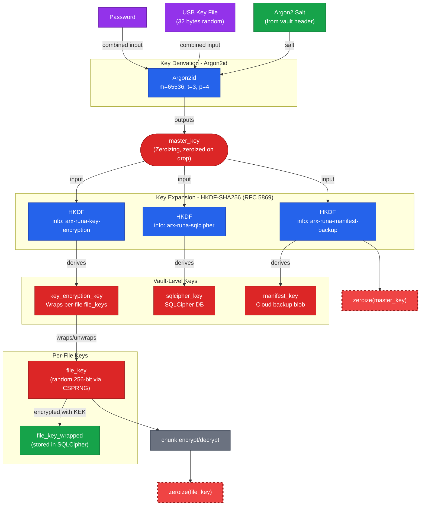

*Figur 6.1: Nøgleafledningstre for Arx Runa. Adgangskode og USB-nøglefil kombineres som input til Argon2id (m=65.536, t=3, p=4), der producerer master_key. HKDF-SHA256 ekspanderer master_key til tre vault-nøgler via domæneseparerede info-strenge. master_key zeroises lige efter HKDF-ekspansionen.*

### 6.3 Nøglehåndtering og vault-arkitektur

Vault-arkitekturen implementerer et KEK/DEK-hierarki (Key Encryption Key / Data Encryption Key) i overensstemmelse med NIST SP 800-57, §6.2 (NIST, 2020b). Princippet om begrænset eksponering betyder at kompromittering af én DEK kun berører den pågældende fils data og ikke propagerer til resten af vault'en.

#### Per-fil tilfældig nøgle

Hver fil tildeles en unik file_key genereret af en kryptografisk stærk tilfældighedsgenerator (CSPRNG). file_key bruges til XChaCha20-Poly1305-kryptering af filens chunks og lagres aldrig i klartekst. Den er krypteret (wrapped) med key_encryption_key og gemmes i SQLCipher-manifestet. Adgang til en fil kræver at vault'en er oplåst, og file_key er unwrapped just-in-time for kryptering eller dekryptering.

KEK/DEK-arkitekturen begrænser eksponeringsradius til den individuelle fil, muliggør per-fil nøglerotation og understøtter fildeling (kapitel 10) ved at sende én file_key i en HPKE-pakke, så vault-nøglen aldrig forlader enheden. LUKS2 og Linux fscrypt anvender samme mønster (Fruhwirth m.fl., u.å.; kernel.org, u.å.).

#### Krypteret manifest

sqlcipher_key krypterer hele SQLCipher-manifestet, som indeholder filnavne, chunk-referencer, metadata og wrapped file_keys. Ingen meningsfulde data lagres ukrypteret lokalt, og cloud-udbyderen modtager aldrig en kopi af sqlcipher_key. Manifestet er det lokale kilde til sandhed for vault'ens tilstand. Som redundant backup uploades manifestet krypteret til cloud under manifest_key (XChaCha20-Poly1305), så vault'en kan genskabes på en ny enhed uden adgang til den lokale database.

Nøgler der aldrig forlader enheden: master_key, key_encryption_key, sqlcipher_key, manifest_key og uindpakkede file_keys eksisterer udelukkende i RAM under en aktiv session og zeroises ved vault-lås.

### 6.4 Realisering i Arx Runa

Designvalgene realiseres i `src-tauri/src/crypto/`, struktureret med én fil pr. primitiv. `hkdf.rs` eksponerer `derive_vault_keys()` med tre HKDF-expand-kald, ét pr. nøgle med unik info-streng:

```rust
// src-tauri/src/crypto/hkdf.rs:10–65
pub(crate) const HKDF_SALT: &[u8] = b"arx-runa-v1";
pub(crate) const HKDF_INFO_KEY_ENCRYPTION: &[u8] = b"arx-runa-key-encryption";
pub(crate) const HKDF_INFO_SQLCIPHER: &[u8] = b"arx-runa-sqlcipher";
pub(crate) const HKDF_INFO_MANIFEST_BACKUP: &[u8] = b"arx-runa-manifest-backup";
// ...
pub fn derive_vault_keys(master_key_bytes: &[u8; 32]) -> Result<VaultKeys, CryptoError> {
    Ok(VaultKeys {
        key_encryption_key: KeyEncryptionKey::from_secret_box(expand_into_secret_box(
            master_key_bytes,
            HKDF_INFO_KEY_ENCRYPTION,
        )?),
        sqlcipher_key: SqlcipherKey::from_secret_box(expand_into_secret_box(
            master_key_bytes,
            HKDF_INFO_SQLCIPHER,
        )?),
        manifest_key: ManifestKey::from_secret_box(expand_into_secret_box(
            master_key_bytes,
            HKDF_INFO_MANIFEST_BACKUP,
        )?),
    })
}
```

`encrypt_chunk.rs` bygger wire-format `[nonce | ciphertext | tag]` med AAD bundet til `file_id || chunk_index`:

```rust
// src-tauri/src/crypto/encrypt_chunk.rs:30–52
pub fn encrypt_chunk(
    mut plaintext: Zeroizing<Vec<u8>>,
    file_key: &FileKey,
    file_id: &FileId,
    chunk_index: ChunkIndex,
) -> Result<Vec<u8>, CryptoError> {
    let nonce_bytes = generate_nonce();
    let aad = build_chunk_aad(file_id, chunk_index);

    let cipher = XChaCha20Poly1305::new(GenericArray::from_slice(file_key.expose()));
    let nonce = GenericArray::from_slice(&nonce_bytes);

    let tag = match cipher.encrypt_in_place_detached(nonce, &aad, plaintext.as_mut_slice()) {
        Ok(value) => value,
        Err(_) => return Err(CryptoError::EncryptionFailed),
    };

    let mut blob = Vec::with_capacity(24 + plaintext.len() + 16);
    blob.extend_from_slice(&nonce_bytes);
    blob.extend_from_slice(&plaintext);
    blob.extend_from_slice(tag.as_slice());
    Ok(blob)
}
```

`wrap_key.rs` anvender identisk mønster med `key_encryption_key` og `file_id` som AAD til at wrap/unwrap `file_keys`. Nøgletyperne i `types/mod.rs` bærer `ZeroizeOnDrop` og `SecretBox<T>`^[`SecretBox<T>` fra `secrecy`-cratet: redacter `Debug`-output og kræver `expose()`-kald for adgang til bytes. Forhindrer utilsigtet logning af nøglemateriale; se §9.2.] for Debug-redaction:

```rust
// src-tauri/src/crypto/types/mod.rs:7–51
#[derive(ZeroizeOnDrop)]
pub struct FileKey(SecretBox<[u8; 32]>);
// ...
#[derive(ZeroizeOnDrop)]
pub struct KeyEncryptionKey(SecretBox<[u8; 32]>);
```

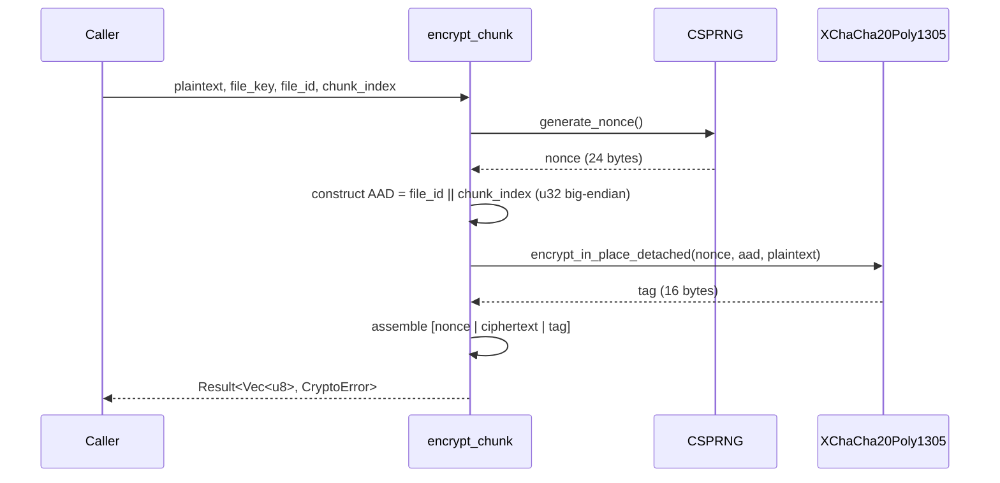

*Figur 6.2: Krypteringsflow for ét chunk.*

Unit-tests dækker AEAD round-trip og forkert-nøgle-fejl; property-based tests via `proptest` udvider inputrummet på AAD og plaintextstørrelse.

> **Delkonklusion - Underspørgsmål 1:** XChaCha20-Poly1305 eliminerer nonce-kollisionsrisikoen ved enhver praktisk vault-størrelse og er hardware-uafhængig. Argon2id med RFC 9106-parametrene gør brute-force hukommelsesintensivt og GPU-resistent. HKDF-SHA256 separerer vault-nøglerne kryptografisk, så kompromittering af én nøgle ikke propagerer til de øvrige. Per-fil tilfældig nøgle med KEK/DEK-hierarki begrænser eksponeringsradius til den individuelle fil. Samlet modsvarer arkitekturen trusselsmodellens krav (§5.4): cloud-udbyderen modtager udelukkende opaque ciphertext-blobs, og ingen del af nøglehierarkiet forlader klientens RAM under en aktiv session.

---

## 7. Analyse og Realisering: Hardware-faktor og offline recovery

Dette kapitel undersøger Underspørgsmål 2. Hvordan kan en fysisk USB-nøglefil integreres som obligatorisk anden faktor, og hvordan kan offline BIP-39 recovery muliggøre brugerstyret gendannelse af credentials uden at delegere tillid?

### 7.1 Tier-model for autentificering

Adgangskodebaseret autentificering har den fundamentale svaghed, at én faktor er ét angrebspunkt. Et kompromitteret password giver fuld adgang, og angriberen behøver ikke bryde krypteringen direkte. NIST SP 800-63B definerer tre Authenticator Assurance Levels (AAL1–AAL3), der graduerer kravet til autentificering efter risikoprofil (NIST, 2017). AAL1 tillader enkeltfaktor, mens AAL2 kræver to uafhængige faktorer fra forskellige kategorier, typisk en vidensbaseret (password) og en besiddelsesbaseret (hardware token).

Arx Runa implementerer to autentificeringsniveauer svarende til disse trin. Tier 1 anvender kun adgangskode (AAL1). Tier 2 kræver adgangskode kombineret med en USB-nøglefil (AAL2, REQ-AUTH-001). Den afgørende designbeslutning er, at de to faktorer ikke er koblet som separate valideringstrin, men kombineres til ét samlet KDF-input. Tier 1-afledningen er:

`master_key = Argon2id(password_bytes, salt)`

Tier 2-afledningen er:

`master_key = Argon2id(password_bytes || key_file_bytes, salt)`

Konkatenering er entydigt fordi key_file_bytes altid er præcis 32 bytes (REQ-AUTH-008). Et forkert password producerer en anden master_key. En forkert key_file producerer ligeledes en anden master_key. Ingen faktor er tilstrækkelig alene (REQ-AUTH-003, REQ-AUTH-004, REQ-AUTH-005).

Som besiddelsesfaktor overvejedes FIDO2/WebAuthn og TOTP som alternativer til USB-nøglefilen. Begge er forkastet af strukturelle årsager. FIDO2/WebAuthn (FIDO Alliance, 2019) producerer en session-unik signatur, ikke reproducérbart nøglemateriale, og Argon2id kræver identisk input på tværs af sessioner. TOTP (RFC 6238) har et cirkulæritetsproblem: den delte hemmelighed `K` kan ikke lagres sikkert i en lokal ZK-applikation. Lagres `K` inden i vault'en, er verificering kun mulig efter åbning. Lagres `K` i klartekst udenfor, er den tilgængelig for angriberen (NIST SP 800-63B, 2017). USB-nøglefilen løser besiddelsesfaktoren (*something you have*) uden disse begrænsninger.

### 7.2 USB-nøglefil: design og angrebsovervejelser

En USB-nøglefil er 32 bytes genereret af CSPRNG^[CSPRNG: Cryptographically Secure Pseudo-Random Number Generator; OS-leveret tilfældighedskilde (`getrandom` på Linux, `BCryptGenRandom` på Windows).] (`rand::rng().fill_bytes()`) ved vault-oprettelse (REQ-AUTH-008). Filen har ingen intern struktur, ingen versionsbyte og intet enheds-id, den er ren tilfældig entropi svarende til 256 bits og samme størrelse som en X25519 privat nøgle. Brugeren kan navngive filen og placere den frit på drevet. I `auth/ceremonies/create.rs` genereres bufferen som `Zeroizing<[u8; 32]>`, skrives til drevet med owner-only rettigheder og hashes med BLAKE3 til fingeraftryk.

BLAKE3-hashen er et offentligt verificeringstegn (O'Connor et al., 2019). Den er preimage-resistent, så kendskab til hashen ikke giver information om de 32 bytes, der producerede den. Hashen lagres i klartext i vault-headeren fordi bootstrapping af autentificering kræver den, og den afslører intet om nøglefilens indhold.

Brugeren behøver ikke navigere manuelt til nøglefilen. Arx Runa overvåger OS-native mount-events og scanner det tilsluttede drev automatisk ved indsætning (REQ-AUTH-010, REQ-AUTH-012). Figur 7.1 illustrerer forløbet fra USB-tilslutning til åben session.

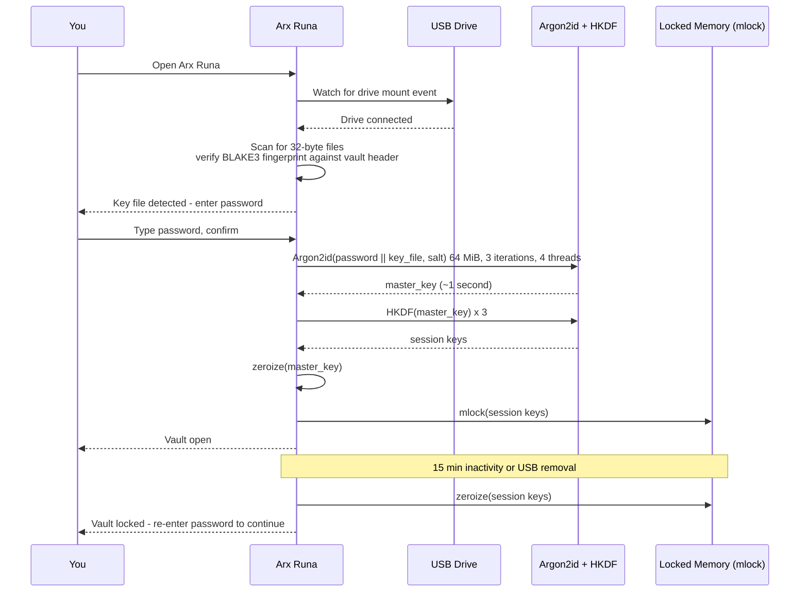

*Figur 7.1: Unlock-flow for Tier 2-vault. USB-tilslutning udløser BLAKE3-scanning, og et match starter Argon2id-derivation, hvorefter session keys mlockes. Timeout eller USB-fjernelse zeroizer alle nøgler.*

Scanningsalgoritmen i `auth/autodetect.rs` filtrerer på 32-byte filstørrelse og verificerer med `blake3::hash(...).ct_eq(...)` — constant-time sammenligning der forhindrer timing-sidekanalangreb mod BLAKE3-verifikationen.

Tabel 7.1 opsummerer angrebsscenarier mod hardware-faktoren.

| Scenario | Trussel | Modforanstaltning |
|----------|---------|-------------------|
| USB stjålet | Angriber besidder key_file, intet password | Argon2id kræver begge faktorer; password alene er utilstrækkeligt |
| USB mistet permanent | Bruger mister hardware-faktor | BIP-39-frasen muliggør re-keying med frasen som eneste faktor |
| USB kopieret digitalt | Angriber har key_file-bytes | Samme risiko som stjålet USB; kræver stadig password |
*Tabel 7.1: Angrebsscenarier for USB-nøglefil og tilhørende modforanstaltninger. Fysisk besiddelse er en sikkerhedspræmis, så systemet kræver to separate kompromiser for at en angriber får adgang.*

Sikkerhedsargumentet er at de to faktorer er uafhængige, så en angriber både skal kompromittere adgangskoden og besidde den fysiske USB-nøglefil.

### 7.3 BIP-39 offline recovery

Mistes USB-drevet permanent, er vault-data varigt utilgængeligt. En recovery-mekanisme er nødvendig, men må ikke delegere tillid til en tredjepart.

Tabel 7.2 sammenligner de tre primære recovery-alternativer.

| Alternativ | Tillidsproblem |
|------------|----------------|
| Server-side key escrow | Kræver tillid til server: kompromittering, legal seizure (CLOUD Act) eller driftsnedlukning eksponerer master_key |
| Social recovery via Shamir's Secret Sharing | Kræver tillid til N kontakter: social engineering-angrebsflade; ét share-sæt er tilstrækkeligt til kompromittering |
| Email-baseret reset | Kræver tillid til email-udbyder og identity provider; begge tredjeparter er CLOUD Act-eksponerede |

*Tabel 7.2: Recovery-alternativer med tilhørende tillidsproblemer. Kildegrundlag: U.S. Congress (2018) for CLOUD Act; Shamir (1979) for secret sharing. Alle tre alternativer kræver delegation af tillid til en tredjepart.*

BIP-39 (Palatinus et al., 2013) koder 256 bits entropi som 24 ord med 8-bit checksum til fejldetektering. Ordliste-enkodning er mere fejltolerant end hex ved manuel afskrivning.

Recovery-slottet er en kryptografisk indpakket kopi af master_key lagret i vault-headeren i skyen. Figur 7.2 illustrerer konstruktionen.

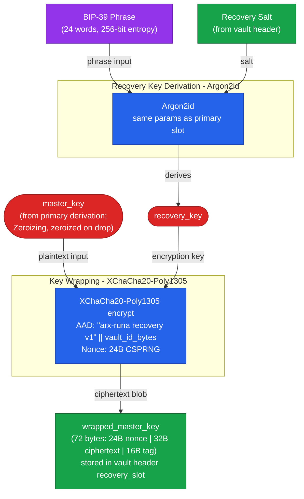

*Figur 7.2: Recovery slot-konstruktion. BIP-39-frasen ekspanderes af Argon2id til en recovery_key, der wrapper master_key med XChaCha20-Poly1305 og vault_id som AAD.*

Listing 7.3 viser implementeringen i `setup_recovery.rs`:

```rust
// src-tauri/src/auth/ceremonies/setup_recovery.rs:75–99
let mut entropy: Zeroizing<[u8; 32]> = Zeroizing::new([0u8; 32]);
rand::rng().fill_bytes(entropy.as_mut_slice());
let mnemonic = Mnemonic::from_entropy_in(Language::English, entropy.as_slice())
    .map_err(|_| AuthenticationError::VaultHeaderInvalid)?;
let phrase_string = canonicalize_phrase(&mnemonic);
drop(entropy);

let mut recovery_salt: Zeroizing<[u8; 32]> = Zeroizing::new([0u8; 32]);
rand::rng().fill_bytes(recovery_salt.as_mut_slice());
let mut recovery_key_bytes: Zeroizing<[u8; 32]> = Zeroizing::new([0u8; 32]);
derive_recovery_key_into(
    phrase_string.as_bytes(),
    &recovery_salt,
    &current_params,
    &mut recovery_key_bytes,
)?;
let recovery_key = recovery_key_from_array(&recovery_key_bytes);
drop(recovery_key_bytes);

let master_key_typed = master_key_from_array(&master_key);
let wrapped = wrap_master_key_for_recovery(&master_key_typed, &recovery_key, vault_id)
    .map_err(|_| AuthenticationError::VaultHeaderInvalid)?;
drop(master_key_typed);
drop(recovery_key);
```

*Listing 7.3: BIP-39 mnemonic-generering og slot-wrap (`setup_recovery.rs:75–99`). Entropi, recovery_key_bytes og master_key_typed zeroizes eksplicit. Master_key indpakkes med vault_id som AAD.*

Listing 7.4 viser slot-iteration ved recovery:

```rust
// src-tauri/src/auth/ceremonies/recover_with_phrase.rs:77–109
for slot in header.recovery_slots.iter() {
    if slot.method != "bip39" { continue; }
    let slot_salt = decode_base64_32(&slot.argon2_salt)?;
    let slot_params = argon2_parameters_from_json(&slot.argon2_params);
    let wrapped = WrappedMasterKey::new(decode_base64_72(&slot.wrapped_master_key)?);

    let mut recovery_key_bytes: Zeroizing<[u8; 32]> = Zeroizing::new([0u8; 32]);
    derive_recovery_key_into(
        canonical.as_bytes(),
        &slot_salt,
        &slot_params,
        &mut recovery_key_bytes,
    )?;
    let recovery_key = recovery_key_from_array(&recovery_key_bytes);
    drop(recovery_key_bytes);
    match unwrap_master_key_from_recovery(&wrapped, &recovery_key, &vault_id) {
        Ok(master_key_typed) => {
            let mut bytes: Zeroizing<[u8; 32]> = Zeroizing::new([0u8; 32]);
            master_key_typed.with_exposed(|exposed| bytes.copy_from_slice(exposed));
            recovered_master_key = Some(bytes);
            break;
        }
        Err(_) => { drop(recovery_key); }   // næste slot; ingen oracle-information
    }
}
```

*Listing 7.4: Slot-iteration i `recover_with_phrase.rs`. Slot-salt og wrapped_master_key dekodes fra vault-headerens base64. En forkert phrase producerer `Err(_)` fra AEAD-laget med non-orakulær fejlsemantik.*

Recovery-slot bruger identiske Argon2id-parametre som primær-slot (m=65536 KiB, t=3, p=4) for slot-indistinguishability, så en angriber ikke kan skelne recovery-salt fra primær-salt i vault-headeren. Phrasen forbliver gyldig på tværs af password-rotationer.

Offline betegner her at recovery er service-uafhængig. Vault-headeren og BIP-39-frasen er de eneste forudsætninger; ingen Arx Runa-infrastruktur eller tredjepartsudbyder kontaktes under ceremonien.

### 7.4 Realisering i Arx Runa

Tier-modellen, USB-nøglefilen og BIP-39-recovery er realiseret i `src-tauri/src/auth/`. KDF-input-konstruktionen udtrykker tier-skelnet via `Option<&[u8; 32]>`:

```rust
// src-tauri/src/auth/kdf.rs:41–71
pub(crate) fn derive_master_key_into(
    password_utf8_bytes: &[u8],
    key_file_bytes: Option<&[u8; KEY_FILE_LENGTH_BYTES]>,
    salt: &[u8; 32],
    parameters: &Argon2Params,
    output: &mut [u8; MASTER_KEY_LENGTH_BYTES],
) -> Result<(), AuthenticationError> {
    let combined_input_length =
        password_utf8_bytes.len() + key_file_bytes.map_or(0, |_| KEY_FILE_LENGTH_BYTES);
    let mut combined_input: Zeroizing<Vec<u8>> =
        Zeroizing::new(Vec::with_capacity(combined_input_length));
    combined_input.extend_from_slice(password_utf8_bytes);
    if let Some(bytes) = key_file_bytes {
        combined_input.extend_from_slice(bytes);
    }

    let argon2_params = Params::new(
        parameters.memory_cost_kib,
        parameters.time_cost,
        parameters.parallelism,
        Some(MASTER_KEY_LENGTH_BYTES),
    )
    .map_err(|_| AuthenticationError::InvalidCredentials)?;

    let argon2 = Argon2::new(Algorithm::Argon2id, Version::V0x13, argon2_params);
    argon2
        .hash_password_into(&combined_input, salt, output)
        .map_err(|_| AuthenticationError::InvalidCredentials)?;

    Ok(())
}
```

*Listing 7.5: `derive_master_key_into`. `None` = Tier 1; `Some(bytes)` = Tier 2 (password || key file).*

`DeviceMonitor`-trait'et deles af tre platformsimplementeringer (Windows, macOS, Linux) og en `MockDeviceMonitor` til test af auto-detektion uden fysisk USB-hardware.

Tre invarianter gennemføres i koden:

- Fejlsemantik er non-orakulær, så forkert password og forkert key file returnerer identisk fejl (REQ-AUTH-006).
- `mlock`-fejl er hård fejl, så ingen nøgle ender på swap (REQ-AUTH-014).
- Argon2id-parametre er skrivebeskyttede under aktiv vault (REQ-AUTH-009).

Testdækning i `scenarios_auth.rs` kører real Argon2id (m=1.024 KiB, t=1) og real SQLCipher for begge tiers og recovery end-to-end.

> **Delkonklusion - Underspørgsmål 2:** Tier 2-vaults giver brugeren en valgfri hardware-faktor ved oprettelse. Vælges Tier 2, konkateneres USB-nøglefilens 32 bytes direkte med adgangskoden som Argon2id-input, og ingen af de to faktorer er tilstrækkelige alene. FIDO2 fravælges fordi session-unik signatur er uforenelig med reproducibel nøgleafledning; TOTP fravælges fordi den delte hemmelighed `K` ikke kan lagres sikkert i et zero-knowledge-system (FIDO Alliance, 2019; NIST SP 800-63B, 2017). BIP-39 offline recovery eliminerer tillidsproblemet ved server-side escrow og social recovery: master_key indpakkes under en Argon2id-afledt recovery_key, og den 24-ords phrase vises én gang og gemmes aldrig af systemet (Palatinus et al., 2013). Jf. trusselsmodellen (§5.4) kræver kompromittering af en Tier 2-vault to uafhængige angrebsvektorer (adgangskode og fysisk USB-besiddelse), og recovery er fuldt brugerstyret og offline uden tredjepart.

---

## 8. Analyse og Realisering: Chunking, synkronisering og provider-agnostisk storage

Underspørgsmål 3 om chunking, synkronisering og provider-agnostisk storage behandles her. Cloud-udbyderen modtager samtlige lagrede blobs og observerer størrelser og adgangsmønstre, så kryptering af indhold ikke er tilstrækkeligt alene. Analysen gennemgår fem delproblemer: blobnavngivning og vault-struktur, chunk-formatering og padding, manifest-kryptering, provider-agnostisk transport og synkroniseringsprotokol.

### 8.1 Metadata-obfuskering: blobnavngivning og vault-struktur

Cloud-udbyderen modtager samtlige uploadede objekter og kan observere navne, antal og relativ størrelse. Filnavne, mappestrukturer og inkrementelle ændringsmønstre er metadata, der lækkes til udbyderen, medmindre de aktivt skjules.

Arx Runa anvender tilfældigt genererede UUID-strenge som blobnavne for krypterede chunks. Cloud-udbyderen observerer N navngivne ciphertext-objekter uden relation til det originale filnavn, mappeplacering eller indholdstype (REQ-VAULT-007) og har ingen mulighed for at korrelere navne med filnavne eller mappestruktur. Manifest-backuppen udgør en undtagelse: den lagres under det faste navn `manifest/manifest-backup.blob`, hvilket er nødvendigt for at enhver autentificeret enhed kan lokalisere og gendanne vault'ens tilstand uden forudgående lokal kopi.

Den eneste klartekstfil i den uploadede vault er `vault-header.json`. Headeren indeholder udelukkende offentlige parametre: Argon2id-salt, algoritmeidentifikatorer og et BLAKE3-fingeraftryk af USB-nøglefilen ved Tier-2-autentificering. Intet nøglemateriale, intet filnavn og ingen strukturinformation indgår. Headeren er nødvendig for at en ny enhed kan starte autentificeringen uden forudgående kontakt med vault'en.

| Navngivningsstrategi | Eksempel | Metadatalæk | Valgt |
|---|---|---|---|
| Originalt filnavn | `rapport.pdf.enc` | Filnavn, extension, mappenavn | Nej |
| Hash af filnavn | `SHA256(navn).enc` | Deterministisk, korrelérbar ved genkryptering | Nej |
| Krypteret filnavn | `AEAD(navn, key)` | Blob-til-fil-korrelation; størrelse eksponeret | Nej |
| Tilfældig UUID | `3f8a2c1d...blob` | Ingen inference | Ja |

*Tabel 8.1: Blobnavngivningsstrategier og deres metadataafsløring. Krypterede filnavne er forkastet fordi blob-størrelsen stadig afslører størrelsesinterval-information, og fordi en deterministisk mapping fra filnavn til blobnavn kan afsløre ændringsmønstre over tid.*

### 8.2 Chunking-strategi og padding

Selv med UUID-blobnavne lækker blob-størrelse filstørrelsesinformation. En fil på 30 MiB producerer et forudsigeligt antal blobs, og cloud-udbyderens observation af blob-antallet afgrænser filstørrelses-intervallet. Det er en iboende egenskab ved enhver opdeling af filer til cloud-lagring, men konsekvenserne varierer med valget af chunk-paradigme.

| Paradigme | Fordel | Ulempe | Valgt |
|---|---|---|---|
| Fast størrelse | Størrelsesinfrence til ét interval; ingen størrelses-fingeraftryk | Padding-overhead for korte filer: op til 88% for en 500 KB fil ved 4 MiB chunk (Nikitin m.fl., 2019) | Ja (standard) |
| Padmé (variabel med begrænset læk) | Max 12% overhead; lækker kun O(log log M) bit pr. fil (Nikitin m.fl., 2019) | Blobs ikke uniform størrelse; adversary lærer præcis størrelsestier frem for ét interval | Nej |
| Bin-packing | Tæt på nul overhead ved mange korte filer; alle blobs uniform størrelse | Write amplification: sletning af én fil i et packed blob kræver dekryptering og genkryptering af hele blob | Nej |
| CDC (indholdsdefineret) | Deduplication-venlig | Samme problem som variabel størrelse, men forstærket: indholdsdefinerede grænser giver reproducerbart blob-størrelsesmønster, der muliggør fil-fingerprinting (Alexeev m.fl., 2025; Truong m.fl., 2025) | Nej |
| Hybrid auto-routing (epoch buffering) | Tæt på nul overhead for filer under `chunk_size`; eliminerer timing-korrelation for disse; store filer uploades straks uden delay; alle blobs uniform størrelse | Kræver dual-mode manifest-opslag og soft-delete; opt-in | Ja (opt-in) |

*Tabel 8.2: Chunking-paradigmer. Kildegrundlag: Nikitin m.fl. (2019); Alexeev m.fl. (2025); Truong m.fl. (2025).*

Hybrid auto-routing fungerer ved at routingbeslutningen træffes på filstørrelse frem for chunk-type. Filer under `chunk_size_bytes` rutes til epoch-bufferen og pakkes med andre korte filer i ét blob ved flush. Filer over grænsen, inklusive afsluttende partial chunks, uploades som selvstændige blobs med det samme. Denne opdeling løser det problem, der gør ren bin-packing uegnet: i bin-packing kræver opdatering eller sletning af én fil dekryptering og genkryptering af hele blob (write amplification). I epoch-modellen håndteres sletning via soft-delete i manifest'et og kompaktering; det afsluttende chunk af store filer uploades straks, så backup aldrig er ufuldstændig for den pågældende fil. Klartekst skrives aldrig til disk: korte filer stages i SQLCipher, store filer krypteres chunk for chunk til staging-mappen.

Padmé (Nikitin m.fl., 2019) er det teoretisk optimale alternativ for storage-effektivitet med begrænset informationslæk og ville reducere overhead til max 12%. Den er fravalgt som primær løsning fordi variabel blob-størrelse giver adversary præcis størrelsesklassifikation frem for ét groft interval. Padmé er noteret som fremtidig opt-in i §12.3.

Arx Runa anvender fast chunk-størrelse default 4 MiB (128 KiB–64 MiB, immutabel efter vault-oprettelse, da ændring kræver fuld genkryptering, REQ-VAULT-002). Throughput: kryptering 4,04 ms (~989 MiB/s), dekryptering 4,85 ms (~825 MiB/s, Bilag D). Padding zero-padder det sidste chunk; filstørrelse gemmes krypteret i manifest'et. AAD er `file_id || chunk_index` (big-endian u32, REQ-CRYPTO-009), der binder chunk til position og forhindrer omplacering. Krypteringssekvensen pr. chunk er vist i Figur 6.2.

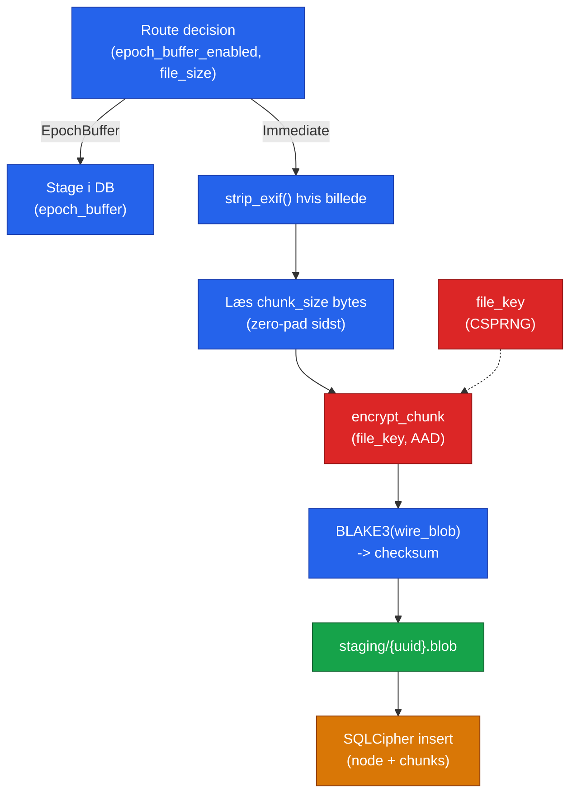

*Figur 8.1a: Krypteringssti. Route-beslutningen sender korte filer til epoch-bufferen og store filer direkte gennem EXIF-strip, chunking og kryptering til staging.*

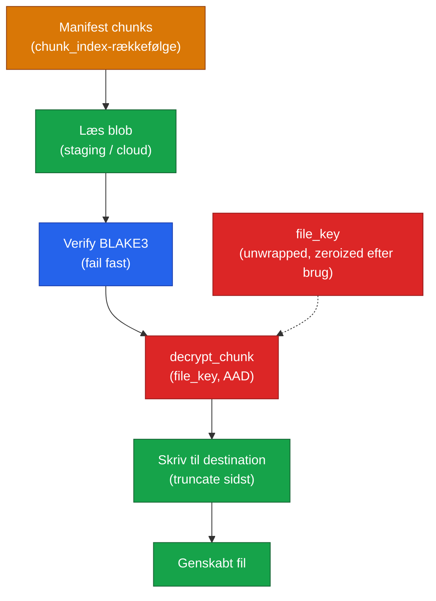

*Figur 8.1b: Dekrypteringssti. BLAKE3-verificering fejler fast ved mismatch inden dekryptering. `file_key` zeroises umiddelbart efter brug.*

### 8.3 Manifest-arkitektur

Manifest'et er vault'ens lokale kilde til sandhed og indeholder al meningsfuld metadata: filnavne, mappestruktur, chunk-referencer med BLAKE3-checksum, indpakkede filnøgler og synkroniseringsmetadata. Det er den eneste komponent, der holder meningsfuld information om brugerens filer.

Manifest'et er en SQLCipher-database krypteret med `sqlcipher_key` (HKDF, §6.2). Til cloud-synkronisering serialiseres det via `VACUUM INTO` og krypteres separat med `manifest_key`, så cloud-udbyderen modtager en opaque blob. `manifest_key`-kompartmentalisering fra `sqlcipher_key` følger NIST SP 800-57's nøgleseparerings-princip (NIST, 2020b).

Figur 8.2 viser relationsmodellen for kerneskemaet (`src-tauri/src/storage/schema.rs`).

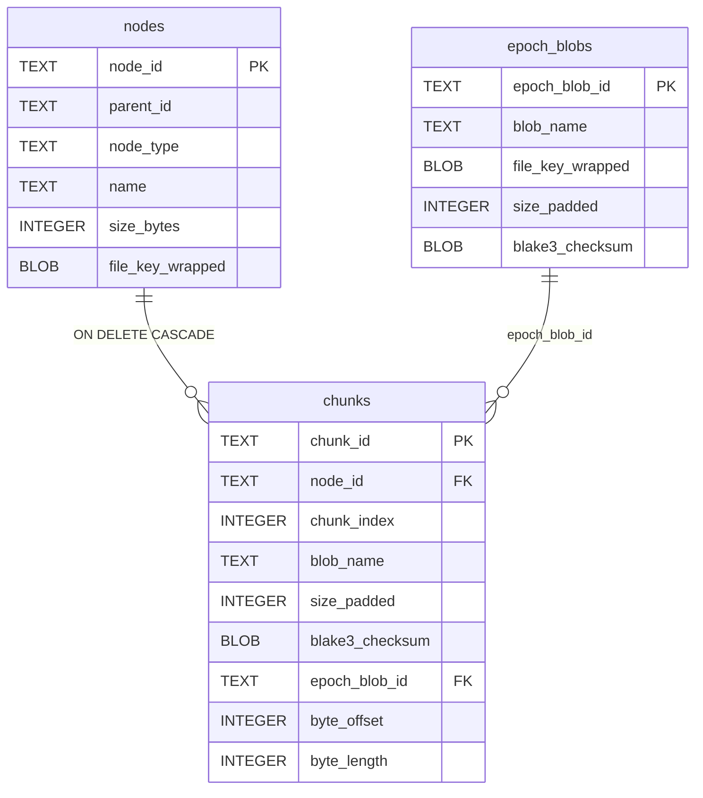

*Figur 8.2a: Kerneskema (schema v9). `parent_id` i `nodes` er en selvreference til samme tabel og udgør mappestrukturen. `epoch_blobs.file_key_wrapped` er nødvendig fordi ét epoch-blob kan indeholde chunks fra flere filer.*

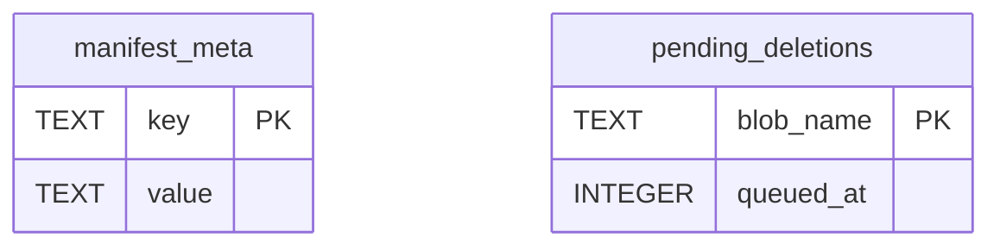

*Figur 8.2b: Støttetabeller uden FK-relationer. `manifest_meta` indeholder vault-parametre (schema_version, snapshot_counter, chunk_size_bytes m.fl.). `pending_deletions` er den udskudte cloud-sletningskø: blob-navne indskrives transaktionelt ved brugerinitiert sletning og drænes ved næste push.*

Skemaet håndhæver zero-knowledge-invarianterne direkte i DDL frem for udelukkende i applikationslogikken. `file_key_wrapped` placeres i `nodes` frem for i `chunks` fordi én nøgle pr. fil eliminerer N redundante kopier, og CASCADE-sletning fungerer korrekt. `blob_name` i `chunks` er et UUID v4 uden relation til filnavnet. Manifest'et er det eneste sted sammenhængen kendes, og det er krypteret. `UNIQUE(blob_name)` omsætter en UUID-kollision (statistisk negligibel) til en deterministisk insert-fejl frem for en lydløs overskrivning.

To constraints er centrale for korrekthed:

```sql
-- nodes: fil har altid nøgle; mappe har aldrig nøgle
CHECK ((node_type = 'file'      AND file_key_wrapped IS NOT NULL)
    OR (node_type = 'directory' AND file_key_wrapped IS NULL))

-- chunks: et chunk tilhører præcis én sti — standalone eller epoch
CHECK (
    (blob_name IS NOT NULL AND epoch_blob_id IS NULL
         AND byte_offset IS NULL AND byte_length IS NULL) OR
    (blob_name IS NULL AND epoch_blob_id IS NOT NULL
         AND byte_offset IS NOT NULL AND byte_length IS NOT NULL)
)
```

*Kode 8.1: DDL CHECK-constraints fra `schema.rs`. Den første fanger ufuldstændige node-rækker ved skrive-tid. Den anden håndhæver routing-invarianten fra §8.2: et chunk er enten standalone eller epoch-bufferet.*

### 8.4 Provider-agnostisk transport: Rclone sidecar-model

Tabel 8.4 viser de fire kandidattilgange til provider-agnostisk transport.

| Tilgang | Provider-lock-in | Primær risiko | Vedligeholdsbyrde |
|---|---|---|---|
| Direkte SDK (`aws-sdk-rust`) | Høj (én SDK pr. udbyder) | Ingen shell-injection | Høj |
| HTTP + provider API | Middel | Ingen shell-injection | Høj (manuel mapping) |
| Rclone sidecar | Ingen | Shell-injection ved usaniterede args | Lav |
| Rclone RC daemon | Ingen | HTTP mod localhost; ingen shell-injection | Lav — kræver fuld omskrivning af `rclone.rs` |
| FUSE-mount via Rclone | Ingen | OS-niveau privilegier | Kræver root/admin |

*Tabel 8.4: Cloud-transportstrategier. Rclone sidecar er valgt (REQ-SYNC-001); alle argumenter sendes som `Vec<OsString>` for at afværge shell-injection (REQ-SYNC-004).*

Rclone RC daemon-varianten blev identificeret efter den indledende implementering var færdig. I stedet for at spawne én subprocess pr. filoperationen kører RC daemon som en langlivet HTTP-server på `localhost:<ephemeral port>` og holder al konfiguration i hukommelsen. Det eliminerer det primære tilbageværende Zero-Trace-problem: den midlertidige `rclone.conf` der i sidecar-modellen skrives til disk ved sessionstart og overskrives ved sessionsafslutning (jf. §9.2). RC daemon-varianten kræver fuld omskrivning af `RcloneTransport` (~600 linjer), men `CloudTransport`-trait'en forbliver identisk, da grænsefladen er uændret. Omfanget oversteg hvad der var forsvarligt at introducere sent i projektet, og varianten er noteret som en fremtidig opgradering (§12.3).

`CloudTransport`-trait'en definerer den provider-agnostiske abstraktion:

```rust
// src-tauri/src/storage/cloud/mod.rs:80–99
#[async_trait]
pub trait CloudTransport: Send + Sync {
    async fn upload_blob(&self, local_path: &Path, remote_path: &str)
        -> Result<(), CloudTransportError>;
    async fn download_blob(&self, remote_path: &str, local_path: &Path)
        -> Result<(), CloudTransportError>;
    async fn delete_blob(&self, remote_path: &str)
        -> Result<(), CloudTransportError>;
    async fn list_blobs(&self, remote_prefix: &str)
        -> Result<Vec<String>, CloudTransportError>;
}
```

*Listing 8.1: `CloudTransport`-trait. `RcloneTransport` i produktion; in-memory mock i tests.*

Rclone-processerne modtager aldrig klartekst, kun krypterede staging-blobs. Vault-credentials krypteres i SQLCipher. Under sync genereres en midlertidig `rclone.conf` på disk med session-credentials for den aktive destination: OAuth2-tokens ved Google Drive og OneDrive, eller statiske nøgler ved S3 og Backblaze B2. Filen overskrives og slettes ved vault-lås. Diskskrivningen er det primære tilbageværende Zero-Trace-forbehold for transportlaget; RC daemon-varianten (§8.4, §12.3) eliminerer den strukturelt.

### 8.5 Synkroniseringsprotokol og konsistensgaranti

Synkronisering introducerer et distribueret konsistensproblem, hvor to enheder kan foretage lokale ændringer offline og forsøge at uploade concurrently. Merge-baserede tilgange kræver adgang til det dekrypterede filindhold for at løse konflikter, hvilket er strukturelt umuligt i en E2EE-kontekst. Arx Runa anvender i stedet en monoton snapshot-tæller (REQ-VAULT-006): `cloud_counter == local_counter` tillader push; `cloud_counter > local_counter` kræver pull-first; `cloud_counter < local_counter` afbryder for at forhindre rollback. Push shuffler blob-listen via Fisher-Yates, uploader op til fire blobs parallelt og uploader manifest-backup sidst (idempotent).

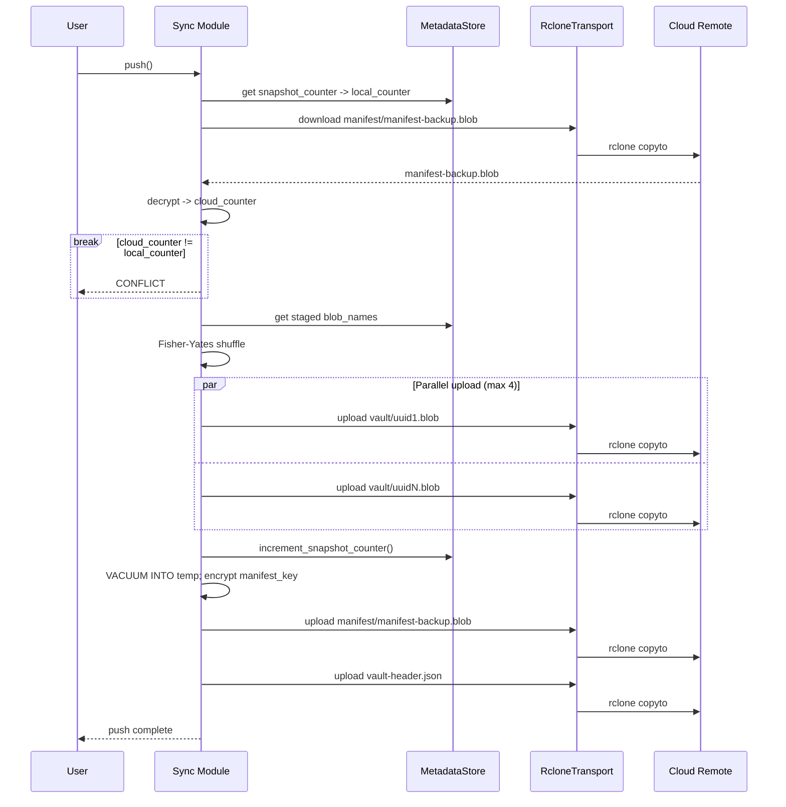

*Figur 8.3: Push-flow. Snapshot-tæller sammenlignes med cloud-kopien; ved konflikt afbrydes; blobs uploades parallelt; manifest-backup uploades sidst (idempotent).*

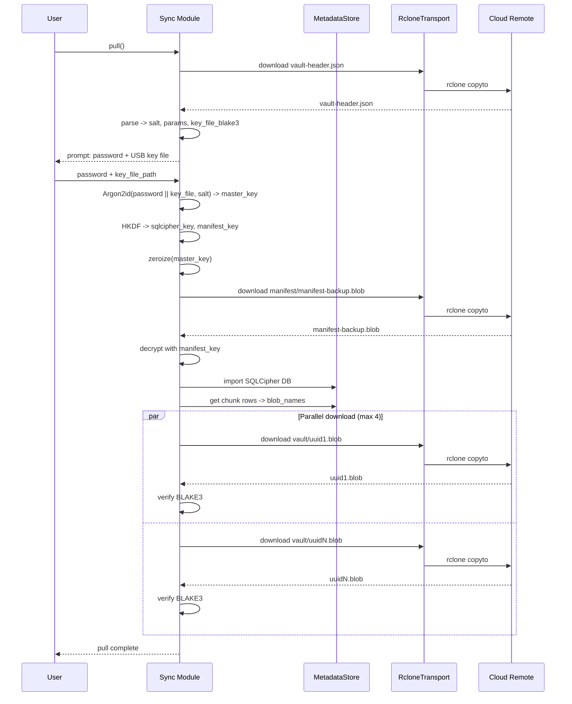

*Figur 8.4: Pull-flow (ny-enhed recovery). Vault-header hentes og bruges til nøgleafledning; manifest-backup dekrypteres og importeres; alle blobs downloades og BLAKE3-verificeres.*

### 8.6 Realisering i Arx Runa

Chunking-pipelinen er realiseret i `storage/pipeline/` (`encrypt_file`, `decrypt_file`), manifest i `storage/sqlcipher.rs` og synkronisering i `storage/cloud/sync.rs`. Listing 8.2 viser UUID-blobnavngivning og zero-padding i `encrypt_file_inner()`:

```rust
// src-tauri/src/storage/pipeline/encrypt_file.rs:95–129
let mut plaintext = Zeroizing::new(vec![0u8; chunk_size_usize]);
let bytes_read = read_chunk_plaintext(&mut source_reader, plaintext.as_mut_slice()).await?;
if bytes_read == 0 && chunk_index == 0 {
    return Ok(chunk_records);
}
if bytes_read == 0 { break; }
let wire_blob = encrypt_chunk(
    plaintext, file_key, &crypto_file_id, ChunkIndex::new(chunk_index),
)
.map_err(StorageError::from)?;
let checksum = compute_checksum(&wire_blob);
let blob_name = Uuid::new_v4().hyphenated().to_string();
staged_blob_names.push(blob_name.clone());
write_blob_file(staging_directory, &blob_name, &wire_blob).await?;
// ...
chunk_records.push(ChunkRecord {
    chunk_id: Uuid::new_v4(),
    blob_name,
    size_padded: chunk_size_bytes,
    // ...
});
```

*Listing 8.2: UUID-blobnavngivning og zero-padding i `encrypt_file_inner()`.*

```rust
// src-tauri/src/storage/vault_ops/routing.rs:11–17
pub fn decide(file_size: u64, chunk_size_bytes: u64, epoch_enabled: bool) -> RouteDecision {
    if epoch_enabled && file_size < chunk_size_bytes {
        RouteDecision::EpochBuffer
    } else {
        RouteDecision::Immediate
    }
}
```

*Listing 8.3: Routing-funktionen. Filer præcis på grænsen rutes til den selvstændige sti.*

```rust
// src-tauri/src/storage/vault_ops/upload_file.rs:80–158 (forkortet)
match decide(file_size, chunk_size_bytes, epoch_buffer_enabled) {
    RouteDecision::EpochBuffer => {
        let plaintext: Zeroizing<Vec<u8>> = Zeroizing::new(
            tokio::fs::read(source).await?
        );
        metadata_store
            .insert_file_node_and_stage_epoch_entry(&node, plaintext)
            .await?;
        Ok(node)
    }
    RouteDecision::Immediate => {
        let file_key = generate_file_key();
        let wrapped_file_key = wrap_file_key(&file_key, &FileId::from_uuid(node_id), kek)?;
        let chunks = pipeline::encrypt_file(
            source, node_id, &file_key, metadata_store, staging_directory, progress,
        ).await?;
        metadata_store.insert_file_with_chunks(&node, &chunks).await?;
        Ok(node)
    }
}
```

*Listing 8.4: De to routing-stier. Epoch-stien gemmer plaintext som `Zeroizing`-buffer i SQLCipher. Den selvstændige sti genererer en `file_key` og krypterer chunk for chunk til stagingmappen.*

```rust
// src-tauri/src/storage/vault_ops/epoch_flush.rs:94–153 (forkortet)
let mut packed: Zeroizing<Vec<u8>> = Zeroizing::new(Vec::new());
let mut extents: Vec<(Uuid, u32, u64, u64)> = Vec::new();

for (node_id, plaintext) in entries {
    let byte_offset = packed.len() as u64;
    let byte_length = plaintext.len() as u64;
    packed.extend_from_slice(plaintext);
    extents.push((*node_id, 0u32, byte_offset, byte_length));
}

// Zero-pad til præcis chunk_size_bytes
if packed.len() < chunk_size_usize {
    packed.resize(chunk_size_usize, 0u8);
}

let encrypted = encrypt_chunk(
    packed, &file_key, &FileId::from_uuid(epoch_blob_id), ChunkIndex::new(0)
)?;
tokio::fs::write(blob_path, &encrypted).await?;
metadata_store.commit_epoch_flush(&record, &extents).await?;
```

*Listing 8.5: Epoch-flush. Staged plaintexts pakkes og zero-paddes til fuld chunk-størrelse, krypteres til ét blob, og extents committes atomisk med manifest-rækkerne.*

---

> **Delkonklusion - Underspørgsmål 3:** Chunks lagres under UUID v4-blobnavne uden relation til filnavn eller mappestruktur (REQ-VAULT-007); manifest-backuppen lagres under det faste navn `manifest/manifest-backup.blob` så enhver enhed kan gendanne vault'en. Fast chunk-størrelse med zero-padding begrænser størrelsesinfrence til ét interval; hybrid auto-routing (opt-in) eliminerer padding-overhead for filer under `chunk_size_bytes` uden at bryde uniform blob-størrelse. Manifest krypteres med en HKDF-afledt `manifest_key` adskilt fra `sqlcipher_key` (NIST SP 800-57, NIST, 2020b). Rclone sidecar giver provider-agnosticitet; shell-injection afværges via `Vec<OsString>` (REQ-SYNC-004). Monoton snapshot-tæller er tilstrækkelig i en enkelt-primær-vault-model. Cloud-udbyderen modtager alene navnløse, fast-størrelse ciphertext-blobs uden filsystemsemantik eller nøglemateriale.


## 9. Analyse og Realisering: Zero-Trace operation og RAM-baseret UI

Underspørgsmål 4 handler om Zero-Trace-drift. Hvordan kan en RAM-baseret UI sikre at dekrypteret indhold aldrig skrives til disk, og hvilke forensiske spor forbliver efter vault-låsning? Analysen er opdelt i trusselsbillede og scope (§9.1), nøglemateriale i hukommelse (§9.2), session-livscyklus (§9.3) og RAM-baseret filvisning (§9.4).

### 9.1 Zero-Trace: trusselsbillede og scope

Trusselsmodellen i §5.4 identificerer en fysisk angriber med adgang til en låst maskine som en primær trussel. Angriberen har adgang til disk-artefakter efterladt af applikationen, men ingen aktiv session. Zero-Trace er det overordnede designprincip der minimerer disse artefakter til det forensisk insignifikante.

Tre kategorier af utilsigtet persistens udgør truslen:

- OS-swap kan persistere heap-allokerede nøgler til `pagefile.sys` eller `swap`.
- Filvisning via temp-filer efterlader disk-artefakter.
- WebView kan persistere session-IDs i `localStorage`.

### 9.2 Kryptografisk nøglemateriale og hukommelseslåsning

#### Alternativvurdering

Fire tilgange til nøglebeskyttelse mod OS-swap er vurderet:

| Alternativ | Vurdering | Valgt |
|---|---|---|
| Soft-fail (advar, fortsæt) | Stille degradering. Nøgler kan skrives til swap uden brugerens viden, hvilket bryder zero-knowledge-løftet | Nej |
| `mlockall` (lås hele procesrummet) | Låser kode, stak og heap. Medfører betydeligt hukommelsesforbrug og overskrider realistiske RLIMIT-grænser | Nej |
| `memsec`-crate (`malloc_secure`) | Kombinerer mlock og allokering i ét kald, men tilføjer en ekstra afhængighed. Feltvis `mlock` med `ZeroizeOnDrop` er mere transparent og sammensætbar | Nej |
| `mlock`/`VirtualLock` | Forhindrer swap på alle tre målplatforme med feltvis granularitet og uden ekstra afhængighed | Ja |

*Tabel 9.1: Alternativvurdering for nøglebeskyttelse mod OS-swap. Kildegrundlag: POSIX mlock(2); Windows VirtualLock API; NIST SP 800-57 Part 1 Rev 5.*

`mlock`/`VirtualLock` er valgt fordi det er den eneste tilgang der forhindrer swap på alle tre målplatforme (Windows, Linux, macOS) med feltvis granularitet og uden ekstra afhængighed. Fejler låsning, afbrydes autentificeringen med en hård fejl. En sikkerhedsapplikation der stille degraderer sin hukommelsesbeskyttelse kan ikke verificeres at opfylde sit eget sikkerhedsløfte. OpenSSH følger samme princip og nægter at starte `ssh-agent` hvis hukommelseslåsning fejler (NIST, 2020b) (REQ-AUTH-014).

`SecureBytes<N>` i `src-tauri/src/memory/secure_buffer.rs` er den kanoniske container for session-nøglers byte-indhold. Bufferen allokeres, låses og zeroizes i en samlet RAII-wrapper (ressource-acquisition is initialization: ressourcer erhverves ved konstruktion og frigives automatisk når objektet går ud af scope):

```rust
// src-tauri/src/memory/secure_buffer.rs:20–52
pub(crate) fn new() -> Result<Self, MemoryLockError> {
    let mut buffer: Box<[u8; N]> = Box::new([0u8; N]);
    // SAFETY: `buffer` is a live allocation of exactly `N` bytes.
    unsafe { platform::lock_memory(buffer.as_mut_ptr(), N) }?;
    Ok(Self { buffer })
}

impl<const N: usize> Drop for SecureBytes<N> {
    fn drop(&mut self) {
        self.buffer.as_mut().zeroize();
        // SAFETY: pointer/length match the prior successful `lock_memory` call.
        unsafe { platform::unlock_memory(self.buffer.as_mut_ptr(), N); }
    }
}
```

Fejler mlock, afbrydes autentificeringen med `AuthenticationError::MemoryLockFailed`. Der er ingen stille fallback. `SessionKeys`-felterne er mlocket via `SecureBytes<32>`. Øvrige nøgletyper (`FileKey`, `KeyEncryptionKey` m.fl.) nulstilles ved drop via `secrecy`-cratens `SecretBox<[u8; 32]>`, men er ikke mlocket:

```rust
// src-tauri/src/crypto/types/mod.rs:7–20
#[derive(ZeroizeOnDrop)]
pub struct KeyEncryptionKey(SecretBox<[u8; 32]>);
// ...
#[derive(ZeroizeOnDrop)]
pub struct FileKey(SecretBox<[u8; 32]>);
```

`SecretBox<T>` deaktiverer `Debug`-output og eksponerer bytes udelukkende via en `expose()`-callback, så råbyte-referencer ikke lever ud over kaldsrammen.

### 9.3 Session-livscyklus og automatisk låsning

Session-livscyklussen er modelleret som en tilstandsmaskine med tre tilstande (figur 9.1). `SessionKeys` er lagret i mlocked hukommelse udelukkende i tilstanden `Active` og zeroizes ved overgangen til `Expired` via `SecureBytes`, der i sin `Drop`-implementering kalder `zeroize()` efterfulgt af `munlock`.

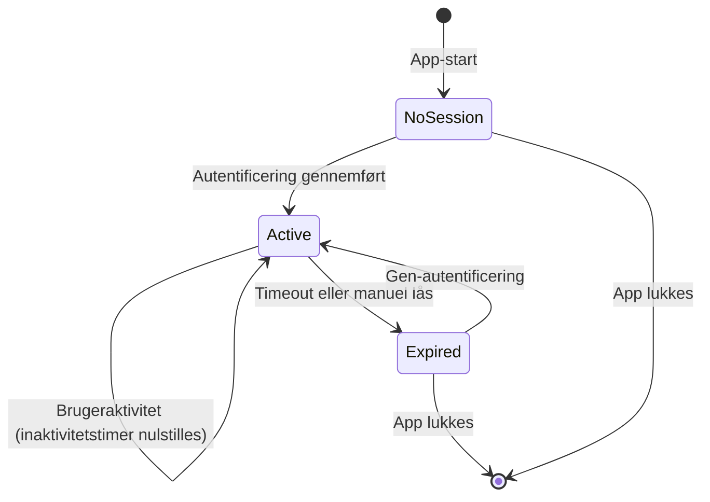

*Figur 9.1: Session-livscyklus i Arx Runa. `SessionKeys` er mlockede i tilstanden `Active` og zeroizes ved overgangen til `Expired`. En `TimeoutWarning { seconds_remaining }`-hændelse emittered via intern broadcast-kanal kort før automatisk lås.*

`SessionManager.lock()` lukker gaten via `fetch_or(GATE_CLOSED_FLAG)` på et atomisk `u32` der kombinerer gate-flag og operations-tæller:

```rust
// src-tauri/src/auth/session/manager.rs:23–24
const GATE_CLOSED_FLAG: u32 = 0x8000_0000;
const COUNTER_MASK: u32 = 0x7FFF_FFFF;
```

Nye IPC-operationer blokeres. `waiter.wait_for(|count| *count == 0)` venter til løbende operationer er færdige. Herefter eksekveres en ordnet nedlukning, hvor SQLCipher-forbindelsen droppes eksplicit, `rclone.conf` overskrives og slettes, og `SessionKeys` droppes som det absolutte sidste trin:

```rust
// src-tauri/src/auth/session/manager.rs:334–350
{
    let mut session_guard = self.session.write().await;
    if let Some(mut keys) = session_guard.take() {
        keys.metadata_store = None;       // frigiv SQLCipher-forbindelsen
    }
}
self.destroy_rclone_conf().await;         // overskriv og slet cloud-legitimationsoplysninger

{
    let mut session_guard = self.session.write().await;
    *session_guard = None;                // drop SessionKeys → zeroize + munlock
}
```

Rækkefølgen er intentionel: SQLCipher og `rclone.conf` håndteres mens sessionsnøglerne stadig er gyldige, og `SessionKeys` frigives som det allersidste, så ingen ressource kan tilgå nøgler efter zeroization.

### 9.4 RAM-baseret UI og in-app filvisning

Dekrypteret filindhold er en selvstændig Zero-Trace-risiko. To tilgange implementerer garantien for henholdsvis statisk og streamet indhold.

#### Sti A: `get_file_content`, statisk visning (maks. 50 MiB)

| Alternativ | Disk-touch | Hukommelsesisolation | Platform |
|---|---|---|---|
| Download til temp-fil | Ja | Ingen | Universal |
| Browser File API | Nej | Browser-sandbox | Web-only |
| Tauri asset-protokol | Potentielt | Begrænset | Tauri |
| `blob:` URL i WebView | Nej | WASM-hukommelse | Tauri/Chromium |
| `data:` URI / direkte tekstdekodning (valgt) | Nej | WASM-hukommelse | Tauri/Chromium |

*Tabel 9.2: Alternativer til in-app filvisning uden disk-touch.*

`get_file_content(file_id)` afviser filer over 50 MiB uanset MIME-type (`FIFTY_MIB` i `file_commands.rs`). Gyldige filer dekrypteres til `Zeroizing<Vec<u8>>`, base64-kodes og returneres. Frontend viser billeder som inline `data:`-URI og tekst i et `<pre>`-element. Signal-tilstanden nulstilles ved luk (Zero-Trace). Ingen plaintext berører disk (REQ-VAULT-009, REQ-UI-010). Store ikke-video-filer over grænsen kan kun ses ved at downloade til en bruger-valgt destination via `download_file`, hvilket forlader Zero-Trace-scopet og er brugerens informerede valg.

#### Sti B: `arxvault://` URI-scheme, video-streaming (ingen størrelsesgrænse)

Store videofiler kan ikke basekodes til RAM på én gang. Løsningen anvender HTTP Range Requests (Fielding et al., 2014) mod et Tauri-registreret URI-scheme:

```
arxvault://localhost/view/{file_id}       (macOS/Linux)
http://arxvault.localhost/view/{file_id}  (Windows)
```

Handleren i `video_stream.rs` dekrypterer kun de chunks der overlapper `Range: bytes=N-M`. Åbne range-anmodninger begrænses til 8 MiB (`MAX_RANGE_BYTES`); højst én Range-svarbuffer er i RAM ad gangen. En accepteret begrænsning ved Tauris URI-scheme-API er, at dekrypterede bytes kopieres til en plain `Vec<u8>` ved overdragelse til `ResponseBuilder::body()`. Tauri overtager ejerskabet, og zeroize er ikke mulig efter overdragelsen.

#### Frontend-tilstand og Zero-Trace-compliance

Al frontend-tilstand er holdt i Leptos-signaler (RAM), uden brug af `localStorage`, `sessionStorage` eller `IndexedDB` (REQ-UI-002). CSP deaktiverer service workers og ekstern script-eksekvering via `default-src 'self'`.

`SessionActions::clear()` i `src/state/session_context.rs` kaldes ved `SessionEvent::Locked` og nulstiller hele session-tilstanden til defaults i én atomisk signal-opdatering:

```rust
// src/state/session_context.rs:89–91
pub fn clear(self) {
    self.set_state.update(|s| *s = SessionState::default());
}
```

Password-feltet i login-formularen zeroizes straks efter IPC-kaldet, uanset succes eller fejl.

---

> **Delkonklusion - Underspørgsmål 4:** Zero-Trace opnås via tre adskilte lag. `mlock`/`VirtualLock` forhindrer at session-nøgler ender i swap eller hibernation. En atomisk session-gate med eksplicit `rclone.conf`-sletning minimerer credentials-vinduet på disk. RAM-only filvisning via inline `data:`-URI (billeder) og `arxvault://` Range-stream (video) eliminerer temp-filer og browser-caches. `SessionActions::clear()` ved `SessionEvent::Locked` sikrer ren browser-state efter vault-lock (REQ-UI-002). To undtagelser (video-frames i HTTP-handoff og OS crash dumps) er eksplicitte arkitektoniske begrænsninger.

## 10. Analyse og Realisering: Fildeling i et zero-trust system

Dette kapitel undersøger underspørgsmål 5. Hvad er de kryptografiske og protokolmæssige udfordringer ved at muliggøre fildeling med filgranularitet mellem uafhængige brugere i et zero-trust klientkrypteret system, og hvordan sammenligner den foreslåede delingsarkitektur sig med eksisterende tilgange?

Trusselsmodellen (§5.4) placerer cloud-udbyderen som en fuldt utroværdig modstander med adgang til alle lagrede data. Fildeling introducerer det yderligere krav at en separat part skal kunne dekryptere en specifik fil uden at vault-nøglen eksponeres. Afsnit 10.5 beskriver, hvordan arkitekturen er realiseret i Arx Runa.

### 10.1 Udfordringen ved fildeling i zero-trust-systemer

Fildeling i et zero-trust klientkrypteret system medfører to sammenvævede problemer, der begge kræver løsning.

Det første er deleparadokset. Vault-nøglen (`master_key` videreudledt til `key_encryption_key`) giver adgang til samtlige filers nøgler. At dele vault-nøglen med en modtager svarer til at give vedkommende adgang til alt vault-indholdet, et alle-eller-intet-design der bryder den per-fil-isolation, som KEK/DEK-hierarkiet fra §6.3 er designet til at håndhæve. Per-fil-nøglerne er løsningens forudsætning, fordi kun `file_key` for præcis den delte fil behøver at nå modtageren.

Det andet problem er nøgle-distributionen. I et serverløst system er der ingen betroet kanal til at levere `file_key` sikkert til modtageren. En symmetrisk løsning, fx at sende `file_key` direkte i en krypteret besked, kræver en separat hemmelig kanal, som ikke er tilgængelig i en provider-agnostisk arkitektur. Begge problemer peger mod hybridkryptografi: asymmetrisk kryptografi til nøgledistribution og symmetrisk kryptografi til selve datakrypteringen. Den konkrete løsning er Hybrid Public Key Encryption (HPKE), defineret i RFC 9180 (Barnes m.fl., 2022).

### 10.2 Asymmetrisk identitet og HPKE-konstruktionen

#### X25519-identiteter uden central server

Arx Runa genererer et X25519-nøglepar ved første opstart. Den private nøgle er wrappet med `key_encryption_key` og gemt i SQLCipher-manifestet under samme autentificeringskæde som resten af vault-indholdet. Den offentlige nøgle eksporteres som en fil og udveksles via en vilkårlig kanal, brugeren har tillid til. Der kræves ingen konto, ingen server og ingen tilknytning til en specifik cloud-udbyder.

Modellen deler grundprincipper med age-krypteringsformatet, der anvender X25519-nøglepar til at adressere specifikke modtagere og uddelegerer kanalvalget til brugeren (C2SP, u.å.).

En potentiel angrebsvektor er MITM-substitution under nøgleudvekslingen, hvor en angriber på kanalen erstatter modtagerens offentlige nøgle med sin egen og dermed kan åbne share-pakker beregnet til modtageren. Arx Runa mindsker risikoen ved at vise et fingeraftryk for hver kontakt, beregnet som de første 8 bytes af SHA-256(public_key) og vist som 16 hexadecimale tegn. En kort verifikation out-of-band, fx et telefonopkald, er tilstrækkelig til at afvise et sådant angreb. Verifikationen er ikke obligatorisk og kræver koordination.

#### HPKE (RFC 9180) som nøgle-enkapsleringsmekanisme

HPKE kombinerer en Key Encapsulation Mechanism (KEM) med en symmetrisk AEAD til at kryptere en vilkårlig besked for en modtager, uden at afsender og modtager deler en forudgående hemmelighed. Arx Runa anvender Base-mode med ciphersuiten (Barnes m.fl., 2022):

```
DHKEM(X25519, HKDF-SHA256) + HKDF-SHA256 + CTX-ChaCha20-Poly1305
```

Sender-operationen:

```
(enc, ct) = HPKE.Seal(
    recipient_public_key,          // modtagerens X25519 public key, 32 bytes
    info = b"arx-runa-share",      // HPKE applikationskontekst - domæneadskillelse
    plaintext = share_package_json // file_key + chunk_uuids + cloud_endpoint + ...
)
wire = [enc (32 B) | ciphertext | CTX_tag (32 B)]
```

HPKE genererer internt et efemert X25519-nøglepar. Den efemere private nøgle kasseres efter encapsuleringen, og `enc` (den efemere offentlige nøgle) inkluderes i wire-formatet. Afsenders statiske nøgle indgår ikke i KEM-operationen, så pakken er kryptografisk adresseret udelukkende til modtagerens private nøgle. Afsenderens identitet (`sender_public_key`) er inkluderet i payloaden inden for HPKE-envelopen.

Modtager-operationen:

```
plaintext = HPKE.Open(
    recipient_private_key,         // X25519 private key, 32 bytes
    enc,                           // ephemeral X25519 fra wire-format
    info = b"arx-runa-share",
    ciphertext,
)
```

Hele share-pakken, inklusiv `file_key`, `chunk_uuids`, `cloud_endpoint` og eventuelt `expires_at`, er krypteret inden i HPKE-envelopen. Cloud-udbyderen observerer kun en blob med uigennemsigtigt indhold og kan hverken afkode filindholdet eller identificere modtageren.

#### CTX-ChaCha20-Poly1305 og nøgle-commitment

Standard ChaCha20-Poly1305 er ikke key-committing, og en angriber kan derfor konstruere et ciphertext, der verificerer gyldigt under to separate nøgler (Chan & Rogaway, 2022). For `file_key`-deling er konsekvensen et potentielt partition oracle-angreb, hvor en angriber skelner den korrekte nøgle ved at observere, om dekrypteringen lykkes (Len m.fl., 2021).

Arx Runa erstatter Poly1305-tagget (16 bytes) med en BLAKE3-commitment-tag (32 bytes):

```
CTX_TAG = BLAKE3("arx-runa-ctx-v1" || key || nonce || ciphertext)
```

Commitmentet opnår CMT-4-sikkerhed (full key commitment): en forfalskningsangriber kan ikke konstruere et ciphertext, der åbner gyldigt under to separate `file_key`-værdier. Tagget verificeres med constant-time comparison inden dekryptering. Egenskaben er ikke tilgængelig i RFC 9180's standard-ciphersuiter og udgør en bevidst afvigelse motiveret af den specifikke eksponering af `file_key` i share-pakken (Chan & Rogaway, 2022). AAD er tom (`&[]`) i denne konstruktion, så commitmentet dækker alle variable input.

Figur 10.1 viser det samlede delingsflow fra engangsnøgleudveksling til revokering.

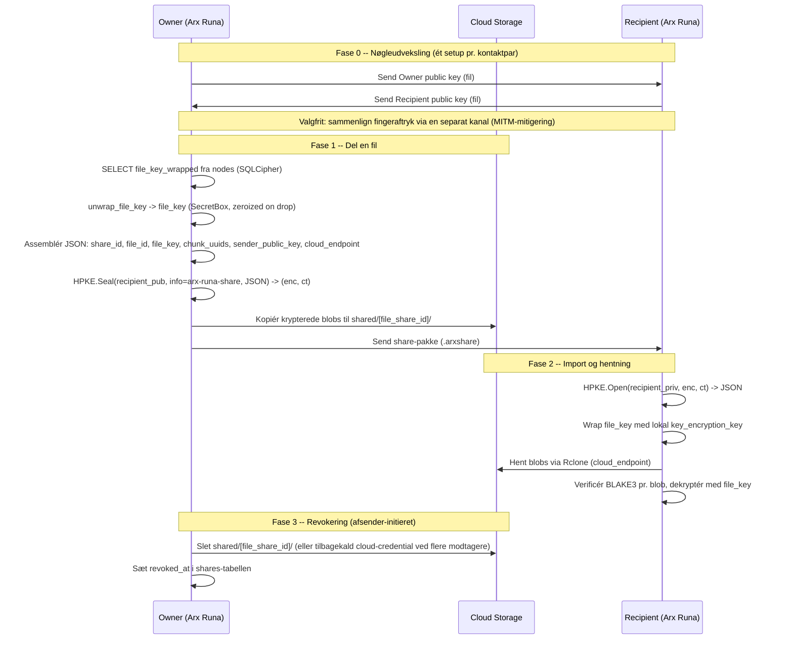

*Figur 10.1: Det centrale delingsflow i Arx Runa. Fase 0 er et engangsetup pr. kontaktpar. Cloud-udbyderen modtager kun uigennemsigtige krypterede blobs og kan hverken læse indholdet eller identificere modtageren. Download-kvitteringer og share-udløb er udeladt af figuren for overskuelighed.*

### 10.3 Sammenligning med eksisterende delingsmodeller

**OneDrive** er en cloud-baseret fildelingstjeneste med server-side kryptering. Deling sker via platformens egne mekanismer (link eller invitation), og adgang styres og tilbagekaldes server-side (Microsoft, u.å.-b). Microsoft er som amerikansk virksomhed underlagt CLOUD Act og kan pålægges at udlevere data ved juridisk pålæg (U.S. Congress, 2018).

**Cryptomator (desktop)** krypterer en hel vault med én fælles `masterkey` afledt via scrypt fra vault-adgangskoden. Deling sker ved at overdrage vault-adgangskoden til modtageren, som dermed får adgang til hele vaultens indhold (Cryptomator, u.å.).

**Cryptomator Hub** udvider modellen med per-bruger nøgledistribution: vault-nøglen forsegles individuelt for hver bruger via ECDH-ES og en brugerspecifik EC-nøgle. Hub fungerer som nøgle-mægler og kræver en separat Hub-serverinstans (Cryptomator Hub, u.å.).

**age** krypterer filer til én eller flere modtagere via X25519-nøglepar. Modtagerens offentlige nøgle angives eksplicit ved krypteringstidspunktet. Specifikationen definerer ingen revokeringsmekanisme (C2SP, u.å.).

Tabel 10.1 sammenfatter de fire modellers centrale dimensioner samt Arx Runas tilgang.

| Løsning | Nøglekontrol | Delingsgranularitet | Modtager-discovery | Revokering |
|---------|-------------|---------------------|--------------------|------------|
| **OneDrive** | Server (Microsoft) | Fil/mappe | Link eller invitation | Server-håndhævet |
| **Cryptomator (desktop)** | Klient (delt) | Vault | Delt vault-kodeord | Re-kryptér vault |
| **Cryptomator Hub** | Klient + Hub-mægler | Vault (per bruger) | Per-bruger EC-nøgle via Hub | Tilbagekald i Hub |
| **age** | Klient | Fil | X25519 public key | Ingen |
| **Arx Runa** | Klient | Fil | X25519 out-of-band + HPKE | Blob-sletning + udløb |

*Tabel 10.1: Sammenligning af delingsmodeller. Kildegrundlag: Microsoft (u.å.); Cryptomator (u.å.); Cryptomator Hub (u.å.); C2SP (u.å.).*

### 10.4 Snapshot-semantik, revokering og designgrænser

Share-pakken er et snapshot af filens tilstand på delingstidspunktet, så ændringer kræver ny deling. Payloaden indeholder ud over `file_key` også filens oprindelige navn og chunk-struktur (antal, størrelse, samlet filstørrelse), så modtageren kan samle og dekryptere filen korrekt. Cloud-udbyderen ser dem aldrig, fordi hele payloaden ligger inden i HPKE-envelopen. Revokering er asymmetrisk, hvilket betyder at sletning af `shared/<file_share_id>/` blokerer fremtidig adgang, men ikke kan tilbagekalde data modtageren allerede har hentet. `revoke_share()` returnerer `RevocationPartial { failed_index }` ved delfejl og kan genoptages.

Nøgle-autenticitet er ikke løst, og fingeraftryksverifikation (§10.2) er opt-in mitigering mod MITM. Kvitteringssystemet HPKE-forsegles til afsenderens nøgle ved download og import og er best-effort. Mislykkes det, fuldføres download stadig.

En tredje grænse er provider-dækningen. Selve nøgledistributionen er provider-agnostisk, fordi `file_key` rejser inden i HPKE-envelopen, men modtagerens hentning af de delte blobs forudsætter at udbyderen kan udstede en scoped, read-only og tidsbegrænset credential til en undermappe, som modtageren kan bruge uden egen konto. Det er kun realiseret for Backblaze B2 og Google Drive. B2 er turnkey, da en scoped read-only applikationsnøgle udledes automatisk fra afsenderens B2-konfiguration, mens Google Drive kræver at afsenderen først lagrer en Service Account-nøgle (JSON fra Google Cloud). OneDrive understøttes ikke, fordi Shares API for OneDrive for Business og SharePoint altid kræver en autentificeret brugerkontekst og ikke kan tilgå anonymt delt indhold (Microsoft, u.å.-a), og anonyme links på OneDrive Personal er upålidelige til automatiseret download. Hver udbyder kræver desuden sin egen rclone-konfiguration uden en generisk skabelon, så nye udbydere kræver yderligere implementering.

### 10.5 Realisering i Arx Runa

Implementeringen er samlet i `src-tauri/src/sharing/` (`hpke.rs`, `ctx_aead.rs`, `packages.rs`, `identity.rs`, `revocation.rs`, `store.rs`). `kem_encap()` realiserer DHKEM(X25519)-encapsulering per RFC 9180 §4.1:

```rust
// src-tauri/src/sharing/hpke.rs:128–149
fn kem_encap(
    recipient_public_key: &DalekPublicKey,
) -> Result<(Zeroizing<[u8; 32]>, [u8; 32]), SharingError> {
    let mut ephemeral_bytes = Zeroizing::new([0u8; 32]);
    rand::rng().fill_bytes(ephemeral_bytes.as_mut_slice());
    let ephemeral_secret = StaticSecret::from(*ephemeral_bytes);
    let ephemeral_public_key = DalekPublicKey::from(&ephemeral_secret);
    let diffie_hellman = ephemeral_secret.diffie_hellman(recipient_public_key);
    if diffie_hellman.as_bytes().ct_eq(&[0u8; 32]).into() {
        return Err(SharingError::AuthenticationFailed);   // small-subgroup-forsvar
    }
    let enc = *ephemeral_public_key.as_bytes();
    let mut kem_context = [0u8; 64];
    kem_context[..32].copy_from_slice(&enc);
    kem_context[32..].copy_from_slice(recipient_public_key.as_bytes());
    let shared_secret = extract_and_expand(diffie_hellman.as_bytes(), &kem_context)?;
    Ok((shared_secret, enc))
}
```

*Listing 10.1: `kem_encap()`. DH nul-tjekkes mod small-subgroup-angreb; `kem_context = enc || pk_R` binder shared secret per RFC 9180 §4.1.*

`SharePackagePayload` implementerer eksplicit `Drop` der zeroizer `file_key`-strengen:

```rust
// src-tauri/src/sharing/packages.rs:22–55
/// JSON payload sealed inside the HPKE envelope of a share package.
#[derive(Serialize, Deserialize)]
pub(crate) struct SharePackagePayload {
    /// Unique share identifier (UUID v4 hyphenated).
    pub share_id: String,
    /// File node identifier (UUID v4 hyphenated).
    pub file_id: String,
    /// Original file name.
    pub file_name: String,
    /// Number of chunks in the shared file.
    pub chunk_count: u32,
    /// Chunk size in bytes.
    pub chunk_size: u32,
    /// Ordered blob-name UUIDs for each chunk (UUID v4 hyphenated).
    pub chunk_uuids: Vec<String>,
    /// Base64-encoded 32-byte file key.
    pub file_key: String,
    /// Base64-encoded 32-byte X25519 sender public key.
    pub sender_public_key: String,
    /// Cloud endpoint metadata for locating the shared blobs.
    pub cloud_endpoint: serde_json::Value,
    /// Total file size in bytes (used by recipient to truncate last-chunk padding on decrypt).
    #[serde(default)]
    pub file_size: u64,
    /// Optional Unix timestamp when the share expires.
    #[serde(skip_serializing_if = "Option::is_none")]
    pub expires_at: Option<i64>,
}

impl Drop for SharePackagePayload {
    fn drop(&mut self) {
        self.file_key.zeroize();
    }
}
```

HPKE Base-mode er implementeret manuelt i `sharing/hpke.rs` ovenpå `x25519-dalek` (DHKEM-encapsulering), `hkdf` og `sha2` (key schedule per RFC 9180 §4) og `sharing/ctx_aead.rs` (CTX-ChaCha20-Poly1305). Det publicerede `hpke`-crate er fravalgt, fordi dets sealed `Aead`-trait ikke understøtter CTX-konstruktionens 32-byte BLAKE3-tag og 24-byte XChaCha20-nonce.

> **Delkonklusion - Underspørgsmål 5:** Nøgle-distributionsproblemet i et serverløst zero-trust system løses ved at kombinere X25519-identiteter med HPKE (RFC 9180, Barnes m.fl., 2022). Kun `file_key` for den specifikke fil eksponeres, aldrig vault-dækkende nøgler, og cloud-udbyderen modtager udelukkende krypterede blobs. CTX-ChaCha20-Poly1305 med BLAKE3-commitment eliminerer risikoen for partition oracle-angreb mod `file_key`-dekryptering (Chan & Rogaway, 2022). Sammenlignet med eksisterende løsninger, der enten kræver provider-tillid (OneDrive) eller delt vault-adgangskode (Cryptomator desktop), opnår Arx Runa filgranulær deling med kryptografisk isolation pr. modtager. To begrænsninger er ærlige designvalg: revokering er kun effektiv for data, modtageren endnu ikke har hentet, og nøgle-autenticitet afhænger af den out-of-band-kanal, brugeren selv vælger.

---

## 11. Test og evaluering

Arx Runas teststrategi er organiseret i fire lag med klart adskilte ansvarsområder. Rust-lagene ejer kryptografisk korrekthed, mens E2E-laget verificerer brugergrænsefladen. Traceabiliteten fra use case til test er en bevidst designbeslutning der gør det muligt at knytte hvert krav i §5.2 direkte til en automatiseret verifikation.

### 11.1 Testlag og ansvarsfordeling

Arx Runa anvender fire testlag med klart adskilte ansvarsområder:

| Lag | Placering | Transport | Adgangsniveau | Primært ansvar |
|-----|-----------|-----------|---------------|----------------|
| Unit | In-file `#[cfg(test)]` | (intern) | Private | Enkelt funktion i isolation |
| Scenario | `src-tauri/src/tests/` | Mocked (`MockCloudTransport`) | `pub(crate)` | Tværgående flows med real krypto og real SQLCipher |
| Integration | `src-tauri/tests/*.rs` | Real I/O | `pub` kun | Fuld encrypt, upload, download og decrypt round-trip |
| E2E | `src-tauri/tests/e2e/` | Real Tauri-app | UI (WebDriver) | Brugergrænseflade og browser-storage-oprydning efter lås |

Kryptografisk korrekthed ejes af Rust-lagene; E2E verificerer brugerfladen. `MockCloudTransport` er et in-memory blob-store der holder scenario-tests hermetiske via samme `CloudTransport`-trait som i produktion.

### 11.2 Scenarietest som use case-traceabilitet

Scenario-tests i `src-tauri/src/tests/` er organiseret direkte efter use case:

| Fil | UC | Eksempel på dækket flow |
|-----|----|------------------------|
| `scenarios_auth.rs` | UC-3 | Opret vault, tilføj recovery phrase, lås, gendan og verificer aktiv session |
| `scenarios_backup.rs` | UC-1 | Upload fil, krypter chunks og verificer manifest-integritet |
| `scenarios_sync.rs` | UC-2, UC-5 | Konfliktresolution, multi-destination backup |
| `scenarios_sharing.rs` | UC-4 | HPKE-del-flow med modtager-nøglepar |
| `scenarios_destinations.rs` | UC-5 | Per-destination fejlhåndtering |
| `scenarios_real_cloud.rs` | UC-1, UC-5 | Live Backblaze B2 (gated: `ARX_TEST_B2_*`) |

Organiseringen giver direkte traceabilitet fra krav (§5.2) via use case til test. Scenario-tests anvender reducerede Argon2-parametre (`memory_cost_kib: 1024, time_cost: 1`) for at fremskynde testafvikling, ikke som produktionsparametre. `create_tier_{one,two}_vault()` kører med `DEFAULT`-parametre, så oprettelsesstien altid testes realistisk.

### 11.3 CI-pipeline og platformsdækning

GitHub Actions kører `cargo test -p arx-runa-tauri --all-targets` med alle Rust-tests (unit, scenario og integration) på tre platforme ved hvert push:

```
ubuntu-24.04 · windows-latest · macOS-latest
```

Platformsdækning fanger `mlock`/`VirtualLock`-variationer og SQLCipher-kompileringsfejl per OS inden merge. E2E kører separat på Linux med `xvfb-run`.

**Gated tests** kræver ekstern infrastruktur og springes over i normal CI:

| Test | Gate | Kræver |
|------|------|--------|
| `rclone_integration.rs` | `ARX_RCLONE_INTEGRATION=1` | Real rclone-binary + lokal filesystem-remote |
| `scenarios_real_cloud.rs` | `ARX_TEST_B2_*` env-vars | Live Backblaze B2-bucket |

### 11.4 Teststrategi-refleksion: Agile Testing Quadrants

Tests er kortlagt mod Brian Maricks Agile Testing Quadrant-model (akser: business-facing vs. technology-facing; support the team vs. critique the product) (Marick, 2003):

| Kvadrant | Beskrivelse | Dækning i Arx Runa |
|----------|-------------|-------------------|
| **Q1:** Teknologi, støttende | Unit- og komponenttest. Hurtig feedback under udvikling. | Dækket: In-file unit-tests; integration-tests |
| **Q2:** Forretning, støttende | Scenarie- og funktionstest. Verificerer use cases. | Dækket: Scenario-tests (UC1–UC5); E2E-tests (scriptede Tier 1 UI-flows, automatiserede) |
| **Q3:** Forretning, kritiserende | Eksplorativ test, usability-test. Menneskestyret. | Delvist dækket: Tier 2-oprettelse og recovery er testet via uformelle explorationstest under udvikling. Native fil-picker afskærer WebDriver-automatisering, og ingen struktureret eksplorativ testproces er dokumenteret. |
| **Q4:** Teknologi, kritiserende | Performance, sikkerhed, fuzzing. Finder non-funktionelle fejl. | Delvist dækket: `cargo audit` (CVE-afhængigheder), `gitleaks` (hemmelig scanning), `zero_trace.spec.js`, `cargo bench` (Argon2-derivation, chunk-gennemstrømning), `cargo geiger` (unsafe-blok-sporing), `cargo fuzz` (tre targets på kryptografiske parsing-indgangspunkter). Ingen penetrationstest. |

E2E-testene (Q2) er scriptede og dækker alle automatiserbare Tier 1-flows. Q3 er delvist dækket via uformelle explorationstest under udvikling. Tier 2-oprettelse og recovery kan ikke automatiseres, da native fil-picker afskærer WebDriver, og ingen formel eksplorativ testproces er dokumenteret for dem. Q4 dækkes af `cargo audit`, `gitleaks`, `zero_trace.spec.js`, `cargo bench` (Bilag D), `cargo geiger` og tre `cargo-fuzz`-targets (`fuzz_vault_header`, `fuzz_manifest_backup`, `fuzz_parse_chunk_size`) på ubetroede cloud-data parsing-indgangspunkter. Penetrationstest er eksplicit udenfor scope.

> **Delkonklusion - Test og evaluering:** De fire testlag giver kryptografisk korrekthed og use case-traceabilitet. Q3 er delvist dækket via uformelle explorationstest. To flows kræver native fil-picker og kan ikke automatiseres. Q4 dækkes af statisk analyse, fuzzing og benchmarks; penetrationstest er eksplicit udenfor scope.

---

## 12. Diskussion

### 12.1 Hvad Arx Runa løser, og hvad det ikke løser

Arx Runa demonstrerer at zero-knowledge kryptering med hardware-MFA og provider-agnostisk transport er realiserbart som integreret desktop-applikation. Klient-side kryptering med XChaCha20-Poly1305 og per-fil CSPRNG-nøgler, wrappet med en HKDF-afledt key-encryption-key fra `master_key`, sikrer at cloud-udbyderen aldrig modtager klartekst (jf. §6, §8). Tier 2 opfylder NIST SP 800-63B AAL2 uden serverkontakt, Zero-Trace holder nøglemateriale i `mlock`-beskyttet RAM med automatisk sletning ved sessionslås (jf. §9), og krypteringspipelinen opnår ~989 MiB/s, så CPU ikke er flaskehalsen ved upload (Bilag D). Garantien er begrænset til det kryptografiske lag. Keylogging, hardware-kompromittering og OS-angreb under aktiv session er uden for trusselsmodellen (§5.4), og systemet løser ikke det bredere problem med at beskytte data mod en adversary med lokal adgang.

### 12.2 Design-trade-offs

KDF-input er `password_bytes || key_file_bytes`, og begge faktorer er nødvendige for vault-adgang. FIDO2 er fravalgt fordi det er ikke-deterministisk, og TOTP fordi det kræver klokkesynchronisering og servervalidering (FIDO Alliance, 2019; IETF, 2011). En bruger der mister USB-nøgle og BIP-39-frase er permanent låst ude. Tier 2 er stærkere mod server-kompromitteringsscenarier end cloud-baseret MFA, men svagere på tilgængelighed, og valget afspejler målgruppen af brugere der prioriterer selvforvaltet sikkerhed. BIP-39-frasen eliminerer server-escrow og CLOUD Act-tvang som angrebsveje (jf. §7.3), og recovery er single-factor netop fordi den typisk bruges når nøglen er tabt. Shamir social recovery ville fordele ansvaret, men introducerer N-parts-tillid der ikke er berettiget for målgruppen.

Rclone som subprocess giver adgang til 70+ cloud-backends og afskærmer kodebasen fra provider-API-ændringer (Rclone, u.å.). Breaking changes mitigeres ved versionspinning og integration-tests bag `ARX_RCLONE_INTEGRATION=1`. Den tilbageværende zero-trace-begrænsning er `rclone.conf` på disk ved OAuth2-destinationer, hvor token-refresh kræver filskriv og et crash-vindue efterlader filen til næste appstart rydder op. RC daemon-tilstand (`rclone rcd`) med in-memory konfiguration er den strukturelle mitigering og beskrives i §12.3. Fildeling har en tilsvarende iboende grænse. Revokering er kryptografisk effektiv hvis modtageren endnu ikke har hentet blobsene, men post-download befinder klartekstet sig på dennes maskine, og kryptografisk tilbagekaldelse er umulig uden koordination der er uforenelig med det serverløse design.

### 12.3 Videre udvikling

Group sharing kan realiseres serverløst via HPKE multi-recipient (Barnes m.fl., 2022). Blob-tidsstempler lækker aktivitet trods UUID-navngivning, og epoch-baseret batching er en mulig mitigering. Reproducerbare builds udgør en fremtidig tillids-egenskab for produktionsudrulning. RC daemon-tilstand (`rclone rcd`) styrker Zero-Trace-garantien uden at berøre krypteringslaget, SQLCipher-skemaet eller frontend, og kræver kun omskrivning af `rclone.rs` og sessionslivscyklusen i `auth/session/manager.rs`.

---

## 13. Konklusion

Den overordnede problemformulering besvares bekræftende. Det er muligt at designe og implementere et zero-knowledge klient-krypteringssystem, der eliminerer tillid til cloud-udbyderen, realiserer hardware MFA uden serverkontakt og understøtter filgranulær deling, samlet i ét integreret og fungerende desktop-system.

Underspørgsmål 1 besvares i §6. XChaCha20-Poly1305 med per-fil CSPRNG-nøgler wrappet via HKDF-SHA256-afledt key-encryption-key sikrer datakonfidentialitet og -integritet uden at nøglemateriale forlader klienten. Krypteringspipelinen opnår ~989 MiB/s throughput (Bilag D), så CPU ikke er flaskehalsen. Underspørgsmål 2 besvares i §7. USB-nøglefilen indgår som direkte KDF-konkatenering, der opfylder NIST SP 800-63B AAL2, og BIP-39 recovery eliminerer escrow-tillidsproblemet. Underspørgsmål 3 besvares i §7. UUID-blobnavne, fast chunk-størrelse og Rclone-sidecar giver provider-agnostisk transport uden filnavnlækage. Underspørgsmål 4 besvares i §9. `mlock`-beskyttet RAM, atomisk session-gate og RAM-only filvisning sikrer Zero-Trace, og crash-dumps og Windows fast startup er eksplicitte, dokumenterede undtagelser. Underspørgsmål 5 besvares i §10. HPKE (RFC 9180) med X25519-identiteter muliggør filgranulær deling uden central server.

Det konkrete bidrag er ikke nye kryptografiske primitiver, men kombinationen: hardware MFA, BIP-39 offline recovery, provider-agnostisk transport og Zero-Trace i ét dokumenteret, fuldt implementeret system. De analyserede alternativer (Cryptomator, Tresorit, Proton Drive) prioriterer andre egenskaber, fx managed recovery og driftsmæssig modenhed.

### 13.2 Begrænsninger og åbne spørgsmål

Tre begrænsninger er kendte og eksplicitte. X25519-nøgle-distribution sker out-of-band uden PKI, så nøgle-autenticitet afhænger fuldt af den kanal brugeren vælger, og fingeraftryksverifikation (§10.2) er opt-in. Mobile platforme er ikke understøttet, og UC-1 (mobilbackup) forbliver dermed uadresseret. Formaliseret usability-test er ikke gennemført, så det er uvist om Tier 2-modellen er operationelt tilgængelig for ikke-tekniske brugere.

---

## 14. Litteraturliste og bilag

*Tæller ikke med i de 30 sider. Kildeformat: APA 7.*

### Litteraturliste


Alexeev, D., Percival, C., & Zhang, Z. (2025). *Chunking attacks on file backup services using content-defined chunking* (IACR ePrint 2025/532). https://eprint.iacr.org/2025/532 *(verificeret 2026-05-25)*

Arciszewski, T. (2020). *draft-irtf-cfrg-xchacha-03: XChaCha: eXtended-nonce ChaCha and AEAD_XChaCha20_Poly1305*. Internet Engineering Task Force. https://datatracker.ietf.org/doc/html/draft-irtf-cfrg-xchacha-03 *(verificeret 2026-05-25)*

Barnes, R., Bhargavan, K., Lipp, B., & Wood, C. (2022). *RFC 9180: Hybrid Public Key Encryption*. Internet Engineering Task Force. https://www.rfc-editor.org/rfc/rfc9180

Bernstein, D. J. (2011). *Extending the Salsa20 nonce* [Præsenteret på SKEW 2011]. http://cr.yp.to/snuffle/xsalsa-20110204.pdf *(verificeret 2026-05-25)*

Biryukov, A., Dinu, D., & Khovratovich, D. (2016). Argon2: New generation of memory-hard functions. *2016 IEEE European Symposium on Security and Privacy (EuroS&P)*, 292–302. https://ieeexplore.ieee.org/document/7467361

Biryukov, A., Dinu, D., Khovratovich, D., & Josefsson, S. (2021). *RFC 9106: Argon2 memory-hard function for password hashing and proof-of-work applications*. Internet Engineering Task Force. https://www.rfc-editor.org/rfc/rfc9106

Böck, H., Zauner, A., Devlin, S., Somorovsky, J., & Jovanovic, P. (2016). Nonce-disrespecting adversaries: Practical forgery attacks on GCM in TLS. *10th USENIX Workshop on Offensive Technologies (WOOT 2016)*. https://eprint.iacr.org/2016/475

C2SP. (u.å.). *age encryption format v1*. https://github.com/C2SP/C2SP/blob/main/age.md *(verificeret 2026-05-25)*

Celi, T. (u.å.). *zeroize: Securely zero memory while avoiding compiler optimizations* [Rust-crate dokumentation]. https://docs.rs/zeroize *(verificeret 2026-05-25)*

Chan, J., & Rogaway, P. (2022). *On committing authenticated encryption* (IACR ePrint 2022/1260). https://eprint.iacr.org/2022/1260 *(verificeret 2026-05-25)*

Cryptomator. (u.å.). *Security Architecture*. Hentet fra https://docs.cryptomator.org/security/architecture *(verificeret 2026-05-25)*

Cryptomator Hub. (u.å.). *Cryptomator Hub — Security*. Hentet fra https://docs.cryptomator.org/en/latest/security/hub/ *(verificeret 2026-05-25)*

Cure53. (2017). *Cryptomator Cryptographic Review*. https://cryptomator.org/audits/2017-11-27%20crypto%20cure53.pdf *(verificeret 2026-06-05)*

Dropbox. (u.å.). *Dropbox account safety: how Dropbox keeps your files secure*. Hentet fra https://help.dropbox.com/security/how-security-works *(verificeret 2026-05-25)*

Ellis, C. A., & Gibbs, S. J. (1989). Concurrency control in groupware systems. *ACM SIGMOD Record*, *18*(2), 399–407. https://doi.org/10.1145/66926.66961

Europa-Parlamentet og Rådet. (2023). *Forordning (EU) 2023/1543 af 12. juli 2023 om europæiske udleveringspåbud og europæiske bevaringspåbud for elektronisk bevismateriale i straffesager og til fuldbyrdelse af frihedsstraffe efter straffesager*. EU's Officielle Tidende, L 191, 118–180. https://eur-lex.europa.eu/legal-content/EN/TXT/?uri=CELEX%3A32023R1543 *(verificeret 2026-06-04)*

FIDO Alliance. (2019). *FIDO2: Web Authentication (WebAuthn)*. https://fidoalliance.org/specifications/ *(verificeret 2026-05-25)*

Fielding, R., Lafon, Y., & Reschke, J. (2014). *RFC 7233: Hypertext Transfer Protocol (HTTP/1.1): Range Requests*. Internet Engineering Task Force. https://www.rfc-editor.org/rfc/rfc7233

Fruhwirth, C., Saout, C., & Lücke, A. (u.å.). *LUKS2 on-disk format specification* (v1.1.4). https://gitlab.com/cryptsetup/LUKS2-docs *(verificeret 2026-05-25)*

Google. (u.å.). *Default encryption at rest*. Google Cloud Documentation. Hentet fra https://docs.cloud.google.com/docs/security/encryption/default-encryption *(verificeret 2026-05-25)*

Grigorik, I. (u.å.). *secrecy: Wrapper types for secret management which follow Rust conventions* [Rust-crate dokumentation]. https://docs.rs/secrecy *(verificeret 2026-05-25)*

Hevner, A. R., March, S. T., Park, J., & Ram, S. (2004). Design science in information systems research. *MIS Quarterly*, *28*(1), 75–105. https://doi.org/10.2307/25148625

IETF. (u.å.). *draft-irtf-cfrg-aegis-aead: The AEGIS family of authenticated encryption algorithms*. https://datatracker.ietf.org/doc/draft-irtf-cfrg-aegis-aead/ *(verificeret 2026-05-25)*

IETF. (2011). *RFC 6238: TOTP: Time-based one-time password algorithm*. https://www.rfc-editor.org/rfc/rfc6238

IETF. (2018). *RFC 8439: ChaCha20 and Poly1305 for IETF protocols*. https://www.rfc-editor.org/rfc/rfc8439

IETF. (2019). *RFC 8452: AES-GCM-SIV: nonce misuse-resistant authenticated encryption*. https://www.rfc-editor.org/rfc/rfc8452

kernel.org. (u.å.). *fscrypt: filesystem-level encryption*. https://docs.kernel.org/filesystems/fscrypt.html *(verificeret 2026-05-25)*

Krawczyk, H., & Eronen, P. (2010). *RFC 5869: HMAC-based extract-and-expand key derivation function (HKDF)*. Internet Engineering Task Force. https://www.rfc-editor.org/rfc/rfc5869

Len, J., Grubbs, P., & Ristenpart, T. (2021). Partitioning oracle attacks. *30th USENIX Security Symposium (USENIX Security 21)*. https://www.usenix.org/conference/usenixsecurity21/presentation/len

Marick, B. (2003). *Agile Testing Directions*. Testing Foundations. https://www.exampler.com/old-blog/2003/08/21/ *(verificeret 2026-05-25)*

McLean, T. (2016). *SIV-mode security review*. https://chosenplaintext.ca/publications/20161104-siv-mode-report.pdf *(verificeret 2026-05-25)*

Microsoft. (u.å.-a). *Access shared items (Shares API) — Microsoft Graph v1.0*. Hentet fra https://learn.microsoft.com/en-us/graph/api/shares-get *(verificeret 2026-06-05)*

Microsoft. (u.å.-b). *How OneDrive safeguards your data in the cloud*. Hentet fra https://support.microsoft.com/en-us/office/how-onedrive-safeguards-your-data-in-the-cloud-23c6ea94-3608-48d7-8bf0-80e142edd1e1 *(verificeret 2026-05-25)*

NIST. (2007). *NIST SP 800-38D: Recommendation for block cipher modes of operation: Galois/Counter Mode (GCM) and GMAC*. https://csrc.nist.gov/pubs/sp/800/38/d/final

NIST. (2017). *NIST SP 800-63B: Digital identity guidelines — authentication and lifecycle management*. https://pages.nist.gov/800-63-4/sp800-63b.html

NIST. (2020a). *NIST SP 800-56C Rev 2: Recommendation for key-derivation methods in key-establishment schemes*. https://csrc.nist.gov/publications/detail/sp/800-56c/rev-2/final

NIST. (2020b). *NIST SP 800-57 Part 1 Rev 5: Recommendation for key management*. https://csrc.nist.gov/publications/detail/sp/800-57-part-1/rev-5/final

O'Connor, J.-P., Aumasson, J.-P., Neves, S., & Wilcox-O'Hearn, Z. (2019). *BLAKE3: One function, fast everywhere*. https://github.com/BLAKE3-team/BLAKE3-specs/blob/master/blake3.pdf *(verificeret 2026-05-25)*

OWASP. (2024). *Password storage cheat sheet*. https://cheatsheetseries.owasp.org/cheatsheets/Password_Storage_Cheat_Sheet.html *(verificeret 2026-05-25)*

Palatinus, M., Rusnak, P., Voisine, A., & Bowe, S. (2013). *BIP-0039: Mnemonic code for generating deterministic keys*. Bitcoin Improvement Proposals. https://github.com/bitcoin/bips/blob/master/bip-0039.mediawiki *(verificeret 2026-05-24)*

Proton AG. (u.å.-a). *Proton Drive security*. Hentet fra https://proton.me/drive/security *(verificeret 2026-05-25)*

Proton AG. (u.å.-b). *Recovery phrase*. Hentet fra https://proton.me/support/recovery-phrase *(verificeret 2026-06-04)*

Rclone. (u.å.). *Rclone: Syncs your files to cloud storage*. Hentet fra https://rclone.org/ *(verificeret 2026-05-25)*

Rescorla, E. (2018). *RFC 8446: The Transport Layer Security (TLS) protocol version 1.3*. Internet Engineering Task Force. https://www.rfc-editor.org/rfc/rfc8446

Shamir, A. (1979). How to share a secret. *Communications of the ACM*, *22*(11), 612–613. https://doi.org/10.1145/359168.359176

Shapiro, M., Preguiça, N., Baquero, C., & Zawirski, M. (2011). Conflict-free replicated data types. I *Stabilization, Safety, and Security of Distributed Systems (SSS 2011)*, LNCS 6976 (s. 386–400). Springer. https://doi.org/10.1007/978-3-642-24550-3_29

Shostack, A. (2014). *Threat Modeling: Designing for Security*. Wiley.

Stephens, R. (2022). *Beginning Software Engineering* (2nd ed.). John Wiley & Sons.

Tresorit. (u.å.). *Security Features*. Hentet fra https://tresorit.com/security *(verificeret 2026-05-24)*

Truong, K. T., Merz, S.-P., Scarlata, M., Günther, F., & Paterson, K. (2025). *Breaking and fixing content-defined chunking* (IACR ePrint 2025/558). https://eprint.iacr.org/2025/558 *(verificeret 2026-05-25)*

U.S. Congress. (2018). *Clarifying Lawful Overseas Use of Data Act (CLOUD Act)*. Pub. L. No. 115-141, div. V, 132 Stat. 348. https://www.congress.gov/bill/115th-congress/house-bill/4943/text

---

### Bilag

- **Bilag A:** Ordliste. Kurateret liste over tekniske begreber der forekommer i rapportens prosa. Akronymer og engelske produkt- og standardnavne bevares; korte forklaringer på dansk. Fuld definition for hvert begreb findes i `docs/guides/glossary.md` og `docs/notes/rapport-forklaringer.md`.

  | Term | Beskrivelse |
  |------|-------------|
  | AAD (Additional Authenticated Data) | Klartekst-data der bindes ind i AEAD-tagget uden at krypteres. I Arx Runa er AAD `file_id #124;#124; chunk_index`, hvilket binder en chunk til position og forhindrer omplacering. |
  | AEAD (Authenticated Encryption with Associated Data) | Kryptografisk konstruktion der både krypterer data og verificerer integritet inklusive ikke-krypteret tilknyttet data. XChaCha20-Poly1305 er Arx Runas AEAD-primitiv. |
  | AES-NI | AES New Instructions: CPU-hardwareudvidelse der accelererer AES-kryptering. Uden AES-NI er AES-GCM sårbar over for timing-sidekanalangreb; XChaCha20-Poly1305 er hardware-uafhængig. |
  | Argon2id | Memory-hard nøgleafledningsfunktion (RFC 9106). Bruges til at omsætte adgangskode (og evt. USB-nøglefil) til `master_key`. 64 MiB hukommelse pr. iteration begrænser brute-force på GPU/ASIC. |
  | BIP-39 | Bitcoin Improvement Proposal 39: kodning af binær entropi som ordliste-fraser. Arx Runa koder 256 bits recovery-entropi som 24 engelske ord med indbygget checksum. |
  | BLAKE3 | Hurtig kryptografisk hashfunktion. I Arx Runa bruges den til blob-integritetscheck (fail-fast inden dekryptering) og som fingeraftryk af USB-nøglefilen i vault-headeren. |
  | Blob | Et krypteret chunk lagret hos cloud-udbyderen. Navnet er en tilfældig UUID med `.blob`-endelse uden relation til filnavn eller indhold. |
  | BYOC (Bring Your Own Cloud) | Princippet om at brugeren selv vælger og konfigurerer cloud-backend. Arx Runa er BYOC-baseret via Rclone-sidecar. |
  | Chunk | Fast 4 MiB (default) blok som en fil splittes i før kryptering. Sidste chunk zero-paddes til chunk-størrelsen. |
  | CSPRNG | Cryptographically Secure Pseudo-Random Number Generator. OS-leveret tilfældighedskilde til nonces, salts, file_keys og USB-nøglefil-bytes (`getrandom`, `BCryptGenRandom`). |
  | CTX-ChaCha20-Poly1305 | Arx Runas key-committing variant af ChaCha20-Poly1305: Poly1305-tagget erstattes af en BLAKE3-commitment over nøgle, nonce og ciphertext. Forhindrer partition oracle-angreb mod delte file_keys. |
  | EXIF | Metadata indlejret i mediefiler (GPS, kameramodel, tidsstempel). Strippes i hukommelsen før kryptering for at undgå metadata-lækage. |
  | FIDO2 / WebAuthn | Åben hardwareautentificeringsstandard (FIDO Alliance, 2019). FIDO2 er den samlede standard; WebAuthn er W3C-specifikationen for browser-integration. Godkendelsen afhænger af en session-specifik nonce og er ikke-reproducerbar; uegnet som KDF-input (§7.1). |
  | FIPS | Federal Information Processing Standards: US-kryptografikrav udgivet af NIST. FIPS-godkendte algoritmer kræves i visse statslige og regulerede miljøer; Arx Runa prioriterer Argon2id over PBKDF2 i sådanne kontekster. |
  | file_key | Per-fil 32-byte CSPRNG-genereret nøgle. Krypterer filens chunks og lagres kun wrapped (med `key_encryption_key`) i manifestet. |
  | HKDF | HMAC-based Key Derivation Function (RFC 5869). Ekspanderer `master_key` til tre domæneadskilte vault-nøgler via unikke `info`-strenge. |
  | HPKE | Hybrid Public Key Encryption (RFC 9180). Kombinerer asymmetrisk KEM med symmetrisk AEAD til at forsegle indhold for én modtagers offentlige nøgle. Bruges i fildeling. |
  | IETF | Internet Engineering Task Force: standardiseringsorganisation der udgiver RFC'er. Arx Runa refererer til RFC 5869 (HKDF), RFC 6238 (TOTP), RFC 9106 (Argon2id) og RFC 9180 (HPKE). |
  | KDF (Key Derivation Function) | Funktion der afledr kryptografisk nøglemateriale fra en hemmelighed. Arx Runa anvender Argon2id som password-KDF (memory-hard) og HKDF som ekspansions-KDF (domæneseparering). |
  | KEK / DEK | Key Encryption Key / Data Encryption Key. Klassisk to-lags nøglehierarki (NIST SP 800-57) hvor en KEK indpakker mange DEK'er. I Arx Runa er `key_encryption_key` KEK'en og `file_key` DEK'en. |
  | Manifest | Krypteret SQLCipher-database med vault'ens sandhed: filnavne, mappestruktur, chunk-referencer, BLAKE3-checksums og wrapped file_keys. Backes op til skyen som `manifest-backup.blob` separat krypteret med `manifest_key`. |
  | master_key | Roden i nøglehierarkiet. Afledes af Argon2id fra adgangskode (og USB-nøglefil ved Tier 2) og zeroizes umiddelbart efter at HKDF har udledt vault-nøglerne. |
  | mlock / VirtualLock | OS-kald (POSIX hhv. Windows) der låser hukommelsessider mod pagning til disk. Påkræves for at session-nøgler ikke ender i swap eller dvalefil. `mlock`-fejl er hård fejl i Arx Runa. |
  | NIST | National Institute of Standards and Technology: amerikansk standardiseringsorganisation der udgiver SP 800-serien. Arx Runa anvender SP 800-57, SP 800-63B og SP 800-131A som normative referencer. |
  | Nonce | Number used once. Et engangstal der sikrer at samme nøgle aldrig krypterer to forskellige plaintexts identisk. XChaCha20 anvender 192-bit nonce, så kollisioner er negligible. |
  | OWASP | Open Worldwide Application Security Project: non-profit der udgiver sikkerhedsstandarder. Arx Runas Argon2id-parametre (m=65.536, t=3, p=4) er valgt i overensstemmelse med OWASP Password Storage Cheat Sheet (2024). |
  | Rclone | Open source-kommandolinjeværktøj der abstraherer 70+ cloud-backends bag ét interface. Arx Runa anvender det som sidecar-proces for provider-agnostisk transport. |
  | recovery_slot / recovery_key | Vault-header-feltet hvor `master_key` ligger wrapped under en Argon2id-afledt `recovery_key` udledt af BIP-39-frasen. Muliggør gendannelse uden adgangskode eller USB-nøglefil. |
  | RFC (Request for Comments) | IETF's publiceringssystem for internet- og kryptografispecifikationer. Aktive RFC'er udgør normative referencer i Arx Runa (RFC 5869, RFC 6238, RFC 8439, RFC 9106, RFC 9180 m.fl.). |
  | SecretBox<T> | Rust-wrapper fra `secrecy`-cratet der redacter `Debug`-output og eksponerer indhold via callback. Bruges til at undgå utilsigtet logning af nøglemateriale. |
  | snapshot_counter | Monoton tæller i manifestet der øges ved hver push. Bruges til konfliktdetektion: lokal tæller mindre end cloud-tæller udløser pull-first. |
  | SQLCipher | SQLite-udvidelse der krypterer hele databasefilen med AES-256. Arx Runa anvender den til den lokale manifest-database, keyed med `sqlcipher_key`. |
  | Staging | Midlertidigt lokalt katalog hvor krypterede blobs venter på upload. Indeholder kun ciphertext og slettes når upload bekræftes. |
  | STRIDE | Trusselskategoriseringsmodel (Spoofing, Tampering, Repudiation, Information Disclosure, Denial of Service, Elevation of Privilege). Shostack (2014). Fuld STRIDE-matrix i Bilag B. |
  | Tier 1 / Tier 2 | Autentificeringsniveauer ved vault-oprettelse. Tier 1: kun adgangskode (NIST AAL1). Tier 2: adgangskode konkateneret med 32-byte USB-nøglefil-bytes som Argon2id-input (NIST AAL2). |
  | TOTP | Time-based One-Time Password (RFC 6238): tidsbaseret engangskode udledt af en delt hemmelighed og det aktuelle 30-sekunders tidsvindue. Output varierer pr. interval og er ikke-reproducerbart; uegnet som KDF-input (§7.1). |
  | USB-nøglefil | 32-byte CSPRNG-genereret fil placeret på et fysisk USB-drev. Hardware-faktor i Tier 2. Identificeres ved BLAKE3-fingeraftryk i vault-headeren. |
  | Vault / Vault Header | Vault: hele det krypterede storage-namespace for én bruger. Vault header: klartekst JSON med offentlige parametre (salt, Argon2-parametre, BLAKE3-fingeraftryk, recovery slot) — nødvendig for bootstrap på en ny enhed. |
  | WASM | WebAssembly: binært instruktionsformat der eksekverer i browsere og Tauri-shells med near-native hastighed. Arx Runa anvender Leptos/WASM som frontend; dekrypteret indhold holdes i WASM-hukommelsesrummet og skrives ikke til disk. |
  | wrapped_master_key | `master_key` krypteret med `recovery_key` under XChaCha20-Poly1305 og lagret i recovery slot. 72 bytes: 24-byte nonce, 32-byte ciphertext, 16-byte tag. AAD inkluderer `vault_id` for transplantationsbeskyttelse. |
  | X25519 | Diffie-Hellman-funktion over Curve25519. Hver Arx Runa-bruger genererer et X25519-nøglepar som delingsidentitet; offentlig nøgle udveksles out-of-band, privat nøgle wrappes i vault'en. |
  | XChaCha20-Poly1305 | AEAD-primitiv (draft-irtf-cfrg-xchacha-03) med 192-bit nonce og Poly1305-autentifikation. Anvendes til alle chunk-krypteringer og til at wrappe `master_key` i recovery slot. |
  | Zero-Trace | Designprincip: ingen dekrypteret plaintext eller credentials forlader RAM. Eksplicitte arkitektoniske undtagelser (Tauri HTTP-handoff, OS crash dumps, Windows fast startup) er dokumenteret i §5.4 og §9.4. |
  | Zeroizing<T> / ZeroizeOnDrop | Rust-typer fra `zeroize`-cratet der overskriver bufferen med nul ved drop. Anvendes på alle session-nøgler og midlertidige plaintext-buffere. |
- **Bilag B:** Trusselsmodel. STRIDE-kategoriseret threat matrix afledt af adversary-modellen i §5.4. STRIDE (Shostack, 2014) opdeler trusler i seks kategorier: Spoofing, Tampering, Repudiation, Information Disclosure, Denial of Service og Elevation of Privilege. Hver række kortlægger én konkret trussel mod én af de tre primære adversaries (cloud-udbyder, juridisk tvang, fysisk angriber) og angiver den eksplicitte mitigering med reference til en analysesektion eller en dokumenteret out-of-scope-note.

  Emfasen ligger på Information Disclosure mod cloud-udbyderen, da det er den primære trussel zero-knowledge-arkitekturen adresserer. Tampering dækkes af AEAD-konstruktionen og snapshot_counter-mekanismen. Elevation of Privilege og dele af Denial of Service er eksplicit uden for scope (§5.4).

  | ID | Kategori | Adversary | Trussel | Mitigering | Reference |
  |----|----------|-----------|---------|-----------|-----------|
  | S-1 | Spoofing | Kanalangriber | MITM-substitution af modtagers offentlige nøgle ved out-of-band-udveksling | BLAKE3-fingeraftryksverifikation out-of-band; opt-in og afhænger af brugerdisciplin | §10.2, §13.2 |
  | T-1 | Tampering | Cloud-udbyder | Modifikation af krypteret chunk-blob | Poly1305 AEAD-tag detekterer bit-flip; BLAKE3-checksum i manifest fail-fast inden dekryptering | §6.1, §8.2 |
  | T-2 | Tampering | Cloud-udbyder | Chunk-swap: splicing af én fils chunk ind i en anden fils sekvens | AAD-binding `file_id #124;#124; chunk_index` får dekryptering til at fejle ved ompositionering | §6.4, §8.2 |
  | T-3 | Tampering | Cloud-udbyder | Rollback af manifest til ældre snapshot eller modifikation af manifest-backup | Monoton snapshot_counter; cloud-snapshot < lokal afvises. Manifest-backup AEAD-krypteret med `manifest_key`; tampering producerer auth-failure | §8.3, §8.5 |
  | T-4 | Tampering | Kanalangriber | Modifikation af share-pakke under out-of-band transit | HPKE Base mode + CTX-BLAKE3-commitment; modificeret `enc` eller ciphertext producerer auth-failure | §10.2 |
  | R-1 | Repudiation | Modtager | Modtager benægter at have downloadet en delt fil | HPKE-forseglet kvittering retur til afsender, best-effort; revokering muligt indtil download | §10.4, §10.5 |
  | I-1 | Information Disclosure | Cloud-udbyder | Læsning af filindhold | XChaCha20-Poly1305 med per-fil CSPRNG-nøgler; nøgler forlader aldrig klientens RAM | §6.1, §6.3 |
  | I-2 | Information Disclosure | Cloud-udbyder | Læsning af filnavne, mappestruktur og chunk-relationer | UUID-blobnavngivning; manifest separat krypteret med `manifest_key` før upload | §8.1, §8.3 |
  | I-3 | Information Disclosure | Juridisk tvang via cloud | Statslig kendelse pålægger cloud-udbyder at udlevere data | Cloud har intet meningsfuldt at udlevere; ingen escrow eller server-baseret recovery | §5.4, §7.3 |
  | I-4 | Information Disclosure | Cloud-udbyder | Identifikation af modtager af share-pakke | Hele routing-payload ligger i HPKE-envelopen; cloud ser kun uigennemsigtige blobs i `shared/<file_share_id>/` | §10.2, §10.5 |
  | I-5 | Information Disclosure | Cloud-udbyder | Inference af filstørrelse fra blob-antal og -størrelse | Fast 4 MiB chunk-størrelse + zero-padding begrænser size-inference til ét interval | §8.2 |
  | I-6 | Information Disclosure | Fysisk angriber | Læsning af nøglemateriale fra OS-swap eller hibernation-fil | `mlock`/`VirtualLock` på alle session-nøgler; hård fejl ved fejlet lås (REQ-AUTH-014) | §9.2 |
  | I-7 | Information Disclosure | Fysisk angriber | Læsning af dekrypteret filindhold fra `%TEMP%` eller browser-storage efter vault-lås | `blob:` URL og `arxvault://` Range-stream uden disk-touch; `VaultActions::clear()` ved lock-event | §9.4, Bilag C |
  | I-8 | Information Disclosure | Fysisk angriber | Læsning af `rclone.conf` med cloud-credentials på disk under aktiv session | Owner-only ACL; `SetDispositionInformationEx` delete-on-close ved vault-lås; crash-vindue er dokumenteret begrænsning med startup-sweep | §12.2.3, Bilag C |
  | D-1 | Denial of Service | Cloud-udbyder | Cloud nægter at servere blobs eller sletter dem vilkårligt | Multi-destination push (REQ-SYNC-010); brugeren kan rotere til anden provider eller anvende mirror-destination som backup | §8.4, §12.2.3 |
  | D-2 | Denial of Service | Selvforvaltet (designet trade-off) | Bruger mister både USB-nøglefil og BIP-39-frase | Ingen mitigering; eksplicit konsekvens af selvforvaltet ansvar uden tredjeparts-escrow | §12.2.2, §13.2 |
  | E-1 | Elevation of Privilege | Lokal OS/malware | OS-kompromittering giver angriber mid-session read-access til processens RAM | Uden for scope. Arx Runa-processen er betroet (§5.4); OS-niveau-beskyttelse er udenfor produktets ansvar | §5.4 |
  | E-2 | Elevation of Privilege | Digital angriber | Omgåelse af Tier 2 ved kun at få fat i adgangskoden | Argon2id-input er `password_bytes #124;#124; key_file_bytes`; uden 32-byte key file produceres en anden master_key (REQ-AUTH-005) | §7.1 |

  **Out-of-scope-trusler** uden eksplicit række i matrixen, men dokumenteret i §5.4: side-channel-angreb (timing/cache) mod aktiv session, keylogging på værtsmaskinen, hardware-implant i USB-drevet, og bruger der bevidst saboterer egen vault. Disse forudsætter angreb under et tillidsniveau der ligger uden for klient-side-zero-knowledge-arkitekturens designformål.

  Kildegrundlag for STRIDE-anvendelsen: Shostack, A. (2014). *Threat Modeling: Designing for Security*. Wiley.
- **Bilag C:** Forensisk verifikation. Empirisk verifikation af Zero-Trace-garantier via Process Monitor, filsystem-scan og browser storage-inspektion.

  **Testmiljø**

  | Parameter | Værdi |
  |-----------|-------|
  | OS | Windows 11 Pro 10.0.26200 |
  | Build | debug-build, branch `development`, 2026-05-26 |
  | Vault | `538da242-4e10-4267-946e-f814cdd74509` (Backblaze B2-destination) |
  | Procedure | Unlock vault, vis filer in-app og manuel vault-lock |
  | Testprocedure | `docs/notes/zero-trace-forensik-verifikation.md` |
  | Platform-dækning | Windows 11 (manuelt). Linux dækkes af E2E-tests i CI (jf. §11.3). macOS-E2E ikke understøttet i GitHub Actions; ikke manuelt verificeret. |

  Zero-Trace-garantierne verificeret i dette bilag (zeroize, VirtualLock, SetDispositionInformationEx) er compile-time-invariante og påvirkes ikke af build-profil. Debug- og release-builds adskiller sig i optimering og debug-symboler, men ikke i de kryptografiske sletningsoperationer der verificeres her.

  **Browser storage-inspektion (DevTools, fanen Application, sektionen Storage)**

  Inspiceret efter vault-lock: Total storage usage: **0 B** (ud af 599.066 MB quota).
  Local storage, Session storage, IndexedDB, Cookies og Cache storage er alle tomme.
  Ingen vault-UUID, session-token eller dekrypteret data er tilgængeligt i browser-lagets storage.

  **Filsystem-scan (PowerShell)**

  | Residue-type | Fund | Vurdering |
  |---|---|---|
  | `%TEMP%` arx-runa-filer (seneste 10 min) | Ingen | Bekræftet |
  | `rclone*.conf` i `%TEMP%` | Ingen | Bekræftet |
  | `%APPDATA%\arx-runa` sensitive filer | Kun `vault.db`, `vault-header.json` (krypterede), `device_id` (klartekst), `.arxshare` (HPKE-krypteret) | Bekræftet |
  | Orphan rclone-mapper fra tidligere sessioner | 0 (23 filer ryddet ved opstart) | Bekræftet |

  `*.tmp`- og `cv_debug.log`-filer i `%TEMP%` stammer fra Visual Studio og Windows-systemprocesser og er uden relation til Arx Runa.

  **Process Monitor (85 events efter filtrering, arx-runa PID 23240)**

  *rclone.conf-livscyklus (credentials-håndtering):*

  | Tid | Operation | Sti | Betydning |
  |-----|-----------|-----|-----------|
  | 03:04:30 | WriteFile + FlushBuffersFile | `arx-runa-23186c78734a760b\rclone.conf` | Credentials skrives til disk ved unlock |
  | 03:04:30 | SetSecurityFile | samme | Owner-only ACL (kun denne bruger kan læse) |
  | 03:05:23 | WriteFile + FlushBuffersFile | samme | Sikker overskrivning ved vault-lås |
  | 03:05:23 | SetDispositionInformationEx | samme | Fil markeret til sletning (delete-on-close) |

  Tidsvindue med credentials på disk: **53 sekunder** (aktiv session). `SetDispositionInformationEx` er Windows' moderne delete-API (Rust/tokio i stedet for den ældre `DeleteFile`). Sletningen er funktionelt ækvivalent, fordi filen fjernes ved lukning af det sidste filhandle.

  *Blob-cache-livscyklus (dekrypteret filvisning):*

  | Operation | Sti | Betydning |
  |-----------|-----|-----------|
  | CreateFile | `staging/cache/*.blob` | Krypteret chunk til in-app visning |
  | SetDispositionInformationEx | samme | Delete-on-close ved visningsafslutning |

  Ingen blob-filer efterlades på disk efter visning. Ingen `WriteFile` på sensitive stier uden for forventede stier. Ingen `RegSetValue`: passwords eller nøgler optræder ikke i Windows Registry.

  **Samlet konklusion**

  | Garanti | Fund | Vurdering |
  |---------|------|-----------|
  | Ingen rclone-credentials på disk efter session-lås | `SetDispositionInformationEx` observeret ved vault-lås | Bekræftet |
  | Ingen dekrypteret filindhold i `%TEMP%` | Blob delete-on-close for alle `staging/cache/*.blob` | Bekræftet |
  | Ingen sensitive data i Windows Registry | Ingen `RegSetValue` i 85 filtrerede events | Bekræftet |
  | Orphan-cleanup ved opstart | 23 filer fra tidligere sessioner ryddet | Bekræftet |
  | Browser storage tom efter vault-lås | 0 B total usage (alle storage-typer) | Bekræftet |
  | Crash/kill-scenarie | `rclone.conf` overlever til næste opstart, startup-sweep rydder | Dokumenteret begrænsning (jf. §5.4 og §13.2) |

  De verificerbare Zero-Trace-garantier er bekræftet empirisk under normale driftsbetingelser via tre uafhængige metoder (browser storage-inspektion, filsystem-scan og Process Monitor). Crash-scenariet er en eksplicit arkitektonisk begrænsning beskrevet i §5.4.
- **Bilag D:** Performance-benchmarks. Målt med Criterion v0.5 (`cargo bench --bench crypto_benchmarks`) på Windows 11 (release-profil, AMD Ryzen 9 7900X). Kilde: `src-tauri/benches/crypto_benchmarks.rs`.

  | Primitiv | Parametre | Median-tid | 95 % CI |
  |----------|-----------|-----------|---------|
  | Argon2id: master key derivation | m=65 536 KiB, t=3, p=4 | 61,0 ms | [60,1 ms – 62,0 ms] |
  | XChaCha20-Poly1305 encrypt | 512 KiB chunk | 429 µs | [427 µs – 431 µs] |
  | XChaCha20-Poly1305 decrypt + BLAKE3 verify | 512 KiB chunk | 464 µs | [462 µs – 466 µs] |
  | XChaCha20-Poly1305 encrypt | 4 MiB chunk (default) | 4,04 ms | [4,03 ms – 4,07 ms] |
  | XChaCha20-Poly1305 decrypt + BLAKE3 verify | 4 MiB chunk (default) | 4,85 ms | [4,76 ms – 4,95 ms] |

  Throughput (4 MiB): kryptering ~989 MiB/s, dekryptering ~825 MiB/s.

  Argon2id-latensen på ~61 ms pr. vault-oplåsning er målt på moderne desktop-hardware (Windows 11, release-profil). På langsommere hardware stiger latensen proportionalt, fordi Argon2id er memory-hard: alle 64 MiB skal tilgås sekventielt og kan ikke paralleliseres bort. Det relevante sikkerhedsmål er ikke den absolutte latens, men angrebsomkostningen pr. gæt. På det testede system svarer 61 ms til ~16 guesses/sekund for en angriber med adgang til præcis den samme hardware. GPU- og ASIC-acceleration hæmmes af det 64 MiB hukommelseskrav, som skal opfyldes pr. tråd pr. gæt. RFC 9106 §4 klassificerer `m=65 536 KiB, t=3, p=4` som "recommended minimum values" for interaktiv brug og angiver ikke et absolut tidsmål; OWASP Password Storage Cheat Sheet (2024) anbefaler samme parametersæt som udgangspunkt. Brugeren oplever ~61 ms som en acceptabel forsinkelse ved vault-oplåsning, og en angriber betaler samme pris pr. forsøg uanset platform.

  **`cargo geiger`: unsafe-blok-sporing** (`cargo geiger`, kørsel i `src-tauri/`):

  `arx-runa-tauri 0.1.0` er markeret `!` (unsafe bruges). Unsafe-koden er koncentreret i `src-tauri/src/memory/`-modulet, som bruger `mlock` (Unix) og `VirtualLock` (Windows) til at forhindre, at kryptografiske nøgler pages til disk. Alle `unsafe`-blokke er ledsaget af `// SAFETY:`-kommentarer jf. `CLAUDE.md`. Ingen unsafe i kryptografiske kerne-primitiver (`crypto/`, `auth/kdf.rs`, `sharing/`).
- **Bilag E:** Fuldt kravkatalog. Alle 101 krav fra `docs/architecture/requirements.md` fordelt på seks domæner: REQ-AUTH (23), REQ-CRYPTO (17), REQ-VAULT (15), REQ-SYNC (15), REQ-SHARE (14), REQ-UI (17). Krav-ID'er anvendes som inline-belæg i §6–§10. Kilde-kolonnen viser hvilke use cases (UC-1 til UC-5) og/eller design-dokumenter (D-auth, D-crypto, D-manifest, D-sync, D-share, D-ipc) kravet er udledt fra.

  **REQ-AUTH: Authentication & Session Management (23 krav)**

  | Krav-ID | Titel | Kilde |
  |---------|-------|-------|
  | REQ-AUTH-001 | Vault creation tier selection | UC-1, UC-3 |
  | REQ-AUTH-002 | Tier 1 unlock | UC-1, UC-2, UC-3 |
  | REQ-AUTH-003 | Tier 2 dual-factor requirement | UC-1, UC-2, UC-3 |
  | REQ-AUTH-004 | Tier 2 password-alone rejection | UC-3 |
  | REQ-AUTH-005 | Tier 2 USB-alone rejection | UC-3 |
  | REQ-AUTH-006 | Non-oracular authentication failure | D-auth |
  | REQ-AUTH-007 | Tier 2 Argon2id input construction | D-auth |
  | REQ-AUTH-008 | USB key file byte format | D-auth |
  | REQ-AUTH-009 | Argon2id parameter immutability | D-auth |
  | REQ-AUTH-010 | USB key auto-detection | UC-3, D-auth |
  | REQ-AUTH-011 | Key file path hint caching | D-auth |
  | REQ-AUTH-012 | OS-native USB device monitoring | D-auth |
  | REQ-AUTH-013 | Offline authentication | UC-3 |
  | REQ-AUTH-014 | Memory-locked session keys | UC-1, UC-2, UC-3, D-auth |
  | REQ-AUTH-015 | Plaintext vault header in cloud | D-auth, D-sync |
  | REQ-AUTH-016 | Pre-authentication bootstrap files | D-sync |
  | REQ-AUTH-017 | Recovery phrase unlocks any tier | UC-3 |
  | REQ-AUTH-018 | Recovery phrase display policy | UC-3 |
  | REQ-AUTH-019 | Credential reset after recovery | UC-3 |
  | REQ-AUTH-020 | Recovery slot survives credential rotation | UC-3 |
  | REQ-AUTH-021 | No external recovery mechanism | UC-3 |
  | REQ-AUTH-022 | Password change without blob re-encryption | UC-3 |
  | REQ-AUTH-023 | USB key rotation without blob re-encryption | UC-3 |

  **REQ-CRYPTO: Cryptographic Primitives (17 krav)**

  | Krav-ID | Titel | Kilde |
  |---------|-------|-------|
  | REQ-CRYPTO-001 | Cipher selection | D-crypto |
  | REQ-CRYPTO-002 | Nonce size | D-crypto |
  | REQ-CRYPTO-003 | master_key zeroization | D-crypto, D-auth |
  | REQ-CRYPTO-004 | HKDF-derived vault keys | D-crypto |
  | REQ-CRYPTO-005 | Per-file key uniqueness | UC-1, UC-2, D-crypto |
  | REQ-CRYPTO-006 | Per-file key isolation | UC-4, D-share |
  | REQ-CRYPTO-007 | Chunk wire format | D-crypto |
  | REQ-CRYPTO-008 | Wrapped key wire format | D-crypto |
  | REQ-CRYPTO-009 | Chunk AAD binding | UC-1, D-crypto |
  | REQ-CRYPTO-010 | Verify before decrypt | D-crypto |
  | REQ-CRYPTO-011 | AEAD tamper detection | UC-1 |
  | REQ-CRYPTO-012 | EXIF stripping | UC-1 |
  | REQ-CRYPTO-013 | Recovery key derivation | UC-3 |
  | REQ-CRYPTO-014 | Wrapped master_key for recovery | UC-3 |
  | REQ-CRYPTO-015 | USB key file BLAKE3 fingerprint | UC-3, D-auth |
  | REQ-CRYPTO-016 | HPKE ciphersuite for sharing | UC-4, D-share |
  | REQ-CRYPTO-017 | Receipt encryption | D-share |

  **REQ-VAULT: Vault Storage & Manifest (15 krav)**

  | Krav-ID | Titel | Kilde |
  |---------|-------|-------|
  | REQ-VAULT-001 | Opaque cloud blobs | UC-1, UC-2, UC-4, UC-5 |
  | REQ-VAULT-002 | Immutable chunk size | UC-1, D-manifest |
  | REQ-VAULT-003 | Chunk zero-padding | D-manifest |
  | REQ-VAULT-004 | Streaming chunk processing | D-manifest |
  | REQ-VAULT-005 | Epoch buffer (opt-in) | D-manifest |
  | REQ-VAULT-006 | Monotonic snapshot counter | UC-2, D-manifest |
  | REQ-VAULT-007 | Divergence detection before push | UC-2, D-sync |
  | REQ-VAULT-008 | Conflict renaming | UC-2 |
  | REQ-VAULT-009 | Zero-Trace decryption | UC-1, UC-2 |
  | REQ-VAULT-010 | Export warning | UC-1, UC-2, UC-4 |
  | REQ-VAULT-011 | Directory hierarchy invariant | D-manifest |
  | REQ-VAULT-012 | SQLCipher key stack policy | D-manifest |
  | REQ-VAULT-013 | Zero-byte file handling | D-manifest |
  | REQ-VAULT-014 | Per-vault destination scope | D-sync |
  | REQ-VAULT-015 | Immutable manifest meta keys | D-manifest |

  **REQ-SYNC: Cloud Synchronisation (15 krav)**

  | Krav-ID | Titel | Kilde |
  |---------|-------|-------|
  | REQ-SYNC-001 | Rclone sidecar transport | D-sync |
  | REQ-SYNC-002 | Remote path sanitisation | D-sync |
  | REQ-SYNC-003 | Idempotent blob operations | D-sync |
  | REQ-SYNC-004 | Rclone stderr sanitisation | D-sync |
  | REQ-SYNC-005 | HTTPS-only cloud endpoints | D-sync |
  | REQ-SYNC-006 | Destination probe before save | D-ipc |
  | REQ-SYNC-007 | Explicit sync only | UC-2 |
  | REQ-SYNC-008 | Pull-before-push enforcement | UC-2 |
  | REQ-SYNC-009 | Offline upload queuing | UC-1, UC-5 |
  | REQ-SYNC-010 | Multi-destination push | UC-5 |
  | REQ-SYNC-011 | Mirror destination deletion semantics | UC-5 |
  | REQ-SYNC-012 | Accumulating destination retention | UC-5 |
  | REQ-SYNC-013 | Single primary destination | UC-5 |
  | REQ-SYNC-014 | Per-destination failure reporting | UC-5 |
  | REQ-SYNC-015 | Provider-agnostic migration | UC-1, UC-5 |

  **REQ-SHARE: File Sharing (14 krav)**

  | Krav-ID | Titel | Kilde |
  |---------|-------|-------|
  | REQ-SHARE-001 | X25519 identity keypair | D-share |
  | REQ-SHARE-002 | Out-of-band public key exchange | D-share |
  | REQ-SHARE-003 | Cloud provider cannot read shared content | UC-4 |
  | REQ-SHARE-004 | Recipient-key exclusivity | UC-4 |
  | REQ-SHARE-005 | Snapshot share semantics | D-share |
  | REQ-SHARE-006 | Publicly readable shared blobs | D-share |
  | REQ-SHARE-007 | Recipient vault independence | UC-4 |
  | REQ-SHARE-008 | Sender-initiated revocation | UC-4 |
  | REQ-SHARE-009 | Honest revocation limitation | D-share |
  | REQ-SHARE-010 | Share expiration - owner-side enforcement | UC-4, D-share |
  | REQ-SHARE-011 | Share expiration - recipient-side enforcement | D-share |
  | REQ-SHARE-012 | Download receipts | UC-4, D-share |
  | REQ-SHARE-013 | Download notification | UC-4 |
  | REQ-SHARE-014 | Cloud provider cannot identify recipient | UC-4 |

  **REQ-UI: Frontend & User Interface (17 krav)**

  | Krav-ID | Titel | Kilde |
  |---------|-------|-------|
  | REQ-UI-001 | IPC response sanitisation | D-ipc |
  | REQ-UI-002 | Zero-Trace frontend state | D-ipc |
  | REQ-UI-003 | IPC password zeroization | D-ipc |
  | REQ-UI-004 | Streaming progress for long operations | D-ipc |
  | REQ-UI-005 | Build-time IPC allowlist | D-ipc |
  | REQ-UI-006 | Upload via drop zone and file picker | UC-1 |
  | REQ-UI-007 | Tier selection at vault creation | UC-1, UC-3 |
  | REQ-UI-008 | Vault deletion confirmation | D-ipc |
  | REQ-UI-009 | Chunk size selector at vault creation | D-ipc |
  | REQ-UI-010 | In-app viewing size limit | D-ipc |
  | REQ-UI-011 | Sync pending indicator | UC-1 |
  | REQ-UI-012 | Stale manifest banner | UC-2 |
  | REQ-UI-013 | USB key not found message | UC-2, UC-3 |
  | REQ-UI-014 | Shared with Me view | UC-4 |
  | REQ-UI-015 | Share package import | D-share, D-ipc |
  | REQ-UI-016 | Per-destination failure badge | UC-5 |
  | REQ-UI-017 | Primary destination visual distinction | UC-5 |
